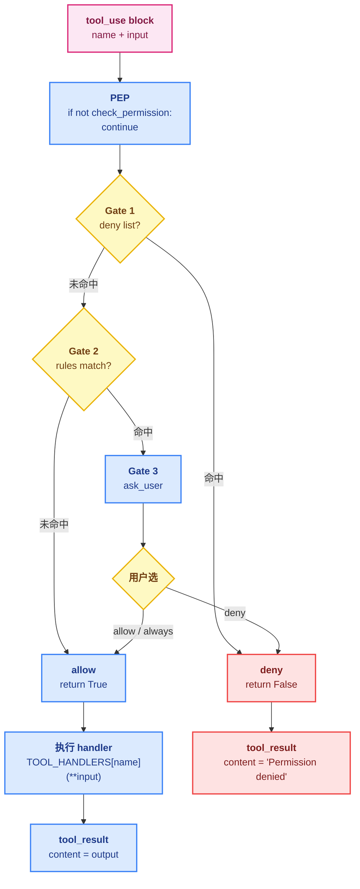

# 03 - Permission

> [!note]
> Agent 一旦有 `bash`，就能 `rm -rf /`。Permission 这一步要做的事是：**在工具真正执行之前，插一道闸门**——按规则拒绝、放行，或者停下来问用户。它是 Agent 从"理论上能做"到"实际可以放心交给它做"之间的那一道安全网。

## 这节重点关注

读完这节，你应该能在脑子里答出这 5 个问题：

1. **三层闸门**：deny list / rules / ask_user 各负责什么？为什么不能合成一层？（→ [核心抽象](#核心抽象)）
2. **代码位置**：闸门插在循环里哪一行？（→ [代码骨架总览](#代码骨架总览)）
3. **拒绝语义**：deny 之后为什么不能静默丢弃，必须塞个 tool_result 回去？（→ [设计要点](#设计要点)）
4. **ask 的意义**：为什么必须有 ask 选项，不能只 allow / deny？（→ [演进与动机](#演进与动机)）
5. **PEP vs PDP**：这套机制和经典安全工程的 PEP/PDP 怎么对应？（→ [核心抽象](#核心抽象)）

**可以略读/跳过**：`PERMISSION_RULES` 列表里的具体规则细节、`ask_user` 的 CLI 实现细节。**三层闸门 + 那一行 `if not check_permission: continue` 是主菜**。

## 这一步加了什么

| 新增 | 作用 | 重点? |
|---|---|---|
| `check_permission(block) -> bool` | 在 `handler(**block.input)` 之前调用的闸门 | ⭐⭐⭐ |
| `DENY_LIST: list[str]` | 硬黑名单（`rm -rf /`、`sudo`、`mkfs` 等） | ⭐⭐⭐ |
| `check_deny_list(command)` | Gate 1：扫 deny list | ⭐⭐ |
| `PERMISSION_RULES: list[dict]` | 规则表：特定工具 + 参数模式 → 触发 ask | ⭐⭐ |
| `check_rules(tool_name, args)` | Gate 2：扫规则表 | ⭐⭐ |
| `ask_user(tool, args, reason) -> str` | Gate 3：弹 CLI prompt，返回 allow/deny | ⭐⭐⭐ |
| 循环里那一行 `if not check_permission(block): continue` | 闸门接入点 | ⭐⭐⭐ |

## 演进与动机

模型不是故意的，但它会犯错。常见的几种危险动作：

- **清理路径写错**：本来想删 `./tmp/`，结果写成 `/tmp/` 或者 `./*`。
- **覆盖关键文件**：`write_file` 覆盖 `.env`、`~/.ssh/` 之类。
- **网络请求**：模型可能主动去 `curl` 一个外部 URL，泄露代码或 token。
- **包管理**：`pip install` 改环境，`npm publish` 发包。

模型自己**无法可靠地判断"这次操作危险"**——它的训练目标是"完成任务"，不是"保守"。所以这个判断必须由 harness 来做。

### 反例：只在 SYSTEM prompt 里写规则

而且这个判断**不能只在 SYSTEM prompt 里写规则**。模型可能"理解"了规则但还是违规，因为：

- 长对话里规则会被稀释。
- 模型在压力下（任务卡住、用户催）会绕过自己的约束。
- 规则用自然语言写，可解释性差。

### 反例：只允许 allow / deny

如果只有 allow / deny 两选项，所有灰色操作只能默认 deny——结果用户体验极差，每次都要改配置；或者默认 allow——结果安全网形同虚设。

### 解法核心：硬代码层 + 模型层 + ask

**硬代码层 + 模型层 + 用户决策**，三道都要有。s03 是硬代码层，并提供 ask 把灰色地带交回用户决定：

1. **deny list**：绝对不允许（`rm -rf /`、`mkfs`），不需要解释，硬代码拦。
2. **rules**：灰色操作（写 workspace 外、destructive 命令），触发 ask。
3. **ask_user**：弹交互问题，用户选 allow / deny / always allow。

## 核心抽象

这是 **Policy Enforcement Point（策略执行点）** 模式，在安全工程里很常见：

```
请求 → [PEP] → 资源
        ↓
       PDP（决策）
        ↓
     allow / deny / ask
```

翻译到 Agent：

- **PEP**（Policy Enforcement Point）：循环里执行 handler 之前的那一行 `if not check_permission(block): continue`。
- **PDP**（Policy Decision Point）：`check_permission` 函数本身，按规则算出决策。
- **策略源**：deny list、rules、用户偏好。

### 三层闸门的语义

```
Gate 1: deny list    → 命中即拦，无商量（rm -rf /）
   ↓ (没命中)
Gate 2: rules        → 命中触发 ask（写 workspace 外）
   ↓ (没命中或用户 allow)
Gate 3: ——           → 直接执行
```

三种决策的语义：

- **allow**：直接执行，不打扰用户。
- **deny**：返回 `"Permission denied"` 字符串当 tool_result。模型会看到这个反馈，自己调整。
- **ask**：弹一个交互问题给用户，用户选 allow / deny / always allow。

`ask` 这一支特别重要——很多操作不是非黑即白：删一个新建的临时文件可以 allow，删一个 git 跟踪的文件得问一下。把决策权交回用户，是 Agent **可信任**的关键。

## 整体架构图



## 三层闸门：deny list / rules / ask

### Gate 1：deny list（硬黑名单）

```python
DENY_LIST = ["rm -rf /", "sudo", "shutdown", "reboot", "mkfs", "dd if=", "> /dev/sda"]

def check_deny_list(command: str) -> str | None:
    for pattern in DENY_LIST:
        if pattern in command:                    # ← 用 in 不用 ==
            return f"Blocked: '{pattern}' is on the deny list"
    return None
```

只放**绝对不允许、不需要解释**的东西。太长的 deny list 维护成本高，而且容易误伤（比如禁止 `git push -f` 会误伤强制覆盖远程的合法场景）。

灰色操作应该走 Gate 2/3 的 **ask**，让用户在场景里决定。

### Gate 2：rules（条件规则）

```python
PERMISSION_RULES = [
    {"tools": ["write_file", "edit_file"],
     "check": lambda args: not (WORKDIR / args.get("path", "")).resolve().is_relative_to(WORKDIR),
     "message": "Writing outside workspace"},
    {"tools": ["bash"],
     "check": lambda args: any(kw in args.get("command", "") for kw in ["rm ", "> /etc/", "chmod 777"]),
     "message": "Potentially destructive command"},
]

def check_rules(tool_name: str, args: dict) -> str | None:
    for rule in PERMISSION_RULES:
        if tool_name in rule["tools"] and rule["check"](args):
            return rule["message"]
    return None
```

每条规则是 `tools + check 函数 + message`。命中后不是直接拦，而是**触发 ask**——让用户决定。

### Gate 3：ask_user（人机交互）

```python
def ask_user(tool_name: str, args: dict, reason: str) -> str:
    print(f"\n⚠  {reason}")
    print(f"   Tool: {tool_name}({args})")
    choice = input("   Allow? [y/N] ").strip().lower()
    return "allow" if choice in ("y", "yes") else "deny"
```

在 CLI 里就是 input prompt；在 GUI 里是按钮；在 CI 里通常返回 deny。

### 串联成 pipeline

```python
def check_permission(block) -> bool:
    if block.name == "bash":
        reason = check_deny_list(block.input.get("command", ""))
        if reason:
            return False                        # Gate 1 命中
    reason = check_rules(block.name, block.input)
    if reason:
        decision = ask_user(block.name, block.input, reason)
        if decision == "deny":
            return False                        # Gate 3 用户拒绝
    return True                                 # 全过 → 执行
```

## 原本的 Claude Code 怎么做的

Claude Code 的权限系统比 s03 复杂得多，但骨架一样：

### 1. 多级规则源

- **allow list** / **deny list**：用户配置（`settings.json`）和项目 CLAUDE.md 里写的。
- **per-tool rules**：比如 `Bash(rm:*)` 表示所有 `rm` 开头的命令。
- **default policy**：未匹配时的默认行为（ask / allow / deny）。

### 2. 交互模式

Claude Code 有几种 permission mode：

- **default**：危险操作 ask。
- **plan**：所有写操作都要 ask（用于规划阶段）。
- **acceptEdits**：编辑类自动 allow，bash 仍 ask。
- **bypassPermissions**：全部 allow（危险，只在隔离环境用）。

### 3. "Always allow" 记忆

用户在 ask 弹窗里可以勾"以后都允许"，这个规则会写回 settings，下次自动放行。这是用户体验的关键——没有它，每次都要点确认会让人发疯。

### 4. Hook 接管

到 s04 你会看到，permission 这套东西其实**整个被搬到 hook 系统里了**。`PreToolUse` hook 返回非 None 就短路执行。这是 Claude Code 真正的扩展方式：权限不是硬代码，是 hook。

## 设计要点

### 1. deny 要尽量短而狠

deny list 应该只放**绝对不允许、不需要解释**的东西（`rm -rf /`、`mkfs`、`dd if=`）。太长的 deny list 维护成本高，而且容易误伤（比如禁止 `git push -f` 会误伤强制覆盖远程的合法场景）。

灰色操作应该走 **ask**，让用户在场景里决定。

### 2. 拒绝信息要回到模型

deny 之后**不能静默丢弃**，要把"Permission denied"作为 tool_result 塞回去。模型看到这个反馈，才知道换一种方式。否则它会以为工具坏了，反复重试。

```python
if not check_permission(block):
    results.append({"type": "tool_result",
                     "tool_use_id": block.id,
                     "content": "Permission denied."})
    continue                                    # ← 注意这个 continue，跳过 handler
```

### 3. permission 是 harness 的责任，不是模型

不要在 SYSTEM prompt 里写"你不许 rm -rf"就完事。模型会违反。**PEP 必须在代码里强制执行**。

### 4. deny list 用 `in` 不用 `==`

模型可能写 `rm -rf /home`，`==` 拦不住——`==` 只匹配完整字符串。用 `in` 子串匹配才能拦住变体。

### 5. 决策应该可观测

每次 deny / ask 都要打日志。这样事后排查"为什么我的 Agent 没完成任务"时，能看到是哪条规则拦了它。

## 相关概念

- [[02 - Tool Use]]：permission 拦的是工具调用，工具的存在是前提。
- [[04 - Hooks]]：s04 会把 permission 重构成 PreToolUse hook，让它和日志、截断等逻辑平级。
- [[06 - Subagent]]：子 Agent 也要跑同一套 permission，否则它绕开主 Agent 的安全网。

> [!warning]
> 几个容易踩的坑：
>
> 1. **静默丢弃被拒工具**：忘了塞 tool_result，API 直接报错"missing tool_use_id"。
> 2. **deny list 用 `==` 而不是 `in`**：模型可能写 `rm -rf /home`，`==` 拦不住。
> 3. **把权限交给模型**：SYSTEM prompt 里写"不要执行危险操作"不靠谱，必须在代码里拦。
> 4. **没有 ask 选项**：只能 allow / deny 会让用户体验很差——灰色地带全靠用户改配置，没人愿意改。

## 代码骨架总览

剥掉具体规则细节，s03 的核心是三层闸门 pipeline 和那一行 PEP 接入。

```python
# === 1. Gate 1: 硬黑名单 ===
DENY_LIST = ["rm -rf /", "sudo", "shutdown", "reboot", "mkfs", "dd if=", "> /dev/sda"]

def check_deny_list(command: str) -> str | None:
    for pattern in DENY_LIST:
        if pattern in command:                  # ← 用 in 不用 ==
            return f"Blocked: '{pattern}' is on the deny list"
    return None

# === 2. Gate 2: 条件规则表（命中触发 ask）===
PERMISSION_RULES = [
    {"tools": ["write_file", "edit_file"],
     "check": lambda args: not (WORKDIR / args.get("path", "")).resolve().is_relative_to(WORKDIR),
     "message": "Writing outside workspace"},
    {"tools": ["bash"],
     "check": lambda args: any(kw in args.get("command", "") for kw in ["rm ", "> /etc/", "chmod 777"]),
     "message": "Potentially destructive command"},
]

def check_rules(tool_name: str, args: dict) -> str | None:
    for rule in PERMISSION_RULES:
        if tool_name in rule["tools"] and rule["check"](args):
            return rule["message"]
    return None

# === 3. Gate 3: 人机交互（CLI input prompt）===
def ask_user(tool_name: str, args: dict, reason: str) -> str:
    print(f"\n⚠  {reason}")
    print(f"   Tool: {tool_name}({args})")
    choice = input("   Allow? [y/N] ").strip().lower()
    return "allow" if choice in ("y", "yes") else "deny"

# === 4. PDP: 三层闸门 pipeline ===
def check_permission(block) -> bool:
    if block.name == "bash":
        reason = check_deny_list(block.input.get("command", ""))
        if reason:
            return False                        # Gate 1 命中 → deny
    reason = check_rules(block.name, block.input)
    if reason:
        decision = ask_user(block.name, block.input, reason)
        if decision == "deny":
            return False                        # Gate 3 用户拒绝 → deny
    return True                                 # 全过 → allow

# === 5. agent_loop —— 唯一新增的那一行 PEP ===
def agent_loop(messages: list):
    while True:
        response = client.messages.create(
            model=MODEL, system=SYSTEM, messages=messages,
            tools=TOOLS, max_tokens=8000,
        )
        messages.append({"role": "assistant", "content": response.content})

        if response.stop_reason != "tool_use":
            return

        results = []
        for block in response.content:
            if block.type != "tool_use":
                continue

            # ↓↓↓ s03 唯一新增：PEP 接入 ↓↓↓
            if not check_permission(block):
                results.append({"type": "tool_result", "tool_use_id": block.id,
                                "content": "Permission denied."})
                continue                        # ← 关键：跳过 handler 但仍要塞 tool_result

            handler = TOOL_HANDLERS.get(block.name)
            output = handler(**block.input) if handler else f"Unknown: {block.name}"
            results.append({"type": "tool_result", "tool_use_id": block.id,
                            "content": output})

        messages.append({"role": "user", "content": results})
```

**这 5 块就是 s03 的全部新增**。下一节 s04 Hooks 会把 `check_permission` 这一坨从循环里抽出去，包成 PreToolUse hook——循环回到干净状态。

## Q&A

（本节学习暂未记录卡点）
