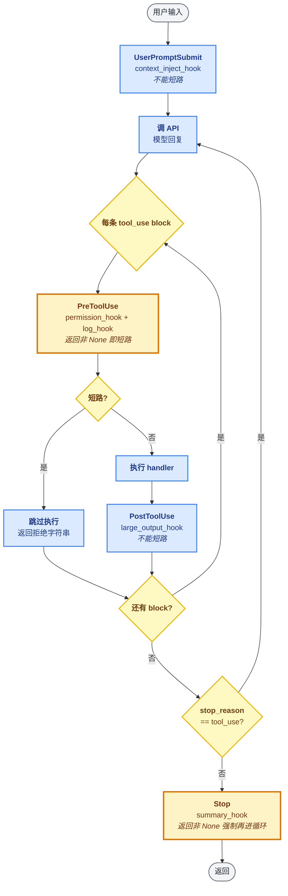

# 04 - Hooks

> [!note]
> s03 把权限检查写进了 agent_loop——但是写死在循环里意味着每次想加新逻辑（日志、截断、统计、用户偏好注入）都要改循环本身。Hooks 把循环的几个时机暴露成"扩展点"：注册一个回调函数，循环到那个时机就自动调用。这是 Agent 从"硬代码"走向"可扩展平台"的关键一步。

## 这节重点关注

读完这节，你应该能在脑子里答出这 5 个问题：

1. **四个事件**：UserPromptSubmit / PreToolUse / PostToolUse / Stop 各在循环的哪个时机触发？哪些能短路？（→ [Hooks 的四个事件](#hooks-的四个事件)）
2. **触发机制**：`HOOKS` dict + `register_hook` + `trigger_hooks` 三件套怎么协作？（→ [核心抽象](#核心抽象)）
3. **短路语义**：`trigger_hooks` 里"返回非 None 即短路"是什么意思？为什么这个设计这么关键？（→ [短路语义的妙处](#短路语义的妙处)）
4. **接入点**：循环里哪 4 行是 hook 的接入点？（→ [代码骨架总览](#代码骨架总览)）
5. **s03 → s04 的迁移**：permission 怎么从硬代码迁成 PreToolUse hook？（→ [演进与动机](#演进与动机)）

**可以略读/跳过**：各 hook 内部实现（`permission_hook` / `log_hook` / `large_output_hook` / `context_inject_hook` / `summary_hook`）。**HOOKS dict + trigger_hooks 短路语义是主菜**。

## 这一步加了什么

| 新增 | 作用 | 重点? |
|---|---|---|
| `HOOKS: dict[str, list[callable]]` | 按事件名分桶，每桶一组回调 | ⭐⭐⭐ |
| `register_hook(event, callback)` | 往桶里加回调 | ⭐⭐ |
| `trigger_hooks(event, *args) → Any` | 依次调桶里的回调，**任一返回非 None 就短路** | ⭐⭐⭐ |
| `UserPromptSubmit` 事件 | 用户输入提交后、调 API 前 | ⭐⭐ |
| `PreToolUse` 事件 | 工具执行前（**可短路**） | ⭐⭐⭐ |
| `PostToolUse` 事件 | 工具执行后 | ⭐⭐ |
| `Stop` 事件 | 循环结束时（**可强制再进一轮**） | ⭐⭐⭐ |
| `permission_hook` / `log_hook` / `large_output_hook` / `context_inject_hook` / `summary_hook` | 5 个示范 hook | ⭐ |

同时**移除**了 s03 写在循环里的 `check_permission(block)`——逻辑搬进 `permission_hook`，通过 PreToolUse 触发。

## 演进与动机

### 反例：循环越长越丑

s01 - s03 的循环已经开始变臃肿：派发 + 权限 + 各种 if。如果继续往里加（统计、限流、审计、用户偏好注入、停止前总结……），最后会变成一坨没人敢动的屎山。

```python
# 反例：所有逻辑都硬塞进循环
for block in response.content:
    if block.type != "tool_use": continue
    if not check_permission(block): ...         # s03 权限
    if not check_rate_limit(): ...              # 假设要加限流
    log_tool_call(block)                        # 假设要加日志
    output = handler(**block.input)
    if len(output) > 100000: output = output[:100000]  # 假设要加截断
    stat_record(block.name, len(output))        # 假设要加统计
    ...
```

**好的架构是循环只管"骨架"，所有"装饰"都挂在钩子上。**

### 反例：用户没法自定义

不同用户对同一个 Agent 的需求完全不同：

- 企业用户要**审计日志**（每次工具调用都写一行到 SIEM）。
- 个人用户要**快捷别名**（`/foo` 自动展开成某段 prompt）。
- CI 环境要**无交互**（禁用所有 ask，统一 deny）。

如果这些逻辑都写死在主循环，用户没法定制。Hook 让用户**不改源码就能改变行为**。

### 解法核心：把循环时机暴露成扩展点

预定义 4 个事件名（UserPromptSubmit / PreToolUse / PostToolUse / Stop），用户提供回调函数注册进去，循环到时机自动调。s03 的 permission 变成了一个 PreToolUse hook。原本散在循环里的 log、context inject、summary 也都变成了 hook。

**循环骨架回到 s01 的干净状态**，所有装饰逻辑都从循环里搬出去了。

## 核心抽象

这是 **Lifecycle Hooks / Event-Driven Extension** 模式。前端框架（React 的 useEffect、Vue 的 mounted）、操作系统（Unix signal handler）、Web 框架（Express middleware、Django signals）里都有它的影子。

核心要素：

1. **预定义的事件名**：系统在固定的时机触发，不允许自定义事件（不然没法在循环里写）。
2. **回调链**：一个事件可以有多个回调，按注册顺序执行。
3. **短路语义**：某些事件的回调如果返回值，就**提前终止**整条链，后面的不再跑。
4. **副作用优先于返回值**：大多数 hook 的作用是副作用（打日志、改状态），返回值只是控制流。

### 三件套：HOOKS dict + register + trigger

```python
HOOKS = {"UserPromptSubmit": [], "PreToolUse": [], "PostToolUse": [], "Stop": []}

def register_hook(event: str, callback):
    HOOKS[event].append(callback)               # 按 event 分桶

def trigger_hooks(event: str, *args):
    for callback in HOOKS[event]:               # 按注册顺序遍历
        result = callback(*args)
        if result is not None:                  # 任一返回非 None → 短路
            return result
    return None
```

就这么多——`HOOKS` 是 dict of lists，`register_hook` 是 append，`trigger_hooks` 是 for + 短路。

## 整体架构图



## Hooks 的四个事件

每个事件的典型用途：

- **UserPromptSubmit**：注入上下文（当前目录、git 分支、最近修改的文件）、改写 prompt（别名展开）、阻止某些输入。
- **PreToolUse**：权限检查、限流、参数校验、记录审计日志。**可短路**——返回字符串就当 tool_result 塞回去，跳过执行。
- **PostToolUse**：截断输出（防上下文爆炸）、格式化结果、统计耗时、触发通知。
- **Stop**：会话总结、保存历史、自动追加"还有什么要做吗"的 prompt。

### 哪些能短路？

| 事件 | 能短路？ | 短路语义 |
|---|---|---|
| UserPromptSubmit | 否（教学版） | 仅副作用 |
| PreToolUse | **是** | 返回字符串 → 当 tool_result 塞回，跳过 handler |
| PostToolUse | 否 | 仅副作用 |
| Stop | **是**（反向） | 返回非 None → 强制再进一轮循环 |

## 短路语义的妙处

注意 `trigger_hooks` 的实现：

```python
def trigger_hooks(event, *args):
    for callback in HOOKS[event]:
        result = callback(*args)
        if result is not None:
            return result                       # ← 短路：后面回调不再跑
    return None
```

只要有一个回调返回非 None，**后面的回调就不再跑**。这意味着：

- 权限 hook 可以"否决"后续的日志 hook（如果它直接拒绝执行）。
- 多个权限规则可以叠加（先匹配的先生效）。
- 用户可以**优先级排序**：把最严格的规则放最前面。

### Stop 的反向短路：强制续跑

Stop hook 的短路是反的——返回非 None 不是"终止"，而是"强制再进一轮"：

```python
if response.stop_reason != "tool_use":
    force = trigger_hooks("Stop", messages)
    if force:
        messages.append({"role": "user", "content": force})
        continue                                # ← 不真的停，再进一轮
    return
```

可以用来实现"自动续跑"——检测到任务没完成就追加一句 prompt 让模型继续。

## 原本的 Claude Code 怎么做的

Claude Code 的 hook 系统就是这个架构的工程化版本：

### 1. 更细的事件分类

除了 s04 的四个，Claude Code 还有：

- **SessionStart** / **SessionEnd**：会话级别的钩子。
- **Notification**：弹通知（比如长任务跑完）。
- **PreCompact**：上下文压缩之前（让你保存重要信息）。
- **SubagentStop**：子 Agent 结束时。

每个事件都有结构化的 input 和 output schema，方便写复杂的 hook。

### 2. Hook 用 shell 命令实现

Claude Code 的 hook 不是 Python 回调，而是 **shell 命令**——配置在 `settings.json` 里：

```json
{
  "hooks": {
    "PreToolUse": [{
      "matcher": "Bash",
      "hooks": [{"type": "command", "command": "/path/to/my-check.sh"}]
    }]
  }
}
```

Agent 把 block 的 JSON 通过 stdin 喂给 shell 命令，命令的退出码 / stdout 控制 hook 的决策。这样**用户可以用任何语言写 hook**——bash、Python、Node、Go——只要能读 stdin 写 stdout。

### 3. matcher（工具名过滤）

不是所有 hook 都关心所有工具。`matcher: "Bash"` 表示只对 Bash 工具触发。这避免了"日志 hook 对每次 read_file 都跑一遍"的浪费。

### 4. 跨进程隔离

用 shell 命令做 hook 还有一个好处：**hook 崩溃不会拖垮主进程**。一个有 bug 的 Python 回调会让整个 Agent 挂掉；shell 子进程挂了最多这一条 hook 失效。

## 设计要点

### 1. 事件要少而稳定

事件名是**公共 API**。一旦发布就不能随便改——所有 hook 都依赖它。Claude Code 的事件数控制在十几个以内，每个语义明确。新增事件要慎重。

### 2. 回调要幂等可重入

PostToolUse hook 可能因为重试被调用多次。回调里不要做不可逆的事（比如每次都 append 一行日志导致重复）。

### 3. 错误要隔离

一个 hook 抛异常不应该让整个循环挂掉。最佳实践是 trigger_hooks 内部 catch 异常、打日志、继续跑下一个。

> s04 的教学版 `trigger_hooks` 没做异常隔离——为了代码极简。生产版必须加 `try/except` 包住每个 callback。

### 4. 顺序要可预测

按注册顺序执行是最简单的语义。如果允许优先级，要明确文档化。Claude Code 用配置文件里的数组顺序，简单粗暴。

## 相关概念

- [[03 - Permission]]：s03 的 permission 在 s04 里被重构成 PreToolUse hook。
- [[05 - TodoWrite]]：Stop hook 是注入"提醒更新任务"的好地方。
- [[08 - Context Compact]]：PostToolUse hook 是截断大输出的标准位置。
- [[02 - Tool Use]]：PreToolUse / PostToolUse 是工具调用的"包围式"扩展点。

> [!warning]
> 几个容易踩的坑：
>
> 1. **回调里抛异常**：一个挂的 hook 拖垮整个 Agent。trigger_hooks 必须 catch。
> 2. **忘了短路语义**：permission 拒绝了但日志 hook 还在跑——可能产生误导日志。
> 3. **事件越加越多**：每个新功能都加个事件，最后事件之间互相依赖、顺序敏感，维护噩梦。
> 4. **hook 之间隐式通信**：通过全局变量传状态。改成显式参数或 context 对象。

## 代码骨架总览

剥掉 5 个示范 hook 的内部实现，s04 的核心抽象只有这么多——`agent_loop` 的结构和 s03 几乎一致，唯一变化是 `check_permission` 那行变成 `trigger_hooks("PreToolUse", block)`。

```python
# === 1. HOOKS 注册中心：按事件分桶 ===
HOOKS = {"UserPromptSubmit": [], "PreToolUse": [],
         "PostToolUse": [], "Stop": []}

def register_hook(event: str, callback):
    HOOKS[event].append(callback)               # 往桶里 append

def trigger_hooks(event: str, *args):
    for callback in HOOKS[event]:               # 按注册顺序遍历
        result = callback(*args)
        if result is not None:                  # ← 短路：返回非 None 即停
            return result
    return None

# === 2. 5 个示范 hook（permission 是从 s03 搬来的）===
DENY_LIST = ["rm -rf /", "sudo", "shutdown", "reboot", "mkfs", "dd if="]
DESTRUCTIVE = ["rm ", "> /etc/", "chmod 777"]

def permission_hook(block):                      # PreToolUse: s03 的 check_permission
    if block.name == "bash":
        for p in DENY_LIST:
            if p in block.input.get("command", ""):
                return "Permission denied by deny list"   # ← 短路
        for kw in DESTRUCTIVE:
            if kw in block.input.get("command", ""):
                if input("Allow? [y/N] ").strip().lower() not in ("y", "yes"):
                    return "Permission denied by user"     # ← 短路
    if block.name in ("write_file", "edit_file"):
        path = block.input.get("path", "")
        if not (WORKDIR / path).resolve().is_relative_to(WORKDIR):
            if input("Allow? [y/N] ").strip().lower() not in ("y", "yes"):
                return "Permission denied by user"         # ← 短路
    return None

def log_hook(block):                            # PreToolUse: 仅副作用
    print(f"[HOOK] {block.name}({list(block.input.values())[:2]})")
    return None

def large_output_hook(block, output):           # PostToolUse: 仅副作用
    if len(str(output)) > 100000:
        print(f"[HOOK] Large output: {len(str(output))} chars")
    return None

def context_inject_hook(query):                 # UserPromptSubmit: 仅副作用
    print(f"[HOOK] working in {WORKDIR}")
    return None

def summary_hook(messages):                     # Stop: 仅副作用
    tool_count = sum(1 for m in messages
                     for b in (m.get("content") if isinstance(m.get("content"), list) else [])
                     if isinstance(b, dict) and b.get("type") == "tool_result")
    print(f"[HOOK] session used {tool_count} tool calls")
    return None

# === 3. 注册所有 hook（顺序决定短路优先级）===
register_hook("UserPromptSubmit", context_inject_hook)
register_hook("PreToolUse", permission_hook)    # ← 最严的放最前
register_hook("PreToolUse", log_hook)
register_hook("PostToolUse", large_output_hook)
register_hook("Stop", summary_hook)

# === 4. agent_loop —— 4 个接入点 ===
def agent_loop(messages: list):
    while True:
        response = client.messages.create(
            model=MODEL, system=SYSTEM, messages=messages,
            tools=TOOLS, max_tokens=8000,
        )
        messages.append({"role": "assistant", "content": response.content})

        if response.stop_reason != "tool_use":
            # 接入点 4: Stop（反向短路 → 强制续跑）
            force = trigger_hooks("Stop", messages)
            if force:
                messages.append({"role": "user", "content": force})
                continue
            return

        results = []
        for block in response.content:
            if block.type != "tool_use":
                continue

            # 接入点 2: PreToolUse（短路 → 跳过 handler）
            blocked = trigger_hooks("PreToolUse", block)
            if blocked:
                results.append({"type": "tool_result", "tool_use_id": block.id,
                                "content": str(blocked)})
                continue

            handler = TOOL_HANDLERS.get(block.name)
            output = handler(**block.input) if handler else f"Unknown: {block.name}"

            # 接入点 3: PostToolUse（仅副作用）
            trigger_hooks("PostToolUse", block, output)

            results.append({"type": "tool_result", "tool_use_id": block.id,
                            "content": output})

        messages.append({"role": "user", "content": results})

# === 5. 入口：接入点 1（UserPromptSubmit）===
if __name__ == "__main__":
    history = []
    while True:
        query = input("s04 >> ")
        if query.strip().lower() in ("q", "exit", ""):
            break
        trigger_hooks("UserPromptSubmit", query)   # ← 接入点 1
        history.append({"role": "user", "content": query})
        agent_loop(history)
```

**这 5 块就是 s04 的全部抽象层**。循环骨架（while + append + stop_reason 判断）从 s01 到 s20 没变过——s04 只是把"装饰逻辑"从循环体搬到了 hook，循环回到干净状态。

## Q&A

（本节学习暂未记录卡点）
