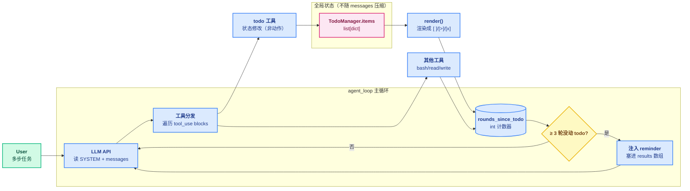

# 05 - TodoWrite

> [!note]
> 任务稍微一长，模型就会"漂"——做一半忘了原目标，或者半路跳到无关的事情上。TodoWrite 给模型一个**外置的、可写的、跨轮可见的任务列表**：先列出来再执行，每完成一个打勾。它不是给用户看的项目管理工具，是给**模型自己**用的认知支架。

## 这节重点关注

读完这节，你应该能在脑子里答出这 5 个问题：

1. **本质模式**：todo 是"动作工具"还是"状态修改工具"？为什么这种区分重要？（→ [核心抽象](#核心抽象)）
2. **状态机语义**：`pending / in_progress / completed` 三态为什么必须强制？`in_progress` 为什么只能一个？（→ [核心抽象](#状态机pending--in_progress--completed)）
3. **三件套协同**：SYSTEM prompt / 工具暴露 / nag 兜底，三者为什么缺一不可？（→ [核心抽象](#三件套system--工具--nag)）
4. **nag 怎么注入**：3 轮没更新 todo 时，reminder 加到 `messages` 还是加到 `tool_results`？s06 选了哪个？（→ [核心抽象](#nag-注入到-results-而非-messages)）
5. **不变量保护**：为什么压缩（[[08 - Context Compact]]）时 todo 不能被压掉？（→ [设计要点](#设计要点)）

**可以略读/跳过**：源码里 `TodoManager.render()` 的 ANSI 渲染细节、CLI 显示逻辑。**心智模型是主菜，渲染是配菜。**

## 这一步加了什么

| 新增 | 作用 | 重点? |
|---|---|---|
| `TodoManager` 类 | 全局任务状态：`items: list[dict]` + `update()` + `render()` | ⭐⭐⭐ |
| `todo` 工具 | 声明式状态修改工具，参数 `items: [{id, text, status}, ...]` | ⭐⭐⭐ |
| SYSTEM prompt 引导 | "复杂任务先用 todo 规划"（写在 system 里建立"该用"预期） | ⭐⭐⭐ |
| `in_progress ≤ 1` 校验 | `TodoManager.update()` 内部强校验，违反抛 ValueError | ⭐⭐ |
| `rounds_since_todo` 计数 | 每轮累加，调用 todo 时归零 | ⭐⭐ |
| nag reminder 注入 | 3 轮没动 todo → 把 `<reminder>` 塞进下一轮 tool_results | ⭐⭐ |
| 20 个上限 | `len(items) > 20` 抛错，防止列表爆炸 | ⭐ |

## 演进与动机

### 反例：长任务里模型会漂

LLM 的注意力是"近因偏向"的——越近的 token 影响越大。一个跨 20 轮的任务，到第 15 轮时，第 1 轮的目标可能已经被中间的工具输出冲淡。模型会：

- 做完一步忘了下一步是什么。
- 中途被某个工具输出引偏，做了无关的事情。
- 在循环里反复检查同一个文件，因为忘了自己已经查过。

### 反例的失败解法：让模型"在心里计划"

最朴素的方案是在 SYSTEM prompt 里写"开始前先在心里规划任务"。模型会输出一段"好的我先做 A 再做 B……"，但这段话在 5 轮之后就被 [[08 - Context Compact]] 压缩掉了，等于没说。

### 解法核心：External Working Memory

把任务状态**外置**到一个不会被压缩、能跨轮访问的位置。`TodoManager.items` 就是这个位置——它在内存里独立于 `messages`，每次需要时被渲染成文本注入对话，而原始结构保留在管理器里。

产品需求也来推一把：用户看到 Agent 在跑，但不知道它跑到哪了。一个 todo 列表实时渲染（CLI 里用 `[ ] / [>] / [x]` 标记），用户能：

- 知道进度（5 个任务完成 3 个）。
- 发现偏航（"我让它做 X，它怎么在搞 Y"）。
- 提前打断（看到方向错了就 Ctrl+C）。

## 核心抽象

### 动作工具 vs 状态修改工具

`bash` / `read_file` / `write_file` 是**动作工具**——它们对真实世界产生副作用（跑命令、读写文件）。`todo` 不一样，它**不执行任何动作**，只是更新 `TodoManager.items` 这块全局内存。

这种"非动作工具"给模型一种**声明式表达方式**：与其每次输出一段文字描述"我现在在做 X，下一步要做 Y"，不如调一次 `todo` 工具更新状态，下一轮自己读到。声明式 > 命令式。

### 状态机：pending → in_progress → completed

```python
class TodoManager:
    def update(self, items: list) -> str:
        if len(items) > 20:
            raise ValueError("Max 20 todos allowed")
        validated = []
        in_progress_count = 0
        for i, item in enumerate(items):
            text = str(item.get("text", "")).strip()
            status = str(item.get("status", "pending")).lower()
            if status not in ("pending", "in_progress", "completed"):
                raise ValueError(f"invalid status '{status}'")
            if status == "in_progress":
                in_progress_count += 1
            validated.append({"id": ..., "text": text, "status": status})
        if in_progress_count > 1:
            raise ValueError("Only one task can be in_progress at a time")
        self.items = validated
        return self.render()
```

三态语义：

- **pending**：还没开始。
- **in_progress**：正在做（**同一时间严格只有一个**，否则抛错）。
- **completed**：做完。

这逼模型把任务切成离散步骤、明确"我现在在哪一步"，而不是模糊地"我在处理这件事"。`in_progress > 1` 直接报错，而不是软警告——防止模型把三个任务都标成"进行中"以"水过去"。

### 三件套：SYSTEM + 工具 + nag

光给工具不够。模型可能根本不调用它。所以三管齐下：

| 组件 | 作用 |
|---|---|
| **SYSTEM prompt 引导** | "复杂任务先用 todo 规划"——模型读 SYSTEM 时建立"该用"预期 |
| **工具暴露** | 让模型"能"用（TOOL_HANDLERS 里注册 `todo`） |
| **nag 兜底** | 如果它忘了用，循环里强制塞 `<reminder>` |

这是教 LLM 用工具的**通用模式**：引导 + 能力 + 强制。三件缺一效果都打折。

### nag 注入到 results 而非 messages

```python
results = []
for block in response.content:
    if block.type == "tool_use":
        ...
        results.append({"type": "tool_result", ...})
        if block.name == "todo":
            used_todo = True
rounds_since_todo = 0 if used_todo else rounds_since_todo + 1
if rounds_since_todo >= 3:
    results.append({"type": "text", "text": "<reminder>Update your todos.</reminder>"})
messages.append({"role": "user", "content": results})
```

注意 reminder 不是单独 `messages.append(...)`，而是**塞进 tool_results 数组**里作为 `{"type": "text"}` 块。这样：

- 同一轮里既有真实 tool_result 又有 reminder，模型一次性看到。
- 不污染 messages 长度（reminder 跟着 tool 调用走，工具调用本身就会被压）。
- 计数只在"调用了非 todo 工具"时 +1，纯对话轮不算。

## 整体架构图



## TodoManager 的契约

```python
@dataclass
class TodoItem:
    id: str            # "1" / "2" ...
    text: str          # 任务描述
    status: str        # "pending" | "in_progress" | "completed"

class TodoManager:
    items: list[TodoItem]
    MAX_ITEMS: int = 20

    def update(self, items: list[dict]) -> str:
        # 校验：≤ 20 条、status 合法、in_progress ≤ 1
        # 副作用：替换 self.items
        # 返回：render() 后的文本（给主调用方作为 tool_result content）

    def render(self) -> str:
        # [ ] #1: task A
        # [>] #2: task B
        # [x] #3: task C
        # (2/3 completed)
```

**契约要点**：

1. `update()` 是**全量替换**而非增量——模型每次调用都要传完整列表。这避免"漏写一条"导致的并发状态错乱。
2. `update()` 返回的是 `render()` 文本，直接作为 `tool_result.content` 回给模型——模型不需要再调一次 `get`。
3. `items` 是**全局单例**（模块级 `TODO = TodoManager()`），所有循环轮次共享，跨轮持久（直到下次 update 或进程退出）。

## 原本的 Claude Code 怎么做的

Claude Code 的等价物是 **TaskCreate / TaskUpdate / TaskGet / TaskList** 一组工具。比 s05 多了几个能力：

### 1. 四个工具而不是一个

- **TaskCreate**：新建任务。
- **TaskUpdate**：改状态、改 owner（多 Agent 时用）。
- **TaskGet**：读单个任务详情。
- **TaskList**：列所有任务。

拆开的好处是**支持多 Agent 协作**（s15 团队）：一个 Agent 创建任务，另一个 Agent claim 它、改 owner、完成后更新状态。s05 的单 Agent 没这个需求，所以一个 todo 工具够用。

### 2. blockedBy / blocks 依赖

任务可以声明依赖："任务 B 必须等任务 A 完成才能开始"。这逼模型在规划阶段就想清楚顺序，避免乱开并行。

### 3. owner 字段

每个任务可以指派 owner（"claude" / "explore-agent" / 用户）。多 Agent 场景下，一个 Agent 看任务列表时知道哪些是自己该做的。

### 4. 任务被注入 system reminder

Claude Code 会在循环里**定期把当前任务列表注入到对话**（作为 system-reminder），让模型始终看到最新状态。这相当于把 s05 的 nag 做得更精细：不是"提醒你更新"，是直接把列表拍在它脸上。

### 5. activeForm（spinner 文字）

每个任务可以有个 `activeForm` 字段，比如"Running tests"。CLI 用它显示在 spinner 上，用户实时看到"Agent 现在在跑测试"而不是"Agent 在跑"。这是**给用户的工作记忆**。

## 设计要点

### 1. todo 是给模型的，不是给用户的

很多新手会把 todo 做成项目管理工具（加 deadline、加优先级、加负责人）。这是过度设计。**todo 的唯一目的是帮模型记住自己该做什么**。任何对模型没用的字段都是噪音。

### 2. 状态语义要严

`in_progress` 同时只能有一个。如果模型把三个都设成 in_progress，等于没设。s05 的 `TodoManager.update()` 直接抛 `ValueError`——硬约束，不是软警告。

### 3. nag 频率要适中

s05 是 3 轮一次。太频繁（每轮）会打断模型思路；太稀疏（10 轮）已经晚了。3 - 5 轮是常见值。

### 4. 任务粒度要可控

模型可能把"写一个 web 服务"列成一个 todo（太大），也可能列成 50 个（太碎）。SYSTEM prompt 里应该给个大致引导："每个 todo 应该能在 3 - 10 个工具调用内完成"。

### 5. todo 是压缩不变量

[[08 - Context Compact]] 压缩 messages 时，**不要碰 TodoManager.items**——它独立于 messages 存在。如果某次压缩把"我做到第 3 步"压没了，模型会忘记任务进度。s08 的 micro_compact / compact_history 都只动 `messages`，TodoManager 是旁路状态。

## 相关概念

- [[04 - Hooks]]：nag 的注入点在循环里，未来可以做成 Stop hook 的反向用法（强制再进一轮）。
- [[08 - Context Compact]]：todo 列表是**不应该被压缩**的外置记忆。压缩策略要避开它。
- [[06 - Subagent]]：子 Agent 应该有自己的 todo，不和主 Agent 共享——否则状态会串。

> [!warning]
> 几个容易踩的坑：
>
> 1. **让 todo 承担项目管理职责**：加 deadline、加 assignee，最后变成 JIRA，模型用不明白。
> 2. **同时多个 in_progress**：失去"现在做哪个"的语义，模型注意力分散。s05 直接抛错拒绝。
> 3. **nag 太频繁**：每轮都提醒，等于背景噪音，模型学会忽略。
> 4. **不渲染给用户**：todo 只存在内存里，用户看不到进度，体感上"Agent 在乱跑"。
> 5. **update 用增量而非全量**：让模型只传"我要改的这一条"会丢失其他状态。全量替换最稳。

## 代码骨架总览

剥掉所有渲染细节，s05 的 todo 子系统只有这么多代码：

```python
# === 1. 全局任务状态 ===
class TodoManager:
    def __init__(self):
        self.items = []
    def update(self, items: list[dict]) -> str:
        # 校验：≤ 20 条 / status 合法 / in_progress ≤ 1
        if len(items) > 20:
            raise ValueError("Max 20 todos allowed")
        validated, in_progress_count = [], 0
        for i, item in enumerate(items):
            text = str(item.get("text", "")).strip()
            status = str(item.get("status", "pending")).lower()
            if status not in ("pending", "in_progress", "completed"):
                raise ValueError(f"invalid status '{status}'")
            if status == "in_progress":
                in_progress_count += 1
            validated.append({"id": str(item.get("id", i+1)), "text": text, "status": status})
        if in_progress_count > 1:
            raise ValueError("Only one task can be in_progress at a time")
        self.items = validated
        return self.render()
    def render(self) -> str:
        if not self.items: return "No todos."
        lines = []
        marker = {"pending": "[ ]", "in_progress": "[>]", "completed": "[x]"}
        for item in self.items:
            lines.append(f"{marker[item['status']]} #{item['id']}: {item['text']}")
        done = sum(1 for t in self.items if t["status"] == "completed")
        lines.append(f"\n({done}/{len(self.items)} completed)")
        return "\n".join(lines)

TODO = TodoManager()

# === 2. 注册成工具 ===
TOOL_HANDLERS["todo"] = lambda **kw: TODO.update(kw["items"])
TOOLS.append({
    "name": "todo",
    "description": "Update task list. Track progress on multi-step tasks.",
    "input_schema": {"type": "object", "properties": {"items": {
        "type": "array",
        "items": {"type": "object", "properties": {
            "id": {"type": "string"},
            "text": {"type": "string"},
            "status": {"type": "string", "enum": ["pending", "in_progress", "completed"]}
        }, "required": ["id", "text", "status"]}
    }}, "required": ["items"]},
})

# === 3. SYSTEM 引导 ===
SYSTEM = f"""You are a coding agent at {WORKDIR}.
Use the todo tool to plan multi-step tasks. Mark in_progress before starting, completed when done.
Prefer tools over prose."""

# === 4. nag：3 轮没动 todo 就注入 reminder ===
def agent_loop(messages: list):
    rounds_since_todo = 0
    while True:
        response = client.messages.create(
            model=MODEL, system=SYSTEM, messages=messages,
            tools=TOOLS, max_tokens=8000,
        )
        messages.append({"role": "assistant", "content": response.content})
        if response.stop_reason != "tool_use":
            return
        # 执行工具并收集 tool_result
        results, used_todo = [], False
        for block in response.content:
            if block.type == "tool_use":
                handler = TOOL_HANDLERS.get(block.name)
                output = handler(**block.input) if handler else f"Unknown tool: {block.name}"
                results.append({"type": "tool_result", "tool_use_id": block.id, "content": str(output)})
                if block.name == "todo":
                    used_todo = True
        # nag 计数 + 注入 reminder
        rounds_since_todo = 0 if used_todo else rounds_since_todo + 1
        if rounds_since_todo >= 3:
            results.append({"type": "text", "text": "<reminder>Update your todos.</reminder>"})
        messages.append({"role": "user", "content": results})
```

**这 4 块是 s05 todo 子系统的全部抽象**。下一节 [[06 - Subagent]] 会演示"独立 messages"的另一种上下文治理手段——隔离而不是外置。

## Q&A

（本节学习暂未记录卡点）
