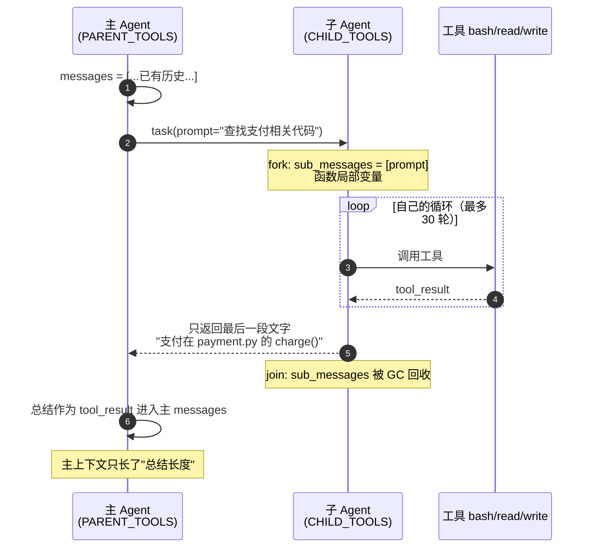

# 06 - Subagent

> [!note]
> 一个研究类任务可能要跑 30 次工具调用、读 10 个文件、产生几万 token 的中间结果。这些**中间结果对最终决策没用**，但全留在主对话里会把上下文撑爆。Subagent 是一个"独立小循环"——给它一个任务，它在自己干净的 messages[] 里跑完，只把**总结**返回给主 Agent。中间过程全丢弃。

## 这节重点关注

读完这节，你应该能在脑子里答出这 5 个问题：

1. **隔离机制**：子 Agent 的 messages 怎么保证"绝对不污染"主 Agent？为什么函数局部变量是关键？（→ [核心抽象](#核心抽象)）
2. **工具子集**：为什么 `CHILD_TOOLS` 故意没有 `task` 工具？递归会导致什么灾难？（→ [核心抽象](#无递归约束childtools-不含-task)）
3. **prompt 契约**：调用 `task` 时传的 `prompt` 字段为什么必须自包含？（→ [核心抽象](#prompt-必须自包含)）
4. **30 轮上限**：子 Agent 为什么不用 `while True`？跑完了没出结论怎么办？（→ [核心抽象](#安全阀30-轮上限--extract-兜底)）
5. **与 compact 的互补**：subagent 是主动压缩还是被动压缩？为什么两者都要？（→ [相关概念](#相关概念)）

**可以略读/跳过**：源码里共享的工具实现（`run_bash` / `run_read` 等），它们和主 Agent 一致。**抽象层是主菜，工具实现是配菜。**

## 这一步加了什么

| 新增 | 作用 | 重点? |
|---|---|---|
| `task` 工具（parent 独有） | 主 Agent 委托子任务，参数 `prompt` + `description` | ⭐⭐⭐ |
| `run_subagent(prompt)` 函数 | 起**全新 messages**、自己的 SYSTEM、自己的循环、最多 30 轮 | ⭐⭐⭐ |
| `CHILD_TOOLS` | 子 Agent 工具集——**故意不含 `task`**，防递归 | ⭐⭐⭐ |
| `SUBAGENT_SYSTEM` | 子 Agent 的极简 SYSTEM："Complete task, then summarize." | ⭐⭐ |
| 30 轮安全阀 | `for _ in range(30)` 而非 `while True` | ⭐⭐ |
| 只返回最后一段文字 | `"".join(b.text for b in ...)`——中间过程全丢弃 | ⭐⭐⭐ |

## 演进与动机

### 反例：探索型任务对上下文是污染

主 Agent 接到"找到所有处理支付的文件"。它得 grep 几次、read 几个、grep 再细查。整个过程可能产生 5 万 token 的中间结果。

但主 Agent 真正需要的只是答案：**"支付相关代码在 payment_service.py 和 checkout.py，主要函数是 charge() 和 refund()"**。

如果让主 Agent 自己跑这些工具，它的 messages 里会塞满无用的 grep 输出。**后续每一轮 API 调用都要为这些垃圾 token 付费**，而且模型可能被中间结果干扰，做出错误判断。

### 失败的解法：让模型"事后总结"

让主 Agent 探索完后再总结成一段话？没用——探索的中间结果**已经在 messages 里了**，模型总结只增加 token，不减少。

### 解法核心：Process Isolation / Fork-Join

借鉴 OS 经典模式——`fork()` 创建子进程，子进程有独立内存，跑完通过 pipe / exit code 把结果传回父进程。Agent 里的 Subagent 完全对应：

- **Fork**：`run_subagent` 新建 messages、绑定 CHILD_TOOLS、起一个新循环。
- **隔离**：子 Agent 的 messages 是**函数局部变量**，主 Agent 拿不到引用。
- **Join**：子 Agent 跑完，只返回最后一段文字。主 Agent 把它当 `tool_result.content` 接收。

主上下文的增长只等于"总结长度"，不是"探索过程长度"——上下文预算被严格保护。

### 产品需求：角色专精

子 Agent 还能挂自己的 SYSTEM：一个"探索 Agent"被告知"只看代码，不修改"，一个"计划 Agent"被告知"只输出方案不动手"。**角色分化**让单次任务更聚焦。

## 核心抽象

### 隔离的本质：函数局部变量

```python
def run_subagent(prompt: str) -> str:
    sub_messages = [{"role": "user", "content": prompt}]  # ← 函数局部变量
    for _ in range(30):
        response = client.messages.create(...)
        sub_messages.append({"role": "assistant", "content": response.content})
        ...
    return "".join(b.text for b in response.content if hasattr(b, "text"))
```

**关键认知**：`sub_messages` 是函数局部变量。函数 `return` 后，Python GC 立即回收——内存里不存了，自然影响不到主对话。这就是"隔离"的物理本质，不是魔法。

主 Agent 拿到的就是一段字符串（子 Agent 的总结），它被包成 `tool_result.content`，长度通常几百到几千 token——比 30 轮探索过程省 90% 上下文。

### 无递归约束：CHILD_TOOLS 不含 task

```python
# 父 Agent 的工具集
PARENT_TOOLS = CHILD_TOOLS + [
    {"name": "task", "description": "Spawn a subagent with fresh context...",
     "input_schema": {"type": "object", "properties": {"prompt": ..., "description": ...}}}
]

# 子 Agent 的工具集（注意没有 task）
CHILD_TOOLS = [
    {"name": "bash", ...},
    {"name": "read_file", ...},
    {"name": "write_file", ...},
    {"name": "edit_file", ...},
    # 没有 "task"！
]
```

故意砍掉 `task` 的原因：

- 如果子 Agent 也能 spawn sub-subagent，主 Agent 可能触发**深度爆炸**的递归。
- 资源消耗不可控——每个 subagent 都有自己的 30 轮限额，3 层嵌套就是 27000 轮潜在工具调用。
- 收益边际递减——两层的"主 → 子"已经足够隔离上下文，三层基本是过度设计。

s06 的 subagent 是**单层**的。这和 Unix 的 `fork` 不一样（fork 可以无限嵌套），但 Agent 场景下，限制深度比放开更稳健。

### prompt 必须自包含

子 Agent 看到的第一条 user 消息就是 `task` 工具传的 `prompt`。它**看不到**主 Agent 的任何历史。所以 prompt 必须**自包含**：

| ❌ 反例 | ✅ 正例 |
|---|---|
| "基于上面的发现做 X" | "我们在改支付模块。当前文件是 payment.py。问题是退款逻辑没处理负数金额。请查找所有调用 refund() 的地方并报告调用点。" |
| "继续之前的探索" | "查找 src/ 目录下所有处理支付的文件，列出主要函数名和它们的作用。" |

这是隔离的代价：**主 Agent 必须显式传上下文**。

### 安全阀：30 轮上限 + extract 兜底

```python
for _ in range(30):   # 不是 while True
    response = client.messages.create(...)
    if response.stop_reason != "tool_use":
        break
    ...
# 循环退出后，无论怎样都返回最后一段文字
return "".join(b.text for b in response.content if hasattr(b, "text")) or "(no summary)"
```

为什么 30 而不是 `while True`：

- 模型可能陷入死循环（反复 read 同一个文件）。
- 模型可能策略错误（一个简单任务展开了 40 步）。
- 30 轮是个安全阀，超过就强制停，把当前状态作为返回。

如果 30 轮不够，说明任务**该拆**——主 Agent 应该把它分成两个子任务，而不是给单个 subagent 加预算。

兜底 `or "(no summary)"`——最后一段可能没有 text block（全是 tool_use），用占位字符串避免主 Agent 拿到空 tool_result。

## 整体架构图



## 原本的 Claude Code 怎么做的

Claude Code 内置了一组 subagent，每个有专门的 `subagent_type`：

### 1. 专门化的 subagent

- **Explore**：快速代码搜索、定位文件、回答"这段逻辑在哪"。
- **Plan**：设计实现方案，输出步骤化计划。
- **general-purpose**：通用研究、多步任务。
- **statusline-setup**：配置状态栏（很窄的专精）。
- **code-reviewer**：审查 diff（独立第二意见）。

每个 subagent 有自己的 system prompt、自己的工具子集。比如 Explore 没有 Edit / Write——它是只读的，不会误改代码。

### 2. description 字段

主 Agent 用 task 工具时传 `description`（短描述）和 `prompt`（完整指令）。Claude Code 的工程实践强调 prompt 要**自包含**：

- 不要写"基于上面的发现做 X"——子 Agent 看不到"上面"。
- 要写"我们在改支付模块。当前文件是 payment.py。问题是退款逻辑没处理 X。请查找所有调用 refund 的地方并报告。"

### 3. 后台运行

Claude Code 的 Agent 工具支持 `run_in_background: true`——子 Agent 在后台跑，主 Agent 继续干别的。完成后通知主 Agent。这对**并行探索**特别有用：主 Agent 可以同时派 3 个 Explore Agent 查不同的方向。

### 4. worktree 隔离

更激进的隔离是 **git worktree**——子 Agent 不光有独立 messages，还有**独立的代码工作目录**。它的修改不影响主 Agent 看到的文件状态。这是 s18 的内容。

## 设计要点

### 1. 子 Agent 的 SYSTEM 要短而专

主 Agent 的 SYSTEM 包含工作目录、可用工具、用户偏好等，可能上千 token。子 Agent 的 SYSTEM 应该极简（s06 里就两句话："You are a coding subagent at {WORKDIR}. Complete the given task, then summarize your findings."）。

因为每轮 API 调用都要重发 SYSTEM，太长浪费 token。子 Agent 通常不需要那些上下文。

### 2. 总结要文字，不要结构化

子 Agent 返回的是 tool_result 的 content，对主 Agent 来说就是一段文字。**不要让它返回 JSON**——主 Agent 看到结构化数据反而要去解析，不如直接看自然语言总结。

如果非要结构化（比如多个候选方案），让子 Agent 返回 markdown 列表，主 Agent 读起来更顺。

### 3. 子 Agent 不跑 hook（s06 简化）

s06 的 `run_subagent` **没过 hook**（不是 s04 的实现，是简化教学）。但生产环境里子 Agent 的工具调用也要过 PreToolUse / PostToolUse 权限闸门——不能因为它"层级低"就绕过安全。Claude Code 就这么做。

### 4. 失败要优雅

子 Agent 可能：

- 30 轮跑完没结论（fallback 到最后一条 assistant 文字）。
- 工具调用失败（继续跑，让它从错误中学习）。
- SYSTEM 太严导致它拒绝执行（主 Agent 看到"我做不到 X"的反馈，自己调整）。

主 Agent 要把子 Agent 的返回**当成参考而非真相**。子 Agent 可能错——主 Agent 应该有自己的判断。

## 相关概念

- [[01 - Agent Loop]]：子 Agent 跑的就是一个 agent_loop，只是绑定了不同的上下文。
- [[02 - Tool Use]]：CHILD_TOOLS 是 TOOL_HANDLERS 的子集，去掉 task 防止递归。
- [[08 - Context Compact]]：subagent 是**主动**压缩——预期会爆就先隔离；compact 是**被动**压缩——已经爆了再压缩。两者互补。
- [[04 - Hooks]]：子 Agent 也跑 hook，权限规则一致（s06 简化版未实现，生产环境必须做）。

> [!warning]
> 几个容易踩的坑：
>
> 1. **prompt 太短**："基于上面的探索，再深入查一下"。子 Agent 不知道"上面"是什么。必须自包含。
> 2. **允许递归**：CHILD_TOOLS 里塞了 task，结果模型套娃，token 烧穿。
> 3. **没有轮数上限**：子 Agent 陷入死循环跑了几百轮才停。
> 4. **总结当作真相**：主 Agent 完全相信子 Agent 的结论，不再校验。子 Agent 也会错。
> 5. **子 SYSTEM 照搬主 SYSTEM**：每轮重发上千 token，浪费配额。

## 代码骨架总览

剥掉所有共享工具实现，s06 的 subagent 子系统只有这么多代码：

```python
# === 1. 共享工具实现（父子都用）===
TOOL_HANDLERS = {
    "bash":       lambda **kw: run_bash(kw["command"]),
    "read_file":  lambda **kw: run_read(kw["path"], kw.get("limit")),
    "write_file": lambda **kw: run_write(kw["path"], kw["content"]),
    "edit_file":  lambda **kw: run_edit(kw["path"], kw["old_text"], kw["new_text"]),
}

# === 2. 子 Agent 工具集（故意不含 task）===
CHILD_TOOLS = [
    {"name": "bash", "description": "Run a shell command.",
     "input_schema": {"type": "object", "properties": {"command": {"type": "string"}}, "required": ["command"]}},
    {"name": "read_file", "description": "Read file contents.",
     "input_schema": {"type": "object", "properties": {"path": {"type": "string"}, "limit": {"type": "integer"}}, "required": ["path"]}},
    {"name": "write_file", "description": "Write content to file.",
     "input_schema": {"type": "object", "properties": {"path": {"type": "string"}, "content": {"type": "string"}}, "required": ["path", "content"]}},
    {"name": "edit_file", "description": "Replace exact text in file.",
     "input_schema": {"type": "object", "properties": {"path": {"type": "string"}, "old_text": {"type": "string"}, "new_text": {"type": "string"}}, "required": ["path", "old_text", "new_text"]}},
    # 注意：没有 "task" 工具，防止递归
]

# === 3. 子 Agent 极简 SYSTEM ===
SUBAGENT_SYSTEM = f"You are a coding subagent at {WORKDIR}. Complete the given task, then summarize your findings."

# === 4. Fork-Join 核心函数 ===
def run_subagent(prompt: str) -> str:
    sub_messages = [{"role": "user", "content": prompt}]  # ← 全新 messages，函数局部变量
    for _ in range(30):  # 安全阀
        response = client.messages.create(
            model=MODEL, system=SUBAGENT_SYSTEM, messages=sub_messages,
            tools=CHILD_TOOLS, max_tokens=8000,
        )
        sub_messages.append({"role": "assistant", "content": response.content})
        if response.stop_reason != "tool_use":
            break
        # 执行工具（同样收集 tool_result）
        results = []
        for block in response.content:
            if block.type == "tool_use":
                handler = TOOL_HANDLERS.get(block.name)
                output = handler(**block.input) if handler else f"Unknown tool: {block.name}"
                results.append({"type": "tool_result", "tool_use_id": block.id, "content": str(output)[:50000]})
        sub_messages.append({"role": "user", "content": results})
    # 只返回最后一段文字——整个 sub_messages 被 GC 回收（这就是隔离的本质）
    return "".join(b.text for b in response.content if hasattr(b, "text")) or "(no summary)"

# === 5. 父 Agent 工具集（多一个 task）===
PARENT_TOOLS = CHILD_TOOLS + [
    {"name": "task", "description": "Spawn a subagent with fresh context. It shares the filesystem but not conversation history.",
     "input_schema": {"type": "object", "properties": {
         "prompt": {"type": "string"},
         "description": {"type": "string", "description": "Short description of the task"}
     }, "required": ["prompt"]}},
]

# === 6. 主循环：识别 task 调用并 fork ===
def agent_loop(messages: list):
    while True:
        response = client.messages.create(
            model=MODEL, system=SYSTEM, messages=messages,
            tools=PARENT_TOOLS, max_tokens=8000,
        )
        messages.append({"role": "assistant", "content": response.content})
        if response.stop_reason != "tool_use":
            return
        results = []
        for block in response.content:
            if block.type == "tool_use":
                if block.name == "task":
                    output = run_subagent(block.input.get("prompt", ""))   # ← fork
                else:
                    handler = TOOL_HANDLERS.get(block.name)
                    output = handler(**block.input) if handler else f"Unknown tool: {block.name}"
                results.append({"type": "tool_result", "tool_use_id": block.id, "content": str(output)})
        messages.append({"role": "user", "content": results})
```

**这 6 块是 s06 subagent 子系统的全部抽象**。关键认知：`sub_messages` 是函数局部变量，return 后被 GC——隔离的物理本质就在这一行。

## Q&A

（本节学习暂未记录卡点）
