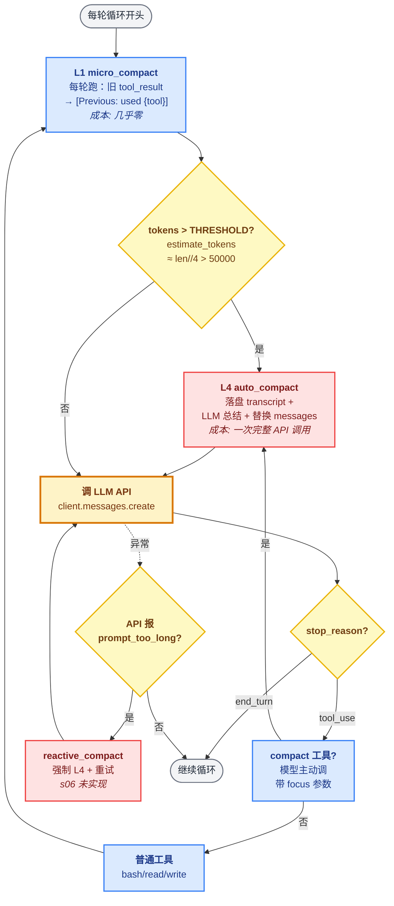

# 08 - Context Compact

> [!note]
> 任何 LLM 都有上下文上限（200K、1M、8M……）。一个跑了 50 轮的 Agent 会自然逼近这个上限——除非主动压缩。s08 设计了**渐进式压缩管线**：从最便宜的"丢中间消息"，到最贵的"让 LLM 写总结"，按代价从低到高依次触发。这是 Agent 能跑长任务的命门。

## 这节重点关注

读完这节，你应该能在脑子里答出这 5 个问题：

1. **分层动机**：为什么不直接每次都让 LLM 总结？分层方案的核心思想是什么？（→ [演进与动机](#演进与动机)）
2. **每层语义**：四层（snip / micro / budget / history）各做什么？哪层最便宜哪层最贵？（→ [核心抽象](#四层渐进式压缩)）
3. **引用技巧**：micro_compact 为什么必须改 dict 字段（`block["content"] = ...`）而不是换对象（`block = {...}`）？（→ [核心抽象](#micro_compact的引用技巧)）
4. **反应式兜底**：API 返回 `prompt_too_long` 时怎么办？为什么不能直接挂掉？（→ [核心抽象](#反应式兜底reactive_compact)）
5. **压缩不变量**：哪些东西绝对不能被压掉？为什么 todo / 最近 N 轮 / system 必须保护？（→ [设计要点](#设计要点)）

**可以略读/跳过**：源码里 `safe_path` / `run_bash` / `run_read` 等工具实现，与压缩逻辑无关。**压缩管线是主菜，工具是配菜。**

## 这一步加了什么

| 新增 | 作用 | 重点? |
|---|---|---|
| `micro_compact(messages)` | 每轮把旧 tool_result 替换成 `"[Previous: used {tool}]"` | ⭐⭐⭐ |
| `auto_compact(messages, focus)` | token 超阈值时让 LLM 总结 + 落盘 transcript | ⭐⭐⭐ |
| `compact` 工具 | 用户/模型主动触发压缩，可带 `focus` 保留特定信息 | ⭐⭐ |
| `estimate_tokens(messages)` | 粗略估算：`len(str(messages)) // 4` | ⭐⭐ |
| `THRESHOLD = 50000` | 触发 auto_compact 的水位线 | ⭐⭐ |
| `KEEP_RECENT = 3` | micro_compact 保留最近 3 个 tool_result 不动 | ⭐⭐ |
| `PRESERVE_RESULT_TOOLS = {"read_file"}` | read_file 输出**永不压缩**（参考资料） | ⭐⭐ |
| `TRANSCRIPT_DIR / .transcripts/` | 压缩前把完整对话落盘，可回溯 | ⭐ |
| `KEEP_RECENT = 3`（auto_compact 后） | 总结后保留最近 3 轮作为"工作记忆" | ⭐ |

## 演进与动机

### 反例：一刀切让 LLM 总结

最直观的做法是：上下文快满了 → 调 LLM 总结历史 → 用总结替换历史。

但这个做法有四个问题：

1. **贵**——每次压缩都是一次完整 API 调用（输入几十 K，输出几 K 总结）。频繁触发开销指数级上升。
2. **慢**——LLM 总结一次要几秒到几十秒。Agent 频繁停顿会让用户体验崩坏。
3. **信息损失不可控**——LLM 总结会丢细节。如果只是"中间几条 grep 输出太大"，根本不需要 LLM 来总结，直接删掉就好。LLM 总结应该是**最后手段**，不是第一手段。
4. **触发条件难定**——什么时候算"快满了"？token 数？消息数？字符数？不同任务模式不一样。

### 解法核心：Tiered Degradation

分层方案的核心思想：**用最便宜的方法解决 80% 的情况，把昂贵的 LLM 总结留给真正复杂的 20%**。这是系统设计里到处都有的模式：

- CPU 缓存：L1 → L2 → L3 → 内存 → 磁盘，越往下越慢但容量越大。
- 日志系统：DEBUG → INFO → WARN → ERROR，默认级别以下全砍掉。
- 垃圾回收：分代 GC，新生代用 copying（便宜），老生代用 mark-sweep（贵）。

每一层的设计原则都是：

1. **本层先尝试**：能用便宜方法解决就不升级。
2. **本层失败时升级**：进入下一层。
3. **越往下越激进**：早期是"删冗余"，后期是"重新表达"。

### 产品需求：让 Agent 跑长任务

真实工作流里 Agent 可能要跑几十甚至上百轮（重构整个模块、迁移代码库）。没有压缩，200K 上下文 30 轮就撑爆了。压缩是 Agent 从"演示玩具"走向"生产工具"的命门。

## 核心抽象

### 四层渐进式压缩

按代价从低到高，理想中的分层（Claude Code 真实行为）：

| 层 | 名字 | 触发条件 | 做什么 | 成本 |
|---|---|---|---|---|
| L1 | **snip_compact** | messages > 50 条 | 砍掉中间最老的几条消息 | 几乎零 |
| L2 | **micro_compact** | 任何工具调用后 | 把旧 tool_result 替换成占位符 | 几乎零 |
| L3 | **tool_result_budget** | 单条 tool_result > 200K 字符 | 把大结果落盘，content 改成路径 | 一次磁盘 IO |
| L4 | **compact_history** | 总 token 逼近上限 | 让 LLM 把整个历史写总结 | 一次完整 API 调用 |

加上一个**反应式兜底**：API 返回 `prompt_too_long` 错误时，立即强制触发 L4。

> [!note]
> **s06 源码的实际实现**：s06 简化教学版只做了 **L2 + L4 + L3(manual)** 三层，没有 L1（条数裁剪）。`micro_compact` 每轮跑、`auto_compact` 在 token 超 `THRESHOLD=50000` 时跑、`compact` 工具让模型主动触发。下面四层描述是 Claude Code 生产形态，s06 代码骨架见 [代码骨架总览](#代码骨架总览)。

### L1 - snip_compact（条数裁剪）

什么时候触发：messages 超过 50 条。

做什么：保留最早几条（用户最初目标）和最近几十条（最近上下文），中间砍掉。

为什么有效：长任务里中间的工具调用往往是为了"探索"，主 Agent 早已基于它们做出了决定，留下结论就够了。

- 不砍最新——**最近上下文最重要**。模型在 ReAct 循环里需要看到"我刚才查了什么，结果是什么"才能决定下一步。
- 不砍最早——**最初目标定义了任务**。砍掉就忘了用户要什么。

### L2 - micro_compact（工具结果占位）

什么时候触发：每轮工具调用后（在 s06 里是循环开头先跑一次）。

做什么：把"超过 KEEP_RECENT=3 轮之前的 tool_result"的 content 替换成 `"[Previous: used {tool_name}]"`。

为什么有效：tool_result 是上下文里**最大**的块（一次 grep 输出可能 50K token）。但它的影响会随时间衰减——几轮前的输出，主 Agent 早就消化了。

为什么是替换不是删除：API 协议要求每个 `tool_use` 必须有配对的 `tool_result`，否则报错。所以只能**改内容**，不能删块。

**特殊保护**：`PRESERVE_RESULT_TOOLS = {"read_file"}`——read_file 的输出永不压缩。它是参考资料，压掉就要重读，反而更贵。

#### micro_compact 的引用技巧

```python
def micro_compact(messages: list) -> list:
    # 收集所有 tool_result 的 (msg_idx, part_idx, part_dict) 三元组
    tool_results = []
    for msg_idx, msg in enumerate(messages):
        if msg["role"] == "user" and isinstance(msg.get("content"), list):
            for part_idx, part in enumerate(msg["content"]):
                if isinstance(part, dict) and part.get("type") == "tool_result":
                    tool_results.append((msg_idx, part_idx, part))
    if len(tool_results) <= KEEP_RECENT:
        return messages
    # ...匹配 tool_use_id → tool_name 映射...
    to_clear = tool_results[:-KEEP_RECENT]
    for _, _, result in to_clear:
        # ↓ 关键：直接改 dict 字段，不是换对象
        result["content"] = f"[Previous: used {tool_name}]"
    return messages
```

**关键认知**：`part` 是 messages 里的 dict 引用。直接改 `result["content"] = ...` 会影响原 messages——所有指向这个 dict 的变量都看到新值。**这是 Python 引用语义**。

❌ 错误写法：`result = {"type": "tool_result", ...}` 只改局部变量，原 messages 不变。
✅ 正确写法：`result["content"] = ...` 改 dict 字段，原 messages 立即生效。

### L3 - tool_result_budget（大结果落盘）

什么时候触发：单条 tool_result 的 content 超过 200K 字符。

做什么：把 content 写到磁盘文件（`/tmp/tool_result_xxx.txt`），把 tool_result 的 content 改成 `"Result saved to /tmp/tool_result_xxx.txt (use read_file to access)"`。

为什么有效：很多工具输出天然巨大（一个 SQL 查询返回 50K 行）。这种"罕见但合法"的大块不该靠 L1 / L2 反复触发，直接落盘一次到位。

为什么不让模型直接看：模型也看不过来 200K 字符——它的注意力会被淹没。落盘后**模型需要时再 read_file 部分**，反而更精准。

### L4 - compact_history（LLM 总结）

什么时候触发：总 token 数逼近上下文上限（s06 里是 `THRESHOLD = 50000`）。

做什么：

1. 把当前 messages 落盘到 `.transcripts/transcript_{timestamp}.jsonl`（可回溯）。
2. 取对话尾部约 80K 字符发给 LLM，要求总结：用户目标、已完成的工作、关键发现、未完成的子任务、重要文件路径。
3. 用总结替换整个 messages（保留最近 KEEP_RECENT=3 轮作为"工作记忆"）。
4. 之后续跑。

为什么这层贵但必要：前 3 层都是**机械式**的——它们不知道"什么是重要的"。只有 LLM 能语义判断"这个 grep 输出虽然老但是关键"。L4 是最后的语义压缩。

为什么不一直用 L4：太贵。一次 L4 调用 = 一次完整推理。频繁触发成本爆炸。

### 反应式兜底（reactive_compact）

API 偶尔会返回 `prompt_too_long` 错误——你预估的 token 数和实际可能差几千。这时候不能让 Agent 死掉。catch 这个错误，强制跑一次 L4，然后重试。

这是 **Fail-Fast Recovery**：宁可花一次贵的总结，也不能让任务挂掉。

> [!note]
> **s06 实际实现里没有 reactive_compact**——s06 用 `THRESHOLD=50000` 主动预防，假设预防到位就不会撞墙。生产环境必须加反应式兜底，因为 token 估算只是粗略值（`len(str(messages)) // 4`）。

## 整体架构图



## 压缩什么不能碰（不变量）

无论哪一层，都不要碰：

- **当前 todos（[[05 - TodoWrite]]）**：模型的外置记忆，丢了它就忘了任务。
- **最近 N 轮（KEEP_RECENT=3）**：模型在 ReAct 中的工作记忆。
- **最初的用户请求**：任务的目标定义。
- **system prompt**：永远不压缩。
- **`PRESERVE_RESULT_TOOLS`（read_file）的输出**：参考资料，压掉就要重读。

这些都是"压缩不变量"——保护它们就是保护任务连续性。

## 原本的 Claude Code 怎么做的

Claude Code 的压缩在公开文档里描述得很清楚，核心思想一致：

### 1. 自动压缩

接近上下文上限时（系统会监控），自动触发 LLM 总结。总结会被**显式标记**（注入一条 system-reminder 告诉模型"以下是历史总结"），让模型知道这不是原始历史。

### 2. 用户可见

压缩发生时，CLI 会显示"Compressing context…"。**用户必须知道发生了什么**——模型可能因为压缩丢失关键信息，用户看到提示能主动补回（比如再说一遍"目标是 X"）。

### 3. /compact 命令

用户可以主动触发压缩，而不是等系统触发。在长任务里这是个有用的"保存点"——压缩完再继续，节省后续 token。s06 的 `compact` 工具就是模型侧的版本，可带 `focus` 参数保留特定信息。

### 4. /clear 命令

更激进——直接清空所有历史，从空白开始。等价于"重启会话"。

### 5. todo 的特殊保护

Claude Code 的 todo / task 列表在压缩时被**单独保存**，压缩完作为新一轮 system-reminder 重新注入。这保证了无论压缩多少次，任务上下文都不会丢。

## 设计要点

### 1. 触发条件用"水位线"而不是单点

不要写"超过 150K 触发压缩"。应该写"超过 130K 准备触发，超过 150K 强制触发，超过 180K 紧急触发"。这样能避免边界抖动（在 150K 上下反复触发）。

### 2. 每层都要可观测

每次压缩都应该打日志：哪一层触发、压缩前后多少 token、压掉了什么。否则用户不知道为什么 Agent 突然忘了某个细节。s06 用 `print("[auto_compact triggered]")` 简单提示。

### 3. 压缩后注入 system-reminder

模型看到"以下是历史总结"的标记，会知道记忆可能不全，更倾向于 ask user 而不是假设。这是诚实的工程实践。s06 简化为 `[Conversation compressed. Transcript: ...]` 前缀。

### 4. 压缩时机选在"自然的回合边界"

不要在工具调用中途压缩——可能丢失工具结果。最好在 `stop_reason != "tool_use"` 的回合（模型说完了话）之后压缩。s06 在每轮开头先跑 micro_compact / 检查 auto_compact，保证压缩在干净边界。

### 5. 落盘 transcript 是逃生通道

`auto_compact` 把完整对话写到 `.transcripts/transcript_{ts}.jsonl`。万一总结丢了关键信息，可以从 transcript 找回。生产环境应该有 read_file 工具能直接读 transcript。

## 相关概念

- [[05 - TodoWrite]]：todo 是压缩不变量，必须保护。
- [[06 - Subagent]]：subagent 是"预期会爆就先隔离"的主动策略，compact 是"已经爆了再压缩"的被动策略。互补。
- [[01 - Agent Loop]]：所有压缩都发生在 agent_loop 的回合边界。
- [[04 - Hooks]]：PostToolUse 是 L2 / L3 触发的天然位置。

> [!warning]
> 几个容易踩的坑：
>
> 1. **一次压缩太多**：L4 把整个历史塞进总结，丢失关键路径。保留最近 N 轮不被总结。
> 2. **压缩 todo**：任务列表被压没，模型忘了在做什么。
> 3. **改对象而不是改字段**：micro_compact 写成 `block = {...}` 不会生效，必须 `block["content"] = ...`。
> 4. **没有反应式兜底**：API 报 prompt_too_long 时直接挂掉。生产环境必须 catch + 强制压缩 + 重试。
> 5. **触发条件单点**：在 150K 边界抖动，反复触发。要用水位线 + 滞回。
> 6. **压缩 read_file 结果**：read_file 是参考资料，压掉就要重读，反而更贵。s06 用 `PRESERVE_RESULT_TOOLS` 白名单豁免。

## 代码骨架总览

剥掉所有工具实现，s06 的压缩管线只有这么多代码。**注意 s06 实际只有 L2 + L4 + L3(manual) 三层**——L1（条数裁剪）和反应式兜底是 Claude Code 生产形态，下面注释标出。

```python
# === 1. 全局阈值 ===
THRESHOLD = 50000              # token 估算超此值触发 auto_compact
KEEP_RECENT = 3                # micro/auto 都保留最近 3 条不动
TRANSCRIPT_DIR = WORKDIR / ".transcripts"
PRESERVE_RESULT_TOOLS = {"read_file"}   # read_file 输出永不压缩

def estimate_tokens(messages: list) -> int:
    """粗略估算：~4 字符 ≈ 1 token"""
    return len(str(messages)) // 4

# === 2. L2 micro_compact：旧 tool_result 替换为占位 ===
def micro_compact(messages: list) -> list:
    # 收集所有 tool_result 的 (msg_idx, part_idx, part_dict) 引用
    tool_results = []
    for msg_idx, msg in enumerate(messages):
        if msg["role"] == "user" and isinstance(msg.get("content"), list):
            for part_idx, part in enumerate(msg["content"]):
                if isinstance(part, dict) and part.get("type") == "tool_result":
                    tool_results.append((msg_idx, part_idx, part))
    if len(tool_results) <= KEEP_RECENT:
        return messages
    # 匹配 tool_use_id → tool_name（从前面的 assistant 消息里找）
    tool_name_map = {}
    for msg in messages:
        if msg["role"] == "assistant" and isinstance(msg.get("content"), list):
            for block in msg["content"]:
                if hasattr(block, "type") and block.type == "tool_use":
                    tool_name_map[block.id] = block.name
    # 砍掉除最后 KEEP_RECENT 个以外的，但保留 read_file 输出
    for _, _, result in tool_results[:-KEEP_RECENT]:
        if not isinstance(result.get("content"), str) or len(result["content"]) <= 100:
            continue
        tool_name = tool_name_map.get(result.get("tool_use_id", ""), "unknown")
        if tool_name in PRESERVE_RESULT_TOOLS:
            continue  # ← read_file 永不压缩
        result["content"] = f"[Previous: used {tool_name}]"   # ← 关键：改字段
    return messages

# === 3. L4 auto_compact：落盘 + LLM 总结 + 替换 messages ===
def auto_compact(messages: list, focus: str = "") -> list:
    # 1) 落盘完整 transcript（逃生通道）
    TRANSCRIPT_DIR.mkdir(exist_ok=True)
    transcript_path = TRANSCRIPT_DIR / f"transcript_{int(time.time())}.jsonl"
    with open(transcript_path, "w") as f:
        for msg in messages:
            f.write(json.dumps(msg, default=str) + "\n")
    # 2) 让 LLM 总结尾部 ~80K 字符
    conversation_text = json.dumps(messages, default=str)[-80000:]
    focus_instruction = f" Pay special attention to preserving: {focus}." if focus else ""
    response = client.messages.create(
        model=MODEL,
        messages=[{"role": "user", "content":
            "Summarize this conversation for continuity. Include: "
            "1) What was accomplished, 2) Current state, 3) Key decisions made. "
            f"Be concise but preserve critical details.{focus_instruction}\n\n" + conversation_text}],
        max_tokens=2000,
    )
    summary = next((b.text for b in response.content if hasattr(b, "text")), "No summary generated.")
    # 3) 替换：总结 + 标记 transcript 路径
    return [{"role": "user",
             "content": f"[Conversation compressed. Transcript: {transcript_path}]\n\n{summary}"}]

# === 4. L3 manual compact：暴露成工具，模型/用户主动调用 ===
TOOL_HANDLERS["compact"] = lambda **kw: "Manual compression requested."
TOOLS.append({
    "name": "compact", "description": "Trigger manual conversation compression.",
    "input_schema": {"type": "object",
                     "properties": {"focus": {"type": "string", "description": "What to preserve"}}},
})

# === 5. 主循环：L2 每轮 + L4 超阈值触发 + L3 工具触发 ===
def agent_loop(messages: list):
    while True:
        # L2：每轮先跑 micro_compact
        micro_compact(messages)
        # L4：token 超阈值触发 auto_compact（用 messages[:] 原地替换）
        if estimate_tokens(messages) > THRESHOLD:
            messages[:] = auto_compact(messages)
        response = client.messages.create(
            model=MODEL, system=SYSTEM, messages=messages,
            tools=TOOLS, max_tokens=8000,
        )
        messages.append({"role": "assistant", "content": response.content})
        if response.stop_reason != "tool_use":
            return
        results, manual_compact, compact_focus = [], False, ""
        for block in response.content:
            if block.type == "tool_use":
                if block.name == "compact":   # ← L3：模型主动调 compact
                    manual_compact = True
                    compact_focus = block.input.get("focus", "")
                    output = "Compressing..."
                else:
                    handler = TOOL_HANDLERS.get(block.name)
                    output = handler(**block.input) if handler else f"Unknown tool: {block.name}"
                results.append({"type": "tool_result", "tool_use_id": block.id, "content": str(output)})
        messages.append({"role": "user", "content": results})
        # L3 执行：用户主动触发，带 focus 保留特定信息
        if manual_compact:
            messages[:] = auto_compact(messages, focus=compact_focus)
            return   # 压缩后等下一轮用户输入再继续

# 生产环境补丁（s06 未实现，必备）：
# try:
#     response = client.messages.create(...)
# except APIError as e:
#     if "prompt_too_long" in str(e):
#         messages[:] = auto_compact(messages)
#         continue   # ← 反应式兜底，强制压缩后重试
#     raise
```

**这 5 块是 s06 压缩管线的全部抽象**。关键认知：

1. `messages[:] = auto_compact(...)` 是**原地替换**——外部持有的 `messages` 引用仍有效（如果用 `messages = ...`，调用方的引用会失效）。
2. micro_compact 改 dict 字段不是换对象——这是 Python 引用语义的应用。
3. 落盘 transcript 是逃生通道，比单纯总结更稳。

## Q&A

（本节学习暂未记录卡点）
