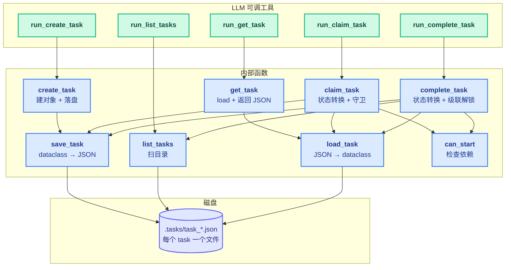
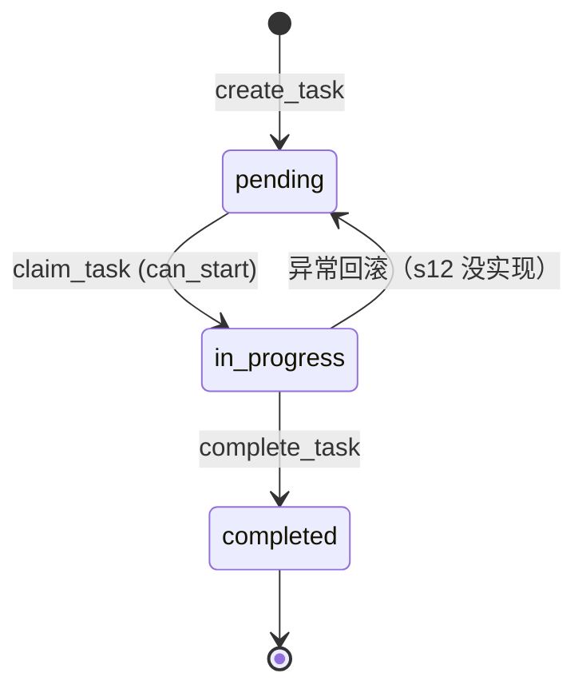
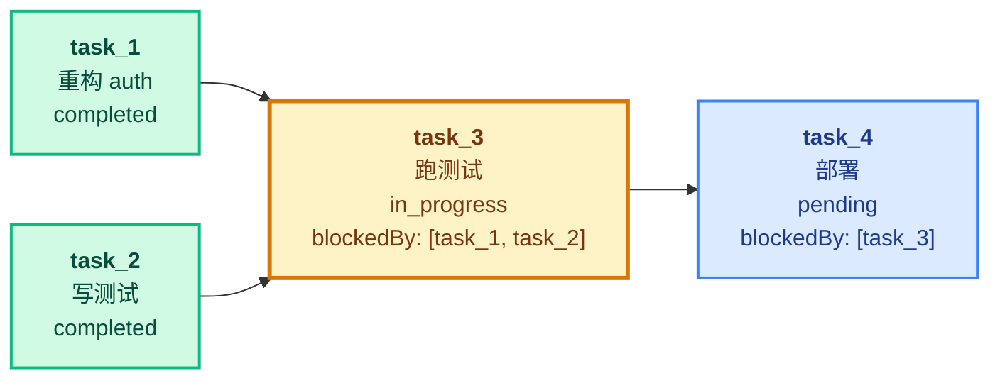

# 12 - Task System

> [!note]
> Phase 1 - 3 的 Agent 把"任务"放在两个地方：模型的脑内（plan）和 TodoWrite（在 messages 里）。两者都是**易失的**——会话结束 / 进程重启就消失，也没法表达"任务 A 完成后才能跑任务 B"这种依赖。s12 把任务外置成**磁盘上的 JSON 文件 + 状态机 + 依赖图**，让任务跨重启存活、跨工具调用可观察、跨 Agent 协作可分配。

## 这节重点关注

读完这节，你应该能在脑子里答出这 5 个问题：

1. **持久化动机**：为什么不直接用 s05 的 TodoWrite？磁盘文件解决了哪三类问题？（→ [演进与动机](#演进与动机)）
2. **状态机契约**：Task 有哪 3 个状态、2 个合法转换？`claim_task` / `complete_task` 的守卫是什么？（→ [状态机](#状态机)）
3. **依赖图语义**：`blockedBy` 怎么判合法性？缺失依赖为什么视为 blocked 而不是 error？（→ [依赖图dag](#依赖图dag)）
4. **agent_loop 影响**：为什么 s12 是 Phase 4 里对 agent_loop 改动最小的一课？（→ [对-agent_loop-的影响](#对-agent_loop-的影响)）
5. **文件粒度选择**：为什么不用 SQLite？文件粒度持久化为未来多 Agent 协作留了什么接口？（→ [设计要点](#设计要点)）

**可以略读/跳过**：5 个 LLM 工具的薄包装函数（`run_create_task` / `run_list_tasks` 等），它们只是参数解包 + 调内部 + 格式化输出。**核心抽象是 `Task` dataclass + 状态机 + DAG，工具入口是配菜。**

## 这一步加了什么

| 新增 | 作用 | 重点? |
|---|---|---|
| `Task` dataclass | 6 字段：id / subject / description / status / owner / blockedBy | ⭐⭐⭐ |
| `TASKS_DIR = .tasks/` | 每个 task 一个 JSON 文件 | ⭐⭐ |
| `_task_path` / `save_task` / `load_task` | CRUD 磁盘读写 | ⭐⭐ |
| `create_task` / `list_tasks` / `get_task` | 业务层 CRUD | ⭐⭐ |
| `can_start` | 检查所有 blockedBy 是否都 completed | ⭐⭐⭐ |
| `claim_task` / `complete_task` | 状态转换 + 守卫 + 级联解锁报告 | ⭐⭐⭐ |
| 5 个 LLM 工具 | `create_task` / `list_tasks` / `get_task` / `claim_task` / `complete_task` | ⭐ |

## 演进与动机

s05 的 TodoWrite 把任务列表存在 messages 的 tool_result 里。三个痛点：

1. **易失性**：会话结束 = messages 清空 = 任务全丢。s08 的 micro_compact / compact_history 还会把旧的 tool_result 压缩掉——TodoWrite 写下的任务列表可能被裁成占位符，模型自己都忘了写过什么。
2. **无依赖**：用户说"重构 auth → 跑测试 → 部署"，模型得自己脑内记住顺序。上下文压缩或会话重启时这个隐式状态就丢了。
3. **无持久化**：长任务跑一半进程崩了，重启后想从断点继续？TodoWrite 给不了——它根本不在磁盘上。

**反例**：

```python
# 灾难现场：用 TodoWrite 表达依赖
todos = [
    {"task": "重构 auth"},
    {"task": "跑测试"},      # 模型得自己脑记"要先重构完"
    {"task": "部署"},        # 模型得自己脑记"要测试过"
]
# 上下文压缩后 → 模型忘了顺序 → 直接部署 → 灾难
```

**解法核心**：把任务外置成磁盘 JSON 文件 + 显式 `blockedBy: list[str]` 依赖关系 + 状态机守卫。task_X 不 `completed`，task_Y 就 `can_start() = False`。task 系统是**外部的工作记忆**，让长流程有结构、可恢复、可依赖。

**产品需求**：`owner` 字段为 Phase 5 多 Agent 协作留接口——多个 Agent 并行 claim 不同 task，互不冲突。

## 核心抽象

### Task dataclass

```python
@dataclass
class Task:
    id: str                   # f"task_{timestamp}_{random}"
    subject: str              # 一句话标题
    description: str          # 详细描述
    status: str               # "pending" | "in_progress" | "completed"
    owner: str | None         # Agent name（multi-agent scenarios）
    blockedBy: list[str]      # 依赖的 task_id 列表
```

### 状态机

3 个状态、2 个合法转换：

- `pending` → `in_progress`（`claim_task`，守卫：`can_start()` 为真）
- `in_progress` → `completed`（`complete_task`）
- `in_progress` → `pending`（异常回滚，**s12 没实现**）

守卫防止模型乱调（重复 claim、跳过依赖、completed 再 claim）。

### 依赖图（DAG）

`blockedBy: list[str]` 是 task_id 列表。`can_start()` 检查：所有依赖必须 `status == "completed"`，**缺失的依赖（文件不存在）视为 blocked**——Fail-safe，宁可卡住不要乱跑。

## 整体架构图



## 状态机



转换守卫：

- `claim_task` 必须 `status == "pending"` 且 `can_start() == True`
- `complete_task` 必须 `status == "in_progress"`

## 依赖图（DAG）

`blockedBy: list[str]` 是 task_id 列表。语义：所有依赖必须 `completed` 才能 `can_start()`；缺失的 id（文件不存在）= 视为未完成 = blocked。



## 文件粒度持久化

每个 task 一个 JSON 文件，不用数据库：

```
.tasks/
  task_1718888000_1234.json
  task_1718888005_5678.json
  task_1718888010_9012.json
```

好处：原子性（写一个不影响其他）、可观察（`cat` 直接看）、git diff 友好、并发安全（不同文件互不干扰，为多 Agent 留接口）。

## Pattern：Persistent State Machine with DAG Dependencies

合起来：**状态机 + DAG + 文件持久化**。三个机制叠加，task 系统就有了完整能力。

## 原本的 Claude Code 怎么做的

CC 早期用 TodoWrite（跟 s05 一样），后来升级成 Task 系列：

| CC 工具 | 对应 s12 函数 |
|---|---|
| `TaskCreate` | `create_task` |
| `TaskList` | `list_tasks` |
| `TaskGet` | `get_task` |
| `TaskUpdate` | `claim_task` + `complete_task`（合并了，用 status 参数控制） |
| `TaskStop` | s12 没有的，强制结束进行中的任务 |

CC 跟 s12 的区别：

1. **owner 用于多 Agent**：CC 的 Task 同样有 owner，用于主 Agent + sub-agent 协调。
2. **状态更丰富**：CC 可能还包括 deleted / blocked 等状态。s12 简化到 3 状态。
3. **UI 可视化**：CC 的 task 状态同步到 UI（spinner、状态图标）。s12 只 print 到 stdout。

## 对 agent_loop 的影响

**几乎没有影响**。这是 s12 最容易理解也最容易被忽视的特点——也是 Phase 4 里**最干净的一课**。

### 改动只有两处

```python
# 1. TOOLS 数组加 5 个新工具
TOOLS = [
    {"name": "bash", ...},
    {"name": "read_file", ...},
    {"name": "write_file", ...},
    {"name": "create_task", ...},   # ← 新
    {"name": "list_tasks", ...},    # ← 新
    {"name": "get_task", ...},      # ← 新
    {"name": "claim_task", ...},    # ← 新
    {"name": "complete_task", ...}, # ← 新
]

# 2. TOOL_HANDLERS 字典加 5 个映射
TOOL_HANDLERS = {
    "bash": run_bash, "read_file": run_read, "write_file": run_write,
    "create_task": run_create_task, ...,
}
```

### agent_loop 本身完全没动

```python
def agent_loop(messages, context):
    while True:
        response = client.messages.create(...)
        messages.append({"role": "assistant", "content": response.content})
        if response.stop_reason != "tool_use":
            return

        results = []
        for block in response.content:
            if block.type != "tool_use":
                continue
            handler = TOOL_HANDLERS.get(block.name)   # ← 跟之前一样
            output = handler(**block.input)            # ← task 工具走这里
            results.append({"type": "tool_result",
                            "tool_use_id": block.id, "content": output})
        messages.append({"role": "user", "content": results})
```

task 工具完全走标准 dispatch。模型调 `create_task` 跟调 `bash` 在 agent_loop 看来没区别。

### 这是 s12 的设计精髓

**通过工具抽象把新功能塞进 Agent**，不需要改循环。开放-封闭：

- 对扩展开放：加新功能就加新工具。
- 对修改封闭：agent_loop 一行不改。

对比 s13/s14 都改了 agent_loop，s12 是 Phase 4 里**最干净的一课**。

## 多线程并行情况

**s12 完全没有多线程**。

- 主线程一个 while 循环跑 agent_loop。
- 工具同步执行：`handler(**block.input)` 调完才返回。
- `.tasks/*.json` 文件读写没有任何锁。

这意味着：长任务会阻塞整个 agent loop；多个 task 必须串行（不能两个 Agent 同时 claim 同一个 task）。

s13 引入线程后才解决"慢工具阻塞"。s12 只解决"任务持久化"，不解决"执行并行化"。

### 文件粒度持久化的并发优势

虽然 s12 单线程不并发，但**文件粒度持久化设计**为未来并发留好了空间：两个 Agent 同时写不同 task 文件互不影响，不需要数据库级别的锁。这正是 Phase 5 多 Agent 协作的基础。

## 设计要点

### 1. 状态机 + 守卫

```python
def claim_task(task_id, owner="agent"):
    task = load_task(task_id)
    if task.status != "pending":           # 守卫 1
        return f"Task {task_id} is {task.status}, cannot claim"
    if not can_start(task_id):              # 守卫 2
        return f"Blocked by: {deps}"
    ...
```

守卫 = 状态转换的合法性检查，防止模型乱调（重复 claim、跳过依赖）。

### 2. 级联解锁

`complete_task` 不只改自己的状态，还**主动报告新解锁的下游**：

```python
unblocked = [t.subject for t in list_tasks()
             if t.status == "pending" and t.blockedBy and can_start(t.id)]
msg = f"Completed {task.id}"
if unblocked:
    msg += f"\nUnblocked: {', '.join(unblocked)}"
```

这给模型一个信号："你刚完成的这个 task 解锁了 X 和 Y，下一步可以做它们"。模型不需要自己 `list_tasks` 再算依赖。

### 3. 缺失依赖视为 blocked

```python
def can_start(task_id):
    for dep_id in task.blockedBy:
        if not _task_path(dep_id).exists():    # 文件不存在
            return False
        ...
```

`blockedBy: ["task_X"]` 但 task_X 文件不存在（被删了、ID 写错了），视为 blocked 而不是 error。**Fail-safe**：宁可卡住不要乱跑。

### 4. task_id 用时间戳 + 随机

```python
id=f"task_{int(time.time())}_{random.randint(0, 9999):04d}"
```

时间戳保证大致有序，随机数避免同一秒创建冲突。够用且无依赖（不需要 UUID 库）。

### 5. owner 字段为多 Agent 留接口

```python
owner: str | None  # Agent name (multi-agent scenarios)
```

s12 单 Agent 时 owner 永远是 "agent"。但字段已经在那，Phase 5 多 Agent 协作时直接复用。

### 6. 为什么不用 SQLite

| 方案 | 优点 | 缺点 |
|---|---|---|
| JSON 文件（s12） | 可观察（cat 直接看）、git 友好、原子写单个文件、无依赖 | 大量 task 时慢（每次 list 扫目录） |
| SQLite | 索引快、查询强（SQL） | 二进制不可读、git diff 不友好、加依赖 |

s12 场景：task 数量小（几十到几百），查询简单（list / get by id），用户经常直接看目录，多 Agent 协作时文件粒度的并发安全是优势。SQLite 适合成千上万条 + 复杂查询的场景，s12 不需要。

## 相关概念

- [[05 - TodoWrite]]：s12 的前身，in-memory 版本
- [[13 - Background Tasks]]：s13 让 task 内的慢工具能异步跑
- [[14 - Cron Scheduler]]：s14 让 task 能由时间驱动触发
- [[Phase 2 - 上下文治理/00 - 综合总结]]：TodoWrite 在 Phase 2 引入
- [[09 - Memory]]：同样的"外置到磁盘"模式（memory 也是 .memory/*.md）

> [!warning]
> 几个容易踩的坑：
>
> 1. **以为 task 系统是给模型的 plan**。不是。task 是给系统的持久状态，模型只是通过工具读写它。模型的"plan"是脑内的，task 是磁盘上的。
> 2. **以为 task 系统会自动执行依赖**。不会。`complete_task` 只**报告**解锁，模型仍需自己 `claim_task` 下一个。task 系统是状态记录，不是工作流引擎。
> 3. **task_id 拼写错了**：`blockedBy: ["tasK_123"]` 拼错，`can_start` 永远返回 False（视为缺失）。生产实现可以加 task_id 存在性校验，s12 简化掉了。

## 代码骨架总览

剥掉所有薄包装工具函数，s12 的核心抽象层只有这么多代码：

```python
# === 1. 数据结构 ===
@dataclass
class Task:
    id: str
    subject: str
    description: str
    status: str               # "pending" | "in_progress" | "completed"
    owner: str | None         # multi-agent 用
    blockedBy: list[str]      # 依赖的 task_id 列表

TASKS_DIR = Path(".tasks")

# === 2. CRUD（纯磁盘读写）===
def _task_path(task_id: str) -> Path:
    return TASKS_DIR / f"{task_id}.json"

def save_task(task: Task):
    _task_path(task.id).write_text(json.dumps(asdict(task), indent=2))

def load_task(task_id: str) -> Task:
    return Task(**json.loads(_task_path(task_id).read_text()))

def list_tasks() -> list[Task]:
    return [Task(**json.loads(p.read_text()))
            for p in sorted(TASKS_DIR.glob("task_*.json"))]

def create_task(subject, description="", blockedBy=None) -> Task:
    task = Task(
        id=f"task_{int(time.time())}_{random.randint(0, 9999):04d}",
        subject=subject, description=description,
        status="pending", owner=None,
        blockedBy=blockedBy or [],
    )
    save_task(task)
    return task

# === 3. 依赖检查 ===
def can_start(task_id: str) -> bool:
    task = load_task(task_id)
    for dep_id in task.blockedBy:
        if not _task_path(dep_id).exists():         # 缺失 = blocked（Fail-safe）
            return False
        if load_task(dep_id).status != "completed":
            return False
    return True

# === 4. 状态机转换（带守卫）===
def claim_task(task_id: str, owner: str = "agent") -> str:
    task = load_task(task_id)
    if task.status != "pending":                    # 守卫 1
        return f"Task {task_id} is {task.status}, cannot claim"
    if not can_start(task_id):                      # 守卫 2
        return f"Blocked by: {task.blockedBy}"
    task.owner = owner
    task.status = "in_progress"
    save_task(task)
    return f"Claimed {task.id} ({task.subject})"

def complete_task(task_id: str) -> str:
    task = load_task(task_id)
    if task.status != "in_progress":
        return f"Task {task_id} is {task.status}, cannot complete"
    task.status = "completed"
    save_task(task)
    # 级联解锁：主动报告新解锁的下游
    unblocked = [t.subject for t in list_tasks()
                 if t.status == "pending" and t.blockedBy and can_start(t.id)]
    msg = f"Completed {task.id} ({task.subject})"
    if unblocked:
        msg += f"\nUnblocked: {', '.join(unblocked)}"
    return msg

# === 5. agent_loop 完全不变，task 工具走标准 dispatch ===
def agent_loop(messages, context):
    while True:
        response = client.messages.create(
            model=MODEL_ID, system=SYSTEM_PROMPT,
            tools=TOOLS, messages=messages,
        )
        messages.append({"role": "assistant", "content": response.content})
        if response.stop_reason != "tool_use":
            return
        results = []
        for block in response.content:
            if block.type != "tool_use":
                continue
            handler = TOOL_HANDLERS[block.name]     # task 工具和 bash 同款入口
            results.append({"type": "tool_result",
                            "tool_use_id": block.id,
                            "content": handler(**block.input)})
        messages.append({"role": "user", "content": results})
```

**这 5 块是 s12 的全部抽象层**。5 个 LLM 工具的 `run_*` 包装函数只是参数解包 + 格式化输出，可省。下一节 s13 会改 agent_loop 的 dispatch 加后台分支，s12 的磁盘骨架不变。

## Q&A

### Q1: 为什么需要有 task 系统，给我举个简单的例子

**A**：考虑这个对话：

> 用户："帮我重构 auth 模块，跑测试，测试过了再部署。"

**没有 task 系统**：模型把工作分成几步在脑内 plan（"我要先重构 → 再跑测试 → 再部署"）。但：

1. 用户关闭终端再开 → 模型忘了之前的 plan。
2. 中途上下文压缩（s08）→ 模型可能忘了"测试要过了再部署"这个依赖。
3. 跑测试跑了一半进程崩了 → 重启后不知道之前到哪步。

**有 task 系统**：

```python
t1 = create_task("重构 auth 模块")
t2 = create_task("跑测试", blockedBy=[t1.id])
t3 = create_task("部署", blockedBy=[t2.id])
```

每个步骤是磁盘上的 JSON 文件，重启后扫 `.tasks/` 目录就恢复。

- 重启后：`list_tasks` → 看到 t1 完成、t2 进行中 → 知道要继续跑测试。
- 模型想跳过测试直接部署：`claim_task(t3.id)` → 返回 "Blocked by: [t2.id]" → 阻止。

task 系统给 Agent 一个**外部的工作记忆**，让长流程有结构、可恢复、可依赖。

### Q2: 那么，模型什么时候用 task，什么时候用 TodoWrite 呢

**A**：**作用域不同**：

| 场景 | 用 |
|---|---|
| 临时列出步骤，帮自己理清思路 | TodoWrite（s05） |
| 跨多次工具调用的长任务 | Task System（s12） |
| 任务有依赖关系 | Task System |
| 需要跨会话恢复 | Task System |
| 简单的 3-5 步线性工作 | TodoWrite 够用 |

CC 的演进路径其实给出了答案：**早期 CC 用 TodoWrite，后来升级成 Task 系列（TaskCreate/Update/Get/List）取代了 TodoWrite**。原因：TodoWrite 的限制（in-memory、无依赖）让长任务难以管理。

**实际原则**：

- 任务可能跨会话或复杂 → 用 Task System。
- 任务在本轮内就能干完 → TodoWrite 即可。

### Q3: 我看到我用的 Claude Code 工具列表里没有 TodoWrite，是 TaskCreate/Update/Get/List，对吗？

**A**：对。CC 早期是 TodoWrite，现在升级成 Task 系列。你可以在你当前会话里看到的 `TaskCreate`、`TaskUpdate`、`TaskGet`、`TaskList`、`TaskStop` 就是 s12 这个机制的**产品化版**。

差异：

| 维度 | s12 教学版 | CC 产品版 |
|---|---|---|
| 工具数量 | 5 个（create/list/get/claim/complete） | 5 个（Create/Update/Get/List/Stop） |
| 状态 | 3 个（pending/in_progress/completed） | 多个（+ deleted/blocked 等） |
| owner | 单 Agent 用 | 多 Agent 协调用 |
| UI | print 到 stdout | 同步到 IDE 状态栏 |
| 持久化 | `.tasks/*.json` | 类似的文件机制 |

CC 的 TaskUpdate 把 s12 的 claim + complete 合并了（用 status 参数控制）。但核心模型（状态机 + DAG + 持久化）跟 s12 一样。

### Q4: complete_task 里那段"找新解锁的下游"会不会很慢

**A**：不会，**task 数量小**。

```python
unblocked = [t.subject for t in list_tasks()
             if t.status == "pending" and t.blockedBy and can_start(t.id)]
```

每次 complete 一次：

- `list_tasks()` 扫 `.tasks/` 目录读所有 JSON（N 个 task = N 次磁盘读）。
- 对每个 pending + 有依赖的，`can_start` 再读它的所有 deps（M 次）。

总复杂度 O(N × M)。N=100、M=5 时 = 500 次小文件读，毫秒级。

如果 N 涨到 10000，会需要索引（按 status 分桶 / 按 blockedBy 反向索引）。s12 简化掉这个，假设 task 数量不会爆炸。

### Q5: 如果两个工具调用同时改同一个 task 怎么办

**A**：s12 **单线程执行**，不会发生。`handler(**block.input)` 是同步的，模型一次只调一个工具（dispatch 是 for 循环）。

但如果未来引入多 Agent（Phase 5），两个 Agent 同时 `complete_task(t1.id)` 会有竞态。需要：

- 文件级锁（`flock`）。
- 或单写者模式（所有 task 操作走一个线程）。
- 或乐观锁（task 加 version 字段，写时检查）。

CC 在多 Agent 场景下用类似的机制保护 task 状态。s12 教学版不涉及这个，简化掉了。
