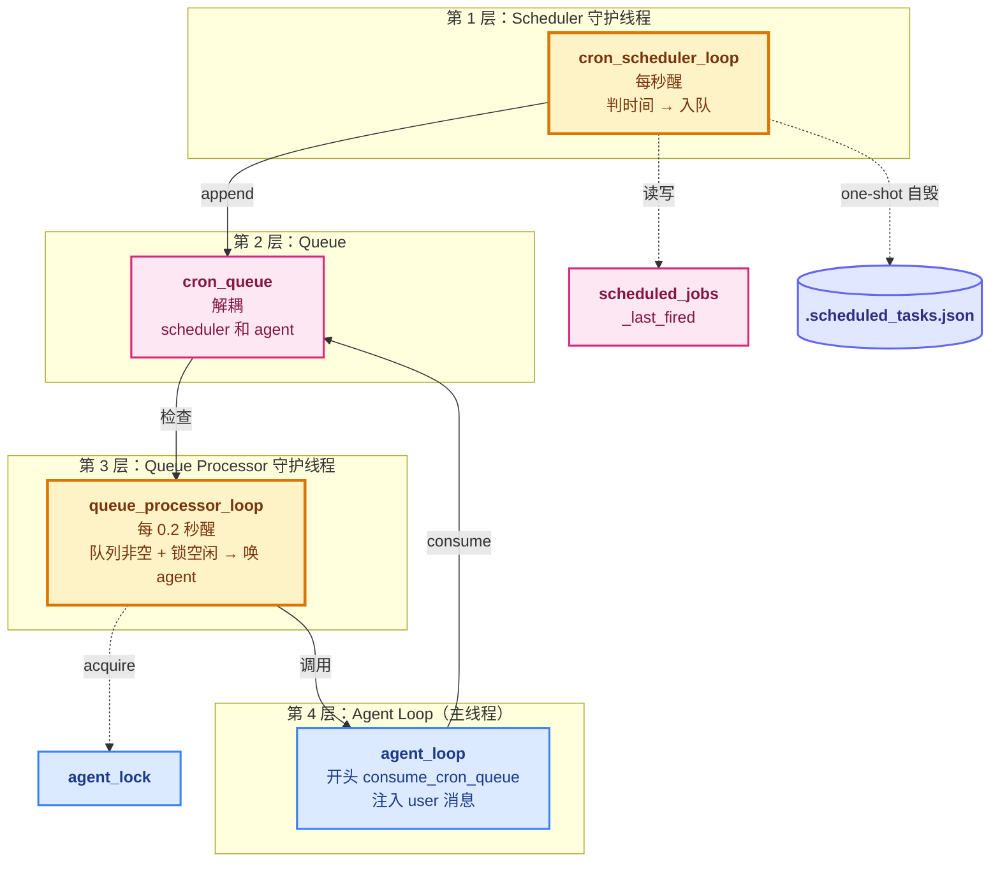
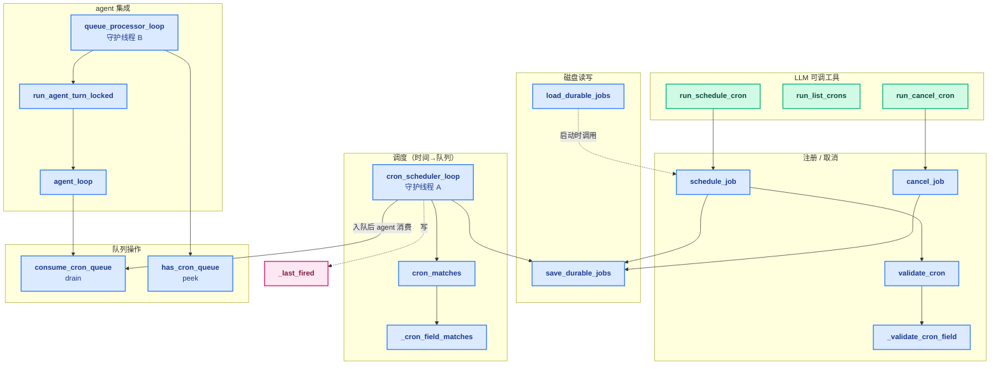
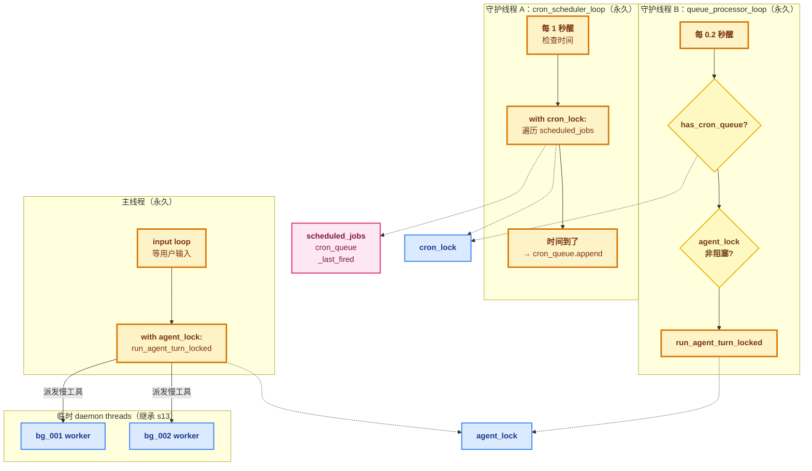

# 14 - Cron Scheduler

> [!note]
> s13 让 Agent 能"派发"慢工具，但仍要用户在场触发——没人输入 Agent 就静止。s14 让**时间本身**成为触发源：用户说"每天 9 点跑日报告"，s14 起一个**独立守护线程**每秒检查时间，到点了把任务塞进队列；另一个守护线程看到队列有东西且 Agent 空闲，就**主动唤起一次 agent turn**。Agent 从"被动响应"升级为"自主醒来"。这是 Phase 4 最复杂的一课，引入了**第一个长期运行的并发架构**。

## 这节重点关注

读完这节，你应该能在脑子里答出这 5 个问题：

1. **4 层架构**：Scheduler / Queue / Processor / Agent Loop 各负责什么？为什么不能合并？（→ [4 层架构 + 队列解耦](#4-层架构--队列解耦)）
2. **两把锁职责**：`cron_lock` 和 `agent_lock` 分别保护什么？为什么 A 线程不碰 agent_lock？（→ [两把锁的获取点](#两把锁的获取点)）
3. **DOM/DOW OR 语义**：Unix cron 历史包袱怎么用 if 分支实现？（→ [domdow-or-语义](#domdow-or-语义)）
4. **双重检查锁定**：queue_processor 为什么检查队列两次？（→ [双重检查锁定double-checked-locking](#双重检查锁定double-checked-locking)）
5. **agent_loop 改动**：s14 在循环入口前插了什么？两条调用路径怎么共享 messages？（→ [对-agent_loop-的影响](#对-agent_loop-的影响)）

**可以略读/跳过**：CC 的 jitter 建议、`/loop` skill 包装、模型选择等高级特性——这些是 CC 产品级 UX 增强。**核心抽象是 4 层 + 队列 + 两把锁，CC 增强是配菜。**

## 这一步加了什么

| 新增 | 作用 | 重点? |
|---|---|---|
| `CronJob` dataclass | 5 字段：id / cron / prompt / recurring / durable | ⭐⭐⭐ |
| `DURABLE_PATH = .scheduled_tasks.json` | durable job 持久化文件 | ⭐⭐ |
| `scheduled_jobs` dict | 所有已注册 job | ⭐⭐ |
| `cron_queue` list | 待投递的"已触发" job | ⭐⭐⭐ |
| `_last_fired` dict | 每个 job 上次触发的 minute_marker（防 60 倍重复） | ⭐⭐⭐ |
| `cron_lock` | 保护上面 3 个共享结构 | ⭐⭐ |
| `agent_lock` | 保护 agent turn 互斥 | ⭐⭐⭐ |
| `_validate_cron_field` / `validate_cron` | 注册时校验表达式合法性 | ⭐⭐ |
| `_cron_field_matches` / `cron_matches` | 运行时表达式匹配 datetime | ⭐⭐⭐ |
| `schedule_job` / `cancel_job` | 注册 / 取消 | ⭐⭐ |
| `save_durable_jobs` / `load_durable_jobs` | 全量重写持久化 + 启动加载 | ⭐⭐ |
| `cron_scheduler_loop` | 守护线程 A：每秒检查时间 → 入队 | ⭐⭐⭐ |
| `queue_processor_loop` | 守护线程 B：检查队列 + 唤 agent | ⭐⭐⭐ |
| `consume_cron_queue` / `has_cron_queue` | drain / peek 队列操作 | ⭐⭐ |
| `run_agent_turn_locked` | 约定：调用方持 agent_lock | ⭐⭐ |

## 演进与动机

s13 的 background task 派发后，仍需要 agent_loop 在跑（主线程在 input 或在跑 turn）。如果用户关掉终端，agent 进程退出，所有工作停止。三个痛点：

1. **时间驱动场景必须 cron**：很多 Agent 工作是周期性或定时的——每天 9 点跑日报告、每小时检查一次部署状态、每周一回顾上周的 commit、工作日下午 5 点提醒提交。没有 cron，这些场景**必须用户在场手动触发**——违背 Agent 的"自主性"。
2. **用户不在场也要跑**：s13 background 是 dispatch 时派发，依赖 agent_loop 跑。需要独立线程轮询时间，不依赖主线程的 input loop。需要 durable 持久化让重启后 job 不丢。
3. **s12 + s13 解决不了**：s12 task 是用户/模型显式创建的，没有时间触发；s13 background 是 dispatch 时派发，依赖 agent_loop 跑。

**反例**：如果只有 1 层（直接在 scheduler 里调 agent）：

```
scheduler: "时间到了！" → agent_loop(messages)
         ↓
         agent 跑了 30 秒（调 API + 跑工具）
         ↓
         scheduler 卡在这 30 秒里
         ↓
         其他 job 错过触发时机
```

**解法核心**：分 4 层把"时间检查"和"agent 执行"解耦——Scheduler 极快（毫秒级判时间入队）、Queue 缓冲、Processor 极快（0.2 秒判时机）、Agent 慢（数秒~数十秒真正干活）。慢的 agent 卡不到快的 scheduler。

**产品需求**：cron 触发的 turn 内部把 prompt 翻译成一条新的 user message（`[Scheduled] {prompt}`），agent 完全不知道有 cron，它只看到一条新的 user 消息。

## 核心抽象

### CronJob dataclass

```python
@dataclass
class CronJob:
    id: str                # f"cron_{timestamp}_{random}"
    cron: str              # "0 9 * * *"（5 字段：minute hour dom month dow）
    prompt: str            # 触发时要喂给 agent 的 prompt
    recurring: bool        # True = 重复 / False = 一次性（触发即自毁）
    durable: bool          # True = 持久化到磁盘 / False = 进程死即消失
```

### 全局状态（3 个共享结构 + 2 把锁）

```python
scheduled_jobs: dict[str, CronJob] = {}   # 所有已注册 job
cron_queue: list[CronJob] = []            # 待投递的"已触发" job
cron_lock = threading.Lock()              # 保护上面 3 个共享结构
agent_lock = threading.Lock()             # 保护 agent turn 互斥
_last_fired: dict[str, str] = {}          # 每个 job 上次触发的 minute_marker
```

### 关键函数契约

- `cron_matches(cron_expr, dt) -> bool`：表达式是否匹配某 datetime（含 DOM/DOW OR 语义）
- `consume_cron_queue() -> list[CronJob]`：原子"取走全部并清空"（drain）
- `has_cron_queue() -> bool`：只读检查队列非空（peek）
- `run_agent_turn_locked(user_query=None)`：**约定：调用方必须已持 agent_lock**

## 整体架构图



## 4 层架构 + 队列解耦

如果只有 1 层（直接在 scheduler 里调 agent），慢的 agent 会卡住 scheduler，其他 job 错过触发时机。**分层的本质是解耦时间检查和 agent 执行**：

| 层 | 速度 | 职责 |
|---|---|---|
| Scheduler（1 秒） | 极快（毫秒级） | 只判时间、入队 |
| Queue | — | 缓冲带 |
| Queue Processor（0.2 秒） | 极快 | 只判"该不该现在唤" |
| Agent | 慢（数秒~数十秒） | 真正干活 |

慢的 agent 卡不到快的 scheduler——这是分层最核心的收益。

## DOM/DOW OR 语义

Unix cron 的历史包袱：如果 day-of-month 和 day-of-week 都被指定（不是 `*`），**只要一个匹配就算命中**。

```
0 0 13 * 5   = 每月 13 号 OR 每个周五（不是"既是 13 号又是周五"）
```

s14 的 `cron_matches` 用 if 分支实现这个语义：

```python
dom_unconstrained = dom == "*"
dow_unconstrained = dow == "*"
if dom_unconstrained and dow_unconstrained:
    return True          # 都不限 → 必过
if dom_unconstrained:
    return dow_ok        # 只限 DOW → 看 DOW
if dow_unconstrained:
    return dom_ok        # 只限 DOM → 看 DOM
return dom_ok or dow_ok  # 都限 → OR
```

## 双重检查锁定（Double-Checked Locking）

queue processor 检查队列两次：

```python
if not has_cron_queue():     # Check 1（锁外）：避免空队列抢锁
    continue
if not agent_lock.acquire(blocking=False):
    continue
try:
    if not has_cron_queue(): # Check 2（锁内）：抢锁期间状态可能变
        continue
    run_agent_turn_locked()
finally:
    agent_lock.release()
```

Check 1 为性能，Check 2 为正确性——经典 TOCTOU（Time-of-Check to Time-of-Use）防御。

## 原本的 Claude Code 怎么做的

CC 有非常成熟的 cron 系统，骨架跟 s14 一样，但功能多很多。

### 1. 类似的 4 层架构

CC 的实现也是：Scheduler 线程（或 libuv timer）检查时间 → Queue 缓冲 → Queue processor 唤起主流程 → 主流程把 prompt 当用户输入注入。

### 2. Jitter：避免 :00 拥堵

```
"57 8 * * *"   ← 不用 "0 9 * * *"
```

CC 主动建议用户**避开 :00 和 :30**，因为全世界的人写 cron 都爱用整点，导致 API 在整点收到洪水请求。CC 的 CronCreate 文档里明确写这个建议。

s14 没这个考量——教学版不在乎。

### 3. /loop skill

CC 把 cron 包装成一个 **skill**：用户说"/loop every 5 minutes check X"，CC 自动调 CronCreate 工具。这是 s07 + s14 的结合。

### 4. 更多调度选项

CC 的 cron 支持：一次性任务（recurring=False）、自定义模型（用 haiku 跑 cron 触发的 turn 省钱）、跨会话存活（durable）、用户可列出/取消/暂停。s14 教学版覆盖了核心（recurring + durable + cancel），但没暴露模型选择等高级特性。

## 整体函数关系图



### 调用关系详解

#### 路径 A：用户注册 cron job

```
用户输入 → LLM 调 run_schedule_cron 工具
         ↓
         schedule_job(cron, prompt, recurring, durable)
         ↓
         validate_cron → _validate_cron_field  (校验合法性)
         ↓
         建 CronJob 对象
         ↓
         with cron_lock: scheduled_jobs[job.id] = job
         ↓
         if durable: save_durable_jobs()  (写 .scheduled_tasks.json)
```

**只动注册表和磁盘，不动队列**——时间还没到。

#### 路径 B：调度线程发现时间到了

```
守护线程 cron_scheduler_loop（每 1 秒）
         ↓
         now = datetime.now()
         minute_marker = "%Y-%m-%d %H:%M"
         ↓
         with cron_lock:
             for job in list(scheduled_jobs.values()):
                 if cron_matches(job.cron, now):
                     if _last_fired[job.id] != minute_marker:
                         cron_queue.append(job)
                         _last_fired[job.id] = minute_marker
                     if not job.recurring:
                         scheduled_jobs.pop(job.id)
                         if durable: save_durable_jobs()
```

**只动注册表 + 队列，不动 messages**——不知道 agent 现在忙不忙。

#### 路径 C：投递器 + agent 消费

```
守护线程 queue_processor_loop（每 0.2 秒）
         ↓
         if not has_cron_queue(): continue              ← Check 1
         if not agent_lock.acquire(blocking=False): continue
         try:
             if not has_cron_queue(): continue          ← Check 2
             run_agent_turn_locked()
         finally: agent_lock.release()
```

`run_agent_turn_locked` → `agent_loop`：

```
agent_loop 每轮开头:
         fired = consume_cron_queue()    ← 取走全部并清空
         for job in fired:
             messages.append({"role": "user",
                              "content": f"[Scheduled] {job.prompt}"})
         ↓
         调 API → 模型看到"[Scheduled] 跑日报告" → 像处理用户提问一样
```

**把队列里的 job 翻译成 messages**——agent 完全不知道有 cron，它只看到一条新的 user 消息。

## 对 agent_loop 的影响

s14 改动 agent_loop 的**入口部分**。这是 Phase 4 第三次也是最大的一次 agent_loop 改造。

### 改动：入口前 consume

```python
def agent_loop(messages, context):
    system = get_system_prompt(context)
    while True:
        # s14 新增：入口前消费 cron 队列
        fired = consume_cron_queue()
        for job in fired:
            messages.append({"role": "user",
                             "content": f"[Scheduled] {job.prompt}"})
            print(f"  [inject cron] {job.prompt[:50]}")

        try:
            response = client.messages.create(...)   # ← 调 API
        ...

        # dispatch（继承 s13 的后台分支）
        ...
```

### 为什么在入口前而不是其他位置

`consume_cron_queue` 必须在**每次调 API 之前**，确保：

- 模型这一轮能看到所有已触发的 cron prompt。
- 触发的 prompt 跟模型这一轮的处理一起进行。

如果放在循环末尾，可能错过——比如模型本轮返回 stop_reason="end_turn"，循环退出，cron prompt 一直堆在队列里下次才能注入。

### 不只是"加几行"

s14 改变了 agent_loop 的**触发模型**：

| 之前（s01-s13） | s14 |
|---|---|
| agent_loop 只由用户输入触发 | agent_loop 由两条路径触发 |
| messages 由 input() 推 | messages 由 input() + cron_queue 推 |
| 主线程独占 agent | 主线程和 queue_processor 都可能跑 agent（互斥） |

agent_loop 本身代码没大改，但**它的调用方式被多线程化**了。

### 关键：两条调用路径共享同一份 messages

```python
session_history: list = []
session_context = update_context({}, [])

# 路径 1：主线程
def main_loop():
    while True:
        query = input("s14 >> ")
        with agent_lock:
            run_agent_turn_locked(query)

# 路径 2：queue processor
def queue_processor_loop():
    while True:
        ...
        if not agent_lock.acquire(blocking=False): continue
        try:
            run_agent_turn_locked()   # ← 不传 query，靠 consume_cron_queue 注入
        finally: agent_lock.release()
```

两条路径都调 `run_agent_turn_locked`，都操作同一份 `session_history` 和 `session_context`。`agent_lock` 保证不会同时跑。

## 多线程并行情况

s14 是 Phase 4 引入最多并发的一课。**三个长期线程** + s13 的临时 daemon。



### 三个长期线程的职责矩阵

| 线程 | 频率 | 职责 | 用什么锁 |
|---|---|---|---|
| 主线程 | 等用户输入 | 跑 agent turn（用户输入触发） | `agent_lock`（阻塞） |
| 守护线程 A | 每秒 | 判时间、入队 | `cron_lock` |
| 守护线程 B | 每 0.2 秒 | 判队列、唤 agent | `cron_lock` + `agent_lock`（非阻塞） |

**线程 A 完全不碰 `agent_lock`**——它只负责"宣布时间到了"，不管 agent 忙不忙。

### 两把锁的获取点

#### `cron_lock`：6 个获取点

```python
# 1. schedule_job 注册时（短）
with cron_lock:
    scheduled_jobs[job.id] = job

# 2. cancel_job 取消时（短）
with cron_lock:
    job = scheduled_jobs.pop(job_id, None)

# 3. cron_scheduler_loop 每秒（中，遍历所有 job）
with cron_lock:
    for job in list(scheduled_jobs.values()):
        ...

# 4. consume_cron_queue 取走全部（短）
with cron_lock:
    fired = list(cron_queue)
    cron_queue.clear()

# 5. has_cron_queue 查 bool（极短）
with cron_lock:
    return bool(cron_queue)

# 6. run_list_crons（短）
with cron_lock:
    jobs = list(scheduled_jobs.values())
```

**所有持锁时长都是微秒到毫秒级**，冲突概率极低。

#### `agent_lock`：2 个获取点

```python
# 1. 主线程用户输入（阻塞）
with agent_lock:
    run_agent_turn_locked(query)

# 2. queue_processor（非阻塞）
if not agent_lock.acquire(blocking=False):
    continue
try:
    ...
    run_agent_turn_locked()
finally:
    agent_lock.release()
```

**持锁时长 = 整个 agent turn**（数秒到数十秒）。所以：

- 主线程持锁时，queue_processor 拿不到 → continue 重试。
- queue_processor 持锁时，主线程的 `with agent_lock:` 阻塞等。

### 锁顺序与死锁预防

s14 总是按 **cron_lock → agent_lock** 顺序获取（或单独获取），**不会反向**。

- `cron_lock` 内部从不调 `agent_lock`。
- `agent_lock` 内部会短暂调 `cron_lock`（通过 `consume_cron_queue`），但这是嵌套且顺序固定。

死锁条件（环形等待）不会形成。s14 这个设计是**安全的**。

### 命名约定：`_locked` 后缀

```python
def run_agent_turn_locked(user_query=None):
    """Run one agent turn. Caller must hold agent_lock."""
```

**`_locked` 后缀**是 Python 并发编程约定：函数名带 `_locked` 表示**调用者必须已持锁**，函数自己不加锁。

看到这种命名就知道：不能直接调，必须先 `with agent_lock:`。

### 时序示例：3 个线程协作

```
T0:  用户输入"测试一下"
T1:  主线程 with agent_lock（拿到）→ 跑 agent_turn（耗时 20 秒）

  ─── T5: 线程 A 每秒醒来，看到 9:00 到了 ───
T5:  with cron_lock → cron_queue.append(job) → 放锁
     （线程 A 没碰 agent_lock，主线程还在跑）

  ─── T6 起：线程 B 每 0.2 秒醒来 ───
T6:  has_cron_queue → True
T7:  agent_lock.acquire(blocking=False) → False（主线程占着）→ continue
T8（0.2 秒后）: 同上，continue
... 持续 15 秒

T20: 主线程 agent_turn 跑完 → with agent_lock 出栈 → 释放锁

T20.2: 线程 B 又醒
T20.2: has_cron_queue → True
T20.2: agent_lock.acquire(blocking=False) → True（拿到）
T20.2: run_agent_turn_locked() → agent_loop → consume_cron_queue → 注入 job → 跑
T25:  跑完 → agent_lock.release()
```

整个过程：

- A 一直在每秒醒一次（独立工作）。
- B 一直在每 0.2 秒醒一次（等时机）。
- 主线程跑完后 B 才有机会唤 agent。
- 三者完全靠 `cron_queue`（A→B 信号）和 `agent_lock`（B/主 互斥）协调。

## 设计要点

### 1. minute_marker 带日期防跨天漏触发

```python
minute_marker = now.strftime("%Y-%m-%d %H:%M")
```

如果只用 `"%H:%M"`：

```
2026-06-19 09:00 → 触发，记录 _last_fired["job"] = "09:00"
2026-06-20 09:00 → _last_fired["job"] == "09:00" → 跳过！ ❌
```

加日期后：每天 9:00 的 marker 不同，正常触发。

### 2. `_last_fired` 防 1 秒轮询导致 60 倍重复

调度线程每秒醒一次，一个 minute 内会被检查 60 次。`_last_fired[job.id] != minute_marker` 保证每个 job 每分钟最多触发一次。

### 3. one-shot 触发即自毁

```python
if not job.recurring:
    scheduled_jobs.pop(job.id, None)
    if durable: save_durable_jobs()
```

一次性任务触发后立即从注册表删除，下次循环就看不到它。`pop` 不依赖去重是否命中——只要 cron_matches 为真就删，避免"已触发但没删"的边角情况。

### 4. 全量重写持久化（非增量）

```python
def save_durable_jobs():
    durable = [asdict(j) for j in scheduled_jobs.values() if j.durable]
    DURABLE_PATH.write_text(json.dumps(durable, indent=2))
```

每次注册/取消/自毁都全量重写。简单可靠，对小数据量（几十几百个 job）完全够用。

### 5. 双重检查锁定

如前所述，Check 1 为性能（空队列不抢锁），Check 2 为正确性（抢锁期间状态变了）。

### 6. `Thread(target=..., daemon=True)` 守护线程

```python
threading.Thread(target=cron_scheduler_loop, daemon=True).start()
```

`daemon=True` 保证主进程退出时这些守护线程立即终止，不阻止退出。

### 7. agent_lock 非阻塞 vs 阻塞的语义选择

| 调用方 | 阻塞模式 | 理由 |
|---|---|---|
| 主线程用户输入 | `with agent_lock:`（阻塞） | 用户输入必须处理，愿意等 |
| queue processor | `acquire(blocking=False)` | cron 触发是软实时，慢 0.2 秒无所谓 |

阻塞 vs 非阻塞的选择反映了**调用方对延迟的容忍度**。

### 8. cron_lock 内部不嵌套 agent_lock

避免死锁的设计——所有锁顺序固定为 `cron_lock → agent_lock`（如果都要拿的话），从不反向。

### 9. 校验和匹配分离

- `_validate_cron_field` / `validate_cron`：注册时**校验**合法性，一辈子只调一次，可以慢但必须严。
- `_cron_field_matches` / `cron_matches`：运行时**匹配**，调度线程每秒跑 100+ 次，必须轻量。

入口校验 + 热路径快的常见分工。

## 相关概念

- [[12 - Task System]]：cron 触发的 turn 内部可能用 task 系统拆分工作
- [[13 - Background Tasks]]：s14 复用 s13 的通知注入思路（队列 → 注入 messages）
- [[02 - Tool Use]]：cron 工具走标准 dispatch
- [[09 - Memory]]：s14 的 durable 持久化是同构的"磁盘文件 + 启动加载"模式
- [[11 - Error Recovery]]：cron 触发的 turn 内部仍需要 error recovery（s14 教学版省略）

> [!warning]
> 几个容易踩的坑：
>
> 1. **以为 scheduler 在主流程里被调用**。不是。它被 `Thread(target=cron_scheduler_loop).start()` "放生"后，在它自己的线程里跑 `while True`，主流程永远看不到它。
> 2. **以为 agent_lock 保护 task 数据**。不是。`agent_lock` 保护的是"agent turn 互斥"，`cron_lock` 才保护共享数据结构。两者职责不同。
> 3. **以为 cron_queue 是单 producer 单 consumer**。其实 scheduler 是 producer，**两条路径都是 consumer**——agent_loop（用户输入触发时）和 queue_processor（cron 触发时）都会 consume。
> 4. **以为 one-shot 任务会自动重复执行**。不会。触发后立刻 `scheduled_jobs.pop` 自毁。
> 5. **持久化文件不是原子写**：`write_text` 中途进程崩会留半个 JSON。生产实现要用 `tmp.replace(path)` 原子替换。
> 6. **以为 cron 触发会"立即"唤 agent**。不会。要等 queue_processor 下一次 0.2 秒检查 + agent_lock 空闲，最坏延迟 = 0.2 秒 + 主线程跑完。

## 代码骨架总览

剥掉 cron 5 字段校验细节和工具 schema，s14 的核心抽象层只有这么多代码：

```python
# === 1. 数据结构 + 全局状态（3 共享结构 + 2 把锁）===
import threading, time, json, random
from datetime import datetime
from dataclasses import dataclass, asdict

@dataclass
class CronJob:
    id: str
    cron: str            # "0 9 * * *"
    prompt: str
    recurring: bool
    durable: bool

scheduled_jobs: dict[str, CronJob] = {}
cron_queue: list[CronJob] = []
_last_fired: dict[str, str] = {}
cron_lock = threading.Lock()        # 保护上面 3 个共享结构
agent_lock = threading.Lock()       # 保护 agent turn 互斥
DURABLE_PATH = Path(".scheduled_tasks.json")

# === 2. cron 匹配（含 DOM/DOW OR 语义）===
def _cron_field_matches(field: str, value: int) -> bool:
    if field == "*": return True
    if field.startswith("*/"):
        step = int(field[2:]); return step > 0 and value % step == 0
    if "," in field:
        return any(_cron_field_matches(f.strip(), value) for f in field.split(","))
    if "-" in field:
        lo, hi = field.split("-", 1); return int(lo) <= value <= int(hi)
    return value == int(field)

def cron_matches(cron_expr: str, dt: datetime) -> bool:
    fields = cron_expr.strip().split()
    if len(fields) != 5: return False
    minute, hour, dom, month, dow = fields
    dow_val = (dt.weekday() + 1) % 7   # Python Monday=0 → cron Sunday=0
    if not (_cron_field_matches(minute, dt.minute)
            and _cron_field_matches(hour, dt.hour)
            and _cron_field_matches(month, dt.month)):
        return False
    dom_ok = _cron_field_matches(dom, dt.day)
    dow_ok = _cron_field_matches(dow, dow_val)
    dom_unc, dow_unc = dom == "*", dow == "*"
    if dom_unc and dow_unc: return True
    if dom_unc: return dow_ok
    if dow_unc: return dom_ok
    return dom_ok or dow_ok          # Unix OR 语义

# === 3. 持久化（全量重写 + 启动加载）===
def save_durable_jobs():
    durable = [asdict(j) for j in scheduled_jobs.values() if j.durable]
    DURABLE_PATH.write_text(json.dumps(durable, indent=2))

def load_durable_jobs():
    if not DURABLE_PATH.exists(): return
    for d in json.loads(DURABLE_PATH.read_text()):
        job = CronJob(**d)
        scheduled_jobs[job.id] = job

# === 4. 守护线程 A：每秒判时间 → 入队 ===
def cron_scheduler_loop():
    while True:
        time.sleep(1)
        now = datetime.now()
        minute_marker = now.strftime("%Y-%m-%d %H:%M")  # 带日期防跨天漏触发
        with cron_lock:
            for job in list(scheduled_jobs.values()):
                try:
                    if not cron_matches(job.cron, now):
                        continue
                    if _last_fired.get(job.id) != minute_marker:  # 防每分钟 60 倍重复
                        cron_queue.append(job)
                        _last_fired[job.id] = minute_marker
                    if not job.recurring:                  # one-shot 触发即自毁
                        scheduled_jobs.pop(job.id, None)
                        if job.durable: save_durable_jobs()
                except Exception as e:
                    print(f"  [cron error] {job.id}: {e}")

# === 5. 守护线程 B：每 0.2 秒判时机 + 唤 agent ===
def queue_processor_loop():
    while True:
        time.sleep(0.2)
        if not has_cron_queue():                          # Check 1（锁外，性能）
            continue
        if not agent_lock.acquire(blocking=False):        # 非阻塞
            continue
        try:
            if not has_cron_queue():                      # Check 2（锁内，正确性）
                continue
            run_agent_turn_locked()                       # 约定：调用方持锁
        finally:
            agent_lock.release()

def has_cron_queue() -> bool:
    with cron_lock:
        return bool(cron_queue)

def consume_cron_queue() -> list[CronJob]:
    with cron_lock:
        fired = list(cron_queue)     # 复制
        cron_queue.clear()           # consume 语义
    return fired

# === 6. agent_loop：入口前 consume + 两条调用路径共享 messages ===
def run_agent_turn_locked(user_query=None):
    """Caller must hold agent_lock."""
    if user_query:
        session_history.append({"role": "user", "content": user_query})
    agent_loop(session_history, session_context)

def agent_loop(messages, context):
    while True:
        # s14 改动：入口前消费 cron 队列
        fired = consume_cron_queue()
        for job in fired:
            messages.append({"role": "user",
                             "content": f"[Scheduled] {job.prompt}"})

        response = client.messages.create(model=MODEL_ID, system=SYSTEM_PROMPT,
                                          tools=TOOLS, messages=messages)
        messages.append({"role": "assistant", "content": response.content})
        if response.stop_reason != "tool_use":
            return
        # dispatch（继承 s13 的后台分支）...

# === 7. 启动顺序（load → 起 scheduler → 起 processor → main loop）===
load_durable_jobs()
threading.Thread(target=cron_scheduler_loop, daemon=True).start()   # 守护线程 A
threading.Thread(target=queue_processor_loop, daemon=True).start()  # 守护线程 B

def main_loop():
    while True:
        query = input("s14 >> ")
        with agent_lock:                      # 阻塞加锁
            run_agent_turn_locked(query)
```

**这 7 块是 s14 的全部抽象层**。`schedule_job` / `cancel_job` / `validate_cron` 等业务函数和 3 个 LLM 工具的薄包装省略——它们只是参数解包 + 调内部 + 格式化输出。Phase 4 到此结束：s12 任务持久化 + s13 后台派发 + s14 时间驱动，三层叠起来构成"长任务完整执行模型"。

## Q&A

### Q1: 我看代码里 scheduler 似乎全程没出现在循环中？

**A**：因为它**不是被调用**的，是**被启动**的。

s14 有 **3 个并发 while 循环**：

| 循环 | 在哪个线程跑 | 谁启动它 |
|---|---|---|
| `cron_scheduler_loop` | 守护线程 A | 模块加载时 `Thread(...).start()` |
| `queue_processor_loop` | 守护线程 B | `__main__` 里 `Thread(...).start()` |
| `agent_loop` | 主线程 / 守护线程 B（互斥） | `run_agent_turn_locked()` 直接调 |

```python
# 模块加载时执行
load_durable_jobs()
threading.Thread(target=cron_scheduler_loop, daemon=True).start()   # ← 这里
```

`Thread(target=cron_scheduler_loop).start()` 做的事：

1. 创建一个新线程。
2. 在新线程里调用 `cron_scheduler_loop()`。
3. 主线程不等待，继续往下走。
4. `cron_scheduler_loop` 内部是 `while True`，永远不会返回。
5. 这个守护线程就这样跟主线程并行活着。

所以在主线程的代码路径里**永远看不到 `cron_scheduler_loop()` 的调用**——它只在 `Thread(target=...)` 那一处被引用，然后被"放出去自己跑了"。

判断"s14 有哪些循环"的正确方法：**搜 `while True` 和 `Thread().start()`**。前者找循环体，后者找"放生点"。

### Q2: 线程 A（scheduler）和线程 B（queue processor）有关联吗？agent 锁是在什么时候加的？

**A**：A 和 B **没有直接关联**，只通过 `cron_queue` 这个队列间接协作。`agent_lock` **A 完全不碰**。

| 锁 | 线程 A 用 | 线程 B 用 | 主线程用 |
|---|---|---|---|
| `cron_lock` | 是（每秒拿） | 是（每次查队列时拿） | 否 |
| `agent_lock` | 否 | 是（非阻塞 try） | 是（阻塞 wait） |

`agent_lock` 在 s14 里**只出现两次**：

**加锁点 1：主线程用户输入时（阻塞加锁）**

```python
while True:
    query = input("s14 >> ")
    ...
    with agent_lock:                  # ← 阻塞等
        run_agent_turn_locked(query)
```

**加锁点 2：线程 B 检查到队列有任务时（非阻塞加锁）**

```python
if not agent_lock.acquire(blocking=False):   # ← 拿不到立刻返回
    continue
try:
    ...
    run_agent_turn_locked()
finally:
    agent_lock.release()
```

**为什么 A 不需要 agent_lock**：A 的职责是"判时间、入队"，是个几毫秒的纯内存操作，不涉及 agent。如果 A 也调 agent_lock，反而坏事——A 没活干，拿锁只是浪费。

**为什么 B 同时需要两把锁**：B 的工作是"判断时机 + 唤醒 agent"，所以它得碰两个领域：`cron_lock`（通过 `has_cron_queue()` 看队列是否非空）+ `agent_lock`（判断/获取"现在能不能跑 agent"的通行证）。但 B **不会同时持有两把锁**——避免死锁。

### Q3: consume_cron_queue 这个函数有什么作用

**A**：**原子地把队列里所有内容"全部取出并清空"**。

```python
def consume_cron_queue() -> list[CronJob]:
    with cron_lock:
        fired = list(cron_queue)    # 1. 复制一份
        cron_queue.clear()          # 2. 清空原队列
    return fired                    # 3. 返回副本
```

三个关键动作：

1. **`list(cron_queue)` 复制副本**：调用方在锁外安全遍历，不受 scheduler 后续 append 影响。
2. **`cron_queue.clear()` 清空**：取出 = 删除（consume 语义，不是 peek）。如果只读不清空，下次 agent_loop 又会读到同一批 job，重复处理。
3. **`with cron_lock` 整体原子**：复制 + 清空必须在同一把锁里。否则竞态：复制后、清空前，scheduler 入队了 job_D，clear 把它也清掉，永远丢失。

跟 `has_cron_queue` 对比：

| 函数 | 语义 | 返回 | 是否修改队列 |
|---|---|---|---|
| `has_cron_queue()` | **peek** | bool | 否（只读） |
| `consume_cron_queue()` | **drain** | list[CronJob] | 是（取走并清空） |

`has_cron_queue` 给 queue processor 用——它只想知道"有没有活"，不想拿走。`consume_cron_queue` 给 agent_loop 用——它确定要处理这些 job 了，一次性取走。

### Q4: queue_processor_loop 为什么检查两次队列

**A**：经典 **Double-Checked Locking**，防 TOCTOU 竞态。

**Check 1 的作用：避免无谓地抢锁**。如果队列空，根本不该触发 agent turn。`agent_lock` 经常被主线程（用户输入）持有——空队列还去 acquire 会徒增锁竞争。

**Check 2 的作用：抢锁的几毫秒里，状态变了**。考虑这个时序：

```
T0:  scheduler 把 cron job 入队 → queue=["job_A"]
T1:  queue processor Check 1: queue 非空 ✓
T2:  ↓ 准备 acquire 锁的瞬间
T3:  主线程用户输入"测试一下"→ 抢先拿到 agent_lock
T4:  主线程进 agent_loop → consume_cron_queue() 把 job_A 拿走 → queue=[]
T5:  主线程跑完 → 释放锁
T6:  queue processor 终于拿到锁
T7:  Check 2: queue 是空的 → continue（不重复触发）  ← 关键！
```

如果**没有 Check 2**：

```
T6: queue processor 拿到锁
T7: 直接调 run_agent_turn_locked()
T8: agent_loop → consume_cron_queue() 返回 []
T9: 但 messages 里没有任何新 user 消息
T10: 仍然调 client.messages.create() → API 收到一个"没有新内容"的请求 → 浪费 token / 行为异常
```

**核心思想**：锁外的检查是为了性能，锁内的检查是为了正确性。只保留一个要么慢要么错。

### Q5: save_durable_jobs 是怎么 save 的

**A**：两步——**转换 + 写盘**。

```python
def save_durable_jobs():
    durable = [asdict(j) for j in scheduled_jobs.values() if j.durable]
    DURABLE_PATH.write_text(json.dumps(durable, indent=2))
```

**步骤 1：筛选 + 转换**。`if j.durable` 过滤——只持久化 durable 的（session job 随进程死掉就该消失）。`asdict(j)` 把 CronJob dataclass 转成 dict（`json.dumps` 不认识 dataclass，必须转）。

**步骤 2：序列化 + 写盘**。`indent=2` 让文件可读 + git diff 友好。**全量重写**（不是增量）——每次注册/取消/自毁都把所有 durable jobs 全部重写，简单可靠。

**几个没做但生产可能要做的事**：

1. **原子写**：`write_text` 不是原子——写到一半进程崩了会留半个 JSON，下次 `load_durable_jobs()` 解析失败。生产版用 `tmp.replace(path)`（rename 是原子的）。
2. **锁**：`save_durable_jobs` 自己不加锁，靠调用方加（schedule_job / cancel_job / scheduler 都在 `with cron_lock:` 内部调）。
3. **错误处理**：写失败抛异常会冒泡到 agent_loop，可能整个 turn 失败。生产版应该 try/except + 降级。

### Q6: cron_matches 里这段代码在做什么

```python
if cron_matches(job.cron, now):
    if _last_fired.get(job.id) != minute_marker:
        cron_queue.append(job)
        _last_fired[job.id] = minute_marker
    if not job.recurring:
        scheduled_jobs.pop(job.id, None)
        if job.durable:
            save_durable_jobs()
```

**A**：处理"什么时候触发一个 cron job"。三个动作：

1. **时间匹配吗**：`cron_matches(job.cron, now)`
2. **这分钟触发过了吗**：`_last_fired.get(job.id) != minute_marker`——没触发过则入队 + 标记。
3. **一次性任务吗**：`not job.recurring`——是则从注册表移除 + 同步磁盘。

**为什么需要 `_last_fired` 去重**：调度线程每秒轮询，一个 minute 内会被检查 60 次。没有去重的话，9:00 这一分钟 cron `"0 9 * * *"` 会被触发 60 次。

**`minute_marker` 为什么带日期**：如果只用 `"%H:%M"`，昨天 9:00 触发后记录 `"09:00"`，今天 9:00 检查看到相等 → 跳过！加日期后每天的 marker 不同。

**一次性任务的自毁**：触发后立刻 `pop`，下次循环看不到它。`pop` 不管去重是否命中——只要 cron_matches 为真就删，避免"已触发但没删"的边角情况。

### Q7: _cron_field_matches / cron_matches / _validate_cron_field / validate_cron 这几个函数的关系

**A**：**两个领域：匹配（运行时）vs 校验（注册时）**。

| 函数 | 做什么 | 调用时机 |
|---|---|---|
| `_cron_field_matches` | 单字段是否匹配某值（如 `"*/5"` 匹配 `minute=10`） | 调度线程每秒 |
| `cron_matches` | 整条表达式是否匹配 datetime | 调度线程每秒 |
| `_validate_cron_field` | 单字段语法 + 范围是否合法 | 注册任务时 |
| `validate_cron` | 整条表达式是否合法 | 注册任务时 |

**校验和匹配是分开的两套函数**。注册时拒绝非法表达式，避免运行时崩在 `int("abc")` 上。

`_cron_field_matches` 处理 5 种 cron 语法：

| 写法 | 含义 |
|---|---|
| `"*"` | 任意值 |
| `"*/N"` | 每 N 个单位 |
| `"1,3,5"` | 列表（递归匹配每个） |
| `"1-5"` | 范围 |
| `"10"` | 精确值 |

逗号那条用**递归**很巧妙：`"1,3,5"` 拆成 `["1", "3", "5"]`，每个再调自己，支持嵌套 `"1-3,*/2,10"`。

**两套函数为什么不合并**：匹配函数输入已校验过，只关心"是否匹配"，快（不重新检查边界）；校验函数输入未知，严格（每分支都检查），但只在注册时调一次。**入口校验 + 热路径快**的常见分工。

### Q8: session_context 大概是什么内容，是 system_prompt 那些字段吗

**A**：不是 prompt 字段，是**组装 prompt 的原料**。两者容易混。

`update_context` 的返回值：

```python
def update_context(context, messages):
    return {
        "enabled_tools": [t["name"] for t in TOOLS],   # 工具名清单
        "workspace": str(WORKDIR),                      # 工作目录路径
        "memories": memories,                           # MEMORY.md 内容
    }
```

`session_context` 就是这么个 dict，三个 key。而 `PROMPT_SECTIONS` 是**静态的 prompt 片段**：

```python
PROMPT_SECTIONS = {
    "identity": "You are a coding agent. Act, don't explain.",
    "tools": "Available tools: bash, read_file, ...",
    "workspace": f"Working directory: {WORKDIR}",
    ...
}
```

两者关系：

```
session_context (动态状态)
        ↓
   assemble_system_prompt()
        ↓
   system prompt (最终字符串)
```

`assemble_system_prompt` 把 **PROMPT_SECTIONS 的静态段 + context 里的动态值**拼起来。

| 角色 | 比喻 |
|---|---|
| `PROMPT_SECTIONS` | 模板（信件的寒暄、署名） |
| `session_context` | 当天的数据（收件人、订单号） |
| `system prompt` | 最终打印出来的完整信件 |

### Q9: scheduler 跑的 cron_scheduler_loop 里 with cron_lock 那个 save_durable_jobs() 在锁里调，跟 schedule_job 里在锁外调不一致

**A**：**注意到一个真实的小瑕疵**。

`schedule_job` 是这样的：

```python
def schedule_job(...):
    ...
    with cron_lock:
        scheduled_jobs[job.id] = job
    if durable:                                  # ← 锁外
        save_durable_jobs()
```

锁外调磁盘 I/O——好，不占锁。

但 `cron_scheduler_loop` 里：

```python
with cron_lock:
    for job in list(scheduled_jobs.values()):
        ...
        if not job.recurring:
            scheduled_jobs.pop(job.id, None)
            if job.durable:
                save_durable_jobs()              # ← 锁内
```

**锁内调磁盘 I/O**——不一致。如果磁盘 I/O 慢（比如网络文件系统），会让 `cron_lock` 持有时间长，影响其他线程。

为什么 s14 这么写？教学简化：one-shot 任务触发频率极低（注册一次就触发一次），实际影响小。生产实现应该把 `save_durable_jobs()` 移出锁外，或者用单独的"延迟持久化"机制（比如标记 dirty，定期落盘）。

### Q10: 如果进程在跑 cron_scheduler_loop 时崩了怎么办

**A**：分情况：

**情况 1：scheduler 线程内部异常**

```python
def cron_scheduler_loop():
    while True:
        time.sleep(1)
        ...
        with cron_lock:
            for job in list(scheduled_jobs.values()):
                try:
                    if cron_matches(...):
                        ...
                except Exception as e:
                    print(f"  [cron error] {job.id}: {e}")
```

s14 在循环里包了 try/except——单个 job 处理抛异常被 catch，不让它拖垮整个 scheduler 线程。这是**关键防御**。

**情况 2：主进程崩了**

整个进程死掉，所有守护线程（A、B、daemon workers）跟着死。但：

- durable job 在 `.scheduled_tasks.json` 里，重启时 `load_durable_jobs()` 恢复。
- session job（durable=False）丢失——这是设计上的"会话级"语义。
- 正在跑的 cron 触发的 agent turn 中断——这是 s11 error recovery 的范畴（s14 教学版省略了）。

所以 s14 的设计是：**durable job 跨重启存活，session job 随进程消失，正在跑的 turn 重启后从头来**。

生产实现会进一步：把 task 状态（s12 的 task system）也持久化，让 turn 内的工作跨重启恢复；把"正在执行的 prompt"记录到磁盘，重启后从断点继续；CC 的 `/loop` 命令有更复杂的恢复机制。
