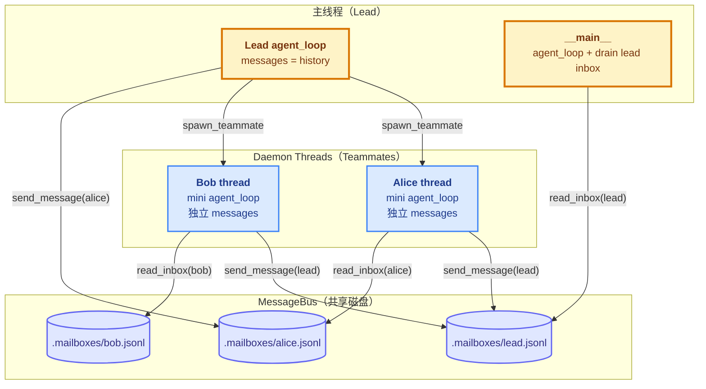
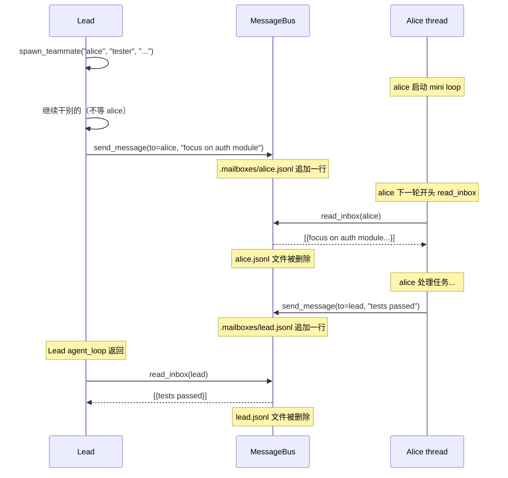
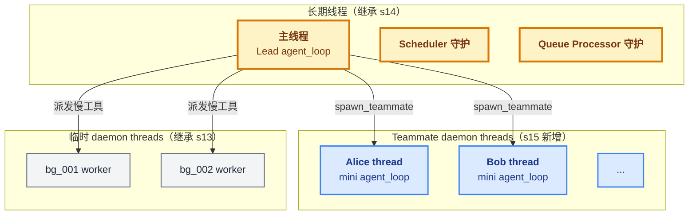

# 15 - Agent Teams

> [!note]
> s06 的 subagent 是"一次性 fork"——主 Agent 派一个子任务，等结果合并回来，subagent 跑完就消失。s15 引入第二种多 Agent 模式：**长期共存的 Teammate**。Lead Agent 可以 `spawn_teammate` 派一个有名字、有角色、自己跑循环的小弟，小弟通过 **MessageBus**（磁盘文件邮箱）跟 Lead 通信。两者**并行**跑：Lead 继续干别的，Teammate 在另一线程做自己的活，做完把结果发回 Lead 的 inbox，下一轮 Lead `check_inbox` 拿到。这是 Agent 第一次拥有**多个真正并行的 agent loop**。

## 这节重点关注

读完这节，你应该能在脑子里答出这 5 个问题：

1. **Teammate vs Subagent**：s15 的 Teammate 跟 s06 的 Subagent 在启动方式、通信、生命周期上有什么本质区别？（→ [演进与动机](#演进与动机)）
2. **MessageBus 契约**：`send` / `read_inbox` 两个方法的 drain 语义是什么？为什么文件持久？（→ [核心抽象](#核心抽象)）
3. **异步派发**：`spawn_teammate` 立刻返回给 LLM 是怎么做到的？daemon thread + 闭包怎么配合？（→ [异步派发与收尾](#异步派发与收尾)）
4. **Teammate 的 mini agent loop**：`run()` 闭包跟主 `agent_loop` 在哪些地方简化了？（→ [teammate 的 mini agent loop](#teammate-的-mini-agent-loop)）
5. **对主循环的影响**：s15 的主 `agent_loop` 代码动了吗？扩展发生在哪？（→ [对 agent_loop 的影响](#对-agent_loop-的影响)）

**可以略读/跳过**：CC 的真实多 Agent 系统细节（文件锁、idle loop、MCP 集成）——这些是生产实现，理解抽象就够。

## 这一步加了什么

| 新增 | 作用 | 重点? |
|---|---|---|
| `MAILBOX_DIR = .mailboxes/` | 每个 agent 一个 `.jsonl` 邮箱文件 | ⭐⭐ |
| `MessageBus` 类 | `send(from, to, content, type)` + `read_inbox(agent)` | ⭐⭐⭐ |
| `active_teammates: dict[str, bool]` | 当前在跑的 teammate 名字占用表 | ⭐⭐ |
| `spawn_teammate` 工具 | Lead 起 daemon thread 跑 teammate | ⭐⭐⭐ |
| `send_message` 工具 | Lead / Teammate 通过 MessageBus 发消息 | ⭐⭐⭐ |
| `check_inbox` 工具 | Lead drain 自己的 inbox | ⭐⭐ |
| `spawn_teammate_thread` | 异步派发 daemon thread + run 闭包 | ⭐⭐⭐ |
| `run()` 闭包 | Teammate 自己的 mini agent loop（daemon thread 里跑） | ⭐⭐⭐ |
| `__main__` drain lead inbox | agent_loop 返回后注入 teammate 消息到 history | ⭐⭐ |

## 演进与动机

s06 的 subagent 是 **Fork-Join** 模式——主 Agent fork 一个子任务，**等结果**才能继续。这种模式适合"一次性委托"，但解决不了：

- **长期协作**：Lead 想同时管多个小弟，小弟跑很久 Lead 不想等，小弟之间也要通信（不只是回报 Lead）。
- **并行执行**：用户："同时跑前端测试和后端测试，都过了就部署"——串行 8 分钟，并行 5 分钟。
- **角色分工**：前端 Teammate / 后端 Teammate / 测试 Teammate 各有 system prompt 和工具集，Lead 是协调者。

s15 的解法是 **Actor Model 的简化版**：每个 Teammate 是独立 actor，靠 MessageBus 异步通信，**不共享内存**。Lead 派活后不等，Teammate 干完发结果回 Lead inbox，下一轮 Lead drain 拿到。

为什么用文件而非内存队列——三个产品需求：
1. **跨进程**：未来 teammate 可能跑在不同进程（甚至 MCP 远程 agent）。
2. **持久性**：进程崩了文件还在，重启可恢复。
3. **可观察**：`cat .mailboxes/alice.jsonl` 直接看收到了什么。

代价是**没有文件锁**（教学版省了）+ **磁盘 I/O 慢**——生产实现用 `proper-lockfile`。

## 核心抽象

### MessageBus：drain 语义的邮箱

```python
class MessageBus:
    """File-based message bus. Each agent has a .jsonl inbox.
    Read is destructive: read_text + unlink (consumes messages).
    Teaching version: no file locking; real CC uses proper-lockfile."""

    def send(self, from_agent, to_agent, content, msg_type="message"):
        msg = {"from": from_agent, "to": to_agent,
               "content": content, "type": msg_type, "ts": time.time()}
        inbox = MAILBOX_DIR / f"{to_agent}.jsonl"
        with open(inbox, "a") as f:
            f.write(json.dumps(msg) + "\n")

    def read_inbox(self, agent):
        inbox = MAILBOX_DIR / f"{agent}.jsonl"
        if not inbox.exists():
            return []
        msgs = [json.loads(line) for line in inbox.read_text().splitlines()
                if line.strip()]
        inbox.unlink()   # consume: read + delete
        return msgs
```

**关键契约**：`read_inbox` 读 = 删（drain 语义）。跟 s14 的 `consume_cron_queue` 同构——读一次清空，避免下次重复处理。

### Teammate vs Subagent：两种模式

| 维度 | Subagent (s06) | Teammate (s15) |
|---|---|---|
| 启动方式 | 主 Agent 同步等结果 | 异步派发，立刻返回 |
| 通信 | 返回值（一次性） | MessageBus（多次往返） |
| 生命周期 | 跑完就消失 | 跑 10 轮才结束（教学版）；生产实现是 idle loop |
| messages | fork 一份副本，结束丢弃 | 独立一份，全程自己维护 |
| 并行度 | 主 Agent 等子 agent 跑完才继续 | 主 Agent 派发后立刻干别的 |

**简单记忆**：Subagent = Fork-Join；Teammate = Actor Model。

## 整体架构图



### 消息流：单向、异步、文件持久



## 异步派发与收尾

### 异步派发：daemon thread + 闭包

```python
def spawn_teammate_thread(name, role, prompt):
    if name in active_teammates:
        return f"Teammate '{name}' already exists"

    system = (f"You are '{name}', a {role}. ...")

    def run():
        messages = [{"role": "user", "content": prompt}]
        # ... teammate 自己的 mini loop ...

    active_teammates[name] = True
    threading.Thread(target=run, daemon=True).start()
    return f"Teammate '{name}' spawned as {role}"   # ← 立刻返回
```

`return` 立刻执行，Lead 继续干别的。`run` 是闭包，捕获外层的 `name` / `role` / `prompt`，每个 teammate 有自己的一份闭包。

### 收尾三件套

`run()` 跑完后必须做三件事：

```python
# 1. 从 messages 挖最后一段 assistant 文本当总结
summary = "Done."
for msg in reversed(messages):
    if msg["role"] == "assistant" and isinstance(msg["content"], list):
        for b in msg["content"]:
            if getattr(b, "type", None) == "text":
                summary = b.text
                break
        else:
            continue
        break

# 2. 把总结发给 lead
BUS.send(name, "lead", summary, "result")

# 3. 清理 active_teammates
active_teammates.pop(name, None)
```

倒序遍历是因为 teammate 最后一轮说的话才是"最终总结"。`for...else` 是 Python 不常见但精确的语法——内层循环没 break 才走 else，用于"当前 message 没 text 块就继续看上一条"。

## teammate 的 mini agent loop

`run()` 闭包是**简化版的 agent_loop**，在 daemon thread 里跑：

- 独立的 `messages` 列表（跟 Lead 隔离）
- 更少的工具（`bash / read_file / write_file / send_message`）
- 最多跑 10 轮（教学版限制）
- 每轮开头 drain 自己的 inbox

```python
def run():
    messages = [{"role": "user", "content": prompt}]
    sub_tools = [bash, read_file, write_file, send_message]
    sub_handlers = {...}

    for _ in range(10):
        inbox = BUS.read_inbox(name)
        if inbox:
            messages.append({"role": "user",
                "content": f"<inbox>{json.dumps(inbox)}</inbox>"})
        response = client.messages.create(model=MODEL, system=system,
                                          messages=messages[-20:],
                                          tools=sub_tools, max_tokens=8000)
        messages.append({"role": "assistant", "content": response.content})
        if response.stop_reason != "tool_use":
            break
        # dispatch tools（标准路径）
        ...
    # 收尾三件套
    ...
```

几个简化点：
- `messages[-20:]` 只取最近 20 条给 API——简化版上下文压缩（s08 的 1/8 实现）
- `try: ... except: break` 包 API 调用，错误就退出
- `sub_handlers` 用 lambda 包装 send_message，让 teammate 调用时自动用自己的 name 作为 from

## 原本的 Claude Code 怎么做的

CC 的多 Agent 系统比 s15 复杂得多。

### 1. Subagent vs Teammate 都有

CC 同时支持两种模式：
- **Subagent（Task 工具）**：s06 的产品化版，一次性 fork-join
- **Teammate**：长期共存的小弟，跟 s15 类似但更复杂

### 2. 真正的文件锁

s15 教学版的 `MessageBus` 没文件锁，注释诚实写明。CC 用 `proper-lockfile`（npm 包）做文件级锁，保证多 Agent 并发读写同一邮箱时不会出竞态。

### 3. Idle Loop 而非固定 10 轮

s15 教学版写死 10 轮。CC 的 teammate 用 idle loop：`while not shutdown_request` 持续跑，直到收到 `shutdown_request` 消息才退出。这让 teammate 能服务多个任务（Lead 可以反复发消息）。

### 4. 更丰富的消息类型

s15 只有 `message` 和 `result` 两种 type。CC 有：`message` / `result` / `shutdown_request` / `error` / `progress` / `query` 等。

### 5. MCP 集成

CC 的多 Agent 能跨进程通信（通过 MCP）。s15 只在同一进程内通过文件通信。

## 对 agent_loop 的影响

这是 Phase 5 最值得讲清楚的一条线。

### 主 `agent_loop` 函数代码：没动

s15 的 `agent_loop` 跟 s14 完全一致——consume cron queue → 调 API → dispatch 工具 → 注入 background notifications。3 个新工具只是进了 `TOOLS` 数组和 `execute_tool` 的 handler 表，dispatch 完全走标准路径。**这一点跟 s12 一样**——通过工具抽象把新功能塞进 Agent，不改循环。

### 但 `__main__` 多了一步：drain lead inbox

```python
# s15 的 __main__:
agent_loop(history, context)
# 打印最新 assistant 文本
inbox = BUS.read_inbox("lead")     # ← 新增
if inbox:
    history.append({"role": "user",
                    "content": f"[Inbox]\n{inbox_text}"})
```

**agent_loop 之外**多了一步。这影响的是 agent_loop 怎么被喂食——下一轮调 agent_loop 时 messages 里多了 inbox 内容。

### 真正的扩展：引入第二个 agent loop

s15 的关键不是改了主 agent_loop，而是**引入了第二套 agent loop**——teammate 自己跑的那个 `run()` 函数。这是简化版的 agent_loop，在 daemon thread 里跑。

### Phase 4-5 扩展脉络

| 课 | 扩展方式 | 改动位置 |
|---|---|---|
| s12 | 加工具 | TOOLS / TOOL_HANDLERS |
| s13 | dispatch 加分支 | agent_loop 内部 dispatch 处 |
| s14 | 入口前 consume | agent_loop 开头 + 起守护线程 |
| s15 | **复制一份新的 mini loop** | 新 daemon thread + __main__ 加 drain |

s15 是**最激进的扩展**——直接造一个并行的 agent。

## 多线程并行情况

s15 在 s14 的三个长期线程基础上，**多了若干个 teammate daemon thread**。



### 关键特征：第一次有多个真正的 agent loop 并行

之前所有的"并发"都不是真正的 agent loop 并行：
- s13 background tasks：跑的是**单个工具**（如 bash），不是完整 agent loop
- s14 scheduler / queue processor：跑的是**判时间 / 唤醒逻辑**，不是 agent loop

s15 第一次让**多个完整的 agent loop 真正并行**——每个 teammate 跑自己的 while 循环，调自己的 API，维护自己的 messages。

### 通信方式：磁盘文件，不共享内存

Lead 和 Teammate **不共享 messages**——靠 MessageBus 文件通信：
- **隔离**：Lead 上下文不会被 teammate 的 messages 污染
- **持久**：邮箱文件在磁盘，进程崩了消息不丢
- **无锁**：通过 drain 语义避免复杂同步（生产要加 `proper-lockfile`）

### 并发风险：API 速率限制

N 个 teammate 同时调 API，**速率限制共享**。3 个 teammate 各跑 10 轮 = 30 次 API 调用在很短时间内发生，容易触发 429。生产实现要做：每 teammate 独立速率限制器 / 错峰启动（jitter）/ 共享 API 调用队列串行化。

## 设计要点

### 1. Drain 语义：读 = 删

`read_inbox` 读 = 删，跟 s14 的 `consume_cron_queue` 同构。读一次清空，避免下次重复处理。

### 2. Teammate 自己维护 messages

每个 teammate 有独立的 `messages` 列表，不污染 Lead 的 history，也不被 Lead 污染。

### 3. 名字唯一性

同名 teammate 不能重复 spawn。跑完后 `active_teammates.pop(name)` 释放名字。

### 4. 异步派发，立刻返回

`spawn_teammate` 立刻拿返回值，不等 teammate 跑完。这让 Lead 能继续干别的。

### 5. 限制 10 轮（教学简化）

避免 teammate 无限循环烧 token。生产实现用 idle loop + shutdown_request 消息。

### 6. 自动提取 summary

teammate 跑完后从历史里挖最后一段 assistant 文本作为总结发给 Lead。`for...else` 是 Python 不常见但精确的语法。

## 相关概念

- [[06 - Subagent]]：s15 的 teammate 跟 s06 subagent 都是"派生 agent"，但模式不同（一次性 fork-join vs 长期共存）
- [[14 - Cron Scheduler]]：s15 复用 s14 的多线程基础设施（daemon thread）
- [[13 - Background Tasks]]：s15 的 teammate 也是 daemon thread，但跑的是完整 agent loop（不是单个工具）
- [[12 - Task System]]：多 Agent 协作时 task system 是协调中介（s15 没展开，留给 s16-s18）
- [[02 - Tool Use]]：spawn_teammate / send_message / check_inbox 走标准 dispatch

> [!warning]
> 几个容易踩的坑：
>
> 1. **以为 teammate 共享 Lead 的 messages**。不共享。teammate 有自己独立的 messages，只靠 MessageBus 文件通信。
> 2. **以为 inbox 自动清理**。只在被 read 时清理。没人读就永远堆积。
> 3. **以为 teammate 会一直跑**。s15 教学版最多 10 轮就退出，要持续跑用生产实现的 idle loop。
> 4. **没有文件锁**：两个 thread 同时 read 同一个 inbox 会有竞态（一个读了另一个 unlink 报错）。生产要用 `proper-lockfile`。
> 5. **API 速率限制**：N 个 teammate 同时调 API 容易触发限流。生产要做错峰或共享速率限制器。
> 6. **`active_teammates` 不释放**：如果 teammate 异常退出（没跑到收尾的 `pop`），名字永远占用，下次 spawn 同名会失败。生产实现要加超时清理或心跳机制。

## 代码骨架总览

剥掉所有平台细节，s15 的核心抽象只有这么多代码。这是你真正需要记住的部分。

```python
# === 1. 文件邮箱 + drain 语义 ===
MAILBOX_DIR = Path(".mailboxes")

class MessageBus:
    def send(self, from_agent, to_agent, content, msg_type="message"):
        msg = {"from": from_agent, "to": to_agent, "content": content,
               "type": msg_type, "ts": time.time()}
        with open(MAILBOX_DIR / f"{to_agent}.jsonl", "a") as f:
            f.write(json.dumps(msg) + "\n")

    def read_inbox(self, agent):
        inbox = MAILBOX_DIR / f"{agent}.jsonl"
        if not inbox.exists(): return []
        msgs = [json.loads(line) for line in inbox.read_text().splitlines()
                if line.strip()]
        inbox.unlink()                     # consume: read + delete
        return msgs

BUS = MessageBus()
active_teammates: dict[str, bool] = {}

# === 2. 异步派发 + run() 闭包（mini agent loop）===
def spawn_teammate_thread(name, role, prompt):
    if name in active_teammates:
        return f"Teammate '{name}' already exists"

    system = f"You are '{name}', a {role}. Use tools to complete tasks. ..."

    def run():
        messages = [{"role": "user", "content": prompt}]
        sub_tools = [bash, read_file, write_file, send_message]
        sub_handlers = {bash: run_bash, read_file: run_read, write_file: run_write,
                        send_message: lambda to, content: BUS.send(name, to, content)}

        for _ in range(10):
            inbox = BUS.read_inbox(name)               # 每轮 drain
            if inbox:
                messages.append({"role": "user",
                    "content": f"<inbox>{json.dumps(inbox)}</inbox>"})
            try:
                response = client.messages.create(model=MODEL, system=system,
                    messages=messages[-20:], tools=sub_tools, max_tokens=8000)
            except Exception:
                break
            messages.append({"role": "assistant", "content": response.content})
            if response.stop_reason != "tool_use": break

            results = [{"type": "tool_result", "tool_use_id": b.id,
                        "content": str(sub_handlers[b.name](**b.input))}
                       for b in response.content if b.type == "tool_use"]
            messages.append({"role": "user", "content": results})

        # 收尾三件套
        summary = next((b.text for msg in reversed(messages)
                          if msg["role"] == "assistant"
                          and isinstance(msg["content"], list)
                        for b in msg["content"] if getattr(b, "type", None) == "text"),
                       "Done.")
        BUS.send(name, "lead", summary, "result")
        active_teammates.pop(name, None)

    active_teammates[name] = True
    threading.Thread(target=run, daemon=True).start()   # 异步
    return f"Teammate '{name}' spawned as {role}"       # 立刻返回

# === 3. 三个新工具（Lead 用，走标准 dispatch）===
def run_spawn_teammate(name, role, prompt):
    return spawn_teammate_thread(name, role, prompt)

def run_send_message(to, content):
    BUS.send("lead", to, content)
    return f"Sent to {to}"

def run_check_inbox():
    msgs = BUS.read_inbox("lead")
    return f"Inbox ({len(msgs)}): ..." if msgs else "Inbox empty"

# === 4. __main__ 多一步 drain lead inbox ===
while True:
    query = input(">>> ")
    history.append({"role": "user", "content": query})
    agent_loop(history, context)                        # s14 不变

    # s15 新增：把 teammate 发回的消息注入 history
    inbox = BUS.read_inbox("lead")
    if inbox:
        inbox_text = "\n".join(f"From {m['from']}: {m['content'][:200]}"
                               for m in inbox)
        history.append({"role": "user", "content": f"[Inbox]\n{inbox_text}"})
```

**这 4 块是 s15 的全部抽象层**。下一节 s16 会在这个基础上加协议（Protocol）+ idle loop，让 teammate 从 10 轮限制升级成长寿命协作者。

## Q&A

### Q1: s15 的 inbox 会进行清理吗

**A**：会，**读 = 删**。`read_inbox` 读 + `unlink()` 删，是 drain（消费）语义。三个清理点：

1. **teammate 每轮开头自己读**：`for _ in range(10): inbox = BUS.read_inbox(name)`
2. **Lead 调 `check_inbox` 工具**：模型主动 drain lead inbox
3. **主循环 agent_loop 返回后**：`__main__` 里 `inbox = BUS.read_inbox("lead")`

如果**没人读**，inbox 文件**永远不被删**，消息堆积。跟 s14 的 `consume_cron_queue` 是同构模式。

### Q2: 这部分代码（spawn_teammate_thread 的收尾 + 启动）讲解一下

**A**：分两部分——**内层（`run()` 闭包结尾）** 和 **外层（`spawn_teammate_thread` 结尾）**。

**内层收尾三件套**：
1. 从 messages 倒序挖最后一段 assistant 文本当总结（`for...else` 语法）
2. 把总结发给 lead（`type="result"`）
3. 清理 `active_teammates.pop(name, None)` 让 name 可被复用

**外层启动四件套**：
1. `active_teammates[name] = True` 登记 name 占用
2. `threading.Thread(target=run, daemon=True).start()` 起 daemon 线程
3. `print(...)` 日志
4. `return` 立刻执行，不等 teammate 跑完——异步派发

**闭包变量捕获**：`run` 函数捕获了外层的 `name` / `role` / `prompt`，每个 teammate 有自己的闭包。

### Q3: s15 对 agent_loop 没什么影响对吗

**A**：**部分对**。

**主 `agent_loop` 函数代码确实没动**——跟 s14 一致，3 个新工具只进 TOOLS 数组和 handler 表。

**但 s15 仍在三个地方动了**：
1. **`__main__` 多一步 drain lead inbox**：影响 agent_loop 怎么被喂食
2. **引入第二个 agent loop**：teammate 自己跑的 `run()` 函数是简化版的 agent_loop
3. **多线程并行 agent loop**：第一次让多个完整 agent loop 真正并行

更准确的说法是：**主 agent_loop 函数不变，但 s15 引入了"多 agent loop 并行"的架构**——这是 Phase 5 的起点。

### Q4: Teammate 和 Subagent（s06）有什么区别

**A**：见 [核心抽象](#teammate-vs-subagent两种模式) 的对比表。简单记忆：Subagent = Fork-Join，Teammate = Actor Model。CC 两种都支持。

### Q5: 为什么 MessageBus 用文件而不是用内存队列

**A**：三个产品需求：
1. **跨进程**：未来 teammate 可能跑在不同进程（甚至不同机器）
2. **持久性**：进程崩了文件还在，重启后能恢复
3. **可观察**：用户可以 `cat .mailboxes/alice.jsonl` 直接看

代价：文件 I/O 比内存慢 + 需要文件锁。CC 选文件是因为要支持**跨进程的多 Agent 架构**（包括 MCP 远程 agent）。

### Q6: 如果 teammate 永远不调 send_message，Lead 怎么知道它跑完了

**A**：s15 有**兜底**——teammate 跑完 10 轮（或 break）后，**自动**提取 summary 发给 Lead。即使 teammate 一句 send_message 都没调，收尾也会自动发个 "Done." 或最后一段 text 给 Lead。

唯一例外：teammate **线程异常退出**（run() 抛未捕获异常），永远没消息。生产实现要在 run 外面包 try/except 兜底发送错误信息。

### Q7: 如果两个 teammate 同时给 Lead 发消息会怎样

**A**：**文件追加是原子的**（POSIX 保证 `O_APPEND` 模式的 write 对小数据原子），两个 teammate 同时 send 不会损坏文件。

真正的问题是 **send + read 交叉**：
- Teammate A 在 send，Lead 在 read
- Lead 读到一半（只读了 A 之前的），A 的 append 进来
- Lead unlink 文件
- **A 刚 append 的内容永远丢了**

这是教学版**没文件锁**的竞态。生产实现用 `proper-lockfile` 保证 read 和 send 互斥。
