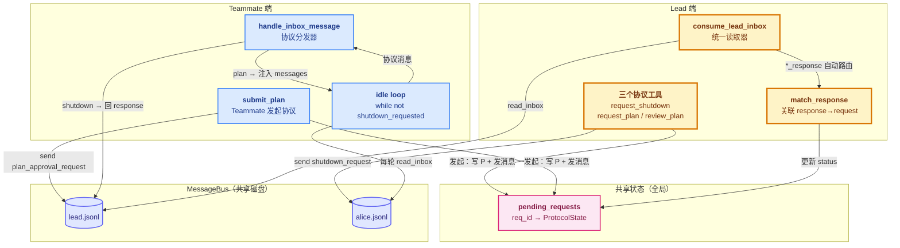
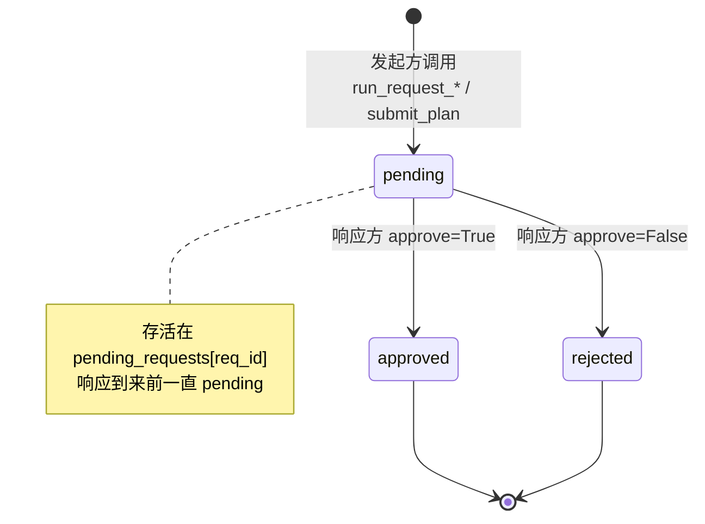
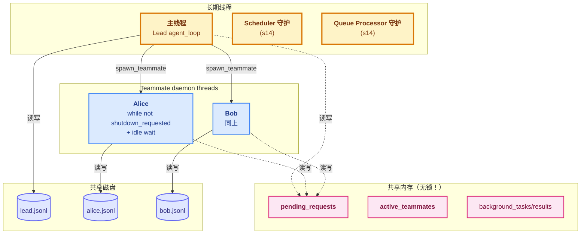

# 16 - Team Protocols

> [!note]
> s15 的 Teammate 只能"干活 + 发总结"——Lead 跟 Teammate 之间除了普通 message 没别的语言。s16 加了一层**协议（Protocol）**：把"请求—响应"这种结构化对话提到一等公民。每个协议请求有一个 `request_id`，状态机 `pending → approved/rejected`，方向可双向（Lead 发起 shutdown / Teammate 发起 plan_approval）。同时 Teammate 的生命周期从 s15 的固定 10 轮升级成 **idle loop**——干完活不退，挂在那等新指令或 shutdown_request，这才真正接近生产级的长寿命 agent。

## 这节重点关注

读完这节，你应该能在脑子里答出这 5 个问题：

1. **协议本质**：为什么不能只用普通 message？协议的"挂号单 + 状态机 + ID 关联"解决了什么？（→ [演进与动机](#演进与动机)）
2. **双向协议**：shutdown 和 plan_approval 方向相反，结构对称，各自的状态推进在谁那边？（→ [两条协议方向](#两条协议方向)）
3. **request_id 的作用**：为什么它是 correlation ID？没有它会怎样？（→ [核心抽象](#核心抽象)）
4. **idle loop 结构**：两层嵌套 while 在干什么？内层为什么"不烧 token"？（→ [idle loop](#idle-loop)）
5. **君子协定的局限**：s16 的 plan_approval 为什么不是代码级 gating？（→ [君子协定的局限](#君子协定的局限)）

**可以略读/跳过**：CC 的完整协议清单（query / progress_report / context_request 等）——这些是 CC 的具体扩展，理解 shutdown / plan_approval 这两条对称协议就够。

## 这一步加了什么

| 新增 | 作用 | 重点? |
|---|---|---|
| `ProtocolState` dataclass | 协议状态机：request_id / type / sender / target / status / payload | ⭐⭐⭐ |
| `pending_requests` 全局 dict | 共享"挂号单"存根：`req_id → ProtocolState` | ⭐⭐⭐ |
| `new_request_id()` | `req_XXXXXX` ID 生成器（random 6 位） | ⭐⭐ |
| `match_response()` | Lead 端关联 response → request，状态机推进 | ⭐⭐⭐ |
| `consume_lead_inbox()` | Lead 统一读取器 + 自动路由 `*_response` | ⭐⭐⭐ |
| `handle_inbox_message()` | Teammate 端协议分发器 | ⭐⭐⭐ |
| `request_shutdown` 工具 | Lead 发起 shutdown 协议（Lead → Teammate） | ⭐⭐ |
| `request_plan` 工具 | Lead 触发 Teammate 自己 submit_plan（只发普通 message） | ⭐ |
| `review_plan` 工具 | Lead 审批 Teammate 提交的 plan | ⭐⭐ |
| `submit_plan` 工具 | Teammate 发起 plan_approval（Teammate → Lead） | ⭐⭐ |
| idle loop | Teammate 从"10 轮"升级到"while not shutdown_requested" | ⭐⭐⭐ |

## 演进与动机

s15 只有一种消息类型——普通 message。Lead 想让 Teammate"现在停下来"或"这个计划先别动手等我审批"，**只能用自然语言说**："please stop" / "wait for my approval"。问题：

- **LLM 可能不照办**（自然语言不是协议）
- **没法确认对方真的停了**
- **没法把"批准/拒绝"关联到具体哪一次请求**

s16 的解法是把控制流提到代码层：**协议 = 代码识别 + 状态机 + 强制行为**。`request_id` 把"请求"和"响应"两条消息关联起来——跟 Web 编程里的 correlation ID 同构（微服务、消息队列都用这个模式）。

再叠三层产品需求：

1. **双向通信**：s15 偏单向（Lead 派 → Teammate 干 → 发结果）。真实协作中 Teammate 也需要向 Lead 请求："我这个计划你批吗？"
2. **长寿命 Teammate**：s15 的 10 轮限制是教学简化。真实场景：alice 服务多个任务（测试 A → idle → 测试 B → idle → shutdown），期间一直挂着。这就是 idle loop 的价值。
3. **结构化确认（ack/nack）**：Lead 不知 Teammate 是否真收到。shutdown 协议保证 Teammate 回 shutdown_response，Lead 看 `pending_requests[R1].status` 就知道关了。

## 核心抽象

### ProtocolState + 共享挂号单

```python
@dataclass
class ProtocolState:
    request_id: str
    type: str       # "shutdown" | "plan_approval"
    sender: str
    target: str
    status: str     # pending | approved | rejected
    payload: str    # plan text or shutdown reason
    created_at: float = field(default_factory=time.time)

pending_requests: dict[str, ProtocolState] = {}

def new_request_id() -> str:
    return f"req_{random.randint(0, 999999):06d}"
```

`pending_requests` 是 Lead 和 Teammate 之间"挂号单"的存根。`request_id` 是后续把 response 关联回 request 的唯一钥匙。dataclass 是可变的——`pending_requests[req_id]` 存的是引用，`state = pending_requests.get(req_id); state.status = "approved"` 直接改字典里的对象。

### match_response：四道校验关

```python
def match_response(response_type, request_id, approve):
    state = pending_requests.get(request_id)
    if not state:                                          # ① ID 存在
        return
    if state.type == "shutdown" and response_type != "shutdown_response":
        return                                             # ② 类型匹配
    if state.type == "plan_approval" and response_type != "plan_approval_response":
        return
    if state.status != "pending":                          # ③ 仍是 pending（幂等）
        return
    state.status = "approved" if approve else "rejected"   # ④ 实际改值
```

四道关卡——ID 存在 / 类型匹配 / 状态 pending / 实际改值。每步出错都安静忽略而不是抛异常。**防御式编程**——网络/线程环境下的协议必须容错。

### consume_lead_inbox：统一入口 + 自动路由

```python
def consume_lead_inbox(route_protocol: bool = True) -> list[dict]:
    msgs = BUS.read_inbox("lead")
    if not msgs: return []
    if route_protocol:
        for msg in msgs:
            meta = msg.get("metadata", {})
            req_id = meta.get("request_id", "")
            msg_type = msg.get("type", "")
            if req_id and msg_type.endswith("_response"):   # ← 后缀区分方向
                approve = meta.get("approve", False)
                match_response(msg_type, req_id, approve)
    return msgs
```

**为什么需要统一入口**：s15 有两个地方读 lead inbox（`check_inbox` 工具 + `__main__` 末尾）。如果协议响应被错误入口吃掉（比如 LLM 调了 `check_inbox`），就再也没机会 match_response。s16 把两个入口都改成调 `consume_lead_inbox`，保证协议路由**一定被执行**。

简单说：**它是个保证协议不丢的护栏**。

### handle_inbox_message：Teammate 端协议分发器

```python
def handle_inbox_message(name, msg, messages) -> bool:
    """Returns True if teammate should stop."""
    msg_type = msg.get("type", "message")
    meta = msg.get("metadata", {})
    req_id = meta.get("request_id", "")

    if msg_type == "shutdown_request":
        BUS.send(name, "lead", "Shutting down gracefully.",
                 "shutdown_response",
                 {"request_id": req_id, "approve": True})
        return True                                          # 停止信号

    if msg_type == "plan_approval_response":
        approve = meta.get("approve", False)
        if approve:
            messages.append({"role": "user",
                "content": "[Plan approved] Proceed with the task."})
        else:
            messages.append({"role": "user",
                "content": f"[Plan rejected] Feedback: {msg['content']}"})

    return False                                             # 继续
```

**关键设计**：协议消息**不直接进 LLM 上下文**——`handle_inbox_message` 拦截后翻译成 `[Plan approved] Proceed...` 这种人类可读文本。LLM 看不到协议消息原文。

## 整体架构图



### 状态机：pending → approved/rejected



## 两条协议方向

### shutdown：Lead → Teammate（命令式）

```
Lead: request_shutdown("alice")
  pending_requests[R1] = ProtocolState(type="shutdown", ...)
  BUS.send("lead", "alice", "shutdown_request", {request_id: R1})

alice: handle_inbox_message → 自动同意
  BUS.send("alice", "lead", "shutdown_response", {request_id: R1, approve: True})
  return True（让 idle loop 停）

alice 跑收尾，退出线程

Lead 下次 drain inbox:
  consume_lead_inbox → match_response(R1, approve=True)
  pending_requests[R1].status = "approved"
```

**特点**：Lead 单方面命令，Teammate **自动同意**（没选择权）。状态推进只在 Lead 端（match_response）。

### plan_approval：Teammate → Lead（请求式）

```
alice: submit_plan("Step 1: ...")
  pending_requests[R2] = ProtocolState(type="plan_approval", sender="alice", ...)
  BUS.send("alice", "lead", "plan_approval_request", {request_id: R2})
  return "Waiting for approval..."

alice 进入 idle 等批准（君子协定）

Lead 调 review_plan(R2, approve=True):
  state.status = "approved"  ← Lead 端状态机推进
  BUS.send("lead", "alice", "plan_approval_response", {request_id: R2, approve: True})

alice idle loop 收到 → handle_inbox_message:
  messages.append("[Plan approved] Proceed with the task.")
  → 回到 LLM turn 继续干活
```

**特点**：Teammate 发起，Lead **有批准/拒绝的选择权**。状态推进在两边都发生（run_review_plan 在 Lead，handle_inbox_message 在 Teammate）。

**对比表**：

| 维度 | shutdown | plan_approval |
|---|---|---|
| 发起方 | Lead | Teammate |
| 响应方 | Teammate | Lead |
| 响应有选择 | 无（自动同意） | 有（approve / reject） |
| 用途 | 终止 Teammate | 决策门禁 |

## idle loop

s16 对 Teammate 的 `run()` 做了**结构性改造**：从 s15 的固定 10 轮升级成持续运行的 idle loop。

```python
shutdown_requested = False
while not shutdown_requested:                  # 外层：有 LLM turn，烧 token
    inbox = BUS.read_inbox(name)
    non_protocol = []
    for msg in inbox:
        if msg.get("type") in ("shutdown_request", "plan_approval_response"):
            should_stop = handle_inbox_message(name, msg, messages)
            if should_stop: break
        else:
            non_protocol.append(msg)
    if non_protocol:
        messages.append({"role": "user", "content": "<inbox>..."})

    response = client.messages.create(...)
    messages.append({"role": "assistant", "content": response.content})

    if response.stop_reason != "tool_use":
        # ↓ 内层 idle：不调 LLM，纯 sleep + read_inbox 轮询
        while not shutdown_requested:
            time.sleep(1)
            inbox = BUS.read_inbox(name)
            if not inbox: continue
            # 分流...
            if non_protocol: break             # 回外层，下一轮 LLM turn

    # dispatch tools
    ...
```

**两层 while 嵌套**：

- **外层**（主循环）：有 LLM turn，烧 token。一轮 = 一次"读 inbox → 调 API → dispatch 工具"
- **内层**（idle 等待）：**不调 LLM**，纯靠 `time.sleep(1) + read_inbox` 轮询

**什么时候进内层**：LLM 这一轮没调工具（stop_reason != tool_use），意味着它觉得"活干完了"或"在等什么"。

**怎么出内层**：三种情况——
1. 收到 shutdown_request → `shutdown_requested = True`，break 内层 → 外层退出
2. 收到 plan_approval_response → 注入 messages → break 内层 → 回外层 → 带着新 messages 调 LLM
3. 收到普通 message → 同上

**为什么不让外层直接处理**：因为外层每轮都调 API 烧 token。idle 状态下 Teammate **无事可做**，调 API 是浪费。内层 while 让它"睡着"等消息——**只在有事时才唤醒 LLM**。这就是"长寿命 Teammate"的核心成本控制。

## 君子协定的局限

s16 的诚实注释：

```python
def _teammate_submit_plan(from_name, plan):
    """Note: This is a protocol-level request, not a code-level gate.
    After submitting, the teammate's thread continues running — it can
    still call bash/write/etc. Real enforcement relies on the model
    waiting for the approval response before acting."""
```

`submit_plan` 后 Teammate 的线程**不阻塞**——代码不强制等批准。LLM 听话就等，不听话就乱干。

**代码级 gating** 要做（伪代码）：

```python
def _teammate_submit_plan(from_name, plan):
    req_id = new_request_id()
    pending_requests[req_id] = ProtocolState(...)
    BUS.send(...)
    while pending_requests[req_id].status == "pending":
        protocol_cond.wait()                  # 阻塞等批准
    return "approved" if ... else "rejected"
```

但这会让 Teammate 的工具调用卡住，复杂度上升。教学版选了"君子协定"——靠 prompt 引导。

CC 真正做的是**代码级 gating**：Teammate 调 `submit_plan` 后，**线程阻塞**在 condition variable 上，直到 Lead 的 `review_plan` 触发唤醒。批准前 Teammate 的工具调用全部被卡住——这才是强制的。

## 原本的 Claude Code 怎么做的

CC 的多 Agent 协议比 s16 复杂得多。

### 1. 更多协议类型

s16 只实现两种（shutdown / plan_approval）。CC 至少有：`shutdown` / `plan_approval` / `query`（Teammate 向 Lead 提问）/ `progress_report`（周期性汇报）/ `idle_notification`（idle 时通知）/ `error_report` / `context_request`。每种协议有独立的状态机和路由规则。

### 2. 真正的代码级 gating

见 [君子协定的局限](#君子协定的局限)——CC 用 condition variable 强制 Teammate 等批准。

### 3. 超时和重试

s16 没有。CC 给每个协议加超时：

```python
if state.created_at + TIMEOUT < now:
    state.status = "timeout"
```

### 4. 协议持久化

s16 的 `pending_requests` 是纯内存，进程崩了全丢。CC 把它存到磁盘（类似 s12 的 task 系统），重启后能恢复未完成的协议。

### 5. 文件锁

跟 s15 一样，CC 用 `proper-lockfile` 保护 mailbox 并发读写。

## 对 agent_loop 的影响

### 主 `agent_loop` 函数：完全没动

s16 的 `agent_loop` 跟 s15 一字不差——consume cron queue（继承 s14）→ 调 API → dispatch 工具 → 合并 background notifications。4 个新工具只是进了 TOOLS 数组和 handler 表。

**这是 Phase 5 一贯的模式**：s15 / s16 都通过工具抽象把新功能塞进 Agent，不动主循环。

### `__main__`：`consume_lead_inbox` 替代直接 `BUS.read_inbox`

```python
# s15
inbox = BUS.read_inbox("lead")

# s16
inbox_msgs = consume_lead_inbox(route_protocol=True)
```

功能相同，但多了一步协议路由：消息进 history 之前，先让 `match_response` 把 `*_response` 消息的状态机推进掉。

### `check_inbox` 工具：也走 `consume_lead_inbox`

这是 s16 的一个重要 bug fix——s15 有两个入口读 lead inbox（工具 + main loop），如果 LLM 用 `check_inbox` 工具读了一次，下次 main loop 再读就空了。s16 把两个入口都统一，保证协议路由一定被执行。

### Phase 5 扩展脉络（更新版）

| 课 | 扩展方式 | 改动位置 |
|---|---|---|
| s12 | 加工具 | TOOLS / TOOL_HANDLERS |
| s13 | dispatch 加分支 | agent_loop 内部 dispatch 处 |
| s14 | 入口前 consume | agent_loop 开头 + 起守护线程 |
| s15 | 复制一份新的 mini loop | 新 daemon thread + __main__ 加 drain |
| s16 | **改 mini loop 的结构 + 加共享状态** | Teammate run() 重写 + consume_lead_inbox 统一 |

s16 是 Phase 5 的"深化课"——不引入新的并行 agent，而是把已有 Teammate 升级成长寿命 + 可协议通信的真正"协作者"。

## 多线程并行情况

s16 跟 s15 的线程结构**完全一样**：主线程 + scheduler 守护线程 + queue processor 守护线程 + 若干 Teammate daemon thread + 临时 background worker。



### 关键变化：Teammate 变成长寿命

s15 的 Teammate 跑完 10 轮就退。s16 的 Teammate **挂在 idle loop 里持续占着一个线程**。这带来三个新风险：

#### 1. `pending_requests` 是共享状态但没有锁

Lead 线程写 / 读 / 改 status；Teammate 线程也会写（submit_plan 时）。CPython 的 GIL 保证单条 dict 操作原子，但**"读 + 改"两步不原子**。教学版省了锁，生产实现要加 `protocol_lock = threading.Lock()`。

#### 2. 没有超时清理

Teammate 卡死（API 持续失败 break 出去但没发 shutdown_response），Lead 那边的 `pending_requests[req_id]` 永远 pending。生产实现要定期扫超时协议。

#### 3. idle loop 的轮询开销

每个 Teammate 每秒做一次磁盘读。N 个 Teammate = N 次/秒。生产实现要用 `inotify`（文件变化通知）或 condition variable 替代轮询。

## 设计要点

### 1. `*_request` / `*_response` 的命名约定

用后缀区分方向——`_response` 一定是对某个 `_request` 的回应。这让 `consume_lead_inbox` 的自动路由很简单：只看后缀。新增协议类型时只要遵循命名约定，路由逻辑不用改。

### 2. 双重校验：ID + 类型

`match_response` 的四道关：ID 存在 / 类型匹配 / 状态 pending / 实际改值。每步出错都安静忽略——防御式编程，网络/线程环境下的协议必须容错。

### 3. 消息分割：协议 vs 普通

Teammate 的 inbox 处理分流——**协议消息**走结构化路径（代码识别 + 自动响应），**普通消息**塞进 messages 给 LLM。这样 LLM 的上下文里只有任务相关内容，控制信令不会污染。

### 4. 君子协定 vs 代码级 gating

s16 的 `submit_plan` 是君子协定——LLM 听话就等，不听话就乱干。代码级 gating 要 condition variable 阻塞，复杂度上升。教学版选了简单方案。

### 5. idle loop 而非 sleep forever

idle 时**轮询而非阻塞**。简单但低效（每秒一次磁盘 I/O）。生产实现用 `threading.Condition` 或 `select` on file descriptor——但要配合文件锁，复杂度大。

### 6. 状态机用 enum 或常量更好

s16 直接用字符串 `"approved"`，容易拼错。生产实现用 `enum.Enum`。教学版省了。

## 相关概念

- [[15 - Agent Teams]]：s16 在 s15 的 Teammate 基础上加协议层
- [[14 - Cron Scheduler]]：s14 的双重检查锁定模式，s16 的协议状态机也用了类似思路（match_response 的多重校验）
- [[13 - Background Tasks]]：协议的异步等待跟 background task 的 await 同构
- [[12 - Task System]]：Task 的状态机（pending→in_progress→completed）跟 ProtocolState 的状态机同构
- [[04 - Hooks]]：Hooks 是同步的双向扩展点，s16 的协议是异步的双向扩展点
- [[02 - Tool Use]]：4 个新协议工具都走标准 dispatch

> [!warning]
> 几个容易踩的坑：
>
> 1. **以为协议强制执行**：s16 的 `submit_plan` 是君子协定——Teammate 提交后线程不阻塞，LLM 不听话就乱干。要真强制得加 condition variable。
> 2. **以为协议消息进 LLM 上下文**：不进。`handle_inbox_message` 拦截协议消息，LLM 只看到 `[Plan approved] Proceed...` 这样的翻译后文本。
> 3. **以为 `pending_requests` 线程安全**：教学版没锁，实际 Lead 和 Teammate 都会读写。生产要加 `protocol_lock`。
> 4. **以为协议有超时**：没有。Lead 发了 shutdown_request Teammate 不回，state 永远 pending。生产要加 timeout 清理。
> 5. **以为 idle loop 高效**：每秒一次磁盘 I/O 轮询。N 个 Teammate = N 次/秒。生产要用 `inotify` 或 condition variable。
> 6. **`run_request_plan` 不是协议发起**：它只发普通 message，触发 Teammate 自己调 `submit_plan`。真正发起 plan_approval 协议的是 Teammate。
> 7. **`active_teammates` 不释放**：Teammate 异常退出（没跑到收尾 `pop`），名字永远占用。要加心跳或超时清理。

## 代码骨架总览

剥掉所有协议变种和 Lead 端工具，s16 的核心抽象只有这么多代码。

```python
# === 1. 协议状态机 + 共享挂号单 ===
@dataclass
class ProtocolState:
    request_id: str
    type: str           # "shutdown" | "plan_approval"
    sender: str
    target: str
    status: str         # pending | approved | rejected
    payload: str
    created_at: float = field(default_factory=time.time)

pending_requests: dict[str, ProtocolState] = {}

def new_request_id() -> str:
    return f"req_{random.randint(0, 999999):06d}"

# === 2. Lead 端：关联 + 校验 ===
def match_response(response_type, request_id, approve):
    state = pending_requests.get(request_id)
    if not state: return                                          # ① ID 存在
    if state.type == "shutdown" and response_type != "shutdown_response": return
    if state.type == "plan_approval" and response_type != "plan_approval_response": return
    if state.status != "pending": return                          # ③ 幂等
    state.status = "approved" if approve else "rejected"

def consume_lead_inbox(route_protocol=True) -> list[dict]:
    msgs = BUS.read_inbox("lead")
    if not msgs: return []
    if route_protocol:
        for msg in msgs:
            meta = msg.get("metadata", {})
            req_id = meta.get("request_id", "")
            msg_type = msg.get("type", "")
            if req_id and msg_type.endswith("_response"):        # ← 后缀区分方向
                match_response(msg_type, req_id, meta.get("approve", False))
    return msgs

# === 3. Teammate 端：协议分发器 ===
def handle_inbox_message(name, msg, messages) -> bool:
    """Returns True if teammate should stop."""
    msg_type = msg.get("type", "message")
    meta = msg.get("metadata", {})
    req_id = meta.get("request_id", "")

    if msg_type == "shutdown_request":
        BUS.send(name, "lead", "Shutting down.", "shutdown_response",
                 {"request_id": req_id, "approve": True})
        return True

    if msg_type == "plan_approval_response":
        approve = meta.get("approve", False)
        messages.append({"role": "user",
            "content": "[Plan approved] Proceed." if approve
                       else f"[Plan rejected] Feedback: {msg['content']}"})

    return False

# === 4. 三个 Lead 协议工具 ===
def run_request_shutdown(teammate):
    req_id = new_request_id()
    pending_requests[req_id] = ProtocolState(
        request_id=req_id, type="shutdown",
        sender="lead", target=teammate, status="pending", payload="")
    BUS.send("lead", teammate, "Please shut down.", "shutdown_request",
             {"request_id": req_id})
    return f"Shutdown request sent (req: {req_id})"

def run_review_plan(request_id, approve, feedback=""):
    state = pending_requests.get(request_id)
    if not state: return f"Request {request_id} not found"
    if state.status != "pending": return f"Already {state.status}"
    state.status = "approved" if approve else "rejected"
    BUS.send("lead", state.sender, feedback or ("Approved" if approve else "Rejected"),
             "plan_approval_response",
             {"request_id": request_id, "approve": approve})
    return f"Plan {'approved' if approve else 'rejected'} ({request_id})"

# === 5. Teammate 的 submit_plan（发起协议）===
def _teammate_submit_plan(from_name, plan):
    """君子协定：提交后线程不阻塞，LLM 自己等批准。"""
    req_id = new_request_id()
    pending_requests[req_id] = ProtocolState(
        request_id=req_id, type="plan_approval",
        sender=from_name, target="lead", status="pending", payload=plan)
    BUS.send(from_name, "lead", plan, "plan_approval_request",
             {"request_id": req_id})
    return f"Plan submitted ({req_id}). Waiting for approval..."

# === 6. idle loop（s16 核心结构：双层 while）===
def run_teammate_loop(name, prompt):
    messages = [{"role": "user", "content": prompt}]
    shutdown_requested = False

    while not shutdown_requested:                              # 外层：烧 token
        inbox = BUS.read_inbox(name)
        non_protocol = []
        for msg in inbox:
            if msg.get("type") in ("shutdown_request", "plan_approval_response"):
                if handle_inbox_message(name, msg, messages):
                    shutdown_requested = True; break
            else:
                non_protocol.append(msg)
        if non_protocol:
            messages.append({"role": "user",
                "content": "<inbox>" + json.dumps(non_protocol) + "</inbox>"})

        response = client.messages.create(...)
        messages.append({"role": "assistant", "content": response.content})

        if response.stop_reason != "tool_use":
            while not shutdown_requested:                      # 内层：不烧 token
                time.sleep(1)
                inbox = BUS.read_inbox(name)
                if not inbox: continue
                # 分流...
                if non_protocol: break                         # 回外层 LLM turn

        # dispatch tools
        ...

    # 收尾
    BUS.send(name, "lead", _extract_summary(messages), "result")
    active_teammates.pop(name, None)
```

**这 6 块是 s16 的全部抽象层**。下一节 s17 会让 idle loop 不再"纯等"，而是主动扫任务看板自己找活——Teammate 从"被动等指令"升级为"主动找活干"的自治 agent。

## Q&A

### Q1: s16 新增的协议消息，是全面取代了普通消息吗

**A**：**不是**，两种消息并存，各有用途。

**普通 message**（type="message"）：任务相关的内容，进 LLM 上下文。比如 Lead 跟 Teammate 讨论怎么实现一个功能。

**协议消息**（type="shutdown_request" / "plan_approval_request" 等）：控制信令，**不直接进 LLM 上下文**。代码识别后走结构化路径。

Teammate 的 inbox 处理就是分流——协议消息走 `handle_inbox_message`，普通消息进 messages。**原则**：能用协议的结构化信令（shutdown、approval）就用协议；任务讨论用普通 message。

### Q2: `consume_lead_inbox` 是在干什么

**A**：见 [核心抽象](#consume_lead_inbox统一入口--自动路由)。两件事：读消息（drain 语义）+ 自动路由 `*_response` 消息。它是 s15 → s16 的一个 bug fix——保证协议响应一定被 match_response 处理，不会因为读错入口而丢失。

### Q3: shutdown 和 plan_approval 各自的流程

**A**：见 [两条协议方向](#两条协议方向)。方向相反，结构对称：shutdown 是 Lead → Teammate 命令式（自动同意），plan_approval 是 Teammate → Lead 请求式（Lead 有批准/拒绝选择）。

### Q4: ProtocolState 定义完后看不到后续应用

**A**：ProtocolState 是**被字典管理的数据**，没有方法——所有逻辑都在外部函数里（match_response / run_review_plan）。这是 Python 里 dataclass + 全局字典的典型用法——**dataclass 当数据库表，字典当索引，外部函数当 DAO**。

三个访问点：发起时写（`pending_requests[req_id] = ProtocolState(...)`）→ 响应时改 status（`state.status = "approved"`，引用语义不用写回）→ 业务代码检查状态（`if state.status != "pending"`）。

### Q5: `spawn_teammate_thread` 相比 s15 有什么变化

**A**：**函数签名和外部接口没变**（仍然是 `spawn_teammate_thread(name, role, prompt)`），但 `run()` 闭包内部**结构性重写**：

1. **循环结构**：从 `for _ in range(10)` 变成 `while not shutdown_requested`
2. **inbox 处理**：从"全部塞进 messages"变成"分流协议 vs 普通"
3. **stop_reason 处理**：从"直接 break 跑收尾"变成"进 idle loop 等新消息"
4. **工具集**：5 → 8 个（+ submit_plan）
5. **system prompt**：提示 LLM 注意协议消息

不变的部分：name 唯一性检查 / daemon thread 启动 / 异步返回 / 收尾三件套 / messages 隔离。

### Q6: 简单梳理 s16 新增函数的调用关系

**A**：见 [整体架构图](#整体架构图)。文字版：

**Lead 发起 shutdown**：
```
run_request_shutdown → 写 pending_requests + send shutdown_request
teammate handle_inbox_message → send shutdown_response
Lead consume_lead_inbox → match_response → 更新 status
```

**Teammate 发起 plan_approval**：
```
_teammate_submit_plan → 写 pending_requests + send plan_approval_request
Lead run_review_plan → 更新 status + send plan_approval_response
teammate handle_inbox_message → 注入 messages "[Plan approved/rejected]"
```

**一句话**：**字典是共享工单，两个发起函数对称写单，两个消费函数不对称读单**——Lead 的消费方自动路由 `*_response`，Teammate 的消费方手动分发所有协议消息。

### Q7: idle loop 里两个 `while` 嵌套，看着绕

**A**：见 [idle loop](#idle-loop)。外层是主循环（有 LLM turn，烧 token），内层是 idle 等待（不调 LLM，纯 `sleep(1) + read_inbox` 轮询）。idle 时**只在有事时才唤醒 LLM**——这就是"长寿命 Teammate"的核心成本控制。

### Q8: `handle_inbox_message` 为什么是个闭包

**A**：定义在 `spawn_teammate_thread` 内部，捕获了外层的 `name` 和环境。**注意**：`messages` 是**参数**不是闭包变量——调用时传的是 `run()` 里的 `messages`。因为 `messages` 在 `run()` 里定义，外层的 `handle_inbox_message` 访问不到内层函数的局部变量，只能通过参数传进来。

简单记：**`handle_inbox_message` 是 spawn_teammate_thread 的私有助手**，外部不直接调。
