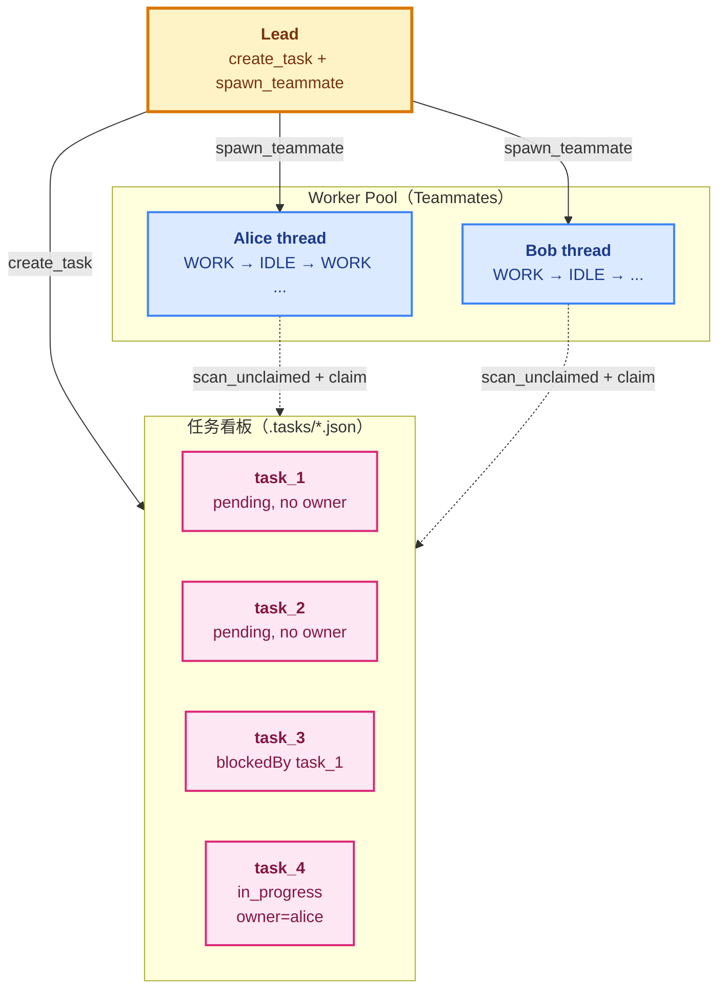
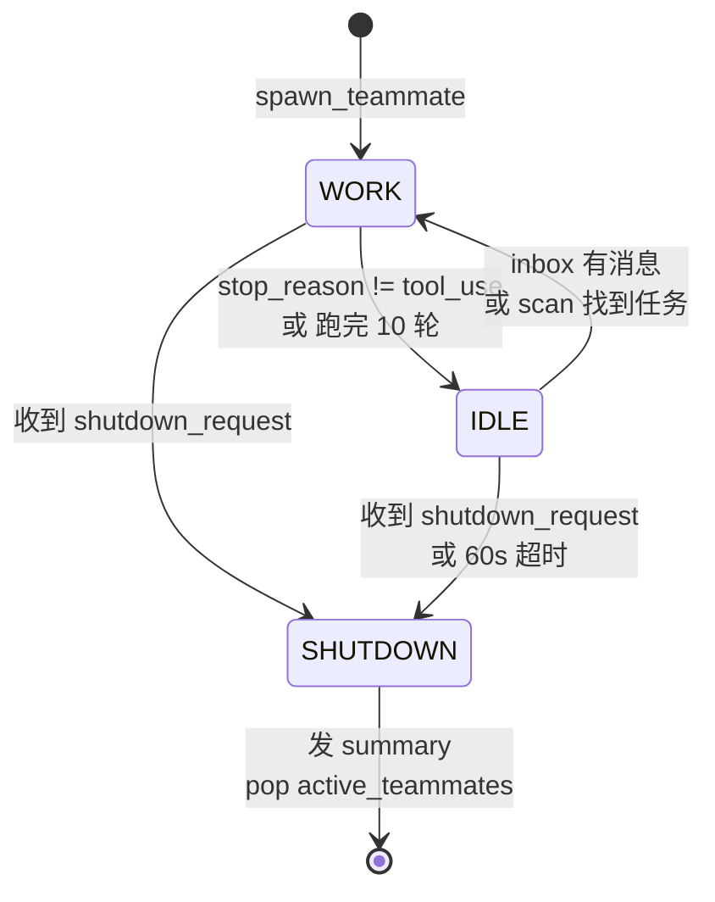
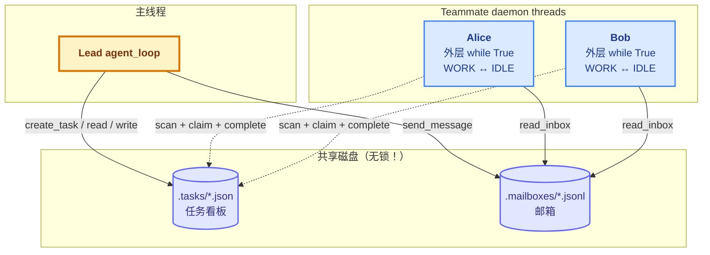

# 17 - Autonomous Agents

> [!note]
> s16 的 Teammate 已经是长寿命了——但**只能被动等活**：Lead 不发消息就永远挂在 idle。s17 给 Teammate 装上"自己看板自己认领"的能力——空闲时主动扫任务看板，发现 pending 且无人认领的任务就 claim，做完再找下一个，60 秒等不到新活才下班。Teammate 从"被动等指令"升级为"主动找活干"的自治 agent。Lead 只需要 `create_task` + `spawn_teammate`，剩下的事 Teammate 自己组织。

## 这节重点关注

读完这节，你应该能在脑子里答出这 5 个问题：

1. **自治本质**：s17 的 idle_poll 跟 s16 的 idle wait 在"主动 vs 被动"上的本质区别？（→ [演进与动机](#演进与动机)）
2. **三阶段状态机**：WORK / IDLE / SHUTDOWN 各自的进入和退出条件？s17 把 IDLE 从"终态"变"中间态"是怎么做到的？（→ [三阶段状态机](#三阶段状态机)）
3. **优先级**：inbox 为什么必须优先于任务板？不优先会怎样？（→ [idle_poll 的优先级](#idle_poll-的优先级)）
4. **TOCTOU 竞态**：claim_task 的 owner 检查能挡住哪种竞争？挡不住哪种？（→ [并发风险](#并发风险)）
5. **CC 的四机制**：教学版 1 个函数 vs CC 的 4 个机制（idle_notification / mailbox 轮询 / task watcher / tryClaimNextTask）？（→ [原本的 Claude Code 怎么做的](#原本的-claude-code-怎么做的)）

**可以略读/跳过**：CC 各机制的源码行号引用（inProcessRunner.ts / useTaskListWatcher.ts 等）——理解"4 个独立机制 vs 1 个函数"的差异就够。

## 这一步加了什么

| 新增 | 作用 | 重点? |
|---|---|---|
| `scan_unclaimed_tasks()` | 找 pending + 无 owner + 依赖已完成的任务 | ⭐⭐⭐ |
| `idle_poll()` | 60s 轮询（12 × 5s），inbox 优先 + 任务板其次 | ⭐⭐⭐ |
| `claim_task` 加 owner 检查 | 防并发覆盖（部分防护） | ⭐⭐⭐ |
| `IDLE_POLL_INTERVAL = 5` | 轮询间隔（秒） | ⭐ |
| `IDLE_TIMEOUT = 60` | 没活自动下班的超时 | ⭐⭐ |
| `while True` 外层循环 | WORK ↔ IDLE 交替 | ⭐⭐⭐ |
| 身份重注入 | messages 过短时插 identity（防压缩失忆） | ⭐⭐ |
| `list_tasks` / `claim_task` / `complete_task` 工具 | Teammate 工具集 5 → 8 | ⭐⭐ |

## 演进与动机

s16 的 Teammate 已经长寿命但**只能被动等活**。Lead 必须手动分配每个任务：

```
Lead: send_message(alice, "做任务 A")
Lead: send_message(bob, "做任务 B")
Lead: send_message(alice, "做完 A 后做 C")
...
```

**10 个未认领任务 = Lead 要 assign 10 次**。Lead 自己也是个 LLM，分配决策烧 token、容易出错、阻塞 Teammate 启动。

s17 的解法是**Worker Pool + Task Board 模式**——把任务分配决策**下沉到 Teammate**：每个 Teammate 自己 `scan_unclaimed_tasks`，看到能干的就 claim。这是分布式系统的经典模式（Kubernetes Job queue、Celery task queue、Go worker pool 都是）。

再叠三个产品需求：

1. **任务之间有依赖（DAG）**：Lead 要跟踪每个任务状态、判断依赖是否解锁、决定下一个派给谁——这是项目管理工作，不该让 Lead LLM 做。s17 把决策下沉：每个 Teammate scan 时调 `can_start` 检查 `blockedBy` 是否都 completed。
2. **并行效率**：两个 Teammate **并行**吃光看板上的任务，Lead 完全不参与分配。
3. **需要"会下班的"Teammate**：s16 的 Teammate 永远挂着，除非 Lead 发 shutdown_request。如果 Lead 忘了发，Teammate 永远占线程 + 每秒一次磁盘 I/O。s17 加 60s 超时——没活就自己退。

## 核心抽象

### scan_unclaimed_tasks：三个守卫

```python
IDLE_POLL_INTERVAL = 5   # seconds
IDLE_TIMEOUT = 60         # seconds

def scan_unclaimed_tasks() -> list[dict]:
    """找 pending + 无 owner + 依赖已完成的任务"""
    unclaimed = []
    for f in sorted(TASKS_DIR.glob("task_*.json")):
        task = json.loads(f.read_text())
        if (task.get("status") == "pending"           # ① 必须未开始
                and not task.get("owner")              # ② 必须无主
                and can_start(task["id"])):            # ③ 依赖必须完成
            unclaimed.append(task)
    return unclaimed
```

三个条件缺一不可。`can_start`（来自 s12）检查 `blockedBy` 列表里所有任务都 completed。`sorted` 保证 Teammate 之间看任务顺序一致——大家都会先认领 task_001 而不是各挑各的（虽然仍可能竞争同一个）。

### idle_poll：inbox > task board

```python
def idle_poll(agent_name, messages, name, role) -> str:
    """Poll 60s. Return 'work' | 'shutdown' | 'timeout'."""
    for _ in range(IDLE_TIMEOUT // IDLE_POLL_INTERVAL):
        time.sleep(IDLE_POLL_INTERVAL)
        inbox = BUS.read_inbox(agent_name)
        if inbox:
            # shutdown_request → 回复 + 返回
            # 普通消息 → 注入 messages + 返回 "work"
            ...
        unclaimed = scan_unclaimed_tasks()
        if unclaimed:
            claim_task(unclaimed[0]["id"], agent_name)
            return "work"
    return "timeout"
```

**为什么 inbox 优先**：inbox 里可能有 shutdown_request——这是**最高优先级**，不能被新任务"压住"。如果先看任务板，可能刚 claim 完任务就回 WORK，shutdown_request 还躺在 inbox 里。inbox 优先保证**控制信令不被任务饿死**。

### claim_task 加 owner 检查（防并发覆盖）

```python
def claim_task(task_id, owner="agent") -> str:
    task = load_task(task_id)
    if task.status != "pending":
        return f"Task {task_id} is {task.status}, cannot claim"
    if task.owner:                              # ← s17 新增
        return f"Task {task_id} already owned by {task.owner}"
    if not can_start(task_id):
        return f"Cannot start — ..."
    task.owner = owner
    task.status = "in_progress"
    save_task(task)
    return f"Claimed {task.id} ({task.subject})"
```

s12 的 claim_task 只检查 status——两个 Teammate 同时调用，第二个会覆盖第一个的 owner。s17 加了 owner 检查，至少能拒绝"已经被认领"的任务（**部分防护**——挡顺序竞争，挡不住 TOCTOU 窗口，见 [并发风险](#并发风险)）。

## 整体架构图



这跟分布式系统里的 **Worker Pool 模式**同构——**生产者**（Lead）往看板丢任务，**消费者**（Teammates）从看板取任务，**协调机制**是文件系统（共享状态）+ scan 函数（拉模式）。

### 三阶段状态机



跟 s16 对比：s16 的 IDLE 是"死循环等"（终态），s17 的 IDLE 是"有限时找活"（中间态）。这是核心差异——s16 的 IDLE 只能去 SHUTDOWN，s17 的 IDLE 可以回 WORK。

## idle_poll 的优先级

```python
def idle_poll(agent_name, messages, name, role):
    for _ in range(60 // 5):                # 12 次
        time.sleep(5)
        inbox = BUS.read_inbox(agent_name)
        if inbox:
            # ① 协议消息（shutdown_request 等）→ 优先处理
            # ② 普通消息 → 注入 messages，return "work"
            ...

        # ③ 任务板（最后才看）
        unclaimed = scan_unclaimed_tasks()
        if unclaimed:
            claim_task(unclaimed[0]["id"], agent_name)
            return "work"

    return "timeout"
```

**为什么 inbox 优先**：最常见的场景——Lead 想让 Teammate 关掉。

```
T0: Lead 在看板上加了 task_X
T0: Lead 决定让 alice 下班 → 发 shutdown_request
T1: alice idle_poll → 同时看到 task_X 和 shutdown_request
```

如果 task_X 先处理，alice 会 claim → 回 WORK → 干活 → 完成后才进下一轮 idle → 才看到 shutdown_request。**关机被任务延迟**。inbox 优先保证 shutdown_request 立即响应。

**原则**：紧急消息 > 普通消息 > 任务。这是所有消息队列设计的基本原则。

## 外层 while True：WORK ↔ IDLE 交替

s17 的 `run()` 闭包多了一层外循环：

```python
while True:                                    # ← 外层（s17 新增）
    if len(messages) <= 3:                     # 身份重注入
        messages.insert(0, identity_msg)

    # WORK phase
    should_shutdown = False
    for _ in range(10):                        # ← 内层（s16 已有）
        ...LLM turn + tool dispatch...
        if response.stop_reason != "tool_use":
            break

    if should_shutdown: break

    # IDLE phase
    idle_result = idle_poll(...)                # ← s17 新增
    if idle_result in ("shutdown", "timeout"):
        break
```

**关键**：s16 是"WORK 一次 → IDLE 永远挂"，s17 是"WORK → IDLE → WORK → IDLE → ..."，每次 IDLE 找到新活就回 WORK 继续干。

### 身份重注入（防压缩后失忆）

```python
if len(messages) <= 3:
    messages.insert(0, {"role": "user",
        "content": f"<identity>You are '{name}', role: {role}. "
                   f"Continue your work.</identity>"})
```

`<= 3` 是个 magic number——意味着 messages 几乎被压缩光了（正常状态至少有 prompt + 几轮对话）。注入 identity 让 LLM 知道"你是谁、在干什么"。CC 的 autoCompact 会保留 system prompt，教学版需要手动处理。

## 原本的 Claude Code 怎么做的

### 核心差异：1 个函数 vs 4 个机制

s17 教学版用**一个 `idle_poll()`** 干所有事——既轮询 inbox，又扫任务板，又处理 shutdown。

CC 拆成**4 个独立机制**，各干各的，组合起来达到同样效果但更灵敏、更省 CPU：

```
教学版:    idle_poll() = 一个函数包打全部

CC:        idle_notification  +  mailbox 轮询  +  task watcher  +  tryClaimNextTask
            （通知 Lead）       （看消息）       （看任务）         （认领）
```

### 四个机制分别做什么

#### 机制 1：idle_notification（通知 Lead）

CC 的 Teammate 完成一轮工作后，**主动发条消息给 Lead**："我闲了"（`inProcessRunner.ts:569-589`）。让 Lead 知道谁可用，决定派新任务 / 请求关机 / 不理。

**为什么需要**：Lead 不能直接看到每个 Teammate 的状态——它只看自己的 inbox。Teammate 主动汇报，Lead 才能协调。s17 是 Teammate 自己决定（拉模式），CC 是通知 Lead 决定（推模式 + Lead 拉模式）。

#### 机制 2：mailbox 轮询（500ms）

CC 的 `waitForNextPromptOrShutdown()`（`inProcessRunner.ts:689-868`）是个 **500ms 轮询循环**——比 s17 的 5s 快 10 倍。检查三类来源：pending user messages / mailbox 文件 / task list。shutdown_request 优先处理。

**为什么 500ms 而不是事件驱动**：mailbox 是文件，跨进程文件事件通知（inotify / fs.watch）在不同 OS 行为不一致。**轮询是最可靠的兜底**。

#### 机制 3：task watcher（事件驱动）

CC 用 `useTaskListWatcher`（`hooks/useTaskListWatcher.ts:34-189`）——基于 `fs.watch()` 监听 `.claude/tasks/` 目录变化，**1 秒 debounce** 防抖，新任务创建或依赖解锁时立即触发检查。

**对比教学版**：s17 的 `scan_unclaimed_tasks` 是**轮询**——5s 才发现一次。CC 是**事件**——任务一加就立即发现。

**类比**：s17 = 每 5 秒看一次公告板；CC = 公告板有新内容就有人敲你门。

#### 机制 4：tryClaimNextTask（主动认领）

CC 的 500ms 轮询循环内部也会调 `tryClaimNextTask()`——等待期间**主动从 task list 领取任务**。

**为什么需要**：task watcher 是被动的——它通知"有新任务了"，但谁来认领？如果只靠 watcher 触发，多个 Teammate 同时醒来抢同一个任务。**轮询里加 tryClaim 是兜底**——保证每个 Teammate 都有机会主动认领。

所以 CC 是 **被动通知 + 主动认领** 双保险。

### 四个机制怎么配合

**场景**：Lead 加了 task_X，alice 和 bob 都闲着。

```
T0       Lead create_task("task_X") → 写 task_X.json
T0+10ms  task watcher 的 fs.watch 触发（事件驱动）
         debounce 1 秒（避免连续写触发多次）
T0+1s    debounce 结束，task watcher 发现 task_X 新 + 可认领 → 广播"任务板变化"
T0+1.5s  alice 500ms 轮询醒来 → tryClaimNextTask → scan → claim task_X 成功！
T0+2s    bob 500ms 轮询醒来 → tryClaimNextTask → task_X 已是 alice 的 → 找不到
T0+?     alice 干完 → 发 idle_notification 给 Lead
```

### 为什么拆 4 个而不是 1 个

| 维度 | 教学版（1 个函数） | CC（4 个机制） |
|---|---|---|
| 任务发现延迟 | 5s（最坏） | ~1s（task watcher 事件） |
| CPU 占用 | 5s 一次磁盘扫 | 500ms 一次轻量 inbox 读 + 事件驱动扫 |
| 多 Teammate 协调 | 靠 owner 检查（不安全） | 靠文件锁（安全） |
| Lead 感知 | 不主动通知 | idle_notification 主动通知 |
| 实现复杂度 | 一个函数 ~30 行 | 四个模块，数百行 |

**核心权衡**：教学版牺牲性能换简单（你看得懂），CC 用复杂度换性能和安全。

### 文件锁保证原子认领

CC 的 `claimTask()`（`utils/tasks.ts:541-612`）用 `proper-lockfile` 在锁内完成**读-检查-改-写**：

```typescript
await lockfile.lock(taskPath)
try {
  const task = JSON.parse(read(taskPath))
  if (task.owner) throw "already owned"
  if (task.status === "completed") throw "completed"
  if (!depsCompleted(task)) throw "blocked"
  task.owner = owner
  task.status = "in_progress"
  write(taskPath, JSON.stringify(task))
} finally {
  await lockfile.unlock(taskPath)
}
```

杜绝 TOCTOU 竞态。

### 无固定超时

CC 的 Teammate **没有 60s 自动超时**——一直挂着等 Lead 决定。Lead 看 UI 上谁闲了，主动发 shutdown_request。s17 的 60s 超时是**教学简化**，避免测试时挂一堆僵尸 Teammate。

## 对 agent_loop 的影响

### 主 `agent_loop` 函数：完全没动

s17 的 `agent_loop` 跟 s16 / s15 / s14 一脉相承——while 循环 + 调 API + dispatch 工具。s17 的所有改动都在 **Teammate 的 run() 闭包**和**任务系统**里。

这是 Phase 5 一贯的模式：**主 agent_loop 是稳定的，所有扩展都发生在 Teammate 端或工具层**。

### `__main__`：跟 s16 一致

```python
agent_loop(history, context)
inbox = consume_lead_inbox(route_protocol=True)
if inbox:
    history.append({"role": "user", "content": f"[Inbox]\n..."})
```

没变化。Lead 端的协议路由 + inbox 注入逻辑在 s16 已经定型。

### 真正的扩展：Teammate 的 run() 闭包结构变化

| 维度 | s16 | s17 |
|---|---|---|
| 循环结构 | 单层 `while not shutdown_requested` | **双层**：外层 `while True` + 内层 `for 10` |
| WORK → IDLE 触发 | stop_reason != tool_use → 进 idle wait | stop_reason != tool_use → 调 idle_poll |
| IDLE 行为 | 死循环 `sleep(1) + read_inbox` | 60s 限时轮询，找活回 WORK |
| IDLE 内部任务认领 | 不做 | `scan_unclaimed_tasks + claim_task` |
| 退出条件 | shutdown_request | shutdown_request / 60s timeout |
| 身份保持 | 仅 system prompt | messages 过短自动重注入 |
| 工具集 | 5 个 | 8 个（+ list_tasks / claim_task / complete_task） |

### 三阶段 vs s16 的两阶段

```
s16:    WORK → IDLE（永远） → SHUTDOWN
s17:    WORK → IDLE → WORK → IDLE → ... → SHUTDOWN
                ↑                ↑
            找到活回 WORK    60s 没活或收到 shutdown
```

**关键变化**：s16 的 IDLE 是终态（除非 shutdown），s17 的 IDLE 是**中间态**——找到活就回 WORK 继续干。这让 Teammate 真正变成"多任务工人"而非"一次性 Worker"。

### Phase 5 扩展脉络

| 课 | Teammate 能力 | 扩展位置 |
|---|---|---|
| s15 | 长期共存 + 异步消息 | 引入 daemon thread + MessageBus |
| s16 | 协议通信 + idle loop | run() 加协议分发 + 内嵌 idle wait |
| s17 | **自治（自己看板自己认领）** | run() 加外层 while + idle_poll |

s17 是 Phase 5 的"集大成"——Teammate 既有长期共存（s15）、又有协议通信（s16）、还能主动找活（s17）。下一课 s18 解决"多 Teammate 同目录工作互相覆盖文件"的问题。

## 多线程并行情况

s17 跟 s16 的线程结构**完全一样**——主线程 + scheduler（如果继承 s14）+ queue processor + 若干 Teammate daemon thread。



### 关键变化：任务看板成热点

s16 之前，任务看板（`.tasks/`）只有 Lead 在读写。s17 起，**每个 Teammate 都在频繁 scan + claim + complete**——N 个 Teammate = N 次/5 秒的磁盘扫描。

## 并发风险

### 风险 1：认领竞争（TOCTOU）

```
T0: alice scan → 看到 task_1 可认领
T0: bob   scan → 看到 task_1 可认领（同时！）
T1: alice claim_task(task_1) → load → owner=None → 通过 → save owner=alice
T1: bob   claim_task(task_1) → load → owner=alice → return "already owned"
```

**owner 检查能挡住顺序到达的情况**（如上）。但如果 alice 和 bob **同时**进 claim_task：

```
T0: alice load_task → owner=None
T0: bob   load_task → owner=None（alice 还没 save）
T1: alice if task.owner → None，通过
T1: bob   if task.owner → None，通过
T2: alice task.owner="alice"; save_task
T2: bob   task.owner="bob"; save_task   ← 覆盖！
```

**结果**：task 的 owner 最终是 bob，但 alice 以为自己拥有它，**两个 Teammate 都在做同一个 task**。这就是经典的 **TOCTOU（Time of Check to Time of Use）** 竞态。教学版靠"实际并发概率低"蒙混，生产必须用文件锁（CC 的 `proper-lockfile`）。

### 风险 2：scan 看到陈旧数据

alice 刚 complete_task（status=completed），bob 的 scan 已经 read 文件之前打开了句柄——可能读到旧的 pending 状态。**POSIX 文件读写通常没这个问题**（原子 rename），但教学版的 `f.write_text` 不是原子写。生产要写 `.tmp` + rename。

### 风险 3：scan 性能

`scan_unclaimed_tasks` 对每个 task 调 `can_start`，`can_start` 又对每个 blockedBy 调 `load_task`——**O(N×M)** 磁盘读。100 个 task、每个 5 个依赖 = 500 次磁盘读。N 个 Teammate 每 5s 扫一次 = **100×500/5 = 10000 次/秒**。生产要缓存 + 事件驱动（`fs.watch`）。

## 设计要点

### 1. 60s 超时：避免僵尸 Teammate

没活干自己退，不占线程。s16 没这个，容易留僵尸。**为什么是 60 秒**：足够长（Lead 有时间派新活）+ 足够短（不会挂太久）。教学值，生产看场景——长任务系统可能 10 分钟，交互式可能 30 秒。

### 2. inbox 优先于任务板

**协议消息 > 普通消息 > 任务**。shutdown_request 一定要先处理，否则 Teammate 会被新任务压住，永远关不掉。

### 3. auto-claim 的返回值检查

```python
result = claim_task(task["id"], agent_name)
if "Claimed" in result:        # ← 字符串匹配
    return "work"
# 失败继续循环
```

claim 可能失败（被别人抢了 / 状态变了）。**失败不退出，继续轮询**——下一轮可能找到别的任务。**字符串匹配不优雅**——生产实现要返回枚举或结构体（`ClaimResult.SUCCESS / ALREADY_OWNED / BLOCKED`）。

### 4. 身份重注入：简单粗暴的压缩检测

`<= 3` 是个 magic number——意味着 messages 几乎被压缩光了。**为什么不在 system prompt 里**：system prompt 在压缩后保留，但教学版可能把它一起压了。注入 messages 是双保险。CC 的真实做法是 context compaction 保留 system prompt。

### 5. 外层 while True 没有显式退出条件

退出靠两个 break。**容易漏掉某个分支导致死循环**——更安全的写法用显式状态变量 `running = True; while running: ...`。

### 6. owner 检查只是部分防护

挡住"顺序到达"的竞争，挡不住"同时进入函数"的竞争。**教学版的诚实**——README 明说"教学版没有文件锁，并发认领可能出现竞争"。生产必须用文件锁。

## 相关概念

- [[16 - Team Protocols]]：s17 在 s16 的协议基础上加自治能力
- [[15 - Agent Teams]]：s17 复用 s15 的 MessageBus + daemon thread 基础设施
- [[12 - Task System]]：s17 让 Teammate 直接读写任务看板，task 系统成为协调中介
- [[14 - Cron Scheduler]]：s14 的双重检查锁定模式，s17 的 claim_task 是简化版（只有 check，没有 lock）
- [[08 - Context Compact]]：s17 的身份重注入是 autoCompact 的下游补救
- [[13 - Background Tasks]]：Teammate 本身就是长寿命的 background worker

> [!warning]
> 几个容易踩的坑：
>
> 1. **以为 claim_task 是原子的**：不是。owner 检查只能挡顺序竞争，挡不住并发竞争。生产要用文件锁。
> 2. **scan_unclaimed_tasks 的性能**：O(N×M) 磁盘读，N 个 Teammate 每 5s 跑一次——任务多时磁盘压力很大。生产要缓存 + 事件驱动。
> 3. **60s 超时是教学值**：生产场景下任务可能有依赖链，60s 不够等前置完成。要根据业务调整。
> 4. **身份重注入的 `<= 3` 是 magic number**：依赖具体压缩行为。压缩算法变了就失效。
> 5. **idle_poll 不分协议/普通消息**：所有 inbox 消息（包括 plan_approval_request）都被 json.dumps 注入 messages。LLM 会看到协议消息原文，可能误判。
> 6. **claim 失败时静默重试**：claim_task 返回非 "Claimed" 字符串时，idle_poll 只是打日志继续循环。Teammate 可能反复扫到同一个被认领的任务，浪费 5s × 12 次。
> 7. **scan 的 sorted 不能防竞争**：只是保证所有 Teammate 看任务顺序一致——大家都会先抢 task_001。要真正防竞争得用锁。
> 8. **`active_teammates` 在超时退出时 pop**：如果 idle_poll 异常退出（没走完整 try），名字永远占用。生产要加 finally。

## 代码骨架总览

剥掉所有边界情况处理，s17 的核心抽象只有这么多代码。

```python
# === 1. 任务扫描 + 三守卫 ===
IDLE_POLL_INTERVAL = 5
IDLE_TIMEOUT = 60

def scan_unclaimed_tasks() -> list[dict]:
    unclaimed = []
    for f in sorted(TASKS_DIR.glob("task_*.json")):
        task = json.loads(f.read_text())
        if (task.get("status") == "pending"             # ① 未开始
                and not task.get("owner")                # ② 无主
                and can_start(task["id"])):              # ③ 依赖完成
            unclaimed.append(task)
    return unclaimed

# === 2. claim_task 加 owner 检查（部分防护）===
def claim_task(task_id, owner="agent") -> str:
    task = load_task(task_id)
    if task.status != "pending":
        return f"Task {task_id} is {task.status}, cannot claim"
    if task.owner:                                       # ← s17 新增
        return f"Task {task_id} already owned by {task.owner}"
    if not can_start(task_id):
        return f"Cannot start — blocked"
    task.owner = owner
    task.status = "in_progress"
    save_task(task)
    return f"Claimed {task.id} ({task.subject})"

# === 3. idle_poll：inbox > task board（核心差异）===
def idle_poll(agent_name, messages, name, role) -> str:
    """Return 'work' | 'shutdown' | 'timeout'."""
    for _ in range(IDLE_TIMEOUT // IDLE_POLL_INTERVAL):
        time.sleep(IDLE_POLL_INTERVAL)

        # ① inbox 优先（控制信令不被任务饿死）
        inbox = BUS.read_inbox(agent_name)
        if inbox:
            for msg in inbox:
                if msg.get("type") == "shutdown_request":
                    req_id = msg.get("metadata", {}).get("request_id", "")
                    BUS.send(name, "lead", "Shutting down.", "shutdown_response",
                             {"request_id": req_id, "approve": True})
                    return "shutdown"
            messages.append({"role": "user",
                "content": "<inbox>" + json.dumps(inbox) + "</inbox>"})
            return "work"

        # ② 任务板其次
        unclaimed = scan_unclaimed_tasks()
        if unclaimed:
            task = unclaimed[0]
            result = claim_task(task["id"], agent_name)
            if "Claimed" in result:
                messages.append({"role": "user",
                    "content": f"<auto-claimed>Task {task['id']}: "
                               f"{task['subject']}</auto-claimed>"})
                return "work"
            # claim 失败（被别人抢了）→ 继续循环

    return "timeout"                                     # 60s 没活，下班

# === 4. run() 闭包的外层结构（双层 while）===
def run():
    messages = [{"role": "user", "content": prompt}]
    sub_tools = [...]  # 8 个工具（+ list_tasks / claim_task / complete_task）

    while True:                                          # ← 外层
        # 身份重注入（防压缩失忆）
        if len(messages) <= 3:
            messages.insert(0, {"role": "user",
                "content": f"<identity>You are '{name}', role: {role}. "
                           f"Continue your work.</identity>"})

        # WORK phase
        should_shutdown = False
        for _ in range(10):
            inbox = BUS.read_inbox(name)
            for msg in inbox:
                if handle_inbox_message(name, msg, messages):
                    should_shutdown = True; break
            if should_shutdown: break

            response = client.messages.create(...)
            messages.append({"role": "assistant", "content": response.content})
            if response.stop_reason != "tool_use": break    # WORK 结束
            # dispatch tools...

        if should_shutdown: break

        # IDLE phase（s17 核心差异：主动找活）
        idle_result = idle_poll(name, messages, name, role)
        if idle_result == "shutdown": break
        if idle_result == "timeout": break

    # SHUTDOWN 收尾
    summary = _extract_last_assistant_text(messages)
    BUS.send(name, "lead", summary, "result")
    active_teammates.pop(name, None)

# === 5. Teammate 工具集扩展 ===
NEW_TOOLS = [
    {"name": "list_tasks", "description": "List all tasks on the board.",
     "input_schema": {"type": "object", "properties": {}, "required": []}},
    {"name": "claim_task", "description": "Claim a pending task.",
     "input_schema": {"type": "object",
                      "properties": {"task_id": {"type": "string"}},
                      "required": ["task_id"]}},
    {"name": "complete_task", "description": "Mark an in-progress task as completed.",
     "input_schema": {"type": "object",
                      "properties": {"task_id": {"type": "string"}},
                      "required": ["task_id"]}},
]
# sub_handlers 多 3 行：
#   "list_tasks": _run_list_tasks,
#   "claim_task": _run_claim_task,         # 自动用 teammate name 当 owner
#   "complete_task": _run_complete_task,
```

**这 5 块是 s17 的全部抽象层**。下一节 s18（Phase 5 最后一课）会解决"多个 Teammate 同目录工作互相覆盖文件"——给每个任务一个独立 git worktree 做物理隔离。

## Q&A

### Q1: s17 的 idle_poll 跟 s16 的 idle wait 有什么本质区别

**A**：**主动找活 vs 被动等活**。

s16 的 idle wait：只看 inbox，inbox 空就一直 sleep——**永远不主动找活**。Lead 不发消息就永远挂着。

s17 的 idle_poll：**除了看 inbox，还看任务看板**。没消息但任务板上有活就自己认领。

类比：s16 是"等电话"——你不打过来我不动。s17 是"看公告板"——没人找我我就自己看有没有事做。

第二个差别：**s17 有超时**（60s 没活就下班），s16 没有（永远挂）。

### Q2: 为什么 inbox 优先于任务板

**A**：见 [idle_poll 的优先级](#idle_poll-的优先级)。因为**协议消息的优先级高于任务**。最常见的场景：Lead 想让 Teammate 关掉——如果 task_X 先处理，shutdown_request 会延迟到任务做完才响应。inbox 优先保证 shutdown_request 立即响应。**原则**：紧急消息 > 普通消息 > 任务。

### Q3: claim_task 的 owner 检查能防住并发竞争吗

**A**：**只能防顺序竞争，防不住并发竞争**。见 [并发风险](#并发风险) 的风险 1。owner 检查挡顺序到达，挡不住 TOCTOU 窗口。教学版靠"实际并发概率低"蒙混，生产实现必须用文件锁。

### Q4: 身份重注入的 `len(messages) <= 3` 是什么意思

**A**：检测 messages 是否被压缩过。正常状态下 messages 应该有几十条。**只有 3 条或更少**意味着刚被 autoCompact 压缩（s08 的能力）。压缩算法可能丢掉了"你是 alice"这种身份信息，重注入保证身份始终在上下文里。**为什么是 3**：压缩后通常保留"摘要 + 最近 1-2 条"。**magic number 的代价**：阈值依赖具体压缩行为——压缩算法变了就要调阈值。

### Q5: Teammate 工具集从 5 个加到 8 个，Lead 工具数不变

**A**：正确——这是设计意图。

**Lead 工具集（14 个，不变）**：bash / read_file / write_file / create_task / list_tasks / get_task / claim_task / complete_task / spawn_teammate / send_message / check_inbox / request_shutdown / request_plan / review_plan

**Teammate 工具集（5 → 8）**：bash / read_file / write_file / send_message / submit_plan **+ list_tasks + claim_task + complete_task**

Lead 已经有这三个工具，**当然能**自己看板和认领。但**设计意图是 Lead 不该做这事**：Lead 是协调者，Teammate 是执行者。让 Teammate 也有这三个工具，**就是把"认领"这个动作从 Lead 下放到 Teammate**。

**注意**：Teammate 的工具集**没有** `create_task` / `get_task` / `request_plan` / `review_plan`——它不能创建任务（这是 Lead 的权力），也不能发起协议审批。

### Q6: idle_poll 找到活就 return "work"，那 WORK 阶段怎么知道是新任务还是接续旧任务

**A**：靠**注入 messages 的标记**。

```python
messages.append({"role": "user",
    "content": f"<auto-claimed>Task {task['id']}: {task['subject']}</auto-claimed>"})
return "work"
```

回 WORK 后，LLM 看到 messages 末尾有 `<auto-claimed>` 标签，知道"我刚自动认领了 task_X"。LLM 会基于这个上下文决定下一步——通常是 `get_task(task_id)` 看详情，然后开干。

**LLM 怎么知道要这么做**：靠 system prompt 引导（"You can list and claim tasks from the board"）。LLM 看到 `<auto-claimed>` 标签会自然联想到"我认领了任务，需要做"。**没有强保证**：LLM 可能忽略标签直接说"我做完了"——这是君子协定。

### Q7: 如果所有 Teammate 同时 scan 同一个任务怎么办

**A**：**部分防护 + 实际场景下很少发生**。教学版靠两层防护：owner 检查 + 5 秒错峰。但如果真的同时（N 个 Teammate 同时启动 + 同时进第一次 idle_poll），最终 owner 是最后 save 的那个，但其他人以为自己拥有 task_1——多人同时做。

实际测试场景下（2-3 个 Teammate，启动间隔几秒），这个问题几乎不会出现。生产场景（数十个 Teammate 同时启动）必须解决。

### Q8: Teammate 超时退出和 shutdown_request 退出有什么区别

**A**：**触发方不同，但收尾一样**。

**shutdown_request（被动退出）**：Lead 主动发起，alice 自动 approve=True。Lead 知道 alice 同意了（收到 shutdown_response）。

**timeout（主动退出）**：alice 自己觉得"没事干我走了"。Lead 不知道 alice 退了——直到下次 drain inbox 看到 summary result 才发现。

**共同的收尾**：发 summary + pop active_teammates。

**区别**：shutdown 协议 Lead 立即知道 alice 退了；timeout Lead 延迟知道。生产实现里，timeout 也应该通知 Lead——发个 `idle_timeout_notification` 让 Lead 知道。教学版省了。
