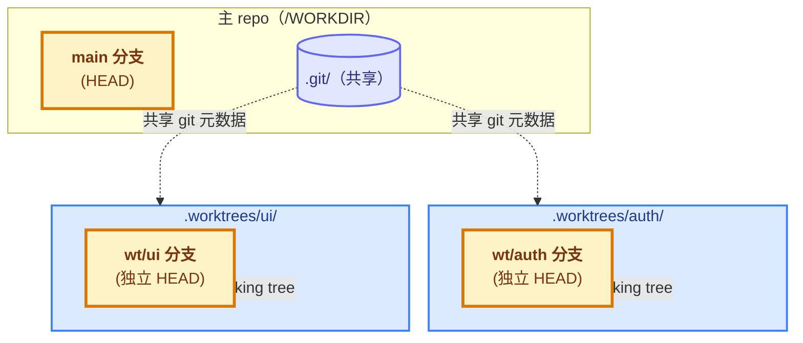
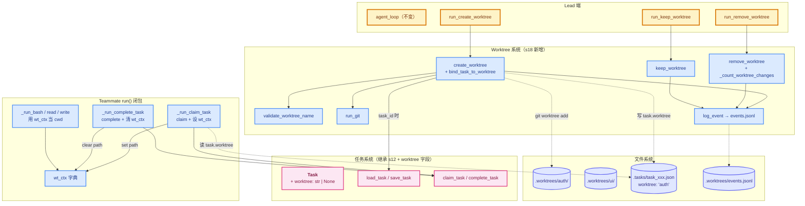
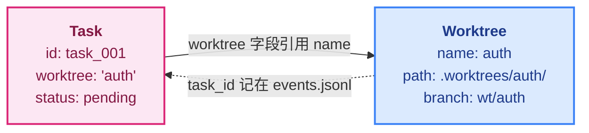
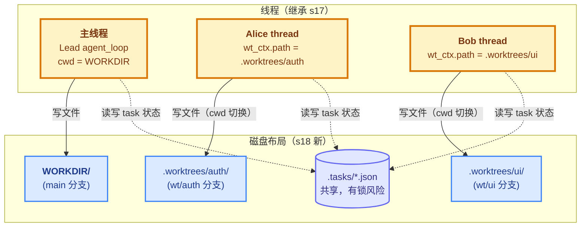

# 18 - Worktree Isolation

> [!note]
> s15-s17 解决了"谁干什么"（task 系统）和"怎么通信"（MessageBus），但没解决**"在哪干"**——所有 Teammate 共享同一个 `WORKDIR`。alice 改 `config.py`，bob 也改 `config.py`，互相覆盖；出了问题分不清谁的改动。s18 用 **git worktree** 给每个任务一个独立目录 + 独立分支：alice 在 `.worktrees/auth/` 工作，bob 在 `.worktrees/ui/` 工作，物理隔离。Task 加 `worktree` 字段做绑定，Teammate 认领带 worktree 的任务时**自动切 cwd**到对应目录。这是 Phase 5 最后一课——多 Agent 协作的"并发安全"基石。

## 这节重点关注

读完这节，你应该能在脑子里答出这 5 个问题：

1. **隔离维度**：s18 解决的是哪一类并发问题？没解决的是哪一类？（→ [演进与动机](#演进与动机)）
2. **git worktree 契约**：`git worktree add` 干了什么？跟 git clone 的区别？（→ [核心抽象](#核心抽象)）
3. **task ↔ worktree 绑定**：双向引用怎么实现？为什么 bind 不改 status？（→ [task--worktree-双向绑定](#task--worktree-双向绑定)）
4. **wt_ctx 切 cwd**：Teammmate 的 `run()` 闭包怎么实现"claim 时切、complete 时清"？为什么用字典而非普通变量？（→ [wt_ctx-切换-cwd](#wt_ctx-切换-cwd)）
5. **删除安全**：remove 默认拒绝有改动的 worktree 是为什么？（→ [删除时的安全检查](#删除时的安全检查)）

**可以略读/跳过**：CC 的 `PersistedWorktreeSession` 字段、`@{push}..HEAD` 的细节——这些是 git/CC 的具体实现细节，理解"物理隔离 + 双向绑定 + 安全删除"就够。

## 这一步加了什么

| 新增 | 作用 | 重点? |
|---|---|---|
| `Task.worktree` 字段 | 绑定的 worktree 名（不是路径），形如 `"auth"` | ⭐⭐⭐ |
| `validate_worktree_name()` | 校验名字（防路径穿越 + 非法字符） | ⭐⭐⭐ |
| `run_git(args)` | 跑 git 命令，返回 `(ok, output)` | ⭐⭐ |
| `log_event(type, name, task_id)` | 写生命周期事件到 `events.jsonl`（只追加） | ⭐⭐ |
| `create_worktree(name, task_id="")` | `git worktree add` 创建独立目录 + 分支 | ⭐⭐⭐ |
| `bind_task_to_worktree(task_id, name)` | 写 `task.worktree`，**不改 status** | ⭐⭐⭐ |
| `_count_worktree_changes(path)` | 数未提交文件 / 未推送 commit | ⭐⭐ |
| `remove_worktree(name, discard_changes=False)` | 删除（有改动时默认拒绝） | ⭐⭐⭐ |
| `keep_worktree(name)` | 保留给人工 review | ⭐⭐ |
| `wt_ctx` 字典 + cwd 切换 | Teammate 维护当前 worktree 路径 | ⭐⭐⭐ |
| `run_bash/read/write` 加 `cwd` 参数 | 底层工具支持 cwd（向后兼容 WORKDIR） | ⭐⭐ |

## 演进与动机

s15-s17 解决了**并行执行**（多个 Teammate 同时跑），但没解决**并行安全**——它们改同一个文件。s17 的致命缺陷：

```
Lead: create_task("重构认证模块")
Lead: create_task("重构 UI 登录页")
Lead: spawn alice, spawn bob

alice 认领 task_1 → WORK：write_file("config.py", "alice 版")
bob   认领 task_2 → WORK：write_file("config.py", "bob 版")    ← 覆盖了 alice 的！
```

两个 Teammate **物理上在同一个目录**工作——文件系统没有任何隔离。**最后写的赢**，前面的工作丢失。

s18 的解法是 **git worktree 物理隔离**：每个任务一个独立目录 + 独立分支。alice 在 `.worktrees/auth/`，bob 在 `.worktrees/ui/`——写 `config.py` 也是各自的 `.worktrees/auth/config.py` 和 `.worktrees/ui/config.py`，互不影响。

再叠三个产品需求：

1. **无法干净回滚**：alice 干完，bob 还在干。Lead 想"task_1 做错了回滚"——但 git diff 里 alice 和 bob 的改动混在一起，**分不清谁是谁的**。
2. **需要独立分支做 review**：每个任务的改动应该在**独立分支**上，方便人工 review。git worktree 天生支持这个——一个 repo 多个 working tree，每个有自己的分支。
3. **可审计的生命周期**：create / remove / keep 都要记录到 `events.jsonl`，方便事后追溯。

**注意 s18 的边界**：只解决**代码文件覆盖**，没解决**协调状态竞争**（task 认领的 TOCTOU、mailbox 并发）——那些要靠文件锁（CC 的 `proper-lockfile`）。

## 核心抽象

### Git Worktree：一个 repo，多个工作目录



`git worktree add <path> -b <branch>` 命令做的事：

1. 在 `<path>` 创建一个新的 working tree（独立的文件副本）
2. 创建并切到新分支 `<branch>`
3. 所有 worktree **共享同一个 `.git`**——commit / branch / object 都在一个地方

**对比 git clone**：clone 是完整复制一份 repo（包括 `.git`），独立 evolution。worktree 是**共享 repo + 隔离 working tree**——更适合"同一个项目的多个并行工作流"。

### 路径穿越防护

```python
VALID_WT_NAME = re.compile(r'^[A-Za-z0-9._-]{1,64}$')

def validate_worktree_name(name):
    if not name: return "empty"
    if name == "." or name == "..": return "invalid"
    if not VALID_WT_NAME.match(name):
        return "only letters, digits, dots, underscores, dashes"
    return None
```

三道关：不能为空 / 不能是 `.` 或 `..` / 必须匹配 `[A-Za-z0-9._-]{1,64}`。

**为什么这么严**：worktree name 直接拼到路径 `WORKTREES_DIR / name`。如果允许 `/`，攻击者可以传 `../../etc/passwd` 把文件写到任意位置（**路径穿越攻击**）。只允许安全字符集就杜绝了所有路径注入。

## 整体架构图



## task ↔ worktree 双向绑定



- Task 里有 `worktree` 字段 → 指向 worktree name
- Worktree 的创建事件里有 `task_id` → 指向 task

**双向引用让两边都能找到对方**——但实际数据只在 task 里持久化（worktree 本身不存 task_id 字段，靠 `events.jsonl` 日志记录关联）。

### bind_task_to_worktree：只写一个字段

```python
def bind_task_to_worktree(task_id, worktree_name):
    task = load_task(task_id)
    task.worktree = worktree_name       # 只写这一个字段
    save_task(task)
    # status 不动，仍 pending
```

**关键**：bind 不改 status。这让 Lead 可以**提前**创建 task + worktree + 绑定，task 仍挂看板上等 Teammate 自动认领。

| 方案 | 行为 |
|---|---|
| bind 改 status | Lead 一绑 task 就 in_progress，没 Teammate 也"占用"——Lead 自己得做完 |
| bind 不改 status（s18） | task 仍 pending，scan_unclaimed 能找到，Teammate 认领时才推进 |

s18 的设计让 Lead 和 Teammate **职责清晰**：Lead 准备资源（task + worktree），Teammate 干活。

## wt_ctx 切换 cwd

Teammate 认领带 worktree 的任务 → `wt_ctx["path"]` 设为 worktree 路径 → 后续 bash/read/write 自动在 worktree 跑。

```python
def run():
    wt_ctx = {"path": None}               # ← 每个 teammate 一份

    def _wt_cwd() -> Path | None:
        p = wt_ctx["path"]
        return Path(p) if p else None

    def _run_bash(command):
        return run_bash(command, cwd=_wt_cwd())    # 传 cwd

    def _run_claim_task(task_id):
        result = claim_task(task_id, owner=name)
        if "Claimed" in result:
            task = load_task(task_id)
            if task.worktree:
                wt_ctx["path"] = str(WORKTREES_DIR / task.worktree)
            else:
                wt_ctx["path"] = None
        return result

    def _run_complete_task(task_id):
        result = complete_task(task_id)
        wt_ctx["path"] = None              # ← 完成后退出 worktree
        return result
```

**为什么用字典而非普通变量**：Python 闭包对**不可变变量**（None / str / int）是只读的——内层函数改它会报 `UnboundLocalError`。用字典包装是个 hack：字典是可变对象，闭包可以改它的 value。替代方案是 `nonlocal`——更 Pythonic，但教学版选字典避免引入 `nonlocal`。

**关键流程**：
```
alice claim task_1 (worktree="auth")
  → wt_ctx.path = .worktrees/auth
alice bash("ls") → 在 .worktrees/auth/ 下跑
alice write_file("config.py", ...) → 写到 .worktrees/auth/config.py
alice complete_task → wt_ctx.path = None（回主目录）
```

### 底层工具加 cwd 参数（向后兼容）

```python
def run_bash(command: str, cwd: Path | None = None) -> str:
    r = subprocess.run(command, shell=True,
                       cwd=cwd or WORKDIR,     # ← 优先用传入的，否则 WORKDIR
                       capture_output=True, text=True, timeout=120)
    ...
```

**向后兼容**：不传 cwd 时用 WORKDIR（Lead 行为不变）；Teammate 传 wt_ctx 时切到 worktree。Lead 始终在 WORKDIR 工作——它是协调者，不是执行者。

## 删除时的安全检查

```python
def remove_worktree(name, discard_changes=False):
    ...
    if not discard_changes:
        files, commits = _count_worktree_changes(path)
        if files > 0 or commits > 0:
            return (f"has {files} uncommitted file(s) and {commits} unpushed commit(s). "
                    "Use discard_changes=true to force removal, "
                    "or keep_worktree to preserve for review.")
    ...
```

**默认拒绝有改动的 worktree**——避免误删工作。三种选择：

| 操作 | 含义 |
|---|---|
| `keep_worktree(name)` | 保留，等人工 review |
| `remove_worktree(name, discard_changes=True)` | 强制删（数据丢失） |
| `remove_worktree(name)` + 无改动 | 干净删 |

**为什么默认拒绝**：LLM 可能一句话 "remove all worktrees" 就把所有心血删了——不可逆。s18 让 LLM 至少要"想两次"才能删有改动的 worktree。

### `_count_worktree_changes` 实现

```python
def _count_worktree_changes(path: Path) -> tuple[int, int]:
    """Count uncommitted files and commits in a worktree."""
    try:
        r1 = subprocess.run(["git", "status", "--porcelain"],
                            cwd=path, capture_output=True, text=True, timeout=10)
        files = len([l for l in r1.stdout.strip().splitlines() if l.strip()])
        r2 = subprocess.run(["git", "log", "@{push}..HEAD", "--oneline"],
                            cwd=path, capture_output=True, text=True, timeout=10)
        commits = len([l for l in r2.stdout.strip().splitlines() if l.strip()])
        return files, commits
    except Exception:
        return -1, -1
```

注意 `@{push}..HEAD` 计算"未推送的 commit"——比 `origin/main..HEAD` 更通用（自动找 upstream）。包了 try-except 返回 `(-1, -1)`——但 remove 检查 `files < 0` 时会拒绝，意味着**新创建无 upstream 的 worktree 没法干净 remove**（要么 discard，要么 keep）。

## 原本的 Claude Code 怎么做的

CC 的 worktree 有两条独立路径：**EnterWorktree**（会话级切换）和 **AgentTool isolation**（子 agent 隔离）。

### 1. EnterWorktree：进程级 chdir

CC 的 `EnterWorktreeTool` 创建 worktree 后**立即** `process.chdir(worktreePath)`（`EnterWorktreeTool.ts:92-97`）：

```typescript
process.chdir(worktreePath)
setCwd(worktreePath)
setOriginalCwd(worktreePath)
saveWorktreeState(...)
```

**整个进程的工作目录切换**——不是 prompt 提醒，是 OS 级 chdir。当前会话所有后续命令都在 worktree 下跑。

`ExitWorktreeTool` 的 keep / remove 都会 `restoreSessionToOriginalCwd()` 恢复原目录。

**对比教学版**：s18 用 `wt_ctx["path"]` 当 cwd 参数传给 subprocess——**不 chdir 整个进程**，只让具体命令在指定目录跑。更细粒度，但需要每次显式传 cwd。

### 2. AgentTool isolation：子 agent 隔离

CC 的 `AgentTool` 在 `isolation: "worktree"` 时调用 `createAgentWorktree()`（`AgentTool.tsx:590-641`）创建 worktree，用 **`cwdOverridePath`** 包住子 agent 执行：

```typescript
const cwdOverridePath = createAgentWorktree(...)
runSubAgent({ cwdOverride: cwdOverridePath, ... })
```

子 agent 的所有操作自动在 worktree 目录下进行——**不影响主会话**。

**对比教学版**：s18 的 Teammate 跟 Lead 在同一个进程，靠 `wt_ctx` 字典隔离 cwd；CC 的子 agent 是独立 spawn 的进程，靠 `cwdOverride` 传参。语义类似，实现不同。

### 3. CC 没有 task-worktree 绑定

**这是最大的差别**。

教学版：Task 加 `worktree` 字段，task 和 worktree 显式绑定。

CC：Worktree 状态通过 `PersistedWorktreeSession`（`worktree.ts:756-768`）管理，字段包括：

```
originalCwd, worktreePath, worktreeName, worktreeBranch,
originalBranch, originalHeadCommit, sessionId
```

**没有 `taskId`**。Worktree 和 task 是**两个独立系统**，通过 Agent 的上下文理解关联——Agent 知道"我现在的 task 是 X，我在 worktree Y 里工作"，但代码层没有显式绑定。

教学版用 `task.worktree` 字段是**教学简化**——让"任务在哪干"这个问题有明确答案。CC 让 Agent 自己决定（更灵活，但容易出错）。

### 4. 路径和分支命名

| 维度 | 教学版 | CC |
|---|---|---|
| 目录 | `.worktrees/<name>/` | `.claude/worktrees/<slug>/` |
| 分支 | `wt/<name>` | `worktree-<slug>`（斜杠用 `+` 替代） |
| 创建命令 | `git worktree add -b` 从 HEAD | `git worktree add -B` 优先从 `origin/<defaultBranch>` |

CC 优先基于 origin/defaultBranch 而非本地 HEAD——保证 worktree 反映远程最新状态，不受本地未推送 commit 影响。

### 5. slug 校验

CC 的 `worktree.ts:76-84` 校验 slug：拒绝 `.` / `..`，允许 `[a-zA-Z0-9._-]`。跟教学版的 `validate_worktree_name` 完全一致——这种安全规则是通用的。

## 对 agent_loop 的影响

### 主 `agent_loop` 函数：完全没动

s18 的 `agent_loop` 跟 s17 一字不差——while + 调 API + dispatch 工具。3 个新 Lead 工具只是进了 TOOLS 数组和 TOOL_HANDLERS。

**这是 Phase 5 一贯的模式**：主循环稳定，所有扩展都在工具层或 Teammate 端。

### 底层工具加 cwd 参数（向后兼容）

```python
# s17
def run_bash(command: str) -> str:
    r = subprocess.run(command, shell=True, cwd=WORKDIR, ...)

# s18
def run_bash(command: str, cwd: Path | None = None) -> str:
    r = subprocess.run(command, shell=True, cwd=cwd or WORKDIR, ...)
```

### Teammate 的 run() 闭包：多了一个 `wt_ctx` 字典

s17 的 run() 闭包结构不变，**内部多了一个 `wt_ctx` 字典**和几个 helper。claim 时**从 task.worktree 字段读出 worktree 名 → 拼路径 → 写入 wt_ctx**；complete 时**清空 wt_ctx**。其他工具（bash/read/write）透明地在 worktree 目录下跑。

### Phase 5 扩展脉络（完结）

| 课 | 解决问题 | 扩展位置 |
|---|---|---|
| s15 | 长期共存 + 异步消息 | 引入 daemon thread + MessageBus |
| s16 | 协议通信 + 长寿命 | run() 加协议分发 + idle loop |
| s17 | 自治（自己看板自己认领） | run() 加外层 while + idle_poll |
| s18 | **物理隔离（独立目录）** | **Task 加 worktree 字段 + wt_ctx 切 cwd** |

s18 是 Phase 5 的**收尾课**——多 Agent 协作的"并发安全"基石。至此：**通信**（s15）、**协议**（s16）、**自治**（s17）、**隔离**（s18）四块齐了。

## 多线程并行情况

s18 跟 s17 的线程结构**完全一样**——主线程 + Teammate daemon thread。但**磁盘布局变了**：



### 关键变化：文件操作不再竞争

s17 的问题：alice 和 bob 都在 WORKDIR 工作，写同一个文件 → 覆盖。

s18 解决：alice 在 `.worktrees/auth/`，bob 在 `.worktrees/ui/`——**物理上不同目录**。互不影响。

### 但任务文件仍是共享热点

`.tasks/*.json` 仍然只有一份——所有 Teammate 都在读写。s17 提到的 TOCTOU 竞态（认领竞争）**s18 没解决**，只是不再造成文件覆盖（因为代码改动在各自 worktree）。要真正解决得用文件锁。

### worktree 不是完全隔离

- **共享**：`.git/` 元数据、`.tasks/`、`.mailboxes/`、`.memory/`
- **隔离**：源代码文件、构建产物

如果两个 Teammate 改 `.tasks/` 里的同一个 task（比如同时 complete）——仍然有覆盖风险。s18 只解决了**代码文件的隔离**，没解决**协调状态的隔离**。

## 设计要点

### 1. 绑定 ≠ 认领

`bind_task_to_worktree` 只写 `worktree` 字段，**不改 status**。这让 Lead 可以**提前**创建 task + worktree + 绑定，task 仍挂看板上等 Teammate 自动认领。s18 的设计让 Lead 和 Teammate **职责清晰**：Lead 准备资源，Teammate 干活。

### 2. wt_ctx 用字典而非变量

见 [wt_ctx 切换 cwd](#wt_ctx-切换-cwd)。Python 闭包对不可变变量只读，要写要么用 `nonlocal` 要么用可变容器（dict / list）。s18 选字典可能是为了简洁，但生产代码用 `nonlocal` 更 Pythonic。

### 3. complete_task 自动清 wt_ctx

```python
def _run_complete_task(task_id):
    result = complete_task(task_id)
    wt_ctx["path"] = None              # ← 完成后回主目录
    return result
```

**为什么自动清**：Teammate 完成一个任务后，可能认领**另一个不带 worktree** 的任务。如果 wt_ctx 不清，后续 bash 仍在旧 worktree 跑——**逻辑错误**。每次 claim 时也会重设（设或清），但 complete 时显式清更安全（防御式）。

### 4. remove 默认拒绝有改动

**默认安全**——避免 LLM 误删工作。要求显式 `discard_changes=True` 才强删。

### 5. events.jsonl 只追加

```python
def log_event(event_type, worktree_name, task_id=""):
    event = {...}
    with open(events_file, "a") as f:        # ← append only
        f.write(json.dumps(event) + "\n")
```

**只追加不修改**——审计日志的基本原则。即使 remove 失败，前面的 create 事件还在——可以追溯。

**缺陷**：事件只是日志，**不是状态**。如果进程崩了重启，没法从 events.jsonl 恢复 worktree 状态（要扫 `git worktree list`）。CC 用 `PersistedWorktreeSession` 存完整状态，可以恢复。

### 6. 共享 `.git` 的代价

所有 worktree 共享一个 `.git/`：

**好处**：
- 节省磁盘（不重复存 objects）
- 跨 worktree 的 commit 互相可见（alice 能 cherry-pick bob 的 commit）
- 创建快（不用复制）

**坏处**：
- `.git/` 是单点——损坏了所有 worktree 都废
- 并发 `git` 命令可能有锁竞争（git 自己有 index lock）

## 相关概念

- [[17 - Autonomous Agents]]：s18 复用 s17 的自治认领机制（claim 时多设 wt_ctx）
- [[16 - Team Protocols]]：s18 的协议层跟 worktree 无关，正交关系
- [[15 - Agent Teams]]：s18 的 Teammate 继承 s15 的 daemon thread 基础设施
- [[12 - Task System]]：s18 给 Task 加 worktree 字段，task-worktree 绑定
- [[03 - Permission]]：s18 的 validate_worktree_name 是 path-based permission 的体现
- [[13 - Background Tasks]]：worktree 本身就像"空间上的 background task"——独立资源，按需清理

> [!warning]
> 几个容易踩的坑：
>
> 1. **以为 worktree 完全隔离**：不。`.tasks/`、`.mailboxes/`、`.memory/` 仍共享。代码文件隔离 ≠ 协调状态隔离。
> 2. **以为 wt_ctx 跨任务保留**：不。`complete_task` 自动清，`claim_task` 重设。任务边界处一定重置。
> 3. **以为 bind 会推进 task 状态**：不。bind 只写 worktree 字段，status 仍 pending。要 in_progress 必须 claim。
> 4. **以为 remove 无害**：默认对有改动的 worktree 拒绝，但 `discard_changes=True` 会**真的删**（包括分支和 commit）。LLM 调用时容易误删。
> 5. **worktree name 不能含 `/`**：`validate_worktree_name` 拒绝。这意味着不能用 "auth/login" 这种层级名——只能 "auth" 或 "auth-login"。
> 6. **events.jsonl 只是日志**：进程崩了重启没法从它恢复 worktree 状态。生产要像 CC 那样用 `PersistedWorktreeSession` 存完整状态。
> 7. **`@{push}..HEAD` 在没 upstream 时报错**：`_count_worktree_changes` 包了 try-except 返回 `(-1, -1)`，但 remove_worktree 检查 `files < 0` 时会拒绝——这意味着**新创建无 upstream 的 worktree 没法干净 remove**。
> 8. **共享 `.git/` 的并发风险**：两个 worktree 同时跑 git 命令可能争 index lock。教学版靠"实际不冲突"蒙混，生产场景要加 git 级锁。

## 代码骨架总览

剥掉所有边界情况处理，s18 的核心抽象只有这么多代码。

```python
# === 1. Task 加 worktree 字段 ===
@dataclass
class Task:
    id: str
    subject: str
    description: str
    status: str
    owner: str | None
    blockedBy: list[str]
    worktree: str | None = None      # ← s18 新增

# === 2. 路径穿越防护 ===
VALID_WT_NAME = re.compile(r'^[A-Za-z0-9._-]{1,64}$')

def validate_worktree_name(name: str) -> str | None:
    if not name: return "empty"
    if name in (".", ".."): return "invalid"
    if not VALID_WT_NAME.match(name):
        return "only letters, digits, dots, underscores, dashes (1-64 chars)"
    return None

def run_git(args: list[str]) -> tuple[bool, str]:
    try:
        r = subprocess.run(["git"] + args, capture_output=True,
                           text=True, timeout=30, cwd=WORKDIR)
        return (r.returncode == 0, (r.stdout + r.stderr).strip())
    except Exception as e:
        return (False, str(e))

# === 3. 审计日志（只追加）===
def log_event(event_type, worktree_name, task_id=""):
    event = {"type": event_type, "worktree": worktree_name,
             "task_id": task_id, "ts": time.time()}
    with open(WORKTREES_DIR / "events.jsonl", "a") as f:
        f.write(json.dumps(event) + "\n")

# === 4. create + 可选绑定 ===
def create_worktree(name: str, task_id: str = "") -> str:
    err = validate_worktree_name(name)
    if err: return f"Error: {err}"
    path = WORKTREES_DIR / name
    if path.exists(): return f"Worktree '{name}' already exists"
    ok, result = run_git(["worktree", "add", str(path), "-b", f"wt/{name}", "HEAD"])
    if not ok: return f"Git error: {result}"
    if task_id: bind_task_to_worktree(task_id, name)
    log_event("create", name, task_id)
    return f"Worktree '{name}' created at {path}"

def bind_task_to_worktree(task_id: str, worktree_name: str):
    """关键：只写 worktree 字段，不改 status。"""
    task = load_task(task_id)
    task.worktree = worktree_name
    save_task(task)

# === 5. 安全删除（默认拒绝有改动）===
def _count_worktree_changes(path: Path) -> tuple[int, int]:
    try:
        r1 = subprocess.run(["git", "status", "--porcelain"],
                            cwd=path, capture_output=True, text=True, timeout=10)
        files = len([l for l in r1.stdout.strip().splitlines() if l.strip()])
        r2 = subprocess.run(["git", "log", "@{push}..HEAD", "--oneline"],
                            cwd=path, capture_output=True, text=True, timeout=10)
        commits = len([l for l in r2.stdout.strip().splitlines() if l.strip()])
        return files, commits
    except Exception:
        return -1, -1

def remove_worktree(name: str, discard_changes: bool = False) -> str:
    err = validate_worktree_name(name)
    if err: return err
    path = WORKTREES_DIR / name
    if not path.exists(): return f"Worktree '{name}' not found"
    if not discard_changes:                                    # ← 默认安全
        files, commits = _count_worktree_changes(path)
        if files < 0: return f"Cannot verify status of '{name}'"
        if files > 0 or commits > 0:
            return (f"has {files} uncommitted file(s) and {commits} unpushed commit(s). "
                    "Use discard_changes=true to force, or keep_worktree.")
    ok1, _ = run_git(["worktree", "remove", str(path), "--force"])
    if not ok1: return f"Failed to remove worktree directory for '{name}'"
    run_git(["branch", "-D", f"wt/{name}"])
    log_event("remove", name)
    return f"Worktree '{name}' removed"

def keep_worktree(name: str) -> str:
    log_event("keep", name)
    return f"kept for review (branch: wt/{name})"

# === 6. 底层 run_bash 加 cwd 参数（向后兼容）===
def run_bash(command: str, cwd: Path | None = None) -> str:
    r = subprocess.run(command, shell=True,
                       cwd=cwd or WORKDIR,               # ← 优先传入的
                       capture_output=True, text=True, timeout=120)
    out = (r.stdout + r.stderr).strip()
    return out[:50000] if out else "(no output)"

# === 7. Teammate 的 wt_ctx 切换（claim 时设，complete 时清）===
def run_teammate_closure(name, role, prompt):
    def run():
        wt_ctx = {"path": None}                              # 字典而非变量（闭包写 hack）

        def _wt_cwd() -> Path | None:
            p = wt_ctx["path"]
            return Path(p) if p else None

        def _run_bash(command):
            return run_bash(command, cwd=_wt_cwd())

        def _run_claim_task(task_id):
            result = claim_task(task_id, owner=name)
            if "Claimed" in result:
                task = load_task(task_id)
                if task.worktree:
                    wt_ctx["path"] = str(WORKTREES_DIR / task.worktree)
                else:
                    wt_ctx["path"] = None
            return result

        def _run_complete_task(task_id):
            result = complete_task(task_id)
            wt_ctx["path"] = None                            # ← 完成后回主目录
            return result

        # ... rest of teammate mini loop（s17 不变）...
```

**这 7 块是 s18 的全部抽象层**。s18 是 Phase 5 收尾课——至此多 Agent 协作的**通信**（s15）、**协议**（s16）、**自治**（s17）、**隔离**（s18）四块齐了。

## Q&A

### Q1: 为什么用 git worktree 而不是 git clone 或 docker

**A**：三种隔离方式的权衡。

| 方式 | 隔离强度 | 磁盘 | 创建速度 | 跨 worktree commit 可见 | 实现复杂度 |
|---|---|---|---|---|---|
| **git worktree** | 中（共享 .git） | 低 | 快（不复制 objects） | 是 | 低 |
| git clone | 高（独立 repo） | 高（完整复制） | 慢 | 否（要 push/pull） | 中 |
| docker container | 极高（独立 FS） | 极高 | 极慢 | 否 | 极高 |

worktree 的优势：**快**（不复制 `.git/objects`）、**commit 互通**（共享 object store）、**简单**（一条命令）。劣势：**不是完全隔离**（`.git/` 共享 → 损坏全废）、**同 machine**（跨机器要用 clone 或 docker）。

s18 选 worktree 是教学合理——同一个 repo 的多任务并行，worktree 就是为此设计的。

### Q2: wt_ctx 为什么用字典而不是普通变量

**A**：见 [wt_ctx 切换 cwd](#wt_ctx-切换-cwd)。Python 闭包对**不可变值**（None / str / int）只读，要写要么用 `nonlocal` 要么用可变容器。s18 选字典避免引入 `nonlocal`，但生产代码应该用 `nonlocal` 更 Pythonic。

### Q3: 为什么 complete_task 要清 wt_ctx

**A**：**防御式编程**——保证任务边界处 wt_ctx 一定重置。

考虑场景：alice 认领 task_1（worktree="auth"）→ complete → idle_poll → 认领 task_2（无 worktree）。**claim 时已经会重设**，所以 complete 时清不清**逻辑上**无所谓。但 complete 时显式清有两个好处：**可读性**（明确"任务结束了，wt_ctx 也该回初始态"）+ **健壮性**（如果将来加新工具，claim 之外的路径可能不清 wt_ctx——complete 时清是兜底）。简单说：**claim 重设 + complete 清空 = 双保险**。

### Q4: Lead 没有自动用 worktree 工作对吗

**A**：**对**。Lead 始终在 WORKDIR 工作。

```python
def run_bash(command):
    return run_bash(command)                # ← Lead 不传 cwd，用默认 WORKDIR
```

Lead 是**协调者**，不是执行者。它的工作是创建 task / worktree、spawn Teammate、review Teammate 的成果——这些都不需要在 worktree 里做。

**如果 Lead 想看 worktree 内容**：它可以调 `read_file("auth/config.py", cwd=...)`——但 s18 的 Lead 工具没暴露 cwd 参数。要实现 Lead 进 worktree，得用 CC 的 EnterWorktree 模式（process.chdir）。

### Q5: Task 的 worktree 字段什么时候设置 / 清除

**A**：**只设置，从不清除**。

worktree 删除时，**task.worktree 字段不自动清**——它仍指向已删除的 worktree 名。

**后果**：
```
Lead: create_worktree("auth", task_id="task_001")  → task_001.worktree = "auth"
Lead: remove_worktree("auth")                      → .worktrees/auth/ 删了
                                                            但 task_001.worktree 仍 = "auth"
```

如果有 Teammate 还想认领 task_001（虽然 status=completed 不会触发认领）：`_run_claim_task("task_001")` → `wt_ctx.path = .worktrees/auth`（已不存在）→ `bash("ls")` 报错。

**教学版的诚实**：remove_worktree 不自动改 task，因为 task 可能 completed（已经不需要 worktree 信息）或 in_progress（teammate 还在干，不能改）。要清得显式调 `bind_task_to_worktree(task_id, "")`——但 s18 没暴露这个工具。

CC 的做法：worktree 和 task 解耦，删除 worktree 不影响 task——task 不知道自己绑过 worktree（CC 根本没 task-worktree 绑定）。

### Q6: 一个 worktree 能绑多个 task 吗

**A**：**代码层不阻止，但设计上不推荐**。

`bind_task_to_worktree` 不检查 "worktree 是否已经被别的 task 绑了"——技术上可以多个 task 指向同一个 worktree。

**为什么不阻止**：可能合理——比如 task_001 和 task_002 都是"重构 auth 模块"的不同子任务，共享一个 worktree 是合理的。

**为什么不推荐**：s18 的 wt_ctx 模型假设"一个 Teammate 在一个 worktree 工作"。如果 alice 认领 task_001（worktree="auth"），同时 bob 认领 task_002（也 worktree="auth"）——**两个 Teammate 在同一个 worktree**！又回到 s17 的覆盖问题。

**安全用法**：一个 worktree 一个 task（设计约束，代码不强制）。

### Q7: Lead 怎么 review 一个完成的 worktree

**A**：用 `keep_worktree` + 普通的 git 命令。

```
Lead: keep_worktree("auth")
  → log_event("keep", "auth")
  → return "kept for review (branch: wt/auth)"

# 用户在 shell 里看（不在 agent 工具里）
$ cd .worktrees/auth
$ git log                    # 看 alice 的 commit
$ git diff main              # 看改动
$ git checkout main && git merge wt/auth   # 合并到 main
```

**s18 没提供 review 工具**——keep_worktree 只是"标记 + 日志"，不做实际 review。要 review 得用户自己进 shell。CC 的做法类似——ExitWorktree 选 keep 也是保留分支，用户自己用 git 命令 review。

### Q8: s18 解决了 s17 的所有并发问题吗

**A**：**没有**。只解决了**代码文件覆盖**，没解决**协调状态竞争**。

| 问题 | s17 状态 | s18 解决？ |
|---|---|---|
| alice 和 bob 改同一个源文件 | 有，互相覆盖 | ✅ 解决（worktree 隔离） |
| alice 和 bob 同时认领同一个 task | 有，TOCTOU | ❌ 没解决（task 文件仍共享） |
| alice 和 bob 同时 complete 同一个 task | 有，覆盖 owner | ❌ 没解决 |
| alice 和 bob 同时写 mailbox | 有，可能丢消息 | ❌ 没解决（仍无文件锁） |
| alice 和 bob 同时扫 task board | 有，重复 scan | ❌ 没解决（性能问题） |

**s18 的价值**：把"代码改动"和"协调状态"解耦——前者隔离（worktree），后者仍共享。代码改动是**最常见、最严重**的冲突源，隔离它就解决了 80% 的问题。

剩下的 20%（task 认领竞争、mailbox 并发）要靠文件锁（CC 的 `proper-lockfile`）——这是 s18 之外的话题，教学版省略。

**一句话**：s18 让多 Agent 协作**实际可用**（代码不冲突），但**生产级**还要加锁。
