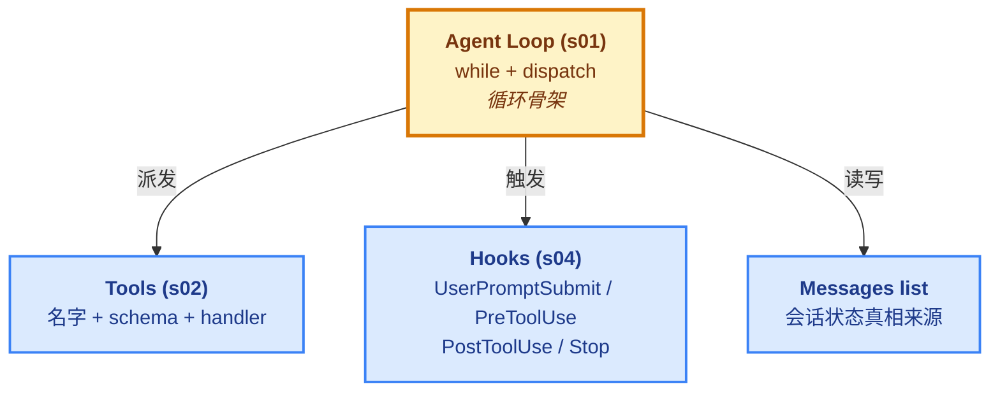

# Claude Code --- 一个 Agent Harness 的解剖

这一文件夹的笔记**只关注一个特定实现**：Anthropic 官方 CLI **Claude Code** 的开源复刻教程 [shareAI-lab/learn-claude-code](https://github.com/shareAI-lab/learn-claude-code)。每一个 phase 都按"原教程顺序"展开，逐课讲解**它每一课加的是什么、为什么加、这是什么机制、原本的 Claude Code 是怎么做的**。

> [!info] 2026-06 重构版
> Phase 1-6 的笔记结构已统一为 12 节固定骨架（重点关注 / 加了什么 / 演进与动机 / 核心抽象 / 架构图 / 代码骨架总览 / Q&A 等），更简洁、更易跨篇对比。
>
> 旧版（`v2` 合并前）保留在 git 历史里，需要时可用 `git log` 回溯。

## 源码（submodule）

笔记引用的源码已作为 git submodule 内嵌在仓库里：

```
Agent/Harness/Learn-Claude-Code/
└── learn-claude-code-src/         ← learn-claude-code 源码（submodule）
    ├── s01_agent_loop/             ← 每节一个目录
    │   ├── code.py                 ← 教学实现
    │   └── README.md               ← 原作者讲解
    ├── s02_tool_use/
    └── ... (s03-s20)
```

**首次 clone 后初始化**：

```bash
git submodule update --init --recursive
```

或重新 clone 时带 `--recursive`：

```bash
git clone --recursive <repo-url>
```

**更新到上游最新**：

```bash
git submodule update --remote Agent/Harness/Learn-Claude-Code/learn-claude-code-src
```

数据文件的实际样例看 [`数据样例/`](数据样例/) —— 那里有 TodoWrite / Memory / System Prompt / Task / Cron / MCP / RecoveryState 等数据长什么样的完整说明。

> [!tip] 学完这 6 个 Phase 之后看哪里？
> **下一步：[`../Claw-Theory/`](../Claw-Theory/)** —— 从 Phase 7 起切到 [shareAI-lab/claw0](https://github.com/shareAI-lab/claw0)，学产品级常驻 Agent 的架构（多通道 / 路由 / 心跳 / 投递 / 重试 / 并发）。骨架不变（[[01 - Agent Loop]] 的循环），扩展方向是"把 Agent 从 CLI 跑成生产服务"。

## 这套笔记的主线

一个 LLM Agent 长成什么样，主要由四个接口决定：



**所有后续扩展（Phase 2 - 6）都是往这四个接口上挂东西**：

- 加工具 → 进 TOOLS / TOOL_HANDLERS
- 加扩展点 → 进 HOOKS
- 加上下文处理 → 操作 messages
- 加新行为 → 组合上面三个

循环骨架本身**从 s01 到 s20 基本不变**。这是这套教程最想传达的工程经验。

## Phase 划分

| Phase | 课程 | 主题 | 核心问题 | 状态 |
|---|---|---|---|---|
| Phase 1 | s01 - s04 | 基础机制 | 最小骨架长什么样？ | done |
| Phase 2 | s05, s06, s08 | 上下文治理 | 怎么跑长任务不爆？ | done |
| Phase 3 | s09 - s11 | 长期记忆与系统提示 | 怎么跨会话连续？ | done |
| Phase 4 | s12 - s14 | 长时间任务 | 怎么跑后台/定时任务？ | done |
| Phase 5 | s15 - s18 | 多智能体 | 怎么让多个 Agent 协作？ | done |
| Phase 6 | s07, s19, s20 | 生态与整合 | 怎么接入外部世界？ | done |

## 阅读顺序

**强烈建议按 Phase 顺序读**。每个 Phase 都建立在前一个之上：

1. **Phase 1** 先读 `00 - 综合总结.md`，再按编号顺序读各课。
2. **Phase 2** 同样先读 `00 - 综合总结.md`，理解三课为什么放一起。
3. **对话精华 QA** 是学习过程的卡点记录，遇到具体疑问时翻。

## 每篇笔记的固定结构

v2 分支起，每篇笔记统一为以下 12 节固定骨架（按阅读顺序）：

```
---
type: concept                    ← Obsidian frontmatter
status: seed
series: learn-claude-code
created / updated
---
# 课题名

> [!note]                        ← 一段话讲"它是什么、解决什么问题"

## 这节重点关注                  ← TL;DR：5 个核心问题 + 锚链接 + 略读指引
## 这一步加了什么                ← 组件表格（| 新增 | 作用 | 重点? |）
## 演进与动机                    ← 反例 + 解法核心（合并旧"为什么+机制"）
## 核心抽象                      ← dataclass / ABC / 关键契约
## 整体架构图                    ← mermaid（classDef 五色批量赋色）
## <本节特有机制章节>             ← 1-3 节，按课题展开（状态机 / 并发模型 / 协议）
## 原本的 Claude Code 怎么做的    ← 产品化形态对照
## 设计要点                       ← 工程经验
## 相关概念                       ← Obsidian 双链
> [!warning]                     ← 易踩坑
## 代码骨架总览                  ← 50-100 行精简 Python（分块注释）
## Q&A                           ← 本节学习卡点
```

**设计原则**：
- 每节只回答一个核心问题（表格先扫概览，文字再深入）
- 代码骨架总览放在最后，读到那自然就懂——前面先建立心智模型
- mermaid 图全部按 [`mermaid-style` skill](https://github.com/PyrePuin/From-Zero-LLM-Agent-Infra-Notes) 规范化（classDef 五色 + 批量赋色）
- `00 - 综合总结.md` 不套此模板——它是 Phase 级别的导览，不是单课笔记

## 取舍声明

这套笔记**不是**：

- 不是 API 文档翻译（看 [Anthropic 官方文档](https://docs.anthropic.com/) 更准）。
- 不是逐行源码注释（看原仓库代码更直接）。
- 不教你如何安装、运行（[原仓库 README](https://github.com/shareAI-lab/learn-claude-code) 已经写得很清楚）。

它是**一份心智模型笔记**。读完之后，你应该能在脑子里画出 Claude Code 的结构图，并能解释每一块为什么必须存在。
