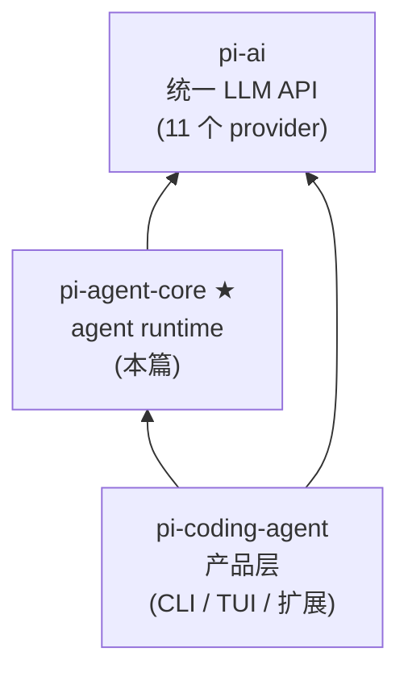
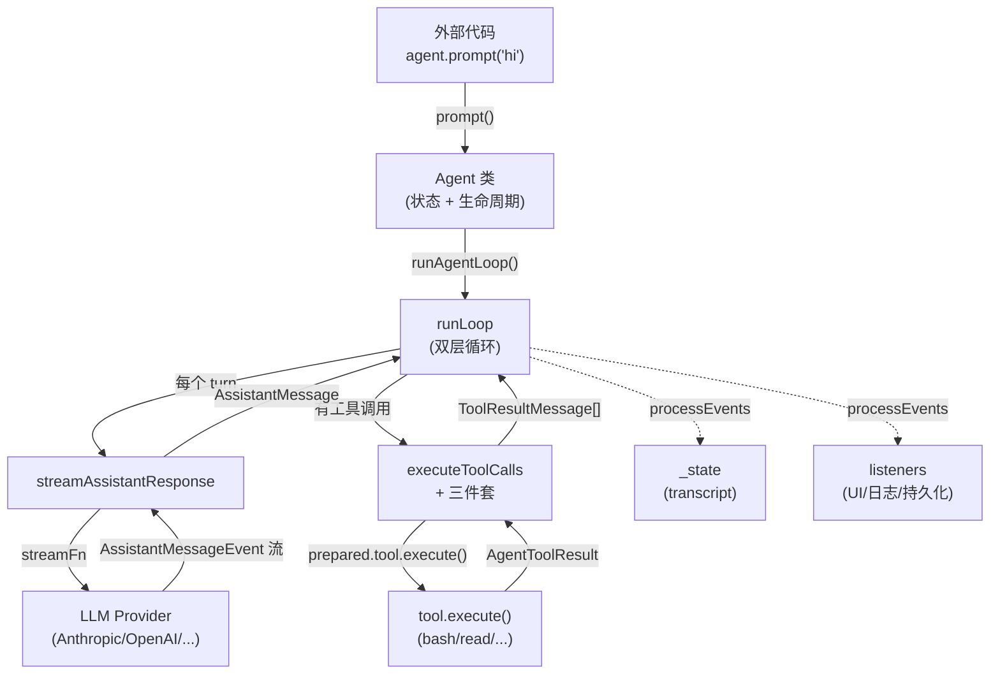
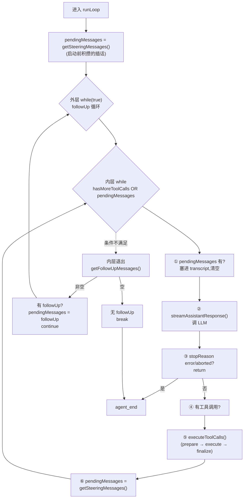

# 01 - pi-agent-core

> [!note]
> 本篇是 Phase 8 第一篇，对应 `packages/agent`（npm 名 `@mariozechner/pi-agent-core`）。
> 完整源码只有 1,859 行（4 个 .ts 文件），却是整个 pi-mono 的"运行心脏"。
> 学完 [[04 - Channels]] ~ [[10 - Concurrency]]（claw0 抽象层）之后，这是第一个**真实产品级实现**——
> 你会看到 claw0 笔记里讲的所有抽象（主循环 / steering / 工具调度 / 状态管理）怎么落到 TypeScript 代码里。

## 重点关注

读完这一篇，你应该能回答：

- pi-agent-core 在 pi-mono 三层架构里担什么角色？
- Agent 类持有什么状态？外部怎么用？
- 一个 prompt 进来后，数据怎么流到 LLM，事件怎么流回 UI？
- 双层 while 循环各自管什么？
- 工具执行的"三件套管道"是什么？为什么这么拆？
- 为什么 pi-mono 的代码看起来这么"碎拆"？设计哲学是什么？

---

## 1. 整体流程

### 1.1 pi-mono 三层架构（先定位）

pi-mono 是 monorepo，三个核心包构成自底向上的依赖链：



一句话定位：

| 包 | 解决什么问题 |
|---|---|
| pi-ai | "怎么对接模型"——把 11 家 provider 收敛成统一接口 |
| **pi-agent-core** | "怎么跑 agent"——把 LLM 调用变成可循环、可订阅、可中断的 runtime |
| pi-coding-agent | "怎么变成产品"——CLI / TUI / 扩展 / 会话持久化 |

### 1.2 agent package 4 个文件

```
packages/agent/src/
├── index.ts          8 行     导出
├── types.ts          341 行   类型契约(运行时消失)
├── agent.ts          539 行   Agent 类(状态管理 + 生命周期)
├── agent-loop.ts     631 行   核心循环 + 工具执行
└── proxy.ts          340 行   proxy 工具(可选,本篇跳过)
```

**职责拆分**：

| 文件 | 类比 |
|---|---|
| types.ts | 项目术语表 / 合同模板（声明，不实现） |
| agent.ts | 建筑工头（登记、看着、收尾，不搬砖） |
| agent-loop.ts | 搬砖工人（循环跑 LLM 调用 + 工具） |

> [!important]
> **agent.ts 里没有循环**！很多人在 agent.ts 里找 `while` 找不到，是因为循环被分到了 agent-loop.ts。这是 pi-mono 的职责拆分——状态归 Agent，循环归 loop。

### 1.3 一个 prompt 的端到端流程

```
外部代码
  │  agent.prompt("hello")
  ▼
Agent.prompt()                        ─── agent.ts L309
  │  ① 检查 activeRun (并发控制)
  │  ② 归一化输入 (string → AgentMessage[])
  ▼
Agent.runPromptMessages()             ─── agent.ts L371
  │  ① createContextSnapshot()  → AgentContext
  │  ② createLoopConfig()       → AgentLoopConfig
  │  ③ 套 runWithLifecycle()    → try/catch/finally
  ▼
runAgentLoop(prompts, ctx, cfg, ...)  ─── agent-loop.ts L95
  │  ① 发 agent_start / turn_start 事件
  │  ② 把 prompts 塞进 context
  ▼
runLoop(ctx, newMsgs, cfg, ...)       ─── agent-loop.ts L155 ★
  │
  │  ┌─── 外层 while(true) ──────────────────┐
  │  │                                       │
  │  │  ┌── 内层 while(tool\|pending) ──┐    │
  │  │  │  ① 处理 pendingMessages     │    │
  │  │  │  ② streamAssistantResponse  │    │ ←── 调 LLM
  │  │  │  ③ executeToolCalls         │    │ ←── 调工具
  │  │  │  ④ 取下一批 steering         │    │
  │  │  └─────────────────────────────┘    │
  │  │                                       │
  │  │  ⑤ 取 followUp,有则 continue        │
  │  └───────────────────────────────────────┘
  │
  │  发 agent_end 事件
  ▼
事件回流到 Agent._state + listeners
```

---

## 2. 模块划分

### 2.1 types.ts（341 行）—— 概念字典

**纯类型声明**，运行时全部消失。定义 agent runtime 的 8 个核心概念：

| 概念 | 类别 | 作用 |
|---|---|---|
| `StreamFn` | 底层协议 | LLM 调用函数签名（不绑 provider）|
| `ToolExecutionMode` | 配置 | `"sequential" \| "parallel"` |
| `ThinkingLevel` | 配置 | `"off" \| "minimal" \| ... \| "xhigh"` |
| `AgentLoopConfig` | 配置 | **核心**：model + 8 个钩子 |
| `AgentMessage` | 消息 | LLM 标准消息 + 自定义消息联合 |
| `CustomAgentMessages` | 消息 | 扩展点（declaration merging）|
| `AgentTool` | 工具 | 工具定义（label + schema + execute + onUpdate）|
| `AgentToolCall` | 工具 | assistant 消息里"调工具"那一段 |
| `AgentToolResult<T>` | 工具 | `{content, details}` |
| `Before/AfterToolCallContext/Result` | 钩子 | 工具执行前后拦截器的入参和返回值 |
| `AgentState` | 状态 | 9 个字段：systemPrompt/model/thinkingLevel/tools/messages/isStreaming/streamingMessage/pendingToolCalls/errorMessage |
| `AgentContext` | 上下文 | 3 字段：systemPrompt/messages/tools（启动时拍快照）|
| `AgentEvent` | 事件 | 10 种事件联合（agent/turn/message/tool_execution 各 start/update/end）|

### 2.2 agent.ts（539 行）—— Agent 类

**结构地图**：

```
L1-149    顶部准备
   ├─ imports
   ├─ defaultConvertToLlm (默认消息转换)
   ├─ EMPTY_USAGE / DEFAULT_MODEL (常量)
   ├─ MutableAgentState + 工厂
   ├─ AgentOptions (构造参数)
   ├─ PendingMessageQueue (内部工具类)
   └─ ActiveRun (内部类型)

L151-539  class Agent
   ├─ ① 字段声明 (L158-186)  ── 17 个字段
   ├─ ② constructor (L188-204)
   ├─ ③ 公开 API (L206-307)  ── prompt/continue/steer/followUp/abort/...
   ├─ ④ 输入归一化 (L352-369) ── normalizePromptInput
   ├─ ⑤ 内部编排 (L371-432)  ── 翻译 Agent 字段 → loop 入参
   ├─ ⑥ 生命周期 (L434-482)  ── try/catch/finally 包裹
   └─ ⑦ 事件分发 (L491-538)  ── processEvents
```

**Agent 类的 17 个字段**（按功能分 4 类）：

| 类别 | 字段 |
|---|---|
| 状态 | `_state`, `activeRun?` |
| 通信 | `listeners`, `steeringQueue`, `followUpQueue` |
| LLM 配置 | `streamFn`, `convertToLlm`, `transformContext?`, `getApiKey?`, `transport`, `thinkingBudgets?`, `maxRetryDelayMs?`, `sessionId?` |
| 钩子 | `onPayload?`, `beforeToolCall?`, `afterToolCall?`, `toolExecution` |

### 2.3 agent-loop.ts（631 行）—— 真正的循环

**导出 4 个公开函数**：

```
agentLoop (L31)              ── 流式风格包装(Agent 类不用)
agentLoopContinue (L64)      ── 同上(continue 版)
runAgentLoop (L95) ★         ── Agent 类用的入口
runAgentLoopContinue (L120)  ── 同上(continue 版)
```

**内部辅助函数**：

```
createAgentStream (L145)        ── 创建事件流
runLoop (L155) ★★★              ── 真正的双层循环
streamAssistantResponse (L238)  ── 调 LLM + 流式事件分发
executeToolCalls (L336)         ── 工具执行入口分发
executeToolCallsSequential (L350)
executeToolCallsParallel (L390)
prepareToolCall (L472) ★       ── 找工具+校验+beforeToolCall
executePreparedToolCall (L524) ★── 调 tool.execute()
finalizeExecutedToolCall (L561)★── afterToolCall+发 end
emitToolCallOutcome (L604)     ── 发 end + 构造 ToolResultMessage
createErrorToolResult (L597)   ── 错误结果工厂
prepareToolCallArguments (L458)── 参数预处理
```

---

## 3. 整体信息流

### 3.1 数据流向（一张图说完）



### 3.2 数据的"双向性"

**正向（控制流）**：用户 prompt → Agent → loop → LLM/工具
**反向（事件流）**：LLM/工具 → loop → processEvents → 状态变化 + listeners

`processEvents`（agent.ts L491-538）是双向枢纽：

```
入:AgentEvent (10 种之一)
   │
   ├─→ 改 _state (push message、维护 pendingToolCalls 等)
   │
   └─→ 按订阅顺序 await listener(event, signal) 转发
```

> [!important]
> **关键设计**：UI / 日志 / 持久化只需要 subscribe 事件，**完全不用直接读 _state**。
> 这就是为什么 agent.ts 里看不到"渲染逻辑"——渲染是 listener 的事。

---

## 4. 模块内的信息流

### 4.1 types.ts —— 没有信息流（纯类型）

types.ts 的"信息"是**静态的契约**，不存在运行时数据流。它的价值是：

1. **概念字典**：定义 agent runtime 有哪些抽象
2. **契约**：实现者必须遵守，使用者可以信任
3. **解耦**：agent.ts 和 agent-loop.ts 都依赖 types.ts（中立第三方），避免循环依赖
4. **API 文档**：消费者读这一份就知道怎么用

### 4.2 agent.ts 内部数据流

```
公开 API (prompt/continue/steer/...)
   │
   ▼
内部编排 (runPromptMessages / runContinuation)
   │
   ├─ createContextSnapshot()  ──→ AgentContext (slice 复制)
   ├─ createLoopConfig()       ──→ AgentLoopConfig (打包钩子)
   │       │
   │       └─ 把 steeringQueue/followUpQueue 通过闭包钩子接到 loop
   │
   ▼
生命周期 (runWithLifecycle)
   │
   │  try { runAgentLoop(...) }
   │  catch { handleRunFailure() ── 合成 error 消息塞 transcript }
   │  finally { finishRun() ── 清状态、resolve promise }
   │
   ▼
runAgentLoop (在 agent-loop.ts)
   │
   │  事件回流
   │
   ▼
processEvents (双向枢纽)
   │
   ├─→ 改 _state
   └─→ 转发给 listeners
```

### 4.3 agent-loop.ts 内部数据流（双层循环）



**核心变量**：

- `pendingMessages: AgentMessage[]` —— 临时缓冲，存放"下次调 LLM 前要注入的消息"
  - 来源 1：`getSteeringMessages()` 钩子（每轮 turn 末尾）
  - 来源 2：`getFollowUpMessages()` 钩子（内层退出后）
  - 处理方式：塞进 transcript → 清空
- `hasMoreToolCalls: boolean` —— 当前 assistant 消息是否有工具调用
- `firstTurn: boolean` —— 是否首轮（避免重复发 turn_start）

---

## 5. 核心参数

### 5.1 AgentLoopConfig（最核心，8 个钩子）

```ts
interface AgentLoopConfig extends SimpleStreamOptions {
    model: Model<any>;                                    // ★ 必填
    convertToLlm: (messages: AgentMessage[]) => Message[];  // ★ 必填
    transformContext?: (...) => Promise<AgentMessage[]>;  // 上下文预处理(压缩/注入)
    getApiKey?: (provider) => string | undefined;         // 动态取 key
    getSteeringMessages?: () => Promise<AgentMessage[]>;  // ★ 插话钩子
    getFollowUpMessages?: () => Promise<AgentMessage[]>;  // ★ 续话钩子
    toolExecution?: "sequential" | "parallel";            // 工具执行模式
    beforeToolCall?: (...) => {block?: bool} | undefined; // ★ 权限拦截
    afterToolCall?: (...) => {content?/details?/isError?};  // ★ 结果脱敏
}
```

**8 个钩子的注入点**：

| 钩子 | 调用位置 | 用途 |
|---|---|---|
| `transformContext` | streamAssistantResponse 开头 | 压缩 / 注入外部信息（实现 _auto_recall 的扩展点）|
| `convertToLlm` | streamAssistantResponse 中段 | AgentMessage → Message（**LLM 调用边界**）|
| `getApiKey` | streamAssistantResponse 中段 | 每次调用前重新取（处理短期 OAuth token）|
| `getSteeringMessages` | runLoop 启动时 + 每个 turn 末尾 | "插话"队列 |
| `getFollowUpMessages` | runLoop 内层退出后 | "续话"队列 |
| `beforeToolCall` | prepareToolCall 末尾 | **权限拦截**，返回 `{block: true}` 阻止 |
| `afterToolCall` | finalizeExecutedToolCall 开头 | **结果脱敏/覆盖** |
| `onPayload` | streamFn 内部（pi-ai 层）| 发请求前看完整 payload（日志/调试）|

### 5.2 AgentContext（3 字段，启动时拍快照）

```ts
interface AgentContext {
    systemPrompt: string;        // 系统提示词
    messages: AgentMessage[];    // 对话历史(快照副本)
    tools?: AgentTool<any>[];    // 工具列表(快照副本)
}
```

**为什么叫 snapshot**？看 `createContextSnapshot`（agent.ts L399-405）：

```ts
return {
    systemPrompt: this._state.systemPrompt,
    messages: this._state.messages.slice(),  // ★ 复制
    tools: this._state.tools.slice(),         // ★ 复制
};
```

`slice()` 防御性复制——loop 拿到的是"启动那一刻的快照"，外部修改 `_state` 不会污染正在跑的 loop。

### 5.3 AgentState（9 字段，跨循环持久状态）

```ts
interface AgentState {
    systemPrompt: string;                  // 系统提示
    model: Model<any>;                     // 当前模型
    thinkingLevel: ThinkingLevel;          // 思考级别
    tools: AgentTool<any>[];               // 工具集
    messages: AgentMessage[];              // transcript
    readonly isStreaming: boolean;         // 是否正在跑
    readonly streamingMessage?: AgentMessage;  // 当前流式响应
    readonly pendingToolCalls: Set<string>;  // 正在执行的工具 id
    readonly errorMessage?: string;        // 最近一次错误
}
```

**AgentContext vs AgentState 区别**：

| | AgentState | AgentContext |
|---|---|---|
| 范围 | 完整状态（含 isStreaming 等运行时字段）| 只发给 LLM 的部分（3 字段） |
| 谁用 | 外部 + UI + 持久化 | loop 内部调 LLM 时用 |
| 持续性 | 持续维护 | 每次启动 loop 时拍快照 |

**心法**：AgentContext = AgentState 里"**LLM 需要知道**"那部分的快照。errorMessage / isStreaming 这些 LLM 不用知道，所以不在 Context 里。

### 5.4 AgentEvent（10 种事件）

```ts
type AgentEvent =
    // Agent 整轮
    | { type: "agent_start" }
    | { type: "agent_end"; messages: AgentMessage[] }
    // Turn(一轮 assistant + 工具执行)
    | { type: "turn_start" }
    | { type: "turn_end"; message: AgentMessage; toolResults: ToolResultMessage[] }
    // 消息(user/assistant/toolResult 都会发)
    | { type: "message_start"; message: AgentMessage }
    | { type: "message_update"; message: AgentMessage; assistantMessageEvent: AssistantMessageEvent }
    | { type: "message_end"; message: AgentMessage }
    // 工具执行
    | { type: "tool_execution_start"; toolCallId; toolName; args }
    | { type: "tool_execution_update"; toolCallId; toolName; args; partialResult }
    | { type: "tool_execution_end"; toolCallId; toolName; result; isError };
```

**事件层级**：

```
agent_start
  └─ turn_start
       ├─ message_start (user/assistant/toolResult)
       ├─ message_update * N (仅 assistant 流式)
       ├─ message_end
       └─ (如有工具)
            ├─ tool_execution_start
            ├─ tool_execution_update * N (可选,工具流式吐进度)
            └─ tool_execution_end
  └─ turn_end
agent_end
```

---

## 6. 工程上的实际行为与考量

### 6.1 为什么 types.ts 单独存在

| 理由 | 说明 |
|---|---|
| **避免循环依赖** | agent.ts ↔ agent-loop.ts 都需要共享类型，types.ts 是中立第三方 |
| **API 契约** | types.ts 是 package 对外的承诺，实现可变，类型不变 |
| **实现文件保持干净** | 类型塞进 agent.ts 会让 539 行变 840+ 行混杂 |
| **消费者不需要看实现** | `import type { AgentMessage } from "..."` 编译时消失 |
| **跨语言惯例** | C/C++ 的 .h、Java 的 interface、Rust 的 trait、Go 的 interface |

### 6.2 为什么用 union type 替代 try/catch

prepareToolCall 返回 union 类型（不是抛异常）：

```ts
type PreparedToolCall = { kind: "prepared"; ... };
type ImmediateToolCallOutcome = { kind: "immediate"; result; isError };

async function prepareToolCall(...): Promise<PreparedToolCall | ImmediateToolCallOutcome>
```

**为什么**：错误也是数据。调用方分支处理即可，不用层层 try/catch。这是函数式编程风格（Result/Either 类型）。

**适用场景**：
- 错误是**业务流程的一部分**（不是真正的异常）
- 错误有**多种可预期的种类**
- 调用方需要**根据错误类型做不同处理**

### 6.3 为什么用 slice 防御性复制

```ts
// createContextSnapshot (L399)
messages: this._state.messages.slice(),
tools: this._state.tools.slice(),
```

**为什么**：JS 数组是引用类型。如果不 slice：

```ts
const ctx = createContextSnapshot();
// ctx.messages === this._state.messages  (同一个引用!)

// loop 在跑时,外部代码改了 _state
this._state.messages.push(newMessage);
// ctx.messages 也变了!loop 看到的是"被污染"的快照
```

**复制后**：loop 拿到的是"启动那一刻的快照"——外部怎么改都不影响 loop。这是并发安全的经典做法。

### 6.4 为什么 prepare/execute/finalize 拆三步

| 拆分理由 | 说明 |
|---|---|
| **钩子注入点清晰** | beforeToolCall 在 prepare 末尾，afterToolCall 在 finalize 开头 |
| **错误也是数据** | union 类型 kind 字段，不抛异常 |
| **可独立测试** | 每段都能 mock |
| **并发友好** | parallel 模式只需 prepare 串行 + execute 并发 |

### 6.5 为什么 sequential/parallel 共用三件套

它们只是"调度方式不同"，"单个工具怎么执行"是完全一样的。

```
                  Sequential            Parallel
                  ─────────             ────────
prepare           串行                  串行(可能有副作用,不能并发)
execute           串行                  ★ 并发(用 Promise.all)
finalize          串行                  串行(可能有副作用)
```

**为什么 prepare 和 finalize 必须串行**：beforeToolCall / afterToolCall 钩子可能有副作用（修改 context），并发会乱。

**为什么 execute 可以并发**：tool.execute() 通常是独立的（读文件、调 API），互不影响。

### 6.6 错误也是数据 + 事件流永远完整

`handleRunFailure`（agent.ts L459）的设计：

```ts
private async handleRunFailure(error, aborted) {
    const failureMessage = {
        role: "assistant",
        content: [{ type: "text", text: "" }],
        stopReason: aborted ? "aborted" : "error",
        errorMessage: error.message,
        ...
    };
    this._state.messages.push(failureMessage);
    await this.processEvents({ type: "agent_end", messages: [failureMessage] });
}
```

**关键**：出错时**不抛异常给调用方**，而是合成一条 `stopReason: "error"` 的 assistant 消息塞进 transcript。

**为什么**：消费者（UI、持久化）看到的事件流**永远完整**——成功是 `agent_end` 带 assistant 消息，失败也是 `agent_end` 带 assistant 消息（只是 stopReason 不同）。订阅者不用写 try/catch，只看事件就够了。

### 6.7 fire-and-forget：`void` 操作符

```ts
// agentLoop (L40)
void runAgentLoop(...).then((messages) => {
    stream.end(messages);
});

return stream;
```

`void expr` 的含义：**执行 expr，但丢弃返回值**。

**为什么**：`agentLoop` 函数**立刻返回 stream**，loop 在后台跑。如果直接 `return runAgentLoop(...)` 函数就变成 async 了，破坏了"立刻返回 stream"的设计。

`void` 明确告诉 TS 编译器："我故意不等，让它后台跑"——避免 "floating promise" 警告。

### 6.8 AgentMessage → Message 的边界

整个 agent-loop 全程用 `AgentMessage`，**只在调 LLM 的最后一刻**通过 `convertToLlm` 转成标准 `Message[]`：

```ts
// streamAssistantResponse (L252)
const llmMessages = await config.convertToLlm(messages);
```

**为什么**：transcript 可以混入 UI-only 消息（如 artifact、notification），LLM 只看到它能理解的 3 种角色（user / assistant / toolResult）。

**好处**：
- UI 可以记录"用户点击了什么按钮"这种非 LLM 消息
- 持久化可以保存"系统通知"这种应用层消息
- LLM 只看 LLM 该看的，不被噪音干扰

### 6.9 partialMessage + push 占位 + replace 策略

streamAssistantResponse 消费 LLM 事件流时：

```ts
case "start":
    context.messages.push(partialMessage);                    // ★ push 占位
case "text_*":
    context.messages[length - 1] = partialMessage;            // ★ replace 最后一条
case "done":
    context.messages[length - 1] = finalMessage;              // ★ replace 为 final
```

**为什么 push 占位 + replace**：外部订阅者从头到尾看到的 messages 数组**长度一致**——只是最后一条在不断更新。UI 渲染时不需要"插入新条"再"删除"再"插入"，只需要"更新最后一条"。

### 6.10 闭包技巧：skipInitialSteeringPoll

```ts
private createLoopConfig(options): AgentLoopConfig {
    let skipInitialSteeringPoll = options.skipInitialSteeringPoll === true;
    return {
        // ...
        getSteeringMessages: async () => {
            if (skipInitialSteeringPoll) {
                skipInitialSteeringPoll = false;  // ★ 只跳过第一次
                return [];
            }
            return this.steeringQueue.drain();
        },
        // ...
    };
}
```

**问题场景**：`continue()` 处理 steering 消息时（agent.ts L336），已经把消息作为 messages 参数塞给 runPromptMessages 了。如果 loop 第一次跑就调 `getSteeringMessages()`，会又 drain 一次队列——可能 drain 出新消息造成逻辑混乱。

**解决**：用闭包变量让钩子"记住被调用了几次"——第一次返回空，之后正常 drain。这是 JS 闭包的典型用法。

---

## 7. 函数调用关系（代码细节）

> [!note]
> 这一节是"代码骨架"层级，前面 1-6 节是"抽象层级"。
> 读源码时遇到不懂的小函数回来查这里就行，不用记。

### 7.1 agent.ts 调用图

```
┌──────────────────────────────────────────────────────────┐
│ 公开 API (L206-307)                                       │
│   prompt() / continue() / steer() / followUp()            │
│   abort() / waitForIdle() / reset() / subscribe()         │
└────────────────────────┬─────────────────────────────────┘
                         │
                         ▼
┌──────────────────────────────────────────────────────────┐
│ 输入归一化 (L352-369)                                     │
│   normalizePromptInput()                                  │
│   └─ string|message|message[] → AgentMessage[]            │
└────────────────────────┬─────────────────────────────────┘
                         │
                         ▼
┌──────────────────────────────────────────────────────────┐
│ 内部编排 (L371-432)  ── "翻译层"                          │
│   runPromptMessages()       L371                          │
│   runContinuation()         L387                          │
│      └─ createContextSnapshot()  L399                     │
│         └─ {systemPrompt, messages[copy], tools[copy]}    │
│      └─ createLoopConfig()       L407                     │
│         └─ 把字段+队列打包成 AgentLoopConfig               │
│      └─ 套 runWithLifecycle()    L434                     │
└────────────────────────┬─────────────────────────────────┘
                         │
                         ▼
┌──────────────────────────────────────────────────────────┐
│ 生命周期 (L434-482)  ── try/catch/finally 包裹器          │
│   runWithLifecycle()                                      │
│      try: executor(signal)  ← executor = runAgentLoop     │
│      catch: handleRunFailure()  L459                      │
│         └─ 合成 error assistant 消息塞 transcript          │
│      finally: finishRun()       L476                      │
│         └─ 清状态、resolve promise                         │
└────────────────────────┬─────────────────────────────────┘
                         │
                         ▼
              runAgentLoop (在 agent-loop.ts)
                         │
                         │ 事件回流
                         ▼
┌──────────────────────────────────────────────────────────┐
│ 事件分发 (L491-538)  ── 双向枢纽                          │
│   processEvents(event)                                    │
│      switch event.type:                                   │
│         case message_start/end/update: 改 _state          │
│         case tool_execution_start/end: 维护 pendingSet    │
│         case agent_end: 清 streamingMessage               │
│      for (listener of listeners):                         │
│         await listener(event, signal)                     │
└──────────────────────────────────────────────────────────┘
```

### 7.2 agent-loop.ts 调用图

```
┌──────────────────────────────────────────────────────────┐
│ 入口层                                                     │
│                                                            │
│   agentLoop (L31)  ── 流式包装                             │
│       │                                                    │
│       └─ void runAgentLoop().then(stream.end)              │
│                                                            │
│   runAgentLoop (L95) ★                                    │
│       ① 发 agent_start / turn_start                       │
│       ② prompts 塞 context                                 │
│       ③ 调 runLoop()                                       │
└────────────────────────┬─────────────────────────────────┘
                         │
                         ▼
┌──────────────────────────────────────────────────────────┐
│ 核心循环 (L155-232)                                        │
│   runLoop()                                                │
│      外层 while(true):                                     │
│         内层 while(hasMoreToolCalls OR pendingMessages):  │
│            ① 处理 pendingMessages(塞 transcript 清空)     │
│            ② streamAssistantResponse()                    │
│            ③ 错误检查 → return                            │
│            ④ executeToolCalls()                           │
│            ⑤ pendingMessages = getSteeringMessages()      │
│         followUp = getFollowUpMessages()                  │
│         有 followUp → 设 pendingMessages + continue       │
│         无 followUp → break                               │
│      发 agent_end                                          │
└────────────────────────┬─────────────────────────────────┘
                         │
              ┌──────────┴──────────┐
              ▼                     ▼
   ┌──────────────────┐   ┌─────────────────────┐
   │ streamAssistant   │   │ executeToolCalls    │
   │ Response (L238)   │   │ (L336)              │
   │                   │   │                     │
   │ ① transformContext│   │ 按 toolExecution     │
   │ ② convertToLlm    │   │ 分发:               │
   │ ③ streamFn()      │   │                     │
   │ ④ for await 事件  │   │  Sequential (L350)  │
   │ ⑤ 改 context.msgs │   │  Parallel   (L390)  │
   │ ⑥ emit events     │   │                     │
   └──────────────────┘   └──────────┬──────────┘
                                     │
                                     ▼
                          ┌──────────────────────┐
                          │ for (toolCall):      │
                          │  emit start          │
                          │  prepareToolCall()   │
                          │  ├ kind immediate →  │
                          │  │  emitToolOutcome  │
                          │  └ kind prepared →  │
                          │     executePrepared  │
                          │     finalizeExecuted │
                          │       └ emitOutcome │
                          └──────────────────────┘
```

### 7.3 三件套详解

#### prepareToolCall（L472）—— "能不能执行？"

**签名**：
```ts
async function prepareToolCall(
    currentContext: AgentContext,           // 找工具用 (.tools)
    assistantMessage: AssistantMessage,     // 含这次工具调用的来源
    toolCall: AgentToolCall,                // {id, name, arguments}
    config: AgentLoopConfig,                // 读 beforeToolCall 钩子
    signal: AbortSignal | undefined,
): Promise<PreparedToolCall | ImmediateToolCallOutcome>
```

**4 步流程**：

1. `tools.find(t => t.name === toolCall.name)`
   - 没找到 → immediate 错误
2. `prepareToolCallArguments(tool, toolCall)` 调 `tool.prepareArguments`
   - 抛错 → immediate 错误
3. `validateToolArguments(tool, preparedToolCall)` pi-ai 的 schema 校验
   - 失败 → immediate 错误
4. `config.beforeToolCall?(ctx, signal)`
   - 返回 `{block: true}` → immediate 错误
5. 全通过 → `{kind: "prepared", toolCall, tool, args}`

#### executePreparedToolCall（L524）—— "执行！"

**签名**：
```ts
async function executePreparedToolCall(
    prepared: PreparedToolCall,    // 来自 prepareToolCall
    signal: AbortSignal | undefined,
    emit: AgentEventSink,
): Promise<ExecutedToolCallOutcome>  // {result, isError}
```

**核心代码**（就一行关键调用）：
```ts
const result = await prepared.tool.execute(
    prepared.toolCall.id,        // 工具调用 id
    prepared.args as never,      // 校验过的参数
    signal,                      // 中断信号
    onUpdate,                    // 流式更新回调
);
```

**onUpdate 回调**：工具可以中途报告进度，emit `tool_execution_update` 事件。

**try/catch**：抛错 → 返回 `{isError: true, result: 错误消息}`。

#### finalizeExecutedToolCall（L561）—— "执行完之后。"

**签名**：
```ts
async function finalizeExecutedToolCall(
    currentContext: AgentContext,
    assistantMessage: AssistantMessage,
    prepared: PreparedToolCall,
    executed: ExecutedToolCallOutcome,    // 来自 execute
    config: AgentLoopConfig,              // 读 afterToolCall 钩子
    signal: AbortSignal | undefined,
    emit: AgentEventSink,
): Promise<ToolResultMessage>
```

**3 步流程**：

1. `result = executed.result`
2. `config.afterToolCall?(ctx, signal)` 钩子
   - 返回 `{content?, details?, isError?}` → 部分覆盖原 result（`??` 操作符，只覆盖提供的字段）
3. `emitToolCallOutcome(toolCall, result, isError, emit)`

#### emitToolCallOutcome（L604）—— 发射器

```ts
async function emitToolCallOutcome(toolCall, result, isError, emit) {
    // ① 发 tool_execution_end 事件
    await emit({ type: "tool_execution_end", ... });

    // ② 构造 ToolResultMessage(role: "toolResult")
    const toolResultMessage = { role: "toolResult", toolCallId, toolName, content, details, isError, timestamp };

    // ③ 把它也当成"一条消息"发 message_start/end
    await emit({ type: "message_start", message: toolResultMessage });
    await emit({ type: "message_end", message: toolResultMessage });

    return toolResultMessage;
}
```

**关键**：工具结果也是一种"消息"——所以也走 message_start/end。UI 看到统一的"消息流"。

### 7.4 一个完整 turn 的 12 步（read 工具示例）

```
1. emit tool_execution_start { toolName: "read", args: {path: "/foo.txt"} }

─── prepareToolCall ───
2. tools.find("read") → 找到 readTool
3. prepareToolCallArguments(readTool, toolCall) → 参数预处理
4. validateToolArguments → schema 校验
5. config.beforeToolCall?(ctx) → 返回 undefined(不 block)
6. 返回 {kind: "prepared", ...}

─── executePreparedToolCall ───
7. readTool.execute("call_xxx", {path: "/foo.txt"}, signal, onUpdate)
   └─ onUpdate 可能多次:
      emit tool_execution_update { partialResult }
8. tool.execute 返回 {content: [{text: "hello"}], details: {size: 5}}
9. await Promise.all(updateEvents)
10. 返回 {result, isError: false}

─── finalizeExecutedToolCall ───
11. config.afterToolCall?(ctx) → 返回 undefined(不覆盖)
12. emitToolCallOutcome:
    ├─ emit tool_execution_end
    ├─ 构造 ToolResultMessage
    ├─ emit message_start(toolResult)
    └─ emit message_end(toolResult)
```

---

## 8. Q&A 整理

> [!note]
> 本节是学习过程中真实提出的问题，按主题分类整理。带 ⭐ 的是关键概念题。

### 8.1 TypeScript 基础

**Q1：types.ts 里全是 interface 和 type，没有实现逻辑？这是为什么？**

A：这就是 TS interface 的本质——**纯声明，运行时全部消失**。它定义"概念字典"和"契约"：
- 概念字典：声明 agent runtime 有哪些抽象
- 契约：实现者必须遵守，使用者可以信任

类比：C/C++ 的 .h 头文件、Java 的 interface、Rust 的 trait、JS 的 JSDoc @typedef。但 TS 把 JSDoc 升级成**编译器强制的契约**——写错字段名编译器直接报错。

**Q2：为什么要有 types.ts 这样一个单独文件？**

A：5 个工程理由：

1. **避免循环依赖**：agent.ts 和 agent-loop.ts 都需要共享类型，types.ts 是中立第三方
2. **API 契约**：types.ts 是 package 对外的承诺，实现可变，类型不变
3. **实现文件保持干净**：类型塞进 agent.ts 会让 539 行变 840+ 行混杂
4. **消费者不需要看实现**：`import type` 编译时消失
5. **跨语言惯例**：静态类型语言都这么干（C/C++ .h、Java interface、Rust trait）

**Q3：`void runAgentLoop(...).then(...)` 这个语法是什么意思？**

A：`void` 操作符 = **执行表达式，但丢弃返回值**。

`runAgentLoop(...)` 返回 Promise，直接写会被 TS 警告"floating promise"。加 `void` 明确告诉编译器："我故意不等，让它后台跑"——这是"fire-and-forget"模式。

`agentLoop` 函数的设计是**立刻返回 stream**，loop 在后台跑，所以需要 void。

### 8.2 流程理解

**Q4：⭐ continue() 是专门处理两个队列的吗？**

A：**不是**。continue() 是"从当前 transcript 继续"的通用入口。

它只在**最后一条消息是 assistant**时才碰队列（agent.ts L333-347）：
- 先看 steeringQueue，有就跑（带 `skipInitialSteeringPoll: true`）
- 否则看 followUpQueue，有就跑
- 都没有就抛错

队列的**主要消费路径不是 continue()**，而是 loop 内部的钩子（`getSteeringMessages` / `getFollowUpMessages`）。continue() 是手动重启的备用入口。

**Q5：⭐ agent.ts 里为什么看不到循环？**

A：**因为循环不在这里**。这是 pi-mono 的职责拆分：

| 文件 | 职责 |
|---|---|
| agent.ts | 状态管理 + 生命周期（不跑循环）|
| agent-loop.ts | 真正的循环 |

类比：建筑工头（agent.ts）登记、看着、收尾，但不搬砖；搬砖工人（agent-loop.ts）才是循环跑 LLM 调用 + 工具的人。

**Q6：⭐ runLoop 里的 pendingMessages 是什么？**

A：临时缓冲变量，存放"下次调 LLM 前要注入到 transcript 的消息"。

两个来源：
- `getSteeringMessages()` 钩子（每个 turn 末尾，L216）
- `getFollowUpMessages()` 钩子（内层退出后，L220 设进来）

处理方式：每个 turn 开头如果非空，就 push 进 transcript，然后清空 `pendingMessages = []`。

不管来源是 steering 还是 followUp，处理方式完全一样——这就是为什么用一个变量统一两种来源。

**Q7：双层 while 循环各自管什么？**

A：

| 循环 | 控制条件 | 干啥 |
|---|---|---|
| 外层 `while(true)` | `break` when no followUp | agent 准备停了，但 followUpQueue 有消息 → 再跑一轮 |
| 内层 `while(hasMoreToolCalls \|\| pendingMessages.length > 0)` | 两个条件都不满足退出 | 只要有工具要调或有插话，就一直 turn |

**Q8：为什么函数拆得这么碎？**

A：6 个理由：

1. **可测试性**：每个小函数能独立 mock
2. **复用性**：sequential 和 parallel 共用 prepare/execute/finalize
3. **钩子注入点清晰**：beforeToolCall 在 prepare 末尾，afterToolCall 在 finalize 开头
4. **错误也是数据**：union 类型 kind 字段，不抛异常，需要分支处理
5. **TS 类型推导友好**：小函数输入输出类型明确
6. **函数式风格**：作者受 FP 影响

对比：claw0（Python 教学）函数大块写、易读；pi-mono（TS 产品）函数碎拆、易维护。**这是教学代码 vs 产品代码的核心差异**。

### 8.3 字段含义

**Q9：⭐ drain() 是什么？**

A：英文 "drain" = 排空、放干（水池放水那种）。在队列里 = **"一次性取出（全部或一批）+ 清空队列"**，原子操作。

两种 mode：
- `"all"`：取出全部 + 清空（`messages.slice()` + `messages = []`）
- `"one-at-a-time"`：取头部一个 + 移除（`messages.slice(1)` + return first）

跟其他队列操作对比：
- `enqueue` 入队、`dequeue` 取头部一个、`peek` 只看不取、`drain` 批量取+清空、`clear` 清空不返回

**Q10：⭐ AgentContext 是什么形式？举个例子**

A：3 字段简单对象，没嵌套：

```ts
{
    systemPrompt: "你是 PuinClaw...",
    messages: [
        { role: "user", content: [{type:"text", text:"2+2?"}], timestamp: 1700... },
        // ... 历史对话
    ],
    tools: [
        { name: "calculator", label: "计算器", execute: async (...) => {...}, ... },
        { name: "read", label: "读文件", ... },
    ],
}
```

**关键**：叫 snapshot 是因为 `createContextSnapshot` 用了 `slice()` 复制——loop 拿到的是启动那一刻的快照，外部改 `_state` 不影响 loop。

**AgentContext vs AgentState 区别**：
- AgentState：完整状态（含 isStreaming 等运行时字段），跨循环持久
- AgentContext：只发给 LLM 的部分（3 字段），每次启动拍快照

**Q11：⭐ stream / streamFn 是什么？**

A：
- **stream**（流式）：数据一条一条过来，而不是一次性返回。LLM 几乎都用 stream——token-by-token 生成，没必要等完整再返回。
- **streamFn**：stream function，pi-mono 里"调 LLM 拿流式响应"的函数。默认是 pi-ai 的 `streamSimple`。

**streamFn 的核心价值**：不管底层是 Anthropic / OpenAI / Gemini / Kimi，输出格式统一（`AssistantMessageEvent` 流）。agent-loop 只看统一格式，**完全不知道是哪家 provider**。

**底层是 SSE（Server-Sent Events）**——HTTP 长连接，服务器持续推 chunk。Anthropic 用 7 种 event 类型（message_start / content_block_delta / message_stop 等），OpenAI 用扁平 delta（`data: {...}`）。pi-ai 的 providers 解析这些不同格式，输出统一事件。

**Q12：transport 字段干啥？**

A：LLM 流式响应的传输协议，值 `"sse" | "websocket"`。默认 `"sse"`。99% 情况用 SSE（Anthropic / OpenAI 都是），WebSocket 给实时 API（如 OpenAI Realtime）用。

**Q13：onPayload 是什么钩子？**

A：每次发请求给 LLM 前，pi-ai 组装好完整 payload（messages/tools/参数），然后调用这个钩子。用途：日志/调试（看 agent 实际发了什么）、成本监控、缓存分析。

注意：这是 **pi-ai 的钩子**（在 SimpleStreamOptions 里），Agent 透传给 streamFn。

**Q14：listener 和 listeners 的关系？**

A：`listeners` 是 Agent 类的字段（`Set<函数>`），通过 `subscribe()` 注册。每个 listener 签名是 `(event, signal) => void | Promise<void>`。

`subscribe()` 返回 unsubscribe 函数（DOM 的 addEventListener 风格）。

listener 收到所有 10 种 AgentEvent，按订阅顺序调用，返回 Promise 会 await。

### 8.4 工程设计

**Q15：⭐ 为什么用 union type 替代 try/catch？**

A：错误也是数据。prepareToolCall 返回 `PreparedToolCall | ImmediateToolCallOutcome`，调用方分支处理：

```ts
if (preparation.kind === "immediate") {
    // 找不到工具/校验失败/被 block
} else {
    // 正常路径
}
```

**适用场景**：错误是业务流程的一部分（不是真正异常）、错误有多种可预期种类、调用方需要根据错误类型做不同处理。

对比 try/catch：try/catch 适合"真正的异常"（数据库连不上、网络挂了），不适合业务流程错误。

**Q16：为什么错误时不抛异常，要合成 error 消息塞 transcript？**

A：`handleRunFailure` 的设计——让事件流**永远完整**。消费者（UI、持久化）看到的事件流：

- 成功：`agent_end` 带 assistant 消息
- 失败：`agent_end` 带 assistant 消息（只是 `stopReason: "error"`）

订阅者不用写 try/catch，只看事件就够了。这是**事件驱动架构**的核心思想——错误也是事件。

**Q17：为什么 prepare / execute / finalize 拆三步？**

A：4 个理由：

1. **钩子注入点清晰**：beforeToolCall 在 prepare 末尾，afterToolCall 在 finalize 开头
2. **错误也是数据**：union 类型 kind 字段，不抛异常
3. **可独立测试**：每段都能 mock
4. **并发友好**：parallel 模式只需 prepare 串行 + execute 并发

**心法**：钩子在三件套的两端——before 在 prepare 末尾，after 在 finalize 开头。中间的 execute 是"纯执行"，没钩子。

**Q18：sequential 和 parallel 唯一的差别是什么？**

A：execute 阶段是否并发。

- prepare 必须**串行**（beforeToolCall 钩子有副作用）
- finalize 必须**串行**（afterToolCall 钩子有副作用）
- execute 可以**并发**（tool.execute() 通常独立）

parallel 实现技巧：

```ts
// 启动所有 execute Promise,但不 await
const running = runnableCalls.map(p => ({ prepared: p, execution: executePreparedToolCall(...) }));
// 按启动顺序 await(实际是并发跑的)
for (const r of running) {
    const executed = await r.execution;
    finalizeExecutedToolCall(...);
}
```

### 8.5 PuinClaw 应用

**Q19：PuinClaw goal-runner 跟 followUpQueue 的关系？**

A：PuinClaw 当前用循环 `prompt("continue")` 实现长任务（外部控制循环），每次 prompt 都启动新的 runAgentLoop——**启动开销大**。

用 followUp 改写更优雅：

```ts
// 启动时预塞 N 条 continue
for (let i = 0; i < 100; i++) {
    agent.followUp({ role: "user", content: "continue" });
}
await agent.prompt("start goal");
// 一次 runLoop 内部跑完所有 followUp,不用重复启动
```

这就是双层循环 + followUpQueue 的设计价值——**让续话在同一轮 loop 内部处理**。

---

## 9. [!warning] 容易踩的坑

> [!warning]
> 1. **agent.ts 里没有循环**——别在 agent.ts 里找 `while`。循环在 agent-loop.ts 的 `runLoop`。
> 2. **函数名带 s 不带 s**——`executeToolCalls`（带 s）是入口分发；`executeToolCall` 没这个函数。`runAgentLoop` 是入口；`runLoop` 是内部函数。
> 3. **不要并发 prompt**——一个 Agent 实例同一时刻只能跑一轮。想插话用 `steer()`，想续话用 `followUp()`。并发 prompt 会抛 "Agent is already processing"。
> 4. **错误不抛异常**——出错时合成一条 `stopReason: "error"` 的 assistant 消息塞进 transcript。事件流永远完整，不需要 try/catch。
> 5. **AgentContext 是快照**——loop 拿到的是 `slice()` 副本，外部修改 `_state.messages` 不会影响正在跑的 loop。要改 transcript 必须通过事件流。
> 6. **afterToolCall 是部分覆盖**——`{content?, details?, isError?}`，提供的字段才覆盖，没提供的保留原值。**没 deep merge**——content 数组是整体替换。
> 7. **beforeToolCall 阻止工具时，事件流仍然完整**——会发 `tool_execution_end` 事件（isError=true），UI 看到的是统一的工具执行流程。
> 8. **streamFn 默认是 streamSimple**——如果传 mock，必须模拟完整的事件流（start / text_delta / done）。
> 9. **AgentMessage 不是 LLM 消息**——transcript 全程用 AgentMessage，**只在调 LLM 前**通过 `convertToLlm` 转成标准 Message[]。自定义消息类型可能被过滤掉。
> 10. **parallel 模式下 prepare 仍然串行**——别以为 toolExecution: "parallel" 就是全程并发，prepare（含 beforeToolCall 钩子）必须串行。

---

## 10. 相关概念

### 10.1 跟 claw0 笔记的对照

| claw0 抽象 | pi-agent-core 实现 |
|---|---|
| [[03 - Sessions]] 会话状态 | `AgentState.messages` / `AgentState.streamingMessage` / `pendingToolCalls` |
| [[06 - Intelligence]] 主循环入口 | `Agent.prompt()` / `Agent.continue()` |
| [[06]] 主循环 | `runLoop` 双层 while |
| [[06]] LLM 调用 | `streamAssistantResponse` |
| [[06]] 工具调度 | `executeToolCalls` + sequential/parallel |
| [[06]] steering（插话） | `steeringQueue` + `getSteeringMessages` 钩子 |
| [[06]] 跟随消息 | `followUpQueue` + `getFollowUpMessages` 钩子 |
| [[06]] _auto_recall | `transformContext` 钩子（扩展点，未默认实现）|
| [[09 - Resilience]] 中断 | `Agent.abort()` + `AbortController` + `waitForIdle()` |
| [[09]] 错误恢复 | `handleRunFailure` 合成错误消息塞 transcript |
| [[09]] checkpoint | （agent 层无）——PuinClaw goal-runner 在外层做了 |
| [[08 - Delivery]] 重试 | streamFn 内部有 retry |

### 10.2 跟 learn-claude-code 的对照

| learn-claude-code 概念 | pi-agent-core 对应 |
|---|---|
| TodoWrite | （agent 层无）——coding-agent 层有 |
| Tool 定义 | `AgentTool`（比 learn-claude-code 多了 `onUpdate` 流式更新）|
| Subagent | （agent 层无）——coding-agent 层有 |
| Hook | `beforeToolCall` / `afterToolCall` / `transformContext` / `onPayload` |
| Memory | （agent 层无）——`transformContext` 是扩展点 |

### 10.3 跟 OpenClaw / PuinClaw 的差距

PuinClaw 当前 = step 8（基础改造）+ step 9（goal-runner）。相对 OpenClaw 完整产品还缺：

| 层 | 缺什么 |
|---|---|
| [[05 - Gateway & Routing]] | 路由层、多 bot 调度 |
| 多 Channels | Telegram / Discord / Web（PuinClaw 只有 Slack）|
| [[06]] _auto_recall | 主动召回记忆（`transformContext` 是扩展点，未实现）|
| [[07 - Heartbeat & Cron]] 主动驱动 | 目前只有 eventsWatcher 被动监听 + goal-runner 手启动 |
| [[08 - Delivery]] QueuedDelivery | 消息队列、失败重试 |
| [[10 - Concurrency]] 多 lane | 单进程单实例 |
| SOUL 人格层 | persona / 语气 / 价值观 |

### 10.4 推荐下一步

读完本篇后建议：

1. **写代码验证理解**：用 PuinClaw 跑起来，加 `onPayload` 钩子打印 LLM 实际请求，对照本篇第 5 节理解
2. **改造 followUp**：把 goal-runner 从循环 `prompt("continue")` 改成 `followUp` 预设（第 8.5 节 Q19）
3. **实现 _auto_recall**：在 `transformContext` 钩子里加 RAG 召回机制（参考 [[06 - Intelligence]]）
4. **继续读 pi-mono**：下一篇 `02 - pi-ai`（types.ts + providers/register-builtins + anthropic.ts）

---

## 11. 代码骨架总览（最速查版）

```
───────────────── agent.ts (539 行) ─────────────────
顶部准备 (L1-149)
  imports / 常量 / 内部类型 / PendingMessageQueue / ActiveRun

class Agent (L151-539)
  字段 (L158-186)         17 个,分 4 类
  constructor (L188-204)  options ?? 默认值
  公开 API (L206-307)     prompt/continue/steer/followUp/abort/...
  输入归一化 (L352-369)   normalizePromptInput
  内部编排 (L371-432)     runPromptMessages / createContextSnapshot / createLoopConfig
  生命周期 (L434-482)     runWithLifecycle / handleRunFailure / finishRun
  事件分发 (L491-538)     processEvents

─────────────── agent-loop.ts (631 行) ──────────────
公开 API (L31-143)
  agentLoop / agentLoopContinue (流式包装,Agent 类不用)
  runAgentLoop / runAgentLoopContinue (回调风格,Agent 类用这个)

辅助 (L145-150)
  createAgentStream

runLoop (L155-232) ★★★
  双层 while 循环
  外层:followUp 续话
  内层:tool 调用 + steering 插话

streamAssistantResponse (L238-331)
  transformContext 钩子 → convertToLlm → streamFn → for await 事件流

工具执行 (L336-631)
  executeToolCalls (L336)              入口分发
  executeToolCallsSequential (L350)    串行调度
  executeToolCallsParallel (L390)      并发调度
  prepareToolCall (L472) ★            找工具+校验+beforeToolCall
  executePreparedToolCall (L524) ★    调 tool.execute()
  finalizeExecutedToolCall (L561) ★   afterToolCall+发 end
  emitToolCallOutcome (L604)          发 end + 构造 result message
  createErrorToolResult (L597)        错误结果工厂
  prepareToolCallArguments (L458)     参数预处理

────────────────── types.ts (341 行) ─────────────────
8 个核心概念,分 6 组
  ① 底层协议: StreamFn
  ② 配置:    ThinkingLevel / ToolExecutionMode / AgentLoopConfig
  ③ 消息:    CustomAgentMessages / AgentMessage / AgentContext
  ④ 工具:    AgentTool / AgentToolCall / AgentToolResult / AgentToolUpdateCallback
  ⑤ 钩子:    Before/AfterToolCall{Context,Result}
  ⑥ 状态/事件: AgentState / AgentEvent
```

---

_学习日期：2026-06-24_
_源码版本：pi-mono HEAD（Mar 30 2026）_
_对照 claw0 [[04 - Channels]] ~ [[10 - Concurrency]]（已完成）_
