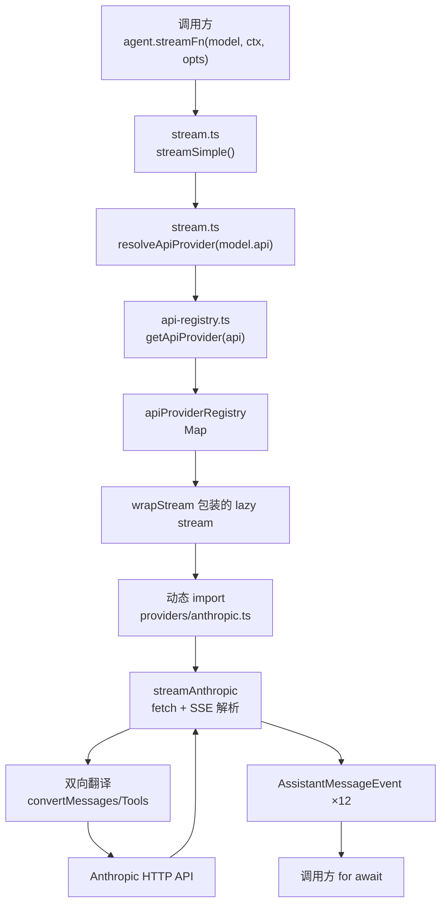

# 02 - pi-ai

> [!note]
> 本篇对应 `packages/ai`（npm 名 `@mariozechner/pi-ai`）。
> pi-ai 是整个 pi-mono 跟 LLM 对话的**适配层**——把 11 家 provider 的不同协议收敛成一套统一接口。
> 学完 [[01 - pi-agent-core]] 之后看这一篇，你会明白 agent 包里所有"留白"（`streamFn` 是什么 / SSE 怎么解析 / 怎么换 provider）的全部答案。

## 重点关注

读完这一篇，你应该能回答：

- pi-ai 在 pi-mono 三层架构里担什么角色？
- 11 家 provider 怎么收敛成一套统一接口？
- 一个 LLM 调用从入口到 provider 实现的完整路径是什么？
- "切块"成 12 种 AssistantMessageEvent 是什么意思？
- 为什么 agent 包跟 pi-ai 的关系不止 `streamSimple` 一个？
- side-effect import 怎么实现"零配置可用"？

---

## 1. 整体流程

### 1.1 pi-ai 在 pi-mono 里的位置

```
┌─────────────────────────────────────────────────────┐
│  coding-agent (产品层)                              │
│    ├─ tools / sessions / extensions                 │
│    └─ AgentMessage (扩展点,declaration merging)     │
│              │                                      │
│              ▼ convertToLlm                         │
│  agent (runtime)                                    │
│    └─ streamFn: (model, context, options) => Stream │
│              │                                      │
│              ▼                                      │
│  ai (本篇)                                          │
│    ├─ stream.ts        ← 4 个入口函数              │
│    ├─ api-registry.ts  ← provider 注册表            │
│    ├─ register-builtins ← 启动脚本(side-effect)    │
│    └─ providers/*      ← 11 家 provider 实现        │
└─────────────────────────────────────────────────────┘
```

**一句话定位**：

| 角色 | 解决什么问题 |
|---|---|
| **统一接口** | 让 agent 包只用一个签名 `streamFn(model, context, options)` |
| **翻译器** | pi-ai 内部格式 ↔ 各家 provider 原生格式（双向） |
| **路由器** | 按 `model.api` 字段自动分发到正确 provider |
| **注册表** | 全局可插拔，支持运行时增删 provider |

### 1.2 pi-ai 包文件地图

```
packages/ai/src/
├── types.ts                  337 行   类型契约(运行时消失)
├── stream.ts                  60 行   ★ 4 个入口函数
├── api-registry.ts            98 行   ★ provider 注册表
├── env-api-keys.ts           133 行   环境变量 API key
├── cli.ts                    133 行   命令行壳(跳过)
├── models.ts                          模型清单(手动维护)
├── models.generated.ts      14583 行   ★ 自动生成(跳过)
│
├── providers/
│   ├── register-builtins.ts  433 行   ★ 启动脚本
│   ├── anthropic.ts          905 行   ★ 看 1 个代表
│   ├── openai-completions.ts 866 行   (类比即可)
│   ├── openai-responses.ts   251 行
│   ├── openai-codex-responses.ts 929 行
│   ├── azure-openai-responses.ts  248 行
│   ├── google.ts             476 行
│   ├── google-vertex.ts      542 行
│   ├── google-gemini-cli.ts  987 行
│   ├── mistral.ts            585 行
│   ├── amazon-bedrock.ts     807 行
│   └── ...
│
└── utils/
    ├── event-stream.ts        87 行   AssistantMessageEventStream
    ├── overflow.ts           136 行   上下文超长截断
    ├── validation.ts          93 行   参数校验
    └── oauth/*                        OAuth 流程(跳过)
```

---

## 2. 模块划分

```
┌─────────────────────────────────────────────────────────────┐
│ 入口层 (stream.ts)                                          │
│   4 个导出函数:stream / complete / streamSimple / complete │
│   ← agent 包只调 streamSimple                               │
└─────────────────────────────────────────────────────────────┘
                          │
                          ▼ 调
┌─────────────────────────────────────────────────────────────┐
│ 路由层 (api-registry.ts)                                    │
│   全局 Map<api 字符串, provider 实现>                       │
│   5 个 API:register / get / getAll / unregisterBySourceId   │
│             / clear                                         │
└─────────────────────────────────────────────────────────────┘
                          │
                          ▼ 注册
┌─────────────────────────────────────────────────────────────┐
│ 启动层 (register-builtins.ts)                               │
│   side-effect import 触发                                   │
│   10 次 registerApiProvider 调用                            │
│   全部用 lazy stream 包装(用到才动态 import)                │
└─────────────────────────────────────────────────────────────┘
                          │
                          ▼ 实现
┌─────────────────────────────────────────────────────────────┐
│ 实现层 (providers/*.ts)                                     │
│   每家 provider 一个文件                                    │
│   负责 SSE 解析 + 双向格式翻译                              │
└─────────────────────────────────────────────────────────────┘
```

---

## 3. 整体信息流

### 3.1 一次 LLM 调用的完整路径



### 3.2 数据的"双向翻译"

**正向（请求）**：pi-ai 统一格式 → provider 原生格式

```
Message[]     ──convertMessages──→ Anthropic messages[]
Tool[]        ──convertTools─────→ Anthropic tools[]
ThinkingLevel ──mapEffort────────→ effort: "high"
StreamOptions ──buildParams──────→ Anthropic request body
```

**反向（响应）**：provider SSE chunk → pi-ai 统一事件

```
SSE chunk                 ──切块──→ AssistantMessageEvent(12 种之一)
  message_start                       start
  content_block_start (text)          text_start
  content_block_delta  (text)         text_delta  ×N
  content_block_stop                  text_end
  content_block_start (thinking)      thinking_start
  content_block_delta  (thinking)     thinking_delta ×N
  content_block_start (tool_use)      toolcall_start
  content_block_delta  (input_json)   toolcall_delta ×N
  content_block_stop                  toolcall_end
  message_delta / message_stop        done
  (error)                             error
```

### 3.3 "切块"举例

用户问 "你好"，模型回 "Hello!"——Anthropic 推过来 7 个 SSE chunk，pi-ai 切成 6 个 event：

```
原始 SSE chunk                pi-ai 切成的事件
──────────────────            ────────────────────
message_start            ─→   start
content_block_start(text)─→   text_start
content_block_delta      ─→   text_delta "Hello"
content_block_delta      ─→   text_delta "!"
content_block_stop       ─→   text_end "Hello!"
message_stop             ─→   done
```

每个 event 都带 `partial: AssistantMessage`（当前累积快照），消费者可以选择只看 partial 忽略 delta。

---

## 4. 模块内的信息流

### 4.1 types.ts —— 类型契约（无运行时）

pi-ai 的 9 组核心类型（详见 [[02 - pi-ai]] §5）：

| 组 | 关键类型 |
|---|---|
| ① 身份标识 | `KnownApi`(10) / `Api` / `KnownProvider`(22) / `Provider` / `Model<TApi>` |
| ② 思考控制 | `ThinkingLevel` / `ThinkingBudgets` |
| ③ 请求选项 | `StreamOptions` / `ProviderStreamOptions` / `SimpleStreamOptions` |
| ④ 流式契约 ★ | `StreamFunction` / `AssistantMessageEvent`(12种) / `AssistantMessageEventStream` |
| ⑤ 内容块 | `TextContent` / `ThinkingContent` / `ImageContent` / `ToolCall` |
| ⑥ 消息类型 | `UserMessage` / `AssistantMessage` / `ToolResultMessage` → `Message` |
| ⑦ Usage 统计 | `Usage`（cost.total 直接是美元） |
| ⑧ Tool/Context | `Tool<TSchema>` / `Context` |
| ⑨ OpenAI 兼容层 | `OpenAICompletionsCompat`（12+ 开关） |

### 4.2 stream.ts —— 入口层（60 行）

4 个导出函数的 2×2 矩阵：

```
                    raw 选项                Simple 选项(+reasoning)
                 ┌─────────────────────┬─────────────────────┐
   流式 stream   │ stream()            │ streamSimple() ★    │
                 │ → EventStream       │ → EventStream       │
                 ├─────────────────────┼─────────────────────┤
   一次性 complete│ complete()          │ completeSimple()    │
                 │ → Promise<AsstMsg>  │ → Promise<AsstMsg>  │
                 └─────────────────────┴─────────────────────┘

关系: complete = stream(...).result()
      completeSimple = streamSimple(...).result()
      streamSimple = provider.streamSimple(...)
      stream = provider.stream(...)
```

→ 4 个函数实际只有 2 条独立路径（raw / Simple），另 2 个是 `.result()` 语法糖。

**关键一行**：L1 的 `import "./providers/register-builtins.js"` 是 side-effect import——
一加载就把 10 个 provider 全部注册，这就是 pi-ai "零配置可用"的秘诀。

### 4.3 api-registry.ts —— 注册表层（98 行）

**全局 Map 实现 provider 注册表**。

5 个核心抽象的层次关系：

```
ApiStreamFunction (去泛型,用于内部存储)
       │
ApiProvider (公开,带泛型,用户注册时填)
       │ wrapStream 包装
ApiProviderInternal (内部,去泛型)
       │ 加 sourceId
RegisteredApiProvider (注册表项)
       │ 存进 Map
apiProviderRegistry = Map<api, RegisteredApiProvider>
```

5 个公开 API（增删查改）：

```
registerApiProvider(provider, sourceId?)   增
getApiProvider(api)                        查(单个)
getApiProviders()                          查(全部)
unregisterApiProviders(sourceId)           删(按 sourceId 批量)
clearApiProviders()                        删(全清,测试用)
```

**关键设计**：
- **wrapStream**：运行时类型守卫，防 TS 泛型擦除导致的"传错 model"
- **sourceId**：插件生命周期管理——一个插件注册多个 provider，卸载时按 sourceId 一次清空

### 4.4 register-builtins.ts —— 启动层（433 行）

**pi-ai 的"开机自启脚本"**——3 件事：

```
① 把 10 个 provider 注册到 registry
   anthropic / openai / google / mistral / bedrock / ...

② 用懒加载(createLazyStream)
   注册时只登记"位置",真正调用时才动态 import
   → 启动快,内存省,没装的 SDK 不会报错

③ 文件末尾 L433: registerBuiltInApiProviders();
   ← 顶层调用,模块一加载就执行
```

**触发链**：

```
用户: import { streamSimple } from "@mariozechner/pi-ai"
         ↓
stream.ts L1: import "./providers/register-builtins.js"  (side-effect)
         ↓
register-builtins.ts L433 自动执行: registerBuiltInApiProviders()
         ↓
10 个 provider 全部就绪
```

**懒加载工作原理**（createLazyStream 工厂）：

```
调用 lazy stream
       │
       ├─ 立刻返回空 outer stream
       │
       ├─ 异步: loadModule() (动态 import)
       │       │
       │       ▼ .then
       │   module.stream(...) → inner stream
       │       │
       │       ▼ forwardStream
       │   把 inner 的每个 event 转给 outer
       │
       └─ 返回 outer 给调用方

失败也变成 event:
   .catch → outer.push({type:"error", ...}) → outer.end()
```

→ **加载失败也不抛**，符合 StreamFunction 契约"错误作为数据"。

### 4.5 anthropic.ts —— 实现层代表（905 行）

**整个文件就是个"翻译器"**：把 pi-ai 统一格式 ↔ Anthropic 原生格式互转。

文件分段：

```
L199-444   ★★★ streamAnthropic (245 行)  ← SSE 解析主流程
L477-516   ★★  streamSimpleAnthropic     ← 薄包装(加 reasoning 映射)
L607-697   buildParams                   ← 构造请求参数
L702-866   convertMessages / Tools       ← 格式翻译
L885-      mapStopReason                  ← 停止原因映射
```

**streamAnthropic 工作流程**：

```
① buildParams(model, context, options)
   构造 Anthropic API 请求体
   │
   ▼
② createClient(options) + fetch SSE
   发 HTTP 请求,接收 SSE chunk 流
   │
   ▼
③ for await (chunk of sse)
   解析每个 chunk,切块翻译成 AssistantMessageEvent
   │
   ▼
④ push 到 EventStream 返回
```

**streamSimpleAnthropic**：仅 40 行，是个"瘦壳"——
把 `reasoning: "high"` 映射成 Anthropic 的 `effort` 参数，然后调 streamAnthropic。

---

## 5. 核心参数

### 5.1 Model<TApi>（模型身份证）

```ts
interface Model<TApi extends Api> {
    id: string;            // "claude-opus-4"
    name: string;          // 显示名
    api: TApi;             // ★ 协议族(决定走哪个 provider)
    provider: Provider;    // 服务商
    baseUrl: string;       // API 地址
    reasoning: boolean;    // 是否支持 reasoning
    input: ("text" | "image")[];
    cost: { input, output, cacheRead, cacheWrite };  // $/M tokens
    contextWindow: number;
    maxTokens: number;
    compat?: ...;          // OpenAI 兼容层配置
}
```

**泛型 `<TApi>` 的作用**：把"这个模型走哪个 api 协议"编码进类型系统。
运行时泛型消失，靠 wrapStream 的运行时检查兜底。

### 5.2 SimpleStreamOptions（请求选项）

```ts
interface SimpleStreamOptions extends StreamOptions {
    reasoning?: ThinkingLevel;       // ★ 思考强度
    thinkingBudgets?: ThinkingBudgets;
}

interface StreamOptions {
    temperature?, maxTokens?, signal?, apiKey?,
    transport?, cacheRetention?, sessionId?,
    onPayload?,          // ★ payload 拦截器
    headers?, maxRetryDelayMs?, metadata?
}
```

→ `AgentLoopConfig extends SimpleStreamOptions`，所以 agent 层的 `thinkingLevel: "high"` 直接传到 provider。

### 5.3 ApiProvider（注册契约）

```ts
interface ApiProvider<TApi, TOptions> {
    api: TApi;
    stream: StreamFunction<TApi, TOptions>;         // raw 入口
    streamSimple: StreamFunction<TApi, SimpleStreamOptions>;  // Simple 入口
}
```

注册一次 = 提供两个入口函数。

---

## 6. 工程上的实际行为与考量

### 6.1 side-effect import（零配置可用）

stream.ts L1：`import "./providers/register-builtins.js"` 没导入任何符号，但触发了整个注册流程。

→ **用户只需一行 import**，10 家 provider 自动就绪。

### 6.2 懒加载（启动快 + 内存省 + 依赖隔离）

```ts
const streamAnthropic = createLazyStream(loadAnthropicProviderModule);
// 第一次调用时才 import("./anthropic.js")
```

| 问题 | 懒加载解决 |
|---|---|
| 启动时全 import 会慢 | 用到才加载 |
| 用户只用 Anthropic 却加载 OpenAI SDK | 内存省 |
| 用户没装 AWS SDK,但 import Bedrock 报错 | 没用到就不报错 |

### 6.3 错误作为数据（不抛异常）

types.ts L120-124 的契约：
> Once invoked, failures should be encoded in the returned stream, not thrown.

→ 消费者一个 `for await` 处理所有情况，不用 try/catch 包裹。
懒加载失败也走同样路径（变成 `error` event）。

### 6.4 双向翻译（不只是切块）

pi-ai 不是单向切块器，是**双向翻译器**：

```
请求方向: pi-ai 格式 → provider 格式
   Message[]       → Anthropic/OpenAI/... 的原生 messages
   Tool[]          → 各家 tools 格式
   ThinkingLevel   → effort / reasoning_effort / ...

响应方向: provider SSE → pi-ai 12 种 event
```

### 6.5 sourceId 追踪（插件热插拔）

```ts
// 插件加载
registerApiProvider(myProvider, "my-plugin-v1");

// 插件卸载(一次清空,不影响别的)
unregisterApiProviders("my-plugin-v1");
```

### 6.6 wrapStream 运行时守卫（类型擦除防御）

TypeScript 泛型编译后消失，wrapStream 加一层 `if (model.api !== api) throw` 兜底。

### 6.7 Api 跟 Provider 正交（不是同一个东西）

```
Provider "openai" ─┬─→ api "openai-completions"
                   └─→ api "openai-responses"

Provider "openrouter" ─→ 走多个 api
```

→ 加一个新 provider 如果兼容现有 api，**不用写新代码**。

### 6.8 TypeBox 而不是 zod

`Tool.parameters` 用 `@sinclair/typebox` 的 `TSchema`——
一个 schema 同时是 TS 类型 + JSON Schema + 运行时校验。

### 6.9 Usage.cost 直接是美元

pi-ai 在内部按 `Model.cost($/M tokens) × tokens` 算好美元，UI 直接显示。

### 6.10 12 种 event 都带 partial

消费者可以选择**忽略所有 delta，只看 partial**（当前累积快照）——简化日志/审计场景。

---

## 7. 函数调用关系

### 7.1 入口层（stream.ts）

```
stream(model, ctx, opts)
   └─ resolveApiProvider(model.api)
   └─ provider.stream(model, ctx, opts)

streamSimple(model, ctx, opts)  ← agent 默认用这个
   └─ resolveApiProvider(model.api)
   └─ provider.streamSimple(model, ctx, opts)

complete / completeSimple
   └─ 内部调 stream/streamSimple + .result()
```

### 7.2 路由层（api-registry.ts）

```
registerApiProvider(provider, sourceId?)
   └─ wrapStream(api, provider.stream)
   └─ wrapStreamSimple(api, provider.streamSimple)
   └─ apiProviderRegistry.set(api, {provider, sourceId})

getApiProvider(api)
   └─ apiProviderRegistry.get(api)?.provider
```

### 7.3 启动层（register-builtins.ts）

```
模块加载 → L433 自动执行
   └─ registerBuiltInApiProviders()
       └─ 10 次 registerApiProvider({...})

每次注册传的是 lazy stream:
   streamAnthropic = createLazyStream(loadAnthropicProviderModule)
       │
       └─ 调用时:
           ├─ loadModule() ─→ import("./anthropic.js")
           ├─ module.stream(...)
           └─ forwardStream 转发事件
```

### 7.4 实现层（anthropic.ts）

```
streamSimpleAnthropic (L477)  ← agent.streamFn 默认
   └─ mapThinkingLevelToEffort(reasoning)
   └─ streamAnthropic(model, ctx, {...opts, effort})

streamAnthropic (L199) ★★★
   ├─ buildParams(model, ctx, opts)
   │    ├─ convertMessages(ctx.messages)
   │    └─ convertTools(ctx.tools)
   ├─ createClient(opts) + fetch SSE
   ├─ for await (chunk of sse)
   │    └─ 切块翻译成 AssistantMessageEvent
   └─ push 到 EventStream
```

---

## 8. Q&A 整理

### 8.1 概念理解

**Q: pi-ai 到底做了什么?**

A: 三件大事——
① 统一接口 `streamSimple`：一个签名吃所有 provider
② 双向翻译：请求/响应在 pi-ai 格式 ↔ provider 格式之间转
③ 注册表：`Map<api, provider>`，可插拔，懒加载

**Q: agent 跟 pi-ai 的关系只在 streamSimple 吗?**

A: 不止。3 层关系——
- 类型契约（13 个类型 re-export，让两包"说同种语言"）
- 核心函数（`streamSimple` + `validateToolArguments`）
- 基础设施（`EventStream` 类 + `parseStreamingJson`，proxy.ts 用）

streamSimple 占 80%，其他 20%。

**Q: 什么是"切块成事件流"?**

A: provider 推来的 SSE chunk 格式各家不同，pi-ai 按语义归一化成 12 种 AssistantMessageEvent。比如 `content_block_delta(text)` → `text_delta`。每个 event 还带 `partial`（当前累积快照）。

**Q: 切块切出来的是 AssistantMessage 吗?**

A: 不是单个消息，是**事件流**。最终聚合后才形成 AssistantMessage（在 `done` event 里）。

### 8.2 设计动机

**Q: 为什么 StreamFunction 失败不能抛?**

A: "错误作为数据"——消费者一个 `for await` 处理所有情况（成功/失败/中止），不用 try/catch 包裹 + 监听 error 事件双轨制。

**Q: 为什么需要懒加载?**

A: 启动快、内存省、依赖隔离（用户没装 AWS SDK 时不会因为 import Bedrock 报错）。

**Q: 为什么 Api 跟 Provider 分开?**

A: 正交关系——一个 Provider（如 OpenAI）可走多个 Api（completions + responses）。加新 provider 如果兼容现有 api 不用写新代码。

**Q: 为什么 side-effect import?**

A: 让 pi-ai 做到"零配置可用"——用户写一行 import，10 家 provider 自动就绪。

### 8.3 字段含义

**Q: Model.api 跟 Model.provider 什么区别?**

A: api 是**协议**（怎么说话），provider 是**服务商**（谁提供）。正交关系。

**Q: `wrapStream` 在干什么?**

A: 把带泛型的 stream 函数包装成去泛型版本，外加一层 `if (model.api !== api) throw` 运行时检查。是 TS 类型擦除的运行时补丁。

**Q: `sourceId` 是干嘛的?**

A: 标记 provider 是谁注册的，用于插件批量卸载——`unregisterApiProviders("my-plugin")` 一次清空。

**Q: `Usage.cost.total` 是 token 数吗?**

A: 不是，直接是**美元**。pi-ai 内部按 Model.cost($/M) 算好了。

### 8.4 PuinClaw 应用

**Q: PuinClaw 跑起来时 pi-ai 做了什么?**

A:
```
agent.prompt("hello")
  → this.streamFn = streamSimple (默认)
  → streamSimple(model, ctx, opts)
  → resolveApiProvider("anthropic-messages")
  → 返回 lazy stream
  → 第一次调用触发动态 import anthropic.ts
  → 真正调 Anthropic API
```

**Q: 怎么换 provider?**

A: 改 `model.api` 字段（如从 "anthropic-messages" 改成 "openai-responses"），pi-ai 自动路由到对应 provider。agent 层无感。

**Q: 怎么加自定义 provider?**

A:
```ts
import { registerApiProvider } from "@mariozechner/pi-ai";

registerApiProvider({
    api: "my-custom-api",
    stream: myStreamFn,
    streamSimple: mySimpleStreamFn,
}, "my-plugin");
```

---

## 9. [!warning] 阅读陷阱

| 陷阱 | 说明 |
|---|---|
| 把 Api 和 Provider 混淆 | Api 是协议,Provider 是服务商,正交关系 |
| 以为 Tool.parameters 用 zod | 实际用 TypeBox |
| 忘了 Message 不可扩展 | 想加自定义消息去 agent 包用 CustomAgentMessages |
| 以为 streamSimple 是唯一的 agent-pi-ai 关系 | 还有 validateToolArguments / EventStream / parseStreamingJson |
| 把 cost.total 当 token 数 | 实际是美元 |
| 在 streamFn 里 try/catch | 错误已经编码进流,通过 `event.type === "error"` 处理 |
| 以为懒加载没注册 | 注册了(登记位置),只是真正 import 延后 |
| 背 OpenAI 兼容层的 12 个开关 | 用到再查,不背 |
| 看 14583 行的 models.generated.ts | 自动生成,跳过 |
| 看 OAuth 流程细节 | 用不到不看 |

---

## 10. 相关概念

### 10.1 跟 [[01 - pi-agent-core]] 的对照

| 概念 | ai 包 | agent 包 |
|---|---|---|
| 消息 | `Message` (固定) | `AgentMessage` (可扩展) |
| 工具 | `Tool` (只声明 schema) | `AgentTool` (含 execute) |
| 流函数 | `StreamFunction` | `StreamFn` (来自 ai) |
| 思考级别 | 5 档（无 off） | 6 档（含 off） |
| 事件 | 12 种 AssistantMessageEvent | 10 种 AgentEvent |
| 状态 | （无） | `AgentState`（9 字段） |

**核心边界**：ai 是**传输层**（无状态），agent 是**运行时层**（有循环/状态/工具调度）。

### 10.2 跟 claw0 抽象的对照

| claw0 抽象 | pi-ai 落地 |
|---|---|
| [[05 Gateway]] 网关 | api-registry + register-builtins |
| 协议适配 | providers/*.ts 的双向翻译 |
| 事件流 | AssistantMessageEvent × 12 |

### 10.3 推荐下一步

- [ ] **看 1 个完整 provider 实现**：anthropic.ts 的 streamAnthropic (L199-444) 是核心
- [ ] **跑 PuinClaw 加 onPayload 钩子**：看实际请求体长什么样
- [ ] **对比 anthropic vs openai-responses**：理解不同 provider 的 SSE 解析差异
- [ ] **继续读 coding-agent 包**：理解产品层怎么用 pi-ai + pi-agent-core

---

## 11. 代码骨架总览

```
pi-ai 包 (~3500 行核心代码,跳过 models.generated)

入口层 (60 行)
├─ stream.ts
│   ├─ stream(model, ctx, opts)              → EventStream
│   ├─ complete(model, ctx, opts)            → Promise<AsstMsg>
│   ├─ streamSimple(model, ctx, opts)        ★ agent 默认用
│   └─ completeSimple(model, ctx, opts)      → Promise<AsstMsg>

路由层 (98 行)
├─ api-registry.ts
│   ├─ apiProviderRegistry: Map<api, RegisteredApiProvider>
│   ├─ registerApiProvider(provider, sourceId?)
│   ├─ getApiProvider(api)
│   ├─ getApiProviders()
│   ├─ unregisterApiProviders(sourceId)
│   ├─ clearApiProviders()
│   ├─ wrapStream(api, stream)       ← 运行时类型守卫
│   └─ wrapStreamSimple(api, stream)

启动层 (433 行)
├─ providers/register-builtins.ts
│   ├─ createLazyStream(loadFn)      ← 懒加载工厂
│   ├─ createLazySimpleStream(loadFn)
│   ├─ forwardStream(target, source) ← 事件管道
│   ├─ createLazyLoadErrorMessage(model, error)
│   ├─ 10 个 loadXxxProviderModule    ← 动态 import
│   ├─ 22 个 lazy stream 变量
│   ├─ registerBuiltInApiProviders()  ★ 10 次注册
│   ├─ resetApiProviders()            ← 测试用
│   └─ L433: registerBuiltInApiProviders();  ← side-effect 触发

实现层 (~6000 行)
└─ providers/*.ts (每家一个)
    ├─ streamXxx(model, ctx, opts)       ★ SSE 解析主流程
    ├─ streamSimpleXxx(model, ctx, opts) ★ 薄包装(加 reasoning)
    ├─ buildParams()
    ├─ convertMessages() / convertTools()
    ├─ createClient() (含 OAuth)
    └─ mapStopReason()

类型层 (337 行)
└─ types.ts (详见 §4.1)
```

---

_Generated while learning pi-mono, 2026-06-25_
