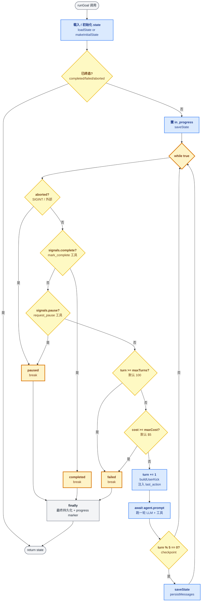
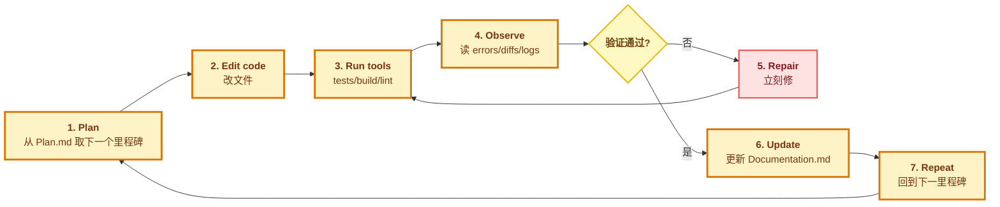
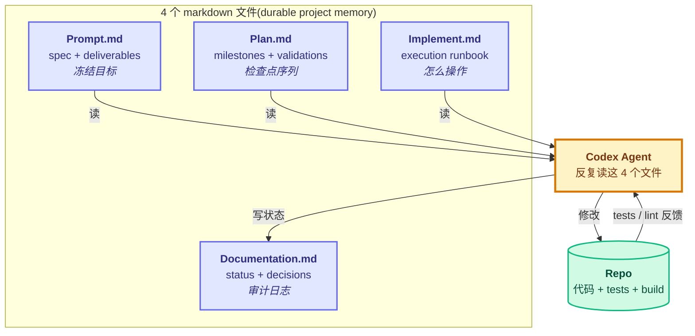
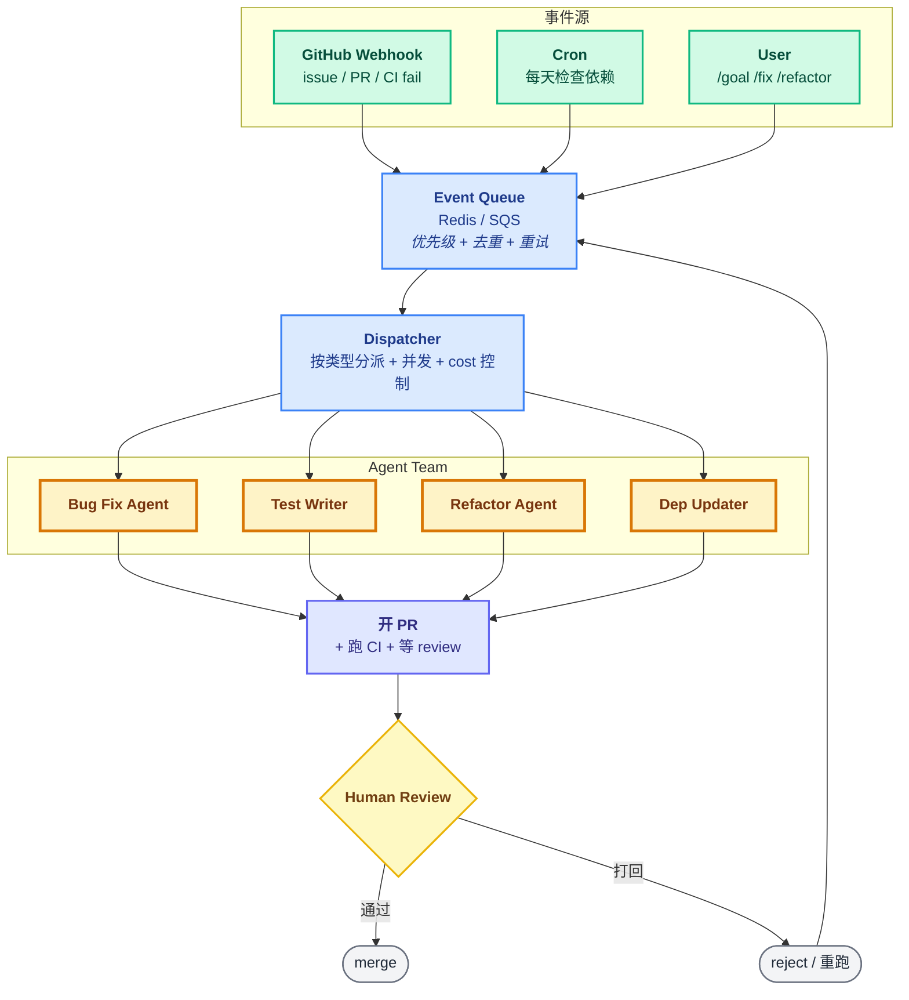
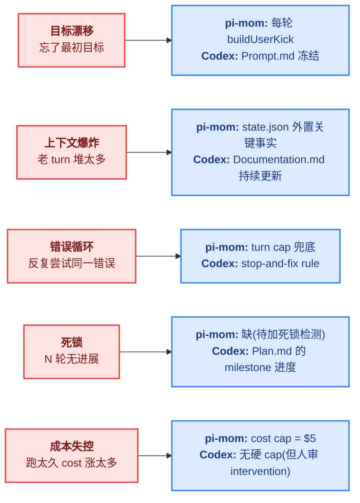

# 04 - 长跑与自治代码库

> [!note]
> 这一节讲两个概念 + 两个示例:
> **概念** —— 长跑(long-running)和自治代码库(autonomous codebase)
> **示例** —— pi-mom 的简化实现(while 循环 + 工具回调)vs OpenAI Codex 的真实做法(durable project memory)

## 1. 长跑的核心命题:时间维度,而非智力维度

```
短任务 agent:  prompt → 一轮 LLM → answer → 结束
长跑 agent:    goal → 反复多轮 LLM + 工具调用 → 直到完成 / cap 触发
```

OpenAI 在《Run long horizon tasks with Codex》里给出关键判断:

> **"Agentic coding is increasingly about time horizon, not just one-shot intelligence."**

METR 的时间视野基准显示,agent 可靠完成的任务长度**每 7 个月翻倍**。GPT-5.3-Codex 在 Extra High reasoning 下能跑 **25 小时不间断 / 13M tokens / 30k 行代码**。

> [!warning]
> 长跑的难点不是"模型不够聪明",而是**跑久了会漂移**。所有长跑架构的核心都是 anti-drift(防漂移)机制。

## 2. 长跑的 5 个关键能力

| 能力 | 含义 | 对应机制 |
|---|---|---|
| **① 持续推进** | 不停跑,而不是一轮就停 | prompt loop / followUp / Heartbeat |
| **② 进度持久** | 跨重启能续上 | state.json / messages.json / markdown |
| **③ 安全 cap** | 防止跑飞(turn / cost) | max_turns + max_cost_usd |
| **④ 优雅中止** | Ctrl-C 不丢状态 | SIGINT → paused(不是 killed) |
| **⑤ 上下文治理** | 老 turn 不堆爆 context | compaction / 关键事实外置 |

任何长跑系统都能套这 5 条检查"是否完备"。下面两种实现(pi-mom 和 Codex)用不同方式满足这 5 条。

## 3. 简化实现:pi-mom goal runner

> pi-mono 的 mom 包(`packages/mom/src/goal/runner.ts`)是一个**最小可行**的长跑实现:一个 `while (true)` 主循环 + 3 个控制工具回调 + 双层 cap + Resume 三件套。

### 3.1 主循环



### 3.2 三个控制工具(回调驱动)

agent 自己通过工具告诉 runner 该做什么。runner 注册 3 个工具,内部只翻转 `signals` holder:

| 工具 | 回调副作用 | 效果 |
|---|---|---|
| `save_progress(summary, next_step)` | `state.last_action = summary` + append progress.md + checkpoint | 让下一轮能看见上一轮做了什么 |
| `mark_complete(result)` | `signals.complete = { result }` | 下一轮循环顶检测到 → `status: completed` → break |
| `request_pause(reason)` | `signals.pause = { reason }` | 下一轮循环顶检测到 → `status: paused` → break |

> [!note]
> **关键设计:工具只翻转信号,不在工具里 break**。因为 `agent.prompt()` 是阻塞的,在工具里 break 会破坏 agent loop 的不变量。runner 在下一轮循环顶统一检查信号 → 决定是否退出。

### 3.3 User Kick:每轮重注入目标

每轮 prompt 都不一样,防止 agent 忘了目标:

```typescript
// 第 1 轮
"Begin working on the goal. Pick the first concrete step..."

// 第 N 轮(N > 1)
"Continue. Turn ${state.turn}. Last action: ${state.last_action}. Pick the next concrete step..."
```

**关键点**:`last_action` 是 agent 自己上一轮通过 `save_progress` 写进去的。这样即便 context 被压缩,agent 也能从外部状态里知道"上次干到哪"。

### 3.4 System Prompt 五段式

固定结构,让 agent 知道边界:

```
# Goal: <title>
## Objective         ← 目标
## Success Criteria  ← 完成判定
## Constraints       ← 边界
## Context           ← 背景信息
## Runner State      ← 当前 turn / cost / caps / workspace
## How to work       ← 5 条操作准则
```

"How to work" 第 5 条是**强制验证**的雏形:

> Verify each success criterion explicitly before calling mark_complete. Do not assume.

### 3.5 双层 cap + Resume 三件套

| 防漂移机制 | 实现 | 默认值 |
|---|---|---|
| **turn cap** | `state.turn >= maxTurns` | 100 轮 |
| **cost cap** | `state.cost_usd >= maxCost` | $5 |
| **checkpoint** | `turn % checkpointEvery == 0` → saveState + persistMessages | 每 5 轮 |
| **save_progress 触发 checkpoint** | 每次调用都存 | 任意时刻 |
| **SIGINT** | 翻 `aborted` 标志 + `agent.abort()` → 跑完当前轮再退 | 优雅退出 |
| **Resume** | 启动时 `loadState` + 重载 `messages.json` → 跑过的轮不丢 | 跨重启 |

> [!warning]
> pi-mom 的 cap 是**硬截断**:turn 或 cost 一旦超 → `status: failed`,**不会自动续跑**。这是简化实现的局限(Codex 用外部记忆解决,见第 4 节)。

## 4. Codex 实际实现:durable project memory

> OpenAI 官方博客《Run long horizon tasks with Codex》(2026-02) 讲的真实做法。
> 跟 pi-mom 完全不同的思路:**不是给 agent 加更多 cap,而是给 agent 一套外部记忆**。

### 4.1 Codex agent loop(7 步)

OpenAI 把长跑的本质提炼为一个 7 步循环:



OpenAI 原话:"长跑不是一个巨大聪明的 prompt,而是 agent 跑在里面的 **agent loop**"。loop 给 agent 三样东西:
- **真实反馈**(errors / diffs / logs)
- **外置状态**(repo / files / docs / worktrees)
- **可纠偏**(基于结果调整方向)

### 4.2 核心思想:durable project memory

**4 个 markdown 文件**作为 source of truth。agent 可以反复回访,防止漂移:



### 4.3 4 个 markdown 文件详解

| 文件 | 角色 | 解决什么问题 | 关键内容 |
|---|---|---|---|
| **Prompt.md** | spec + deliverables | 防"做出令人印象深刻但错误的东西" | Goals + non-goals / Hard constraints / Deliverables / "Done when" checks |
| **Plan.md** | milestones + validations | 把开放性工作切成可验证的小检查点 | Milestones(一轮一个)/ Acceptance criteria + validation commands / Stop-and-fix rule / Decision notes |
| **Implement.md** | execution runbook | 告诉 agent 怎么操作(不只是做什么) | "Plan.md 是 source of truth" / 每里程碑后跑验证 / 保持 diff 局部 / 持续更新 Documentation.md |
| **Documentation.md** | status + decisions | 共享记忆 + 审计日志(人能离开几小时) | 当前里程碑状态 / 决策及原因 / 如何运行+demo / 已知问题+follow-ups |

> [!note]
> **为什么是 markdown 不是 json?**
> 因为 markdown **agent 能直接读、人也能直接读**。json 是机器格式,人审阅成本高;markdown 是双向接口——agent 写完人立刻能看,人改一行 agent 立刻能读。这是"durable project memory"的关键设计。

### 4.4 强制验证(stop-and-fix rule)

Plan.md 里写明的铁律:**每个里程碑跑完必须验证,失败立即修复,不许带病前进**。

Codex 实测跑的验证命令:

| 验证类型 | 命令样例 |
|---|---|
| Lint | `npm run lint` |
| Typecheck | `npm run typecheck` 或 `tsc --noEmit` |
| Tests | `npm test` 或 `pytest` |
| Build | `npm run build` |
| Export | 自定义产物验证 |

> [!warning]
> 这是 pi-mom 没有的:**pi-mom 的 mark_complete 是 agent 自己说"我做完了"**,Codex 则要求**验证命令必须通过才算完成**。后者更严格,但也要求 task 必须有可执行的验证手段。

### 4.5 Codex app 配套基础设施

| 设施 | 作用 |
|---|---|
| **Git worktrees** | 隔离每次运行,保持 diff 可 review,减少 thrash |
| **Plan mode** (`/plan` 命令) | 跑前先生成可 review 的步骤序列,允许 follow-up 澄清 |
| **Skills** | 标准化 plan/implement/test/report 流程 |
| **Automations** | 后台例行任务(类似 cron) |
| **Parallel threads** | 同一 agent 跨项目并发跑多个长任务 |

## 5. 关键对比:pi-mom vs Codex(6 维度)

| 维度 | **pi-mom(简化)** | **Codex(实际)** |
|---|---|---|
| **核心抽象** | while 循环 + 工具翻转 signals | 4 个 markdown 文件作为 source of truth |
| **防漂移** | 每轮 `buildUserKick` 重注入 `last_action` | agent 反复读 4 个 markdown(目标/计划/操作/状态) |
| **状态持久** | `state.json` + `messages.json`(JSON) | `*.md` 文件(markdown,人机双向) |
| **终止判定** | agent 自己 `mark_complete`(无验证) | 里程碑验证命令通过 + 所有 deliverables 满足 |
| **验证** | 仅 System Prompt 提示"verify before complete" | **强制**(stop-and-fix rule + lint/typecheck/tests/build) |
| **审计** | `progress.md`(机器写的进度日志) | `Documentation.md`(agent 持续更新的状态+决策日志) |

**一句话总结**:
- pi-mom = **运行时控制**(怎么停、怎么续、怎么防超)
- Codex = **运行时控制 + 外部记忆 + 强制验证**

> [!note]
> 两者不互斥,而是**层级关系**:Codex 的 4 markdown 套路可以**跑在** pi-mom 的 while 循环里——agent 通过工具读/写这 4 个文件,runner 提供 turn/cost/cap/Resume 机制。

## 6. 自治代码库:更激进的概念

> 长跑的下一步:**agent 不只是完成一个 goal,而是长期驻留、持续管理一个代码库**。
> Anthropic 的《Building a C compiler with Claude》是这个方向的代表实验。

### 6.1 长跑 vs 自治代码库

| 维度 | 长跑(long-running) | 自治代码库(autonomous codebase) |
|---|---|---|
| **任务来源** | 单个 goal | 持续事件流(issue / PR / CI / cron) |
| **终止条件** | `mark_complete` 或 cap | **永不终止**(always-on) |
| **状态** | 单一 `state.json` | 多 task + 优先级队列 |
| **触发** | 用户 `/goal` | 事件驱动(webhook / cron / IM) |
| **失败处理** | `failed` → 退出 | `failed` → 重试 / 切下一个 |
| **Context** | 一份 transcript | 每 task 一份独立 transcript |
| **Agent 数** | 1 个 | Agent team(按角色分) |

### 6.2 自治代码库的 4 个核心特征

```
① 事件驱动    — webhook / cron 推任务,而不是人手动启动
② 多 agent   — 按角色分(Bug Fix / Test Writer / Refactor / Dep Updater)
③ 永不停歇   — always-on,7×24 待命(pm2 守护)
④ 人在环     — agent 开 PR,human review 后才 merge
```

人在自治代码库里做什么:
- Review agent 的 PR
- 设定优先级
- 处理 agent 升级不到的"战略问题"

### 6.3 自治代码库事件流



## 7. 5 类漂移与应对

> OpenAI 文章里讲的是"长跑会漂移"。下面是 5 类漂移 + pi-mom / Codex 各自怎么应对。



| 漂移类型 | pi-mom 应对 | Codex 应对 |
|---|---|---|
| 目标漂移 | 每轮 `buildUserKick` 重注入 | Prompt.md 冻结 + 反复读 |
| 上下文爆炸 | `state.json` 外置关键事实 | Documentation.md 持续更新 |
| 错误循环 | turn cap 兜底(粗暴) | **stop-and-fix rule**(精细) |
| 死锁 | ❌ 待加(每 N 轮无 progress → pause) | Plan.md 的 milestone 进度可观测 |
| 成本失控 | cost cap = $5(硬截断) | 无硬 cap,但 Plan.md 让人不至于盲目跑 |

## 8. 关键挑战(5 类)

> 自治代码库相比长跑,多了 5 类工程挑战:

| 挑战 | 具体内容 |
|---|---|
| **① 上下文管理** | 老 transcript 压缩(compaction)/ 关键事实外置 / 多 agent 各自独立 transcript |
| **② 失败恢复** | checkpoint + rollback / 死锁检测(N turn 无 progress)/ 错误分类(可重试 vs 不可重试) |
| **③ 成本控制** | 单 task cost cap / 月度总预算 / 优先级(高优 task 多花) |
| **④ 质量保证** | Reviewer agent / CI 强制 / Human review 关键 PR |
| **⑤ 安全** | 不能 merge 未 review 的 PR / 不能 force push / 不能改 CI 配置 |

> [!warning]
> 这 5 类挑战是长跑的 5 类漂移的**工程化版本**。漂移是 agent 层问题(怎么不跑偏);挑战是系统层问题(怎么不被 agent 拖垮)。

## 9. 面试要点

### 必答清单

| 问题 | 答 |
|---|---|
| 长 agent 跑久了会什么问题? | 5 类漂移:目标漂移 / 上下文爆炸 / 错误循环 / 死锁 / 成本失控 |
| 长跑需要哪 5 个关键能力? | 持续推进 / 进度持久 / 安全 cap / 优雅中止 / 上下文治理 |
| pi-mom 长跑怎么实现? | while 循环 + 3 控制工具(save_progress/mark_complete/request_pause)+ 双层 cap(turn/cost)+ Resume(state.json + messages.json) |
| Codex 长跑怎么实现? | durable project memory:4 markdown 文件(Prompt/Plan/Implement/Documentation)+ 7 步 loop(Plan/Edit/Run/Observe/Repair/Update/Repeat)+ 强制验证 |
| 为什么用 markdown 不用 json? | markdown 是人机双向接口——agent 写完人立刻能读,人改一行 agent 立刻能读。json 是机器格式,人审阅成本高 |
| 长跑 vs 自治代码库? | 长跑 = 完成"单个目标" → 终止;自治代码库 = 长期驻留 + 事件驱动 + 永不终止 + 多 agent |
| 自治代码库的 4 个核心特征? | 事件驱动 / 多 agent / 永不停歇(always-on)/ 人在环(human review) |
| 自治代码库需要什么基础设施? | 事件源(webhook/cron)+ 队列 + dispatcher + Agent team + PR 流程 + CI + human review |
| 自治代码库的 5 类工程挑战? | 上下文管理 / 失败恢复 / 成本控制 / 质量保证 / 安全 |
| 怎么避免 agent 损坏代码库? | ① Worktree 隔离 ② CI 强制 ③ Reviewer(自动 + 人工)④ 权限控制 ⑤ 关键 PR 必须 human review |
| 上下文爆炸怎么办? | ① Compaction(老消息摘要)② 多 agent 各自独立 transcript ③ 关键事实外置 ④ Codex 的 markdown 外置 |

### 加分点

- 提到 OpenAI 官方 Codex 实测数据:25 小时 / 13M tokens / 30k 行代码
- 提到 METR 时间视野每 7 个月翻倍
- 知道 OpenAI《Run long horizon tasks with Codex》原文的 5 个 takeaways
- 提到 Cursor《Scaling agents》是同类探索
- 提到 Anthropic 的 C compiler 实验是自治代码库方向
- 知道 SWE-agent / Aider / Devin 等同类项目
- 提到 Heartbeat 是长跑核心(对照 claw0 s07)

### 红线(不要答错)

> [!warning]
> - **不要把 pi-mom 实现说成 "Codex 风格"**。pi-mom 是简化版(while 循环 + 工具回调),Codex 真实做法是 durable project memory(4 markdown 文件)。
> - **不要说 cap 越大越好**。Codex 实测 25 小时是因为有强制验证 + 外置记忆,**不是靠加大 cap**。
> - **不要说"agent 跑久了就傻了"**。准确说法是 agent 跑久了会**漂移**,漂移有 5 种,各有应对。

## 10. QA

> 这一节记录学习过程中的真问真答,反映从"模糊理解"到"清晰对照"的脉络。

### Q1: codex 风格的 long goal 是怎么做的?

最初我把 pi-mom 实现讲成"codex 风格 long goal"——while 循环 + 工具翻转 signals + 双层 cap。

**但这是错的**:这只是 pi-mom 的简化实现,**不是 Codex 真实做法**。

去查了 OpenAI 官方博客《Run long horizon tasks with Codex》之后才发现,Codex 的真实做法完全不同:
- 不是给 agent 加更多 cap,而是给 agent **一套外部记忆**
- 4 个 markdown 文件(Prompt.md / Plan.md / Implement.md / Documentation.md)作为 source of truth
- 强制验证(stop-and-fix rule):每个里程碑跑 lint/typecheck/tests/build,失败立即修
- 配套 Git worktree / Plan mode / Skills / Automations / Parallel threads

**关键 takeaway**:pi-mom 关注**运行时控制**(怎么停、怎么续),Codex 关注**外部记忆 + 强制验证**。两者是层级关系——Codex 套路可以跑在 pi-mom 的 while 循环里。

### Q2: 那为什么 markdown 而不是 json?

读 Codex 博客时的疑问:`state.json` 是机器格式、结构化、易解析,为什么 Codex 偏偏用 markdown?

**答案:markdown 是人机双向接口**。

- json:agent 能读,但**人审阅成本高**(打开看一长串嵌套字段,改起来麻烦)
- markdown:agent 能读,**人也能直接读**(就一段文字),人改一行 agent 立刻能读

Codex 的核心判断是:**长跑 agent 必须有外部记忆,而外部记忆必须人能审阅**——否则 agent 漂移了人都不知道。所以选 markdown。

pi-mom 用 json 是因为它的状态主要是**机器内部状态**(turn / cost / status),人很少需要直接看;Codex 的状态是**项目级状态**(目标/计划/操作/审计),人需要频繁审阅。

### Q3: 为什么用 worktree 而不是直接在 workspace 改?

Codex 用 Git worktree 隔离每次运行。理由:

1. **diff 干净**:每次运行改的文件都在独立 worktree 里,主分支不会被污染
2. **可 review**:worktree 就是另一个分支,可以直接 PR
3. **减少 thrash**:多个 task 可以并发跑,互不干扰
4. **可回滚**:跑坏了直接删 worktree,主分支没影响

直接在 workspace 改的话,跑坏了**整个 workspace 都受影响**——这是 Codex 比 pi-mom 强的一个具体地方。

### Q4: 自治代码库跟长跑到底什么区别?

边界其实有点模糊,我用一个判别:**有没有"终止条件"**。

- 长跑:有终止(`mark_complete` / cap 触发) → status 进 terminal → 退出
- 自治代码库:**没有终止**,永远在等待下一个事件

类比:
- 长跑 = 接一个外包项目,做完交付
- 自治代码库 = 雇一个长期员工,7×24 待命

所以自治代码库需要长跑不需要的基础设施:
- **事件驱动入口**(webhook / cron / IM)
- **多任务调度**(优先级队列 + dispatcher)
- **Agent team**(按角色分,不是单个 agent)
- **pm2 守护**(进程级别 always-on)
- **自动 PR 流程**(agent 不能直接 merge)

### Q5: 强制验证会不会让 agent 卡在 lint 上无限循环?

理论上会,但 Codex 用两招防止:

1. **stop-and-fix rule**:验证失败必须**先修再前进**,不许绕过——所以即便循环也是在同一个里程碑内修,不会跑偏
2. **Plan.md 的 milestone 粒度小**:一个里程碑 = 一轮 loop 能完成 + 能验证。如果里程碑太大,验证失败的可能性反而高

### Q6: 5 类漂移和 5 类挑战什么关系?

容易混。一个判别:**漂移是 agent 层,挑战是系统层**。

- 漂移(agent 层):agent 自己跑久了的问题 —— 目标漂移 / 上下文爆炸 / 错误循环 / 死锁 / 成本失控
- 挑战(系统层):**自治代码库**(多个 agent + always-on)带来的工程问题 —— 上下文管理 / 失败恢复 / 成本控制 / 质量保证 / 安全

单 agent 长跑主要对付漂移;自治代码库两者都要对付。

## 11. 关键资料

### 一手资料

| 资料 | 内容 |
|---|---|
| [Run long horizon tasks with Codex (OpenAI Developers)](https://developers.openai.com/blog/run-long-horizon-tasks-with-codex) | **本节核心出处**。OpenAI 官方讲 Codex 25 小时长跑的做法:durable project memory + 4 markdown + 强制验证 |
| [The Codex Agent Loop (OpenAI Developers)](https://developers.openai.com/blog/the-codex-agent-loop) | 7 步 loop(Plan/Edit/Run/Observe/Repair/Update/Repeat)的详细解释 |
| [Building a C compiler with Claude (Anthropic)](https://www.anthropic.com/engineering/building-c-compiler) | 自治代码库方向的代表实验 |
| [How Cursor built a web browser (Scaling agents)](https://cursor.com/blog/scaling-agents) | Cursor 的长跑 agent 实践 |
| [Measuring AI Ability to Complete Long Tasks (METR)](https://metr.org/blog/2025-03-19-measuring-ai-ability-to-complete-long-tasks/) | 时间视野每 7 个月翻倍的基准 |

### 同类项目

| 项目 | 定位 |
|---|---|
| [SWE-agent](https://swe-agent.com/) | Princeton 自治编码 agent(学术) |
| [Aider](https://aider.chat/) | 开源 pair-programming agent |
| [Devin](https://devin.ai/) | 商业 long-running agent(Cognition) |
| [Codex](https://developers.openai.com/codex) | OpenAI 官方 agentic coding 工具 |

### 关联笔记

| 笔记 | 关系 |
|---|---|
| [[06 - Harness]] | 长跑 = Harness 的运行时支柱 |
| [[05 - Agentic Sandbox]] | 自治代码库 = Sandbox + 长跑 + 多 agent |
| [[03 - Agent Teams]] | 自治代码库的"team"机制 |
| [[02 - Agent 评估与提示词优化]] | 长跑评估比单轮更难 |
| [[01 - pm2 与 IM 接口]] | 自治代码库的 always-on 守护 |
| [[06 - Intelligence]] (claw0 Phase 7) | Heartbeat + steering,长跑的另一种实现思路 |

_Generated for PuinClaw 面试准备, 2026-06-25_
