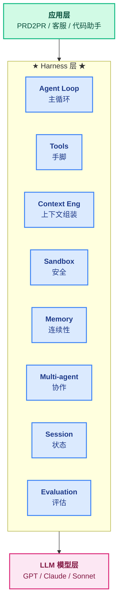
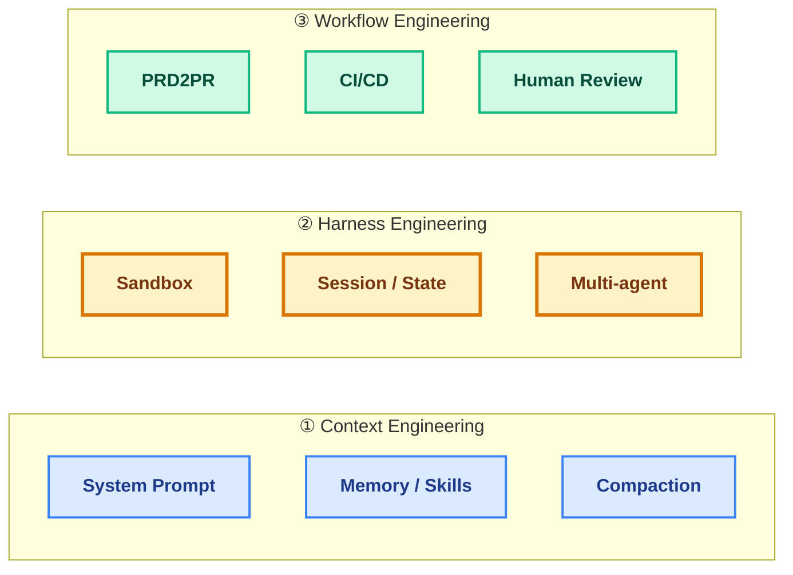
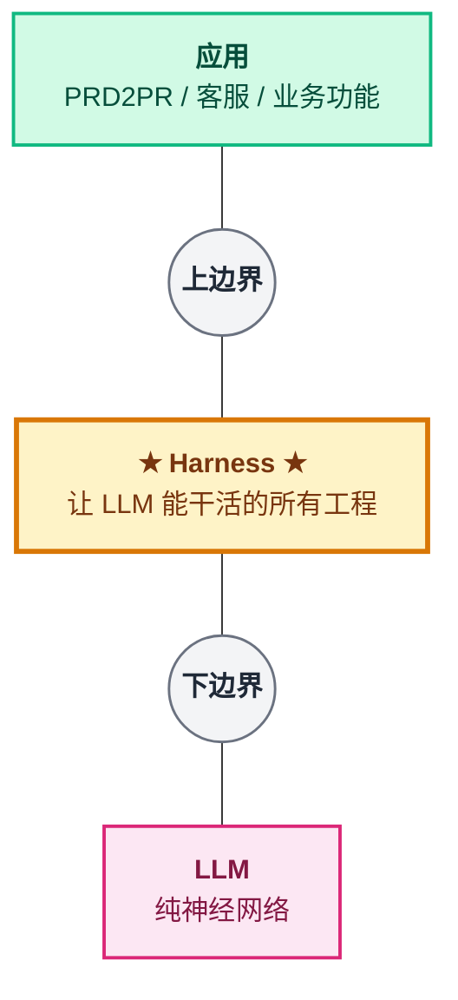
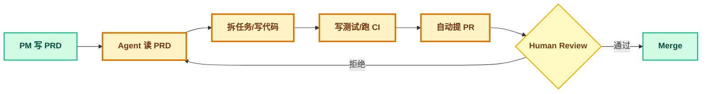
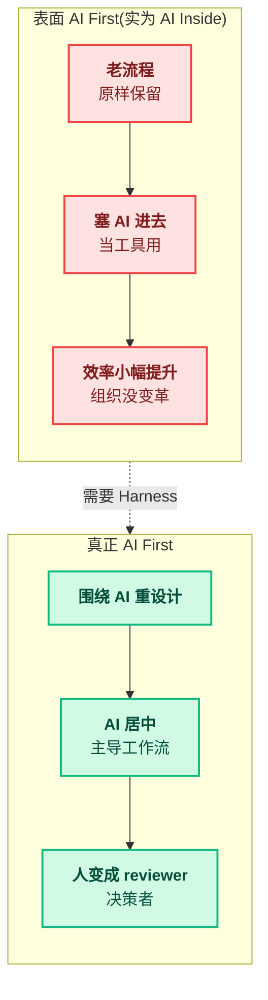
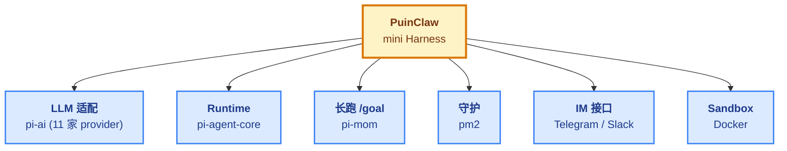

# 06 - Harness

> [!note]
> "Harness" 来自 OpenAI 2026-02 文章
> 《Harness engineering: leveraging Codex in an agent-first world》。
> **核心思维转换**:Harness 不是"一件东西",是夹在 LLM 模型层和应用层之间的**所有工程**。概念模糊但**面试谈资很值**——展现对 agent 时代工程范式的思考。

## 1. Harness 是什么(双视角)

### 1.1 视角 A:字面比喻(线束)

```
Harness 字面意思:线束 / 马具 / 挽具(套在马身上控制马的装备)

借喻:Agent 就是那匹马,Harness 就是"套在 agent 身上"
     让它更好跑、更可控的一切工程基础设施。
```

### 1.2 视角 B:精确边界(层)

更精确的视角——**Harness 是 LLM 模型层和应用层之间的"夹层"**:



### 1.3 类比让它秒懂

| 角色     | 对应物                                                      |
| -------- | ----------------------------------------------------------- |
| LLM 模型 | **大脑**——会思考,但没手脚、没记忆、跑一下就累              |
| Harness  | **神经系统 + 手脚 + 工作台 + 安全带 + 工具箱**              |
| 应用     | 大脑用这套装备去完成的**具体任务**(写代码、做客服、写邮件) |

大脑再聪明,**没有手脚永远干不了活**。Harness 就是让大脑变成劳动者的那一整套装备。

> [!warning] 面试金句
> Harness 不是一个组件,是**夹在 LLM 和应用之间的所有工程**。Agent Loop 让它思考、Tools 给它手脚、Context Engineering 让它不失忆、Sandbox 让它安全、Memory 让它跨会话连续。

## 2. OpenAI 三大支柱(原文要点)

### 2.1 文章信息

| 维度   | 内容                                                            |
| ------ | --------------------------------------------------------------- |
| 标题   | Harness engineering: leveraging Codex in an agent-first world   |
| 时间   | 2026-02-11                                                      |
| 来源   | OpenAI                                                          |
| 震撼点 | 从空 git repo 开始,**连 AGENTS.md 都是 Codex 自己写的**        |
| 核心论点 | "Redefining the role of the engineer"——工程师角色被重新定义 |

### 2.2 三大支柱



| 支柱                    | 关注什么                           | 关键组件                                   |
| ----------------------- | ---------------------------------- | ------------------------------------------ |
| ① Context Engineering   | 怎么给 agent 喂"上下文"            | prompt / memory / skills / compaction / file |
| ② Harness Engineering   | 怎么让 agent "跑起来"              | sandbox / session / state / multi-agent / eval |
| ③ Workflow Engineering  | 怎么把 agent "嵌入真实业务"        | PRD2PR / GitHub 集成 / CI/CD / HITL        |

## 3. Harness 的精确边界(什么不是 Harness)

这一节是面试时**清晰度的关键**——能说出"什么不是 Harness",比"什么是"更难、更值钱。

### 3.1 三种常见误解

| 误解                    | 为什么错                                                                                  |
| ----------------------- | ----------------------------------------------------------------------------------------- |
| Harness = IDE           | IDE 是给人用的(VS Code 给开发者看代码);Harness 是给 **agent** 用的(agent 自己跑) |
| Harness = Agent framework | 部分对,但 framework 偏**代码库**(LangChain);Harness 偏**运行系统**(含守护/监控/持久化) |
| Harness = RAG           | 错,RAG 只是 Context Engineering 的一个子集(给记忆的子集)                                |

### 3.2 边界划层



> [!note]
> LLM 模型层(GPT/Claude) **不是** Harness;具体业务功能(PRD2PR、客服机器人) **也不是** Harness。**中间所有让 LLM 能跑起来的工程**才是。

## 4. PRD2PR(Harness 的典型实践)

### 4.1 流程



### 4.2 已经在做 PRD2PR 的公司

| 公司              | 产品                          |
| ----------------- | ----------------------------- |
| OpenAI            | Codex(自己内部用)             |
| Anthropic         | Claude Code                   |
| Cursor / Cognition | Cursor / Devin                |
| YC startup        | Plandex / Aider               |
| 国内大厂          | 字节 / 阿里 / Google 内部工具 |

### 4.3 关键澄清:PRD2PR ≠ Harness

```
PRD2PR = Harness 支撑的一种工作流应用

类比:
   HTTP 协议     ≠  网站
   HTTP 协议     =  让网站成为可能的基础设施

   Harness       ≠  PRD2PR
   Harness       =  让 PRD2PR 这种工作流成为可能的基础设施
```

PRD2PR 跑起来需要:Sandbox(执行代码) + Tools(git/edit/bash) + Context(PR 注入) + Session(状态) + Evaluation(质量) + CI/CD 集成——**这些加起来才是 Harness**。

## 5. "AI First" 战略反思

### 5.1 错误理解 vs 正确理解



> [!warning] 关键洞察
> 企业说"我们 AI First"但没建 Harness,本质就是"AI Inside"——只是把 LLM 当高级搜索框。**Harness 是从 AI Inside 到 AI First 的桥梁。**

### 5.2 编码工作的演进

| 阶段              | 角色                          | AI 位置              |
| ----------------- | ----------------------------- | -------------------- |
| 阶段 1(过去)      | 人写代码                      | AI 当搜索工具        |
| 阶段 2(现在主流)  | 人主导                        | AI 当副驾驶(Copilot) |
| 阶段 3(PR-First)  | AI 主导                       | 人 Review PR         |
| 阶段 4(Autonomous) | AI 全自动                    | 人只设方向           |

OpenAI Harness Engineering 在阶段 3 → 阶段 4 的边界上。

## 6. Harness 跟学过的所有东西的关系

> Harness = 你 Phase 1-8 学的所有抽象的**产品化整合**

### 6.1 learn-claude-code(Phase 1-6)

| 学过                | 对应 Harness 组件               |
| ------------------- | ------------------------------- |
| s10 System Prompt   | Context Engineering             |
| s11 Recovery        | Harness 状态持久化              |
| s12 Task System     | Harness 任务管理                |
| s13 Background Tasks | Harness 异步执行               |
| s15/17 Agent Teams  | Harness 多 agent                |
| s19 MCP Plugin      | Harness 扩展机制                |

### 6.2 claw0(Phase 7)

| 学过                | 对应 Harness 组件               |
| ------------------- | ------------------------------- |
| s04 Channels        | Harness IM 接口                 |
| s05 Gateway         | Harness 路由                    |
| s06 Intelligence    | Harness Context 组装            |
| s07 Heartbeat/Cron  | Harness 长跑                    |
| s08 Delivery        | Harness 异步交付                |
| s09 Resilience      | Harness 容错                    |
| s10 Concurrency     | Harness 并发                    |

### 6.3 pi-mono(Phase 8)

| 学过                | 对应 Harness 组件               |
| ------------------- | ------------------------------- |
| pi-ai               | Harness LLM 适配                |
| pi-agent-core       | Harness runtime                 |
| pi-coding-agent     | Harness 产品层(**就是 Harness**) |
| pi-mom              | Harness 长跑 /goal 实现         |

## 7. PuinClaw:mini Harness 实例

PuinClaw 是你基于 pi-mono 改造的常驻编码 Agent,是 Harness Engineering 思路的产品级实现。



**面试 1 分钟电梯陈述**:

> PuinClaw 是我基于 pi-mono 改造的常驻编码 Agent,是 OpenAI Harness Engineering 思路的产品级实现。包含完整的 Harness 组件:LLM 适配层(pi-ai,支持 11 家 provider)、Runtime(pi-agent-core,双循环 + 工具调度 + 事件流)、长跑能力(pi-mom /goal,持续推进直到完成)、守护进程(pm2)、IM 接口(Telegram/Slack)、Docker 沙盒。
>
> 下一步:接 GitHub webhook 实现 PRD2PR、加 Reviewer agent 质量保证、上下文压缩支持长跑。

## 8. 面试要点

### 8.1 必答清单

| Q                                       | A 关键点                                                                 |
| --------------------------------------- | ------------------------------------------------------------------------ |
| Harness 是什么?                         | 夹在 LLM 和应用之间的所有工程——Loop/Tools/Context/Sandbox/Memory/...的合称 |
| Harness Engineering 三大支柱?           | ① Context Engineering ② Harness Engineering ③ Workflow Engineering        |
| PRD2PR 是什么?                          | PRD → Agent 自动写代码 → 提 PR → 人 Review → Merge                        |
| PRD2PR 算 Harness 吗?                   | 不算——是 Harness 支撑的**一种工作流**(类比:HTTP vs 网站)                |
| "AI First" 战略常见的错误?              | 表面 AI First = 把 AI 塞进老流程;真正 AI First = 围绕 AI 重新设计流程     |
| 你的 PuinClaw 算 Harness 吗?            | 是 mini Harness——包含 runtime + LLM 适配 + 长跑 + 守护 + IM + Sandbox    |

### 8.2 加分点

- 引用 OpenAI 文章细节(空 repo / AGENTS.md 是 Codex 写的)
- 提到"工程师角色被重新定义"
- 能清晰说出"什么不是 Harness"(IDE / framework / RAG)
- 把 PRD2PR 和 Harness 区分清楚(不是一回事)
- 对照 Anthropic Agent Teams 案例
- 谈"Harness 是 AI Inside 到 AI First 的桥梁"

## 9. QA

> [!note]
> 这一节是学习过程中**真实的问答脉络**——记录卡点、误解、深挖,而不是面试题模拟。面试要点的清单式速查在第 8 节。

### Q1:Harness 具体是哪一件东西?

**A:** 这问题本身问错了。Harness **不是一件东西,是一个"层"**——所有让 LLM 从"会聊天"变成"能干活"的工程,合起来叫 Harness。

类比:你问"基础设施是哪一件东西"——它不是一个建筑物,是道路 + 水管 + 电网 + 通信的合称。Harness 也是这种集合名词。

LLM 是大脑,应用是大脑用装备去完成的任务,**Harness 是中间那套装备**(神经系统 + 手脚 + 工作台 + 安全带 + 工具箱)。

### Q2:Harness 是 IDE / Agent framework / RAG 吗?

**A:** 都不是,这三个是常见误解:

- **IDE 错位**:IDE 是给人用的(VS Code 给开发者看代码);Harness 是给 **agent** 用的(agent 自己跑)
- **framework 部分对**:framework 偏**代码库**(LangChain),Harness 偏**运行系统**(含守护、监控、持久化、跨进程)
- **RAG 是子集**:RAG 只是 Context Engineering 的一个子集(给它记忆的一种方式)

### Q3:PRD2PR 算 Harness 吗?

**A:** 不算。这是最容易混淆的点。

PRD2PR 是 Harness **支撑的一种工作流应用**,不是 Harness 本身。类比:HTTP 协议不是网站,HTTP 是让网站成为可能的基础设施;Harness 不是 PRD2PR,Harness 是让 PRD2PR 这种工作流成为可能的基础设施。

PRD2PR 跑起来需要 Sandbox + Tools + Context + Session + Evaluation + CI/CD——**这些加起来才是 Harness**。

### Q4:为什么企业说"我们 AI First"但效果不行?

**A:** 因为大多数企业是"AI Inside"而不是"AI First":

- **AI Inside**(表面):老流程原样保留,塞 AI 当工具 → 效率小幅提升,组织没变革
- **AI First**(真正):围绕 AI 能力重新设计工作流,人变成 reviewer/决策者

**Harness 是从 AI Inside 到 AI First 的桥梁**——没有 Harness,LLM 只能当聊天机器人,永远停在 AI Inside。

### Q5:工程师的角色变化是什么?

**A:** OpenAI 文章原话:"Redefining the role of the engineer"。

| 阶段              | 工程师角色                    |
| ----------------- | ----------------------------- |
| 阶段 1(过去)      | 写代码                        |
| 阶段 2(现在主流)  | 主导开发,AI 当副驾驶          |
| 阶段 3(PR-First)  | **设计让 agent 写代码的系统** |
| 阶段 4(Autonomous) | 设方向、设约束、做决策        |

阶段 3 开始,工程师的核心技能从"写代码"变成"**设计 Harness**"——你的 PuinClaw 实践就是这一转变的具体体现。

## 10. 关键资料

| 资料                                                                                                                | 内容                |
| ------------------------------------------------------------------------------------------------------------------- | ------------------- |
| [Harness engineering: leveraging Codex in an agent-first world](https://openai.com/index/harness-engineering/)      | OpenAI 原文         |
| [为什么你的"人工智能优先"策略可能是错误的](https://hbr.org/2025/04/your-ai-first-strategy-might-be-wrong)            | HBR 战略反思        |
| [OpenAI Harness 中文版](https://openai.com/zh-Hans-CN/index/harness-engineering/)                                    | 中文翻译            |
| [Build Systems That Make AI Agents Work](https://www.nxcode.io/resources/news/harness-engineering-complete-guide-ai-agent-codex-2026) | 三大支柱详解 |

_Generated for PuinClaw 面试准备, 2026-06-25_
